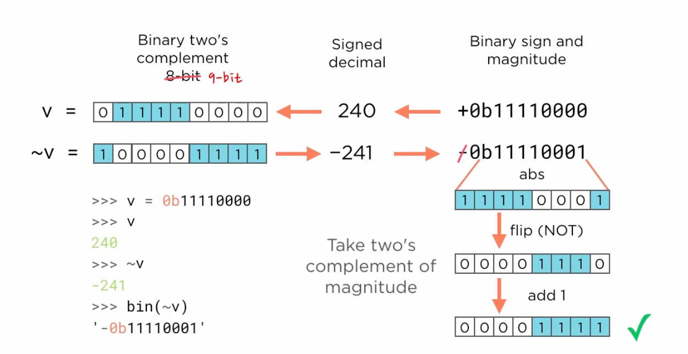

# 2.1 Bitwise Operations on Integers

# 2.1 Bitwise Operations on Integers

## Key Idea

- **Bitwise operators** work at the bit level and lead to interesting corners of Python's integer implementation.
- **Python 3 uses arbitrary precision integers** - not restricted to fixed byte sizes.
- **Two's Complement representation** causes unexpected behavior with bitwise NOT operator.
- Understanding **bit manipulation techniques** is essential for low-level programming.

## Bitwise Operators Overview

### Basic Binary Representation
```python
>>> 0b11110000
240
>>> bin(240)
'0b11110000'
```

- Use `0b` prefix for binary literals
- Use `bin()` function to display integers in binary format

### Bitwise Exclusive OR (XOR) Operator


```python
>>> bin(0b11100100 ^ 0b00100111)
'0b11000011'
```

**Behavior**: Sets bits in output if **exactly one** of the corresponding operand bits is set.

### Bitwise NOT (Complement) Operator


```python
>>> bin(~0b11110000)
'-0b11110001'
```

**Problem**: Result is `-0b11110001` instead of expected `0b00001111`.

## Two's Complement Representation

### How Two's Complement Works


**Example**: Representing -58 in 8-bit Two's Complement

1. **Start**: -58 (signed decimal)
2. **Absolute value**: 58 → `00111010` (8-bit binary)
3. **Flip all bits**: `11000101` (bitwise NOT)
4. **Add 1**: `11000110` (Two's Complement representation of -58)

**Advantages**:
- Works naturally with arithmetic operations
- No separate handling needed for negative numbers

### Python's Challenge with Unlimited Precision

**Problem**: With arbitrary precision integers, how many leading 0s should be flipped?

```python
>>> bin(4)
'0b100'
>>> bin(-4)
'-0b100'
```

**Python's solution**: Uses **sign-magnitude representation** for display, not Two's Complement.

## Understanding Bitwise NOT Results

### The Problem Explained

```python
>>> v = 0b11110000
>>> v
240
>>> ~v
-241
>>> bin(~v)
'-0b11110001'
```

**What happens**:
1. 240 needs 9-bit representation: `011110000`
2. Bitwise NOT applied: `100001111` 
3. This is Two's Complement for -241
4. Python displays as `-0b11110001` (sign-magnitude format)

## Techniques to See Actual Bit Patterns

### Method 1: Two's Complement Arithmetic



```python
>>> def twos_complement(x, num_bits):
...     if x < 0:
...         return x + (1 << num_bits)
...     return x
...
>>> v = 240
>>> ~v
-241
>>> twos_complement(~v, 8)
15
>>> bin(15)
'0b1111'
```

**Logic**:
- Take the negative result (-241)
- Add 2^num_bits (256 for 8 bits)
- Result: -241 + 256 = 15 = `0b1111`

**Key insight**: `1 << num_bits` efficiently calculates 2^num_bits using bit shifting.

### Method 2: Bitwise AND with Mask


```python
>>> bin(~0b11110000 & 0b11111111)
'0b1111'
>>> bin(~0b11110000 & 0b111111111)
'0b100001111'
```

**Purpose**: 
- **8-bit mask** (`0b11111111`): Shows expected result `0b1111`
- **9-bit mask** (`0b111111111`): Reveals leading 1 of Two's Complement


```python
>>> def twos_complement(x, num_bits):
...     if x < 0:
...         return x + (1 << num_bits)
...     return x
...
>>> v
240
>>> ~v
-241
>>> twos_complement(~v, 8)
15
>>>
```

**Understanding the bit shift technique**:

The expression `1 << num_bits` is a clever way to calculate **2^num_bits** using bitwise left shift:

- `1 << 8` means "shift the bit pattern `1` left by 8 positions"
- This transforms `00000001` into `100000000` (9 bits)
- In decimal: `1 << 8 = 256 = 2^8`

**Why this works**:
1. **Two's complement range**: For n-bit representation, values range from -2^(n-1) to 2^(n-1)-1
2. **Modular arithmetic**: Adding 2^n to a negative Two's complement number gives the equivalent positive bit pattern
3. **Efficiency**: Bit shifting is much faster than exponentiation (`2**num_bits`)

**Function behavior**:
- **Positive numbers**: Returns unchanged (Two's complement of positive = itself)
- **Negative numbers**: Adds 2^num_bits to convert from signed to unsigned bit representation

**Example walkthrough**:
- Start with ~240 = -241 (negative Two's complement result)
- Add 2^8 = 256: -241 + 256 = 15
- Result: 15 = `0b1111` (the bit pattern we expected from flipping `11110000`)

## Bit Length Method

**Since Python 3.2**: Use `bit_length()` method to determine required bits.

```python
>>> int(32).bit_length()
6
>>> int(240).bit_length()
8
>>> int(-241).bit_length()
8
>>> int(256).bit_length()
9
```

**Note**: `bit_length()` excludes the sign bit.

## Practical Applications

### When to Use These Techniques

1. **Low-level data manipulation**: Working with binary protocols
2. **Performance optimization**: Bit operations are faster than arithmetic
3. **Memory efficiency**: Packing multiple boolean values into single integers
4. **Cryptography**: Many algorithms rely on bit manipulation

### Best Practices

1. **Use helper functions**: Like `twos_complement()` for clarity
2. **Document bit widths**: Always specify how many bits you're working with
3. **Test with examples**: Bit manipulation is error-prone, verify with simple cases
4. **Consider readability**: Sometimes arithmetic is clearer than bit operations

## Key Takeaways

- **Bitwise NOT behavior** in Python can be surprising due to arbitrary precision integers
- **Two's Complement arithmetic** provides solutions to see actual bit patterns
- **Bit masking** with AND operation controls precision of results
- **Understanding underlying representation** is crucial for effective bit manipulation
- **Python's display format** (sign-magnitude) differs from internal representation
