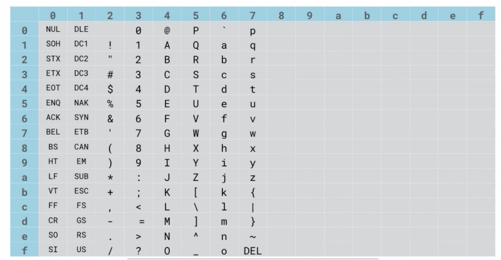

# 2.3 The Bytes Type in Depth

## Key Ideas

- **Bytes vs Strings**: `bytes` is an immutable sequence of bytes (0-255), while `str` is an immutable sequence of Unicode code points
- **ASCII Literals**: Bytes literals use `b` prefix and are restricted to printable 7-bit ASCII characters (codes 0-127)
- **Escape Sequences**: Non-ASCII bytes must use `\x` escape sequences in literals
- **Indexing Behavior**: Indexing bytes returns `int` objects, not single-byte sequences
- **Multiple Constructors**: Several ways to create bytes objects for different use cases
- **Encoding/Decoding**: Converting between bytes and Unicode strings requires explicit encoding specification

## Bytes Literals and ASCII Restrictions


*ASCII character table showing printable characters (32-126) allowed in bytes literals*

### Valid ASCII Literals

The default Python source encoding is UTF-8, but bytes literals are restricted to printable 7-bit ASCII characters:

```python
>>> b"This is OK because it's 7-bit ASCII"
b"This is OK because it's 7-bit ASCII"
```

### Invalid Non-ASCII Characters

Characters outside 7-bit ASCII result in syntax errors:

```python
>>> b"Norwegian characters like Å and Ø are not 7-bit ASCII"
  File "<stdin>", line 1
SyntaxError: bytes can only contain ASCII literal characters.
```

### Using Escape Sequences

For byte values 128-255 or control codes, use `\x` escape sequences:

```python
>>> b"Norwegian characters like \xc5 and \xd8 are not 7-bit ASCII"
b'Norwegian characters like \xc5 and \xd8 are not 7-bit ASCII'
```

## Decoding Bytes to Unicode

Converting bytes to Unicode strings requires specifying an encoding:

```python
>>> norsk = b"Norwegian characters like \xc5 and \xd8 are not 7-bit ASCII"
>>> norsk.decode('latin1')
'Norwegian characters like Å and Ø are not 7-bit ASCII'
```

## Indexing and Slicing Behavior

### Indexing Returns Integers

Unlike strings, indexing bytes objects returns integer values:

```python
>>> norsk[0]
78
>>> chr(norsk[0])  # Convert to character
'N'
```

### Slicing Returns Bytes Objects

Slicing operations return new bytes objects:

```python
>>> norsk[21:25]
b'like'
```

## Bytes Constructor Forms

### Empty Bytes Object

```python
>>> bytes()
b''
```

### Zero-filled Bytes of Specific Length

```python
>>> bytes(5)
b'\x00\x00\x00\x00\x00'
```

### From Iterable of Integers

```python
>>> bytes(range(65, 65+26))
b'ABCDEFGHIJKLMNOPQRSTUVWXYZ'
```

### Value Range Validation

All integer values must be in range 0-255:

```python
>>> bytes([63, 127, 255, 511])
Traceback (most recent call last):
  File "<stdin>", line 1, in <module>
ValueError: bytes must be in range(0, 256)
```

### From String with Encoding

Two-argument form encodes a Unicode string:

```python
>>> bytes('Norwegian characters Å and Ø', 'utf16')
b'\xff\xfeN\x00o\x00r\x00w\x00e\x00g\x00i\x00a\x00n\x00 \x00c\x00h\x00a\x00r\x00a\x00c\x00t\x00e\x00r\x00s\x00 \x00\xc5\x00 \x00a\x00n\x00d\x00 \x00\xd8\x00'
```

## Hexadecimal Conversion

### From Hex String to Bytes

Use the `fromhex()` class method:

```python
>>> bytes.fromhex('54686520717569636b2062726f776e20666f78')
b'The quick brown fox'
```

### From Bytes to Hex String

No built-in method exists, so use a generator expression:

```python
>>> ''.join(hex(c)[2:] for c in b'The quick brown fox')
'54686520717569636b2062726f776e20666f78'
```

## Practical Examples

### Creating Bytes from Character Codes

```python
>>> # ASCII uppercase letters
>>> bytes(range(ord('A'), ord('Z') + 1))
b'ABCDEFGHIJKLMNOPQRSTUVWXYZ'

>>> # ASCII digits
>>> bytes(range(ord('0'), ord('9') + 1))
b'0123456789'
```

### Working with Binary Data

```python
>>> # Create a simple binary header
>>> header = bytes([0xFF, 0xFE, 0x01, 0x00])
>>> header
b'\xff\xfe\x01\x00'

>>> # Check individual bytes
>>> header[0]
255
>>> hex(header[0])
'0xff'
```

### Encoding Examples

```python
>>> # UTF-8 encoding (variable length)
>>> text = "Hello, 世界"
>>> utf8_bytes = bytes(text, 'utf-8')
>>> utf8_bytes
b'Hello, \xe4\xb8\x96\xe7\x95\x8c'

>>> # UTF-16 encoding (fixed width, with BOM)
>>> utf16_bytes = bytes(text, 'utf-16')
>>> utf16_bytes
b'\xff\xfeH\x00e\x00l\x00l\x00o\x00,\x00 \x00\x16N\x8c\x95'
```

## Common Patterns

### Hex Dump Utility Function

```python
def hex_dump(data):
    """Create a hex dump representation of bytes data."""
    return ' '.join(f'{b:02x}' for b in data)

>>> data = b'Hello'
>>> hex_dump(data)
'48 65 6c 6c 6f'
```

### Byte Validation

```python
def validate_byte_values(values):
    """Ensure all values are valid byte values (0-255)."""
    for value in values:
        if not (0 <= value <= 255):
            raise ValueError(f"Value {value} is not a valid byte")
    return bytes(values)

>>> validate_byte_values([65, 66, 67])
b'ABC'
>>> validate_byte_values([65, 256, 67])  # Will raise ValueError
```

## Best Practices

### 1. Use Appropriate Constructor
```python
# For literal bytes, use b'' syntax
data = b'Hello'

# For programmatic creation, use bytes() constructor
data = bytes([72, 101, 108, 108, 111])

# For encoding text, use encode() method on strings
data = 'Hello'.encode('utf-8')
```

### 2. Handle Encoding Explicitly
```python
# Good: Explicit encoding
text_bytes = text.encode('utf-8')
decoded_text = text_bytes.decode('utf-8')

# Avoid: Relying on default encoding
text_bytes = text.encode()  # Uses system default
```

### 3. Validate Byte Values
```python
# Always validate when creating from integers
def safe_bytes(values):
    return bytes(v for v in values if 0 <= v <= 255)
```

### 4. Document Encoding Assumptions
```python
def process_text_data(data: bytes) -> str:
    """
    Process text data assuming UTF-8 encoding.
    
    Args:
        data: UTF-8 encoded bytes
        
    Returns:
        Decoded Unicode string
    """
    return data.decode('utf-8')
```

## Key Takeaways

- Bytes literals are restricted to 7-bit ASCII characters; use `\x` escapes for other values
- Indexing bytes returns integers, not single-byte sequences
- Multiple constructors provide flexibility for different creation scenarios
- Encoding/decoding requires explicit specification of character encoding
- Hexadecimal conversion uses `fromhex()` method and manual conversion for reverse
- Value validation is important when creating bytes from integer sequences
- Immutability means bytes objects cannot be modified after creation
