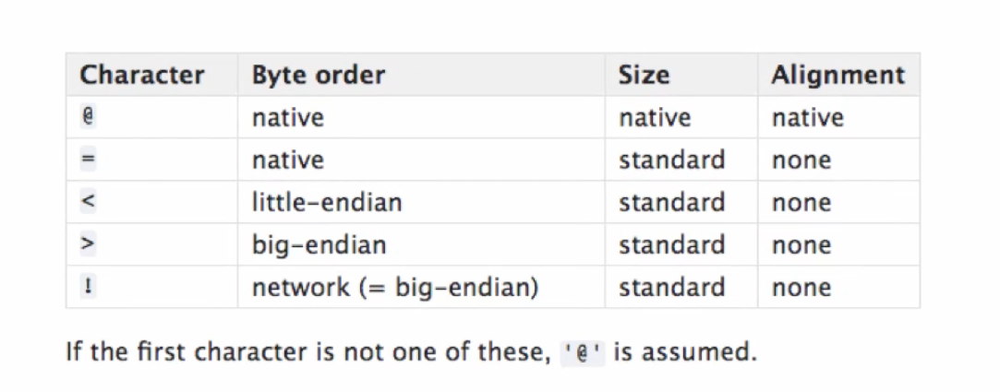
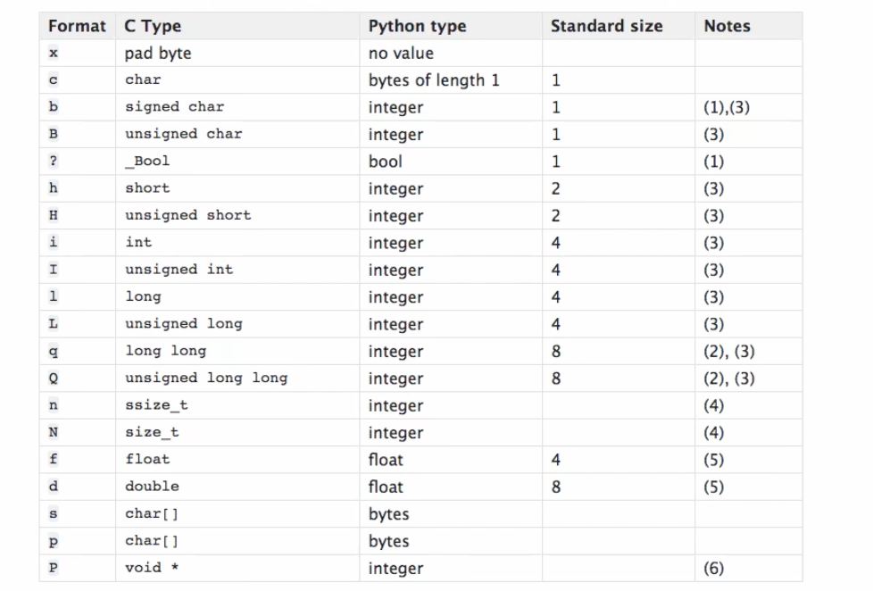
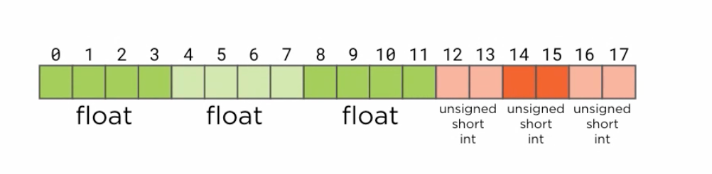

# 2.5 Interpreting Binary Structures

## Key Ideas

- The `struct` module interprets C-style binary data structures in Python
- C data types serve as a low-level lingua franca for binary data exchange
- Format strings specify how to interpret byte patterns using type codes
- Byte order and alignment can significantly affect data interpretation
- Padding bytes are often inserted by compilers for memory alignment
- Diagnostic techniques are essential for understanding binary data layout

## The struct Module

The Python `struct` module decodes byte patterns of C/C++ struct objects. This capability is essential because:

- C data types are widely used for binary data exchange between programs
- Operating systems are typically written in C/C++, requiring C structure interpretation
- Binary file formats often follow C structure conventions

## C Structure Example


*byte ordering schemes*

Consider this C program that creates binary data:

```c
#include <stdio.h>

struct Vector {
    float x;
    float y;
    float z;
};

struct Color {
    unsigned short int red;
    unsigned short int green;
    unsigned short int blue;
};

struct Vertex {
    struct Vector position;
    struct Color color;
};

int main(int argc, char** argv) {
    struct Vertex vertices[] = {
        { .position = { 3323.176, 6562.231, 9351.231 },
          .color = { 3040, 34423, 54321 } },

        { .position = { 7623.982, 2542.231, 9823.121 },
          .color = { 32736, 5342, 2321 } },

        { .position = { 6729.862, 2347.212, 3421.322 },
          .color = { 45263, 36291, 36701 } },

        { .position = { 6352.121, 3432.111, 9763.232 },
          .color = { 56222, 36612, 11214 } }
    };

    FILE* file = fopen("colors.bin", "wb");
    if (file == NULL) {
        return -1;
    }

    fwrite(vertices, sizeof(struct Vertex), 4, file);
    fclose(file);
    return 0;
}
```

### Data Type Differences

- **C float**: 32-bit single precision (vs Python's 64-bit double precision)
- **C unsigned short**: 16-bit integers (0-65,535) vs Python's arbitrary precision integers
- **Vertex structure**: Combines Vector and Color into larger composite structure

### Compilation and Execution

```bash
$ make colorpoints
cc     colorpoints.c   -o colorpoints
$ ./colorpoints
$ ls
colorpoints   colorpoints.c   colors.bin
```

## Reading Binary Data with struct

### Basic struct.unpack_from Usage

```python
import struct

def main():
    with open('colors.bin', 'rb') as f:
        buffer = f.read()

    items = struct.unpack_from('@fffHHH', buffer)
    print(repr(items))

if __name__ == '__main__':
    main()
```

**Output:**
```
(3323.176025390625, 6562.23095703125, 9351.2314453125, 3040, 34423, 54321)
```

### Format String Components


*Complete reference of struct format characters*

- **@**: Native byte order and alignment
- **f**: Single precision float (32-bit)
- **H**: Unsigned short integer (16-bit)
- **<**: Little-endian byte order
- **>**: Big-endian byte order

### Improved Version with Tuple Unpacking

```python
x, y, z, red, green, blue = struct.unpack_from('@3f3H', buffer)
```

Using repeat counts like `3f` (equivalent to `fff`) makes format strings more concise.

## Creating Python Equivalents

### Class Definitions

```python
class Vector:
    def __init__(self, x, y, z):
        self.x = x
        self.y = y
        self.z = z

    def __repr__(self):
        return 'Vector({}, {}, {})'.format(self.x, self.y, self.z)

class Color:
    def __init__(self, red, green, blue):
        self.red = red
        self.green = green
        self.blue = blue

    def __repr__(self):
        return 'Color({}, {}, {})'.format(self.red, self.green, self.blue)

class Vertex:
    def __init__(self, vector, color):
        self.vector = vector
        self.color = color

    def __repr__(self):
        return 'Vertex({!r}, {!r})'.format(self.vector, self.color)
```

### Factory Function

```python
def make_colored_vertex(x, y, z, red, green, blue):
    return Vertex(Vector(x, y, z), Color(red, green, blue))
```

## Processing Multiple Structures

### Using struct.iter_unpack

```python
from pprint import pprint as pp

def main():
    with open('colors.bin', 'rb') as f:
        buffer = f.read()

    vertices = []
    for fields in struct.iter_unpack('@3f3H', buffer):
        vertex = make_colored_vertex(*fields)
        vertices.append(vertex)

    pp(vertices)
```

### Initial Error: Alignment Issues

```
struct.error: iterative unpacking requires a bytes length multiple of 18
```

Expected: 4 × 18 bytes = 72 bytes  
Actual: 80 bytes


*Memory layout showing padding bytes between structures*

## Diagnostic Techniques

### Buffer Analysis

```python
def main():
    with open('colors.bin', 'rb') as f:
        buffer = f.read()

    print("buffer: {} bytes".format(len(buffer)))
    print(buffer)
```

**Output:**
```
buffer: 80 bytes
b'\xd1\xb2\xdf)\xd9\xc1\xcdL\xed\x1c\x1f\xb0...]
```

### Hexadecimal Visualization

```python
from binascii import hexlify

# Convert to readable hex pairs
hex_buffer = hexlify(buffer).decode('ascii')
hex_pairs = ' '.join(hex_buffer[i:i+2] for i in range(0, len(hex_buffer), 2))
print(hex_pairs)

# Add byte indices for reference
indexes = ' '.join(str(n).zfill(2) for n in range(len(buffer)))
print(indexes)
```

**Output:**
```
00 01 02 03 04 05 06 07 08 09 10 11 12 13 14 15 16 17 18 19 20 21 22 23 24 25...
d1 b2 4f 45 d9 11 cd 45 ed 1c 12 46 e8 8b 77 86 31 d4 00 80 db 3f ee 45 b2...
```

### Pattern Analysis

The hex dump reveals:
- Bytes 0-17: First structure data
- Bytes 18-19: Two zero bytes (padding)
- Bytes 20-37: Second structure data  
- Bytes 38-39: Two zero bytes (padding)
- Pattern continues...

## Handling Structure Padding

### The Solution: Pad Bytes

```python
for fields in struct.iter_unpack('@3f3Hxx', buffer):
    vertex = make_colored_vertex(*fields)
    vertices.append(vertex)
```

The `xx` format code skips two padding bytes per structure.

### Successful Output

```
[Vertex(Vector(3323.176025390625, 6562.23095703125, 9351.2314453125), Color(3040, 34423, 54321)),
 Vertex(Vector(7623.98193359375, 2542.23095703125, 9823.12109375), Color(32736, 5342, 2321)),
 Vertex(Vector(6729.86181640625, 2347.2119140625, 3421.322021484375), Color(45263, 36291, 36701)),
 Vertex(Vector(6352.12109375, 3432.111083984375, 9763.232421875), Color(56222, 36612, 11214))]
```

## Understanding Alignment Issues

### Why Padding Occurs

Compilers insert padding to align structures on memory boundaries (typically 4-byte boundaries) for performance reasons. An 18-byte structure is padded to 20 bytes (divisible by 4).

### Compiler Differences

The mismatch between expected and actual padding can occur when:
- Python interpreter and C program use different compilers
- Different compiler versions have different padding conventions
- Cross-platform compatibility issues arise

## Format String Reference

### Common Format Characters

| Character | C Type | Python Type | Size (bytes) |
|-----------|--------|-------------|--------------|
| `b` | signed char | int | 1 |
| `B` | unsigned char | int | 1 |
| `h` | short | int | 2 |
| `H` | unsigned short | int | 2 |
| `i` | int | int | 4 |
| `I` | unsigned int | int | 4 |
| `f` | float | float | 4 |
| `d` | double | float | 8 |
| `s` | char[] | bytes | - |
| `x` | pad byte | no value | 1 |

### Byte Order Characters

| Character | Meaning |
|-----------|---------|
| `@` | Native order, native size, native alignment |
| `=` | Native order, standard size, no alignment |
| `<` | Little-endian, standard size, no alignment |
| `>` | Big-endian, standard size, no alignment |
| `!` | Network (big-endian), standard size, no alignment |

## Practical Examples

### Reading Network Protocol Headers

```python
import struct

# TCP header format
tcp_format = '!HHLLBBHHH'  # Network byte order
header_data = socket.recv(20)  # TCP header is 20 bytes
fields = struct.unpack(tcp_format, header_data)
src_port, dst_port, seq_num, ack_num, flags, window, checksum, urgent = fields[:8]
```

### Binary File Headers

```python
# Reading a bitmap file header
bmp_header_format = '<2sLHHLLLLHH'  # Little-endian
with open('image.bmp', 'rb') as f:
    header_data = f.read(struct.calcsize(bmp_header_format))
    header = struct.unpack(bmp_header_format, header_data)
```

### Creating Diagnostic Tools

```python
def hex_dump(data, width=16):
    """Create a formatted hex dump of binary data."""
    for i in range(0, len(data), width):
        chunk = data[i:i+width]
        hex_vals = ' '.join(f'{b:02x}' for b in chunk)
        ascii_vals = ''.join(chr(b) if 32 <= b < 127 else '.' for b in chunk)
        print(f'{i:08x}: {hex_vals:<{width*3}} {ascii_vals}')

def analyze_struct_size(format_string):
    """Calculate the size of a struct format."""
    return struct.calcsize(format_string)
```

## Best Practices

### 1. Always Specify Byte Order

```python
# Good: Explicit byte order
data = struct.pack('<HHL', value1, value2, value3)

# Risky: Relies on system defaults
data = struct.pack('HHL', value1, value2, value3)
```

### 2. Handle Padding Explicitly

```python
# Account for compiler padding
format_with_padding = '@3f3Hxx'  # Two padding bytes

# Or use no-alignment format
format_no_padding = '=3f3H'  # Standard sizes, no alignment
```

### 3. Use calcsize for Validation

```python
expected_size = struct.calcsize('@3f3Hxx')
if len(buffer) % expected_size != 0:
    raise ValueError(f"Buffer size {len(buffer)} not multiple of {expected_size}")
```

### 4. Create Diagnostic Functions

```python
def debug_binary_data(data, format_string):
    """Debug helper for struct unpacking."""
    print(f"Data length: {len(data)} bytes")
    print(f"Format size: {struct.calcsize(format_string)} bytes")
    
    hex_dump(data)
    
    try:
        values = struct.unpack(format_string, data)
        print(f"Unpacked values: {values}")
    except struct.error as e:
        print(f"Unpacking failed: {e}")
```

## Key Takeaways

- The `struct` module bridges Python and C-style binary data
- Format strings precisely control data interpretation
- Padding and alignment issues are common and require careful handling
- Diagnostic techniques like hex dumps are essential for debugging
- Byte order specification is critical for cross-platform compatibility
- Different compilers may produce different structure layouts
- Always validate buffer sizes against expected structure sizes