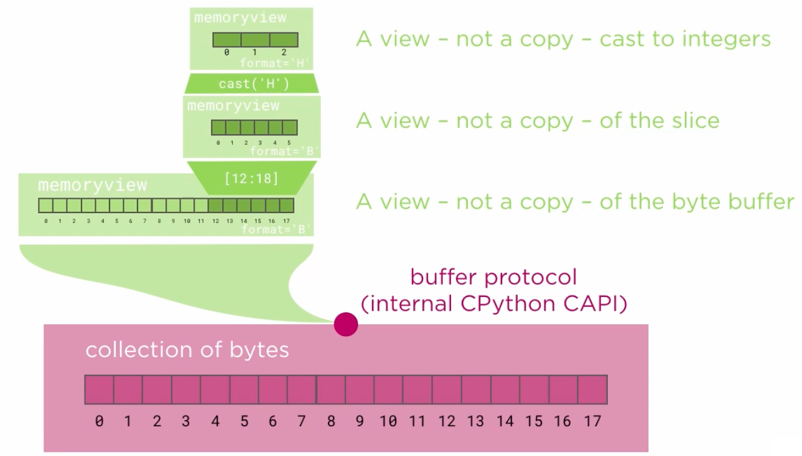

# 2.6 The memoryview Type

## Key Ideas

- memoryview provides a zero-copy view into buffer protocol objects
- Eliminates data duplication when working with binary data
- Supports slicing, indexing, and type casting without copying
- Implements the sequence protocol for convenient access
- Only bytes and bytearray support the buffer protocol among built-in types
- The cast() method allows reinterpretation of data as different types

## Understanding memoryview


*Diagram showing how memoryview provides efficient access to underlying buffer data*

The memoryview type wraps any object that supports the buffer protocol, which is implemented at the C level within the Python interpreter. Unlike Python-level protocols (sequence, mapping), the buffer protocol operates at a lower level to provide efficient memory access.

### The Problem: Data Duplication

The previous struct-based approach required data duplication:

```python
def main():
    with open('colors.bin', 'rb') as f:
        buffer = f.read()  # First copy: file to bytes

    # Second copy: struct.unpack creates new objects
    vertices = []
    for fields in struct.iter_unpack('@3f3Hxx', buffer):
        vertex = make_colored_vertex(*fields)  # Creates separate values
        vertices.append(vertex)

    pp(vertices)
```

### The Solution: memoryview

memoryview provides zero-copy access to the underlying buffer:

```python
mem = memoryview(buffer)  # No copying - just a view
```

## Interactive Exploration with code.interact

For debugging and exploration, the `code` module provides an interactive session:

```python
import code

def main():
    with open('colors.bin', 'rb') as f:
        buffer = f.read()

    mem = memoryview(buffer)
    
    # Drop into interactive session
    code.interact(local=locals())
```

### Interactive Session Output

```sh
buffer: 80 bytes
00 01 02 03 04 05 06 07 08 09 10 11 12 13 14 15 16 17 18 19 20 21 22 23 24 25 26 27 28 29 30 31 32 33 34 35 36 37 38
d1 b2 4f 45 d9 11 cd 45 ed 1c 12 46 e8 8b 77 86 31 d4 00 80 db 3f ee 45 b2 e3 1e 45 7c 7c 19 46 e0 7f de 14 11 09 00
Python 3.5.0 (v3.5.0:374f501f4567, Sep 12 2015, 11:00:19) 
[GCC 4.2.1 (Apple Inc. build 5666) (dot 3)] on darwin
Type "help", "copyright", "credits" or "license" for more information.
(InteractiveConsole)
```

## memoryview Operations

### Basic Access

```python
>>> mem
<memory at 0x101324d08>

>>> hex(mem[21])  # Index access
'0x3f'
```

### Slicing (Zero-Copy)

```python
>>> mem[12:18]  # Slice returns another memoryview
<memory at 0x101324dc8>

>>> mem[12:18][0]  # Index into slice
224
```

### Type Casting

```python
>>> mem[12:18].cast('H')  # Cast to unsigned short
<memory at 0x101324e88>

>>> mem[12:18].cast('H')[0]  # Access typed values
3040
>>> mem[12:18].cast('H')[1]
34423
>>> mem[12:18].cast('H')[2]
54321

>>> mem[12:18].cast('H').tolist()  # Convert to list
[3040, 34423, 54321]
```

## memoryview-Backed Classes

### Enhanced Vector Class

```python
class Vector:
    def __init__(self, mem_float32):
        if mem_float32.format not in "fd":
            raise TypeError("Vector: memoryview values must be floating-point numbers")
        if len(mem_float32) < 3:
            raise TypeError("Vector: memoryview must contain at least 3 floats")
        self._mem = mem_float32

    @property
    def x(self):
        return self._mem[0]

    @property
    def y(self):
        return self._mem[1]

    @property
    def z(self):
        return self._mem[2]

    def __repr__(self):
        return 'Vector({}, {}, {})'.format(self.x, self.y, self.z)
```

#### Key Features:
- **Format Validation**: Checks that memoryview contains floating-point data (`f` or `d`)
- **Length Validation**: Ensures at least 3 elements are available
- **Property Access**: Uses properties to access underlying memoryview data
- **Zero Storage**: Only stores the memoryview reference, not individual values

### Enhanced Color Class

```python
class Color:
    def __init__(self, mem_uint16):
        if mem_uint16.format not in "HILQ":
            raise TypeError("Color: memoryview values must be unsigned integers")
        if len(mem_uint16) < 3:
            raise TypeError("Color: memoryview must contain at least 3 integers")
        self._mem = mem_uint16

    @property
    def red(self):
        return self._mem[0]

    @property
    def green(self):
        return self._mem[1]

    @property
    def blue(self):
        return self._mem[2]

    def __repr__(self):
        return 'Color({}, {}, {})'.format(self.red, self.green, self.blue)
```

#### Validation Logic:
- **H**: unsigned short (16-bit)
- **I**: unsigned int (32-bit)  
- **L**: unsigned long (32-bit)
- **Q**: unsigned long long (64-bit)

### Unchanged Vertex Class

```python
class Vertex:
    def __init__(self, vector, color):
        self.vector = vector
        self.color = color

    def __repr__(self):
        return 'Vertex({!r}, {!r})'.format(self.vector, self.color)
```

## Updated Factory Function

```python
def make_colored_vertex(mem_vertex):
    mem_vector = mem_vertex[0:12].cast('f')    # 3 floats = 12 bytes
    mem_color = mem_vertex[12:18].cast('H')    # 3 shorts = 6 bytes
    return Vertex(Vector(mem_vector), Color(mem_color))
```

### Memory Layout Analysis:
- **Vector data**: Bytes 0-11 (3 × 4-byte floats)
- **Color data**: Bytes 12-17 (3 × 2-byte unsigned shorts)
- **Total structure**: 18 bytes (before padding)

## Complete memoryview Implementation

```python
from binascii import hexlify
from pprint import pprint as pp
import struct

def main():
    with open('colors.bin', 'rb') as f:
        buffer = f.read()

    print("buffer: {} bytes".format(len(buffer)))

    # Diagnostic output
    indexes = ' '.join(str(n).zfill(2) for n in range(len(buffer)))
    print(indexes)

    hex_buffer = hexlify(buffer).decode('ascii')
    hex_pairs = ' '.join(hex_buffer[i:i+2] for i in range(0, len(hex_buffer), 2))
    print(hex_pairs)

    # Create memoryview
    mem = memoryview(buffer)

    # Define structure layout
    VERTEX_SIZE = 18      # Actual data size
    VERTEX_STRIDE = 20    # Including 2-byte padding

    # Create vertex memoryviews
    vertex_mems = [mem[i:i+VERTEX_SIZE] for i in range(0, len(mem), VERTEX_STRIDE)]
    
    # Create vertex objects (zero-copy)
    vertices = [make_colored_vertex(vertex_mem) for vertex_mem in vertex_mems]

    pp(vertices)

if __name__ == '__main__':
    main()
```

## Performance Benefits

### Memory Efficiency

```python
# Traditional approach (multiple copies)
buffer = f.read()                    # Copy 1: file → bytes
fields = struct.unpack(...)          # Copy 2: bytes → tuple
vertex = make_colored_vertex(*fields) # Copy 3: tuple → objects

# memoryview approach (zero-copy)
buffer = f.read()                    # Copy 1: file → bytes
mem = memoryview(buffer)             # Zero-copy view
vertex = make_colored_vertex(mem)    # Zero-copy slicing and casting
```

### Comparison

| Approach | Memory Copies | Memory Usage | Performance |
|----------|---------------|--------------|-------------|
| struct.unpack | 3+ copies | High | Lower |
| memoryview | 1 copy | Low | Higher |

## Advanced memoryview Features

### Multidimensional Views

```python
# For 2D array data
data = bytearray(24)  # 2x3 array of 4-byte floats
mem = memoryview(data).cast('f')
array_2d = mem.cast('f', (2, 3))  # Shape as 2D
```

### Format Information

```python
>>> mem = memoryview(buffer)
>>> mem.format      # 'B' for unsigned char
>>> mem.itemsize    # 1 byte per item
>>> mem.nbytes      # Total bytes
>>> mem.readonly    # True if read-only
```

### Buffer Protocol Compatibility

```python
# Objects supporting buffer protocol
supported_types = [
    bytes(b'hello'),
    bytearray(b'hello'),
    array.array('i', [1, 2, 3]),
    numpy.array([1, 2, 3])  # If numpy available
]

for obj in supported_types:
    try:
        mem = memoryview(obj)
        print(f"{type(obj).__name__}: {mem.format}")
    except TypeError:
        print(f"{type(obj).__name__}: Not supported")
```

## Practical Examples

### Binary File Processing

```python
def process_large_binary_file(filename):
    """Process large binary files efficiently with memoryview."""
    with open(filename, 'rb') as f:
        buffer = f.read()
    
    mem = memoryview(buffer)
    
    # Process chunks without copying
    chunk_size = 1024
    for i in range(0, len(mem), chunk_size):
        chunk = mem[i:i+chunk_size]
        # Process chunk in-place
        process_chunk(chunk)

def process_chunk(chunk_mem):
    """Process a memoryview chunk."""
    # Convert to appropriate type
    if len(chunk_mem) % 4 == 0:
        float_data = chunk_mem.cast('f')
        # Process as floats
```

### Network Protocol Parsing

```python
def parse_packet(data):
    """Parse network packet using memoryview."""
    mem = memoryview(data)
    
    # Header (first 20 bytes)
    header = mem[:20]
    packet_type = header[0]
    length = int.from_bytes(header[1:3], 'big')
    
    # Payload (remaining bytes)
    payload = mem[20:20+length]
    
    return {
        'type': packet_type,
        'length': length,
        'payload': payload  # Zero-copy slice
    }
```

### Efficient Data Conversion

```python
def convert_endianness(data):
    """Convert between little and big endian."""
    mem = memoryview(data)
    
    # Cast to 4-byte integers
    int_view = mem.cast('I')  # unsigned int
    
    # Process in chunks
    result = bytearray(len(data))
    result_mem = memoryview(result).cast('I')
    
    for i in range(len(int_view)):
        # Byte swap (simplified)
        result_mem[i] = int_view[i].to_bytes(4, 'big')
    
    return bytes(result)
```

## Best Practices

### 1. Validate memoryview Format

```python
def safe_cast(mem, target_format):
    """Safely cast memoryview with validation."""
    if len(mem) % struct.calcsize(target_format) != 0:
        raise ValueError(f"Buffer size not multiple of {target_format} size")
    
    return mem.cast(target_format)
```

### 2. Handle Read-Only Views

```python
def modify_if_writable(mem):
    """Only modify if memoryview is writable."""
    if not mem.readonly:
        mem[0] = 255  # Safe to modify
    else:
        # Create writable copy
        writable = bytearray(mem)
        writable[0] = 255
        return memoryview(writable)
```

### 3. Resource Management

```python
def process_with_cleanup(data):
    """Ensure proper cleanup of memoryview resources."""
    mem = memoryview(data)
    try:
        # Process data
        result = process_memory_view(mem)
        return result
    finally:
        # Explicit cleanup (usually automatic)
        mem.release()
```

## Common Pitfalls

### 1. Format Mismatch

```python
# Dangerous: Wrong format assumption
mem = memoryview(b'\x00\x01\x02\x03')
try:
    float_val = mem.cast('f')[0]  # May not be valid float
except struct.error:
    print("Invalid format conversion")
```

### 2. Lifetime Management

```python
def get_view():
    data = bytearray(b'temporary')
    return memoryview(data)  # Dangerous: data may be garbage collected

# Better approach
def get_view():
    data = bytearray(b'persistent')
    mem = memoryview(data)
    return mem, data  # Keep data alive
```

## Key Takeaways

- memoryview eliminates unnecessary data copying for binary data processing
- Supports all sequence operations (indexing, slicing) without copying
- The cast() method enables type reinterpretation using struct format codes
- Property-based classes can provide clean interfaces to binary data
- Interactive debugging with code.interact() helps understand memory layouts
- Significant performance benefits for large binary data processing
- Requires careful validation of data formats and buffer compatibility
- Only bytes and bytearray support the buffer protocol among built-in types
