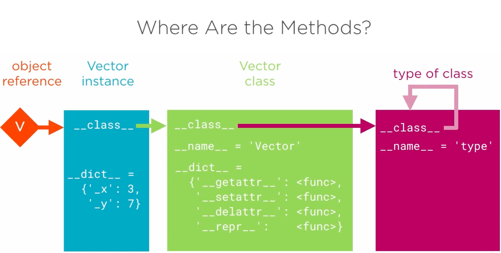

# 3.10 Where are Methods Stored?

## Key Ideas

- Methods are not stored in the instance's `__dict__` - only instance attributes are
- Methods are stored as attributes of the class object (accessible via `__class__`)
- Class `__dict__` contains callable objects that become methods when accessed on instances
- Class `__dict__` is a `mappingproxy`, not a regular dict - it doesn't support item assignment
- Use `setattr()` to add attributes to classes, not direct dictionary assignment
- Understanding where methods live is crucial for comprehending Python's object model

## The Question: Where Are the Methods?

When we introspect an object's `__dict__`, we only see attributes, not methods:

```python
>>> v = Vector(x=3, y=7)
>>> v.__dict__
{'_x': 3, '_y': 7}
```

But we can retrieve methods using `getattr()` - so where are they stored?

## The Answer: Methods Live in the Class Object

Methods are attributes of the **class object** associated with our instance.



### Exploring the Class Object

```python
>>> from vector import *
>>> v = Vector(x=3, y=7)

# Instance __dict__ - only instance attributes
>>> v.__dict__
{'_x': 3, '_y': 7}

# Access the class object
>>> v.__class__
<class 'vector.Vector'>

# Class __dict__ - contains the methods!
>>> v.__class__.__dict__
mappingproxy({'__weakref__': <attribute '__weakref__' of 'Vector' objects>, '__setattr__': <function Vector.__setattr__ at 0x101a5fa60>, '__doc__': None, '__repr__': <function Vector.__repr__ at 0x101a5fb70>, '__init__': <function Vector.__init__ at 0x101a5f620>, '__getattr__': <function Vector.__getattr__ at 0x101a5f6a8>, '__module__': 'vector', '__dict__': <attribute '__dict__' of 'Vector' objects>, '__delattr__': <function Vector.__delattr__ at 0x101a5fae8>})
```

### Calling Methods Directly

We can retrieve the callable object and call it directly, passing the instance as the first argument (taking the place of `self`):

```python
>>> v.__class__.__dict__['__repr__'](v)
'Vector(x=3, y=7)'
```


## Understanding `mappingproxy`

The class `__dict__` is not a regular `dict` but a `mappingproxy` - a special read-only mapping type used internally by Python.

### Failed Direct Assignment

```python
>>> v.__class__.__dict__['a_vector_class_attribute'] = 5
Traceback (most recent call last):
  File "<stdin>", line 1, in <module>
TypeError: 'mappingproxy' object does not support item assignment
```

### Correct Way: Using `setattr()`

```python
>>> setattr(v.__class__, 'a_vector_class_attribute', 5)
>>> Vector.a_vector_class_attribute
5
```

## How Method Lookup Works

When you access a method on an instance:

1. Python looks in the instance `__dict__` first
2. If not found, looks in the class `__dict__`  
3. If found in class `__dict__` and it's callable, Python creates a bound method
4. The bound method automatically passes the instance as the first argument (`self`)

### Demonstration

```python
# These are equivalent:
>>> v.__repr__()  # Normal method call
>>> Vector.__repr__(v)  # Direct call with explicit self
>>> v.__class__.__dict__['__repr__'](v)  # Manual lookup and call
```

## Exploring the Object Model

### What's in Instance vs Class

```python
# Create instances
>>> v1 = Vector(x=1, y=2)
>>> v2 = Vector(x=3, y=4)

# Each instance has its own __dict__ with different data
>>> v1.__dict__
{'_x': 1, '_y': 2}

>>> v2.__dict__
{'_x': 3, '_y': 4}

# But both share the same class object and its methods
>>> v1.__class__ is v2.__class__
True

>>> v1.__class__ is Vector
True
```

### Inspecting Method Types

```python
# Method in class __dict__ is just a function
>>> type(Vector.__dict__['__repr__'])
<class 'function'>
```

```python
# Method accessed through instance becomes bound method
>>> type(v.__repr__)
<class 'method'>

# Method accessed through class remains unbound function
>>> type(Vector.__repr__)
<class 'function'>
```

## Why This Design?

**Memory efficiency**: Methods are stored once in the class, not duplicated in every instance.

**Code sharing**: All instances of a class share the same method implementations.

**Dynamic behavior**: Methods can be added to classes at runtime and immediately become available to all instances.

## Key Takeaways

- **Separation of concerns**: Instance `__dict__` holds data, class `__dict__` holds behavior
- **Method resolution**: Python looks up methods in the class, not the instance
- **`mappingproxy`**: Class `__dict__` is protected from direct modification
- **`setattr()` for classes**: Use `setattr()` to modify class attributes, not direct assignment
- **Shared methods**: All instances share the same method objects from the class
- **Bound vs unbound**: Methods accessed through instances are automatically bound with `self`
