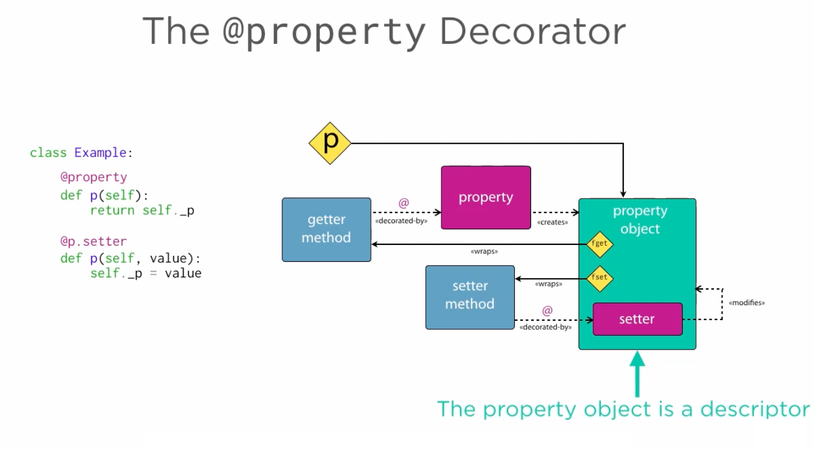
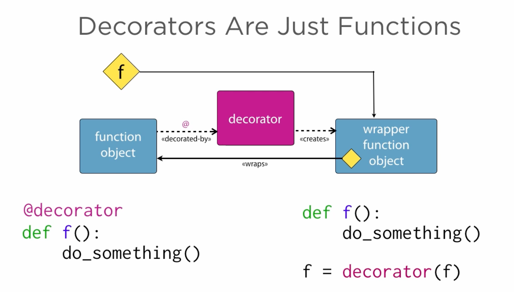

# 4.2 Properties are Descriptors

## Key Ideas

- Properties are descriptors - they implement the descriptor protocol
- Property decorators create property objects that aggregate getter and setter functions
- The `property()` constructor can be called directly instead of using decorators
- Properties behave like attributes because they are descriptors
- Descriptors support get, set, and delete operations through special methods
- Understanding properties as constructors helps reveal the descriptor mechanism

## How Properties Work as Descriptors



A property decorator creates a property object that:
- Binds the getter function to an attribute called `fget`
- Provides a `setter` decorator that binds the setter function to `fset` 
- Aggregates getter and setter into a single property object
- Behaves like an attribute because it implements the descriptor protocol

## Decorators are Just Functions



Since decorators are regular functions, we can apply `property` explicitly using function call syntax instead of the `@` decorator syntax.

### Understanding the Property Constructor

```python
>>> help(property)
Help on class property in module builtins:

class property(object)
 |  property(fget=None, fset=None, fdel=None, doc=None) -> property attribute
 |
 |  fget is a function to be used for getting an attribute value, and likewise
 |  fset is a function for setting, and fdel a function for del'ing, an
 |  attribute. Typical use is to define a managed attribute x:
 |
 |  class C(object):
 |      def getx(self): return self._x
 |      def setx(self, value): self._x = value
 |      def delx(self): del self._x
 |      x = property(getx, setx, delx, "I'm the 'x' property.")
 |
 |  Decorators make defining new properties or modifying existing ones easy:
 |
 |  class C(object):
 |      @property
 |      def x(self):
 |          "I am the 'x' property."
 |          return self._x
 |
 |      @x.setter
```

The `property` function supports arguments for simultaneously supplying getter, setter, and deleter functions, along with a docstring value.

## Converting from Decorator to Constructor Form

Let's transform our Planet class properties from decorator form to constructor form.

### Original Decorator Form

```python
@property
def radius_metres(self):
    return self._radius_metres

@radius_metres.setter
def radius_metres(self, value):
    if value <= 0:
        raise ValueError("radius_metres value {} is not positive.".format(value))
    self._radius_metres = value

@property
def mass_kilograms(self):
    return self._mass_kilograms

@mass_kilograms.setter
def mass_kilograms(self, value):
    if value <= 0:
        raise ValueError("mass_kilograms value {} is not positive.".format(value))
    self._mass_kilograms = value

@property
def orbital_period_seconds(self):
    return self._orbital_period_seconds

@orbital_period_seconds.setter
def orbital_period_seconds(self, value):
    if value <= 0:
        raise ValueError("orbital_period_seconds value {} is not positive.".format(value))
    self._orbital_period_seconds = value

@property
def surface_temperature_kelvin(self):
    return self._surface_temperature_kelvin

@surface_temperature_kelvin.setter
def surface_temperature_kelvin(self, value):
    if value <= 0:
        raise ValueError("surface_temperature_kelvin value {} is not positive.".format(value))
    self._surface_temperature_kelvin = value
```

### Converted to Constructor Form

```python
def _get_radius_metres(self):
    return self._radius_metres

def _set_radius_metres(self, value):
    if value <= 0:
        raise ValueError("radius_metres value {} is not positive.".format(value))
    self._radius_metres = value

radius_metres = property(fget=_get_radius_metres, fset=_set_radius_metres)

def _get_mass_kilograms(self):
    return self._mass_kilograms

def _set_mass_kilograms(self, value):
    if value <= 0:
        raise ValueError("mass_kilograms value {} is not positive.".format(value))
    self._mass_kilograms = value

mass_kilograms = property(fget=_get_mass_kilograms, fset=_set_mass_kilograms)

def _get_orbital_period_seconds(self):
    return self._orbital_period_seconds

def _set_orbital_period_seconds(self, value):
    if value <= 0:
        raise ValueError("orbital_period_seconds value {} is not positive.".format(value))
    self._orbital_period_seconds = value

orbital_period_seconds = property(fget=_get_orbital_period_seconds, fset=_set_orbital_period_seconds)

def _get_surface_temperature_kelvin(self):
    return self._surface_temperature_kelvin

def _set_surface_temperature_kelvin(self, value):
    if value <= 0:
        raise ValueError("surface_temperature_kelvin value {} is not positive.".format(value))
    self._surface_temperature_kelvin = value

surface_temperature_kelvin = property(fget=_get_surface_temperature_kelvin, fset=_set_surface_temperature_kelvin)
```

### Transformation Steps

1. **Remove decorators**: Remove `@property` and `@name.setter` decorators
2. **Rename functions**: Prefix getter functions with `_get_` and setter functions with `_set_`
3. **Create property objects**: Call `property()` constructor with `fget` and `fset` parameters
4. **Assign to class attributes**: Bind the property object to the original attribute name

**Note**: Single underscore prefixes are used because these are not special methods.

## Identical Runtime Behavior

```python
>>> from planet import Planet
>>> pluto = Planet(name='Pluto', radius_metres=1184e3, mass_kilograms=1.305e22, orbital_period_seconds=7816012992, surface_temperature_kelvin=55)
>>> pluto.radius_metres
1184000.0

>>> pluto.radius_metres = -13
Traceback (most recent call last):
  File "<input>", line 1, in <module>
  File "/Users/rjs/training/tmp/advanced/planets/planet.py", line 31, in _set_radius_metres
    raise ValueError("radius_metres value {} is not positive.".format(value))
ValueError: radius_metres value -13 is not positive.
```

The runtime behavior is unchanged - we can still:
- Create objects
- Retrieve attribute values through properties  
- Set attribute values with validation
- Get rejection of nonsensical values

## Understanding Descriptor Operations

Descriptors support three fundamental operations:
- **Get a value**: Retrieve attribute values
- **Set a value**: Assign new values with validation
- **Delete a value**: Remove or reset attributes

In the case of `property`, these operations call our custom functions that query and manipulate instance attributes, though descriptor operations can be implemented to do almost anything.

## Key Takeaways

- **Properties are descriptors**: They implement the descriptor protocol behind the scenes
- **Constructor reveals mechanism**: Using `property()` directly shows how descriptors work
- **Decorator syntax is sugar**: The `@property` syntax is convenience over the constructor form
- **Same functionality**: Both forms provide identical runtime behavior
- **Foundation understanding**: This constructor approach reveals how to build custom descriptors
- **Descriptor operations**: Get, set, and delete form the core of the descriptor protocol
