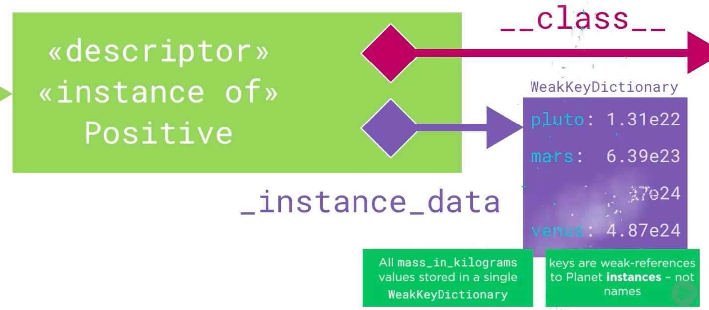

# 4.3 Implementing a Descriptor

## Key Ideas

- Descriptors implement the descriptor protocol with `__get__`, `__set__`, and `__delete__` methods
- Custom descriptors can eliminate code duplication for validation patterns
- Descriptors are owned by the class, not instances, creating data storage challenges
- `WeakKeyDictionary` solves the instance data storage problem elegantly
- Descriptors don't know their attribute names - a limitation addressed by metaclasses
- Descriptors provide automatic cleanup when instances are destroyed

## Creating a Custom Descriptor

Let's create a specialized descriptor for strictly positive numeric values in our Planet class.

### The Positive Descriptor

```python
from weakref import WeakKeyDictionary

class Positive:

    def __init__(self):
        self._instance_data = WeakKeyDictionary()

    def __get__(self, instance, owner):
        return self._instance_data[instance]

    def __set__(self, instance, value):
        if value <= 0:
            raise ValueError("Value {} is not positive".format(value))
        self._instance_data[instance] = value

    def __delete__(self, instance):
        raise AttributeError("Cannot delete attribute")
```

### The Descriptor Protocol

The descriptor protocol consists of three methods:
- **`__get__(self, instance, owner)`**: Called when retrieving a value from a descriptor
- **`__set__(self, instance, value)`**: Called when setting a value through a descriptor  
- **`__delete__(self, instance)`**: Called when deleting a value through a descriptor

Additionally, `__init__` configures new instances of the descriptor.

## Refactoring Planet with Custom Descriptor

```python
class Planet:

    def __init__(self,
                 name,
                 radius_metres,
                 mass_kilograms,
                 orbital_period_seconds,
                 surface_temperature_kelvin):
        self.name = name
        self.radius_metres = radius_metres
        self.mass_kilograms = mass_kilograms
        self.orbital_period_seconds = orbital_period_seconds
        self.surface_temperature_kelvin = surface_temperature_kelvin

    @property
    def name(self):
        return self._name

    @name.setter
    def name(self, value):
        if not value:
            raise ValueError("Cannot set empty Planet.name")
        self._name = value

    radius_metres = Positive()
    mass_kilograms = Positive()
    orbital_period_seconds = Positive()
    surface_temperature_kelvin = Positive()
```

### Dramatic Code Reduction

With the `Positive` descriptor, the Planet class shrinks by a huge amount - we replace multiple property definitions with simple descriptor assignments.

### Understanding the Assignment Pattern

At first sight, this may appear confusing - it looks like we're assigning to `radius_metres` twice:
1. **Class level**: `radius_metres = Positive()` - binds a descriptor instance to a class attribute
2. **Instance level**: `self.radius_metres = radius_metres` in `__init__` - invokes the descriptor's `__set__` method

## How Descriptor Calls Work

```python
>>> pluto = Planet(name='Pluto', radius_metres=1184e3,
...     mass_kilograms=1.305e22, orbital_period_seconds=7816012992,
...     surface_temperature_kelvin=55)
```

### Attribute Access Translation

```python
m = pluto.mass_kilograms    # -> m = Positive.__get__(self, pluto, Planet)
pluto.mass_kilograms = m    # -> Positive.__set__(self, pluto, m)
```

- **Getting**: `pluto.mass_kilograms` calls `Positive.__get__(self, pluto, Planet)`
  - `instance` argument = `pluto`  
  - `owner` argument = `Planet` class
- **Setting**: Assignments in `__init__` resolve to calls to `Positive.__set__`

## The Data Storage Challenge


### Object Relationships
- `pluto` references a Planet instance
- Planet instance's `__class__` points to Planet class object
- Planet class contains four attributes, each referencing a distinct Positive descriptor instance
- Each descriptor's `__class__` points to the Positive class

### The Core Problem

**Cannot store in descriptor**: Since the descriptor is owned by the Planet class rather than the instance, storing values in the descriptor would share them between all planet instances.


**Cannot use instance `__dict__`**: Within the descriptor class, we have no way of knowing to which attribute name the descriptor is bound in the Planet class. Descriptors don't know their attribute names.

**Error message regression**: Our validation error message no longer mentions the attribute name - a clear loss of functionality that requires metaclasses to fix.

## The WeakKeyDictionary Solution


We use a special collection type from the Python standard library called `WeakKeyDictionary`.


### How WeakKeyDictionary Works

- **Like regular dictionary**: But won't retain value objects referenced only by dictionary keys
- **Weak references**: References that don't prevent garbage collection
- **Per-descriptor storage**: Each descriptor instance has its own `WeakKeyDictionary`
- **Instance-to-value mapping**: Associates Planet instances with values for that specific descriptor

### Automatic Cleanup



When a Planet instance is destroyed, the corresponding entries in all WeakKeyDictionaries are automatically removed.

### Implementation Details

**Descriptor initialization**: `WeakKeyDictionary` instance called `_instance_data` is created in the descriptor initializer.

**Storage strategy**: 
- One dictionary contains all `radius_metres` values for all planet instances
- Another dictionary contains all `mass_kilograms` values for all Planet instances
- And so on for each descriptor

**External storage**: Instance attribute values are stored completely outside the instances, but retrievable in `__get__`.

## Testing the Implementation

```python
def main():
    mercury = Planet("Mercury",
                     radius_metres=2439.7e3,
                     mass_kilograms=3.3022e23,
                     orbital_period_seconds=7.60052e6,
                     surface_temperature_kelvin=340)

    venus = Planet("Venus",
                   radius_metres=6051.8e3,
                   mass_kilograms=4.867624e24,
                   orbital_period_seconds=1.94142e7,
                   surface_temperature_kelvin=737)

    earth = Planet("Earth",
                   radius_metres=6371.0e3,
                   mass_kilograms=5.972e24,
                   orbital_period_seconds=3.15581e7,
                   surface_temperature_kelvin=288)

    mars = Planet("Mars",
                  radius_metres=3389.5e3,
                  mass_kilograms=6.4185e23,
                  orbital_period_seconds=5.93543e7,
                  surface_temperature_kelvin=210)

    return mercury, venus, earth, mars

if __name__ == '__main__':
    main()
```

In the debugger, when stepping into the descriptor's `__set__` function for Mars's `radius_metres` attribute, the `_instance_data` dictionary already contains the three radii for Mercury, Venus, and Earth.


## Key Takeaways

- **Descriptor protocol**: Three methods (`__get__`, `__set__`, `__delete__`) define descriptor behavior
- **Code reduction**: Custom descriptors dramatically reduce boilerplate validation code  
- **Storage challenge**: Descriptors can't use simple instance storage due to sharing concerns
- **WeakKeyDictionary**: Elegant solution for per-instance data storage in descriptors
- **Name limitation**: Descriptors don't know their attribute names (fixable with metaclasses)
- **Automatic cleanup**: Weak references provide memory management benefits
- **External storage**: Instance data stored outside instances but accessible through descriptor protocol
