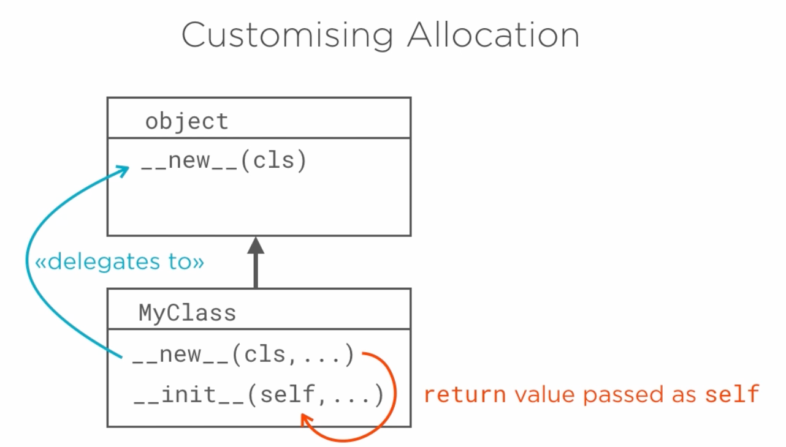
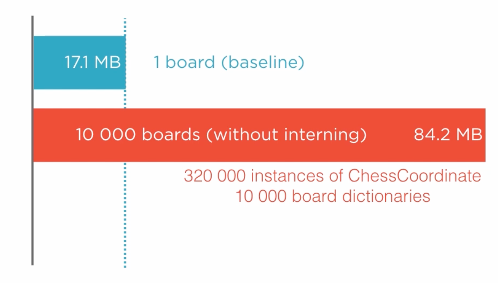
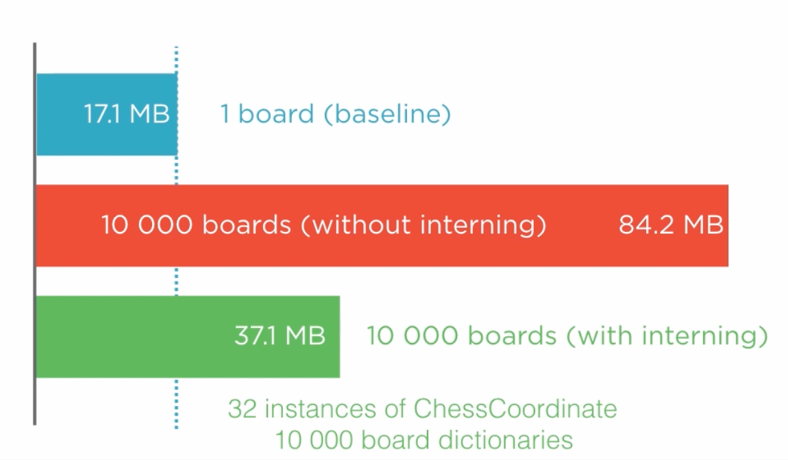

# 5.3 Customizing Allocation

## Key Ideas

- `__new__` can be customized to control instance creation beyond basic allocation
- **Interning** is a powerful technique that can dramatically reduce memory consumption
- Interning reuses existing instances instead of creating new ones for identical values
- Only immutable value types should be interned to ensure safe sharing
- Python uses interning internally for integers and strings
- Memory savings can be substantial when many duplicate immutable objects exist



## Practical Application: Chess Board Memory Optimization

### The Chess Board Problem

We'll demonstrate customizing allocation by extending our chess program to handle multiple chess boards. Each board is represented as a dictionary mapping piece names to ChessCoordinate objects:

```python
{
    '♕♖': ChessCoordinate('a', 1),
    '♕♘': ChessCoordinate('b', 1),
    '♕♗': ChessCoordinate('c', 1),
    '♕♕': ChessCoordinate('d', 1),
    '♔♔': ChessCoordinate('e', 1),
    ...
    '♚♝♟': ChessCoordinate('f', 7),
    '♚♞♟': ChessCoordinate('g', 7),
    '♚♜♟': ChessCoordinate('h', 7),
}
```

**Unicode Piece Notation**: We use Unicode chess symbols where combinations like '♕♖' (white queen + white rook) means "white queen's rook", and '♚♝♟' (black king + black bishop + black pawn) means "black king's bishop's pawn". This specificity is required because dictionary keys must be distinct.

### Initial Implementation

```python
def starting_board():
    return {
        '♕♖': ChessCoordinate('a', 1),
        '♕♘': ChessCoordinate('b', 1),
        '♕♗': ChessCoordinate('c', 1),
        '♕♕': ChessCoordinate('d', 1),
        '♔♔': ChessCoordinate('e', 1),
        '♔♗': ChessCoordinate('f', 1),
        '♔♘': ChessCoordinate('g', 1),
        '♔♖': ChessCoordinate('h', 1),
        '♕♖♙': ChessCoordinate('a', 2),
        '♕♘♙': ChessCoordinate('b', 2),
        '♕♗♙': ChessCoordinate('c', 2),
        '♕♕♙': ChessCoordinate('d', 2),
        '♔♔♙': ChessCoordinate('e', 2),
        '♔♗♙': ChessCoordinate('f', 2),
        '♔♘♙': ChessCoordinate('g', 2),
        '♔♖♙': ChessCoordinate('h', 2),
        '♛♜': ChessCoordinate('a', 8),
        '♛♞': ChessCoordinate('b', 8),
        '♛♝': ChessCoordinate('c', 8),
        '♛♛': ChessCoordinate('d', 8),
        '♚♚': ChessCoordinate('e', 8),
        '♚♝': ChessCoordinate('f', 8),
        '♚♞': ChessCoordinate('g', 8),
        '♚♜': ChessCoordinate('h', 8),
        '♛♜♟': ChessCoordinate('a', 7),
        '♛♞♟': ChessCoordinate('b', 7),
        '♛♝♟': ChessCoordinate('c', 7),
        '♛♛♟': ChessCoordinate('d', 7),
        '♚♚♟': ChessCoordinate('e', 7),
        '♚♝♟': ChessCoordinate('f', 7),
        '♚♞♟': ChessCoordinate('g', 7),
        '♚♜♟': ChessCoordinate('h', 7),
    }

def main():
    boards = [starting_board() for _ in range(1)]
    pass
```

## The Memory Problem

### Single Board Usage
Creating a single chess board shows Python allocated about **17.1 MB** of memory.

### Scaling Issues
```python
def main():
    boards = [starting_board() for _ in range(10000)]
    pass
```

Creating 10,000 chessboards utilizes **84.2 MB** of memory to store the 320,000 instances of ChessCoordinate contained by the 10,000 dictionaries.



### The Core Inefficiency

**Key insight**: There are only **64 distinct positions** on a chess board. Since our ChessCoordinate objects are deliberately immutable value types, we should never need more than 64 instances. In our specific case, we should never need more than the **32 positions** occupied by pieces in their initial places.

## The Interning Solution

### Implementing Interning in `__new__`

```python
class ChessCoordinate:

    _interned = {}

    def __new__(cls, file, rank):
        if len(file) != 1:
            raise ValueError("{} component file {!r} does not have a length of one."
                             .format(cls.__name__, file))

        if file not in 'abcdefgh':
            raise ValueError("{} component file {!r} is out of range."
                             .format(cls.__name__, file))

        if rank not in range(1, 9):
            raise ValueError("{} component rank {!r} is out of range."
                             .format(cls.__name__, rank))

        key = (file, rank)
        if key not in cls._interned:
            obj = super().__new__(cls)
            obj._file = file
            obj._rank = rank
            cls._interned[key] = obj

        return cls._interned[key]

    @property
    def file(self):
        return self._file

    @property
    def rank(self):
        return self._rank
```

### Key Changes Made

1. **Named parameters**: Using specific `file` and `rank` arguments instead of `*args, **kwargs`
2. **Validation moved**: Validation logic moved from `__init__` to `__new__`
3. **Interning dictionary**: Class attribute `_interned = {}` stores cached instances
4. **Key creation**: `key = (file, rank)` creates a hashable lookup key
5. **Instance caching**: Only create new instances if not already cached
6. **Direct initialization**: Initialize `_file` and `_rank` directly in `__new__`
7. **Empty `__init__`**: The `__init__` method becomes empty and can be removed

### How the Interning Works

1. **Validate arguments** first (same validation as before)
2. **Create lookup key** from file and rank tuple
3. **Check cache**: Look for existing instance in `_interned` dictionary
4. **Create if missing**: Only allocate new object if key not found
5. **Initialize immediately**: Set `_file` and `_rank` attributes during creation
6. **Cache new instance**: Store in `_interned` dictionary for future use
7. **Return cached instance**: Always return the cached instance (new or existing)

## Memory Optimization Results

With interning in place, allocating 10,000 boards takes much less memory: **37.1 MB**, less than half what was required previously.



### Why Still 37.1 MB?

Even with interned ChessCoordinate objects, we still need to store **10,000 distinct dictionaries** representing the board configurations. The memory savings come from reusing the same 32 ChessCoordinate instances across all boards.

## When to Use Interning

### Requirements for Safe Interning
- **Immutable value types only**: Objects that can safely be shared between data structures
- **Frequent duplication**: Many instances with identical values
- **Memory pressure**: Situations where memory usage is a concern

### Python's Internal Use
Python uses interning internally for:
- **Integers** (especially small integers)
- **Strings** (especially string literals)

## Key Takeaways

- **Custom `__new__`**: Enables powerful memory optimization techniques like interning
- **Validation placement**: Validation can be moved to `__new__` for early failure
- **Instance sharing**: Immutable objects can be safely shared to reduce memory usage
- **Dramatic savings**: 50%+ memory reduction achievable with interning
- **Cache management**: Class-level dictionaries provide simple instance caching
- **Safety requirement**: Only use interning with immutable value types
- **Real-world impact**: Techniques used internally by Python for performance optimization
