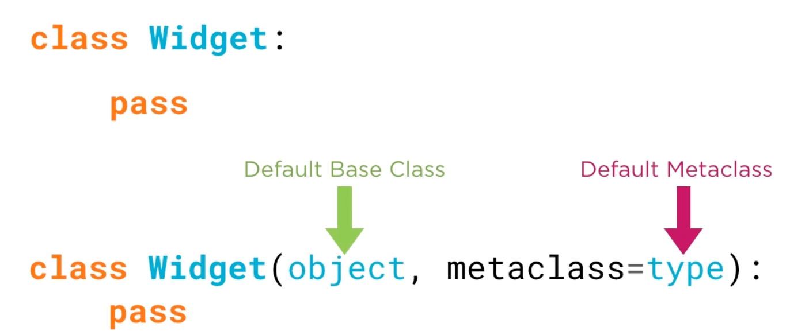

# 6.1 Metaclasses

## Key Ideas

- Metaclasses are the "classes of class objects" - they define how classes behave
- The default metaclass in Python is `type`
- The type of any class object is its metaclass
- Metaclasses can be specified in class definitions and customized
- Understanding metaclasses requires understanding the hierarchy: instance → class → metaclass
- Class definitions are syntactic sugar for more explicit metaclass usage

## What is a Metaclass?

A **metaclass** is the class of a class object. Just as instances have classes, classes themselves have metaclasses that control their behavior and creation.

### The Type Hierarchy


**Instance level**: The type of an instance is its class
**Class level**: The type of a class is its metaclass

### The `type` Duality

The `type` built-in serves two purposes:
- **As a function**: Determines the type of an object
- **As a value**: The default metaclass for all classes

This pattern exists elsewhere in Python (e.g., `list` as both constructor and type).

### Metaclass Chain Through `__class__`


## Class Creation and Metaclasses

### Implicit vs Explicit Class Definition



**Standard class definition** (syntactic sugar):
```python
class Widget:
    pass
```

**Explicit equivalent**:
```python
class Widget(object, metaclass=type):
    pass
```

### Default Behavior

- **Base class**: Implicitly `object` when not specified
- **Metaclass**: Implicitly `type` when not specified

## Fundamental Concepts

### Metaclass Definition
- The **type of any class object** is its metaclass
- The **default metaclass** is `type`
- Metaclasses control how classes are constructed and behave

### The `type` Metaclass
- `type` is both a function for introspection and the default metaclass
- `type(type)` returns `type` (self-referential at the top of the hierarchy)
- All standard Python classes use `type` as their metaclass unless explicitly changed

## Module Scope

This module will cover:
- Specifying custom metaclasses in class definitions
- Defining custom metaclasses and their special methods
- Practical metaclass examples solving real problems
- Metaclass interaction with inheritance

## Key Takeaways

- **Hierarchy understanding**: Instances → Classes → Metaclasses
- **Default metaclass**: `type` is used unless explicitly overridden
- **Syntactic sugar**: Class definitions hide the implicit metaclass specification
- **Self-reference**: `type` is its own metaclass (top of the metaclass chain)
- **Practical foundation**: Understanding metaclasses enables advanced class customization
