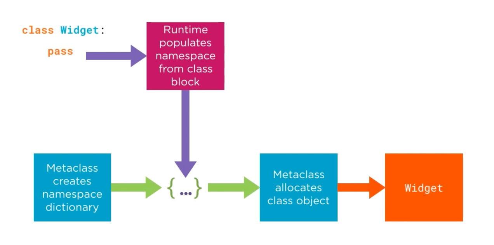

# 6.2 Class Allocation and Initialization

## Key Ideas

- Class definitions are syntactic sugar for dictionary creation and metaclass processing
- Metaclass creation involves three phases: `__prepare__`, `__new__`, and `__init__`
- The Python runtime populates the namespace dictionary during class block execution
- Custom metaclasses can intercept and modify class creation at each phase
- Understanding the metaclass protocol enables powerful class customization



## The Class Creation Process

### Syntactic Sugar Explanation

Class blocks in Python source code are syntactic sugar for creating dictionaries that are processed by metaclasses to produce class objects.

### Metaclass Creation Protocol

When defining `class Widget`, Python executes the equivalent of:

```python
name = 'Widget'
metaclass = type
bases = ()
kwargs = {}

namespace = metaclass.__prepare__(name, bases, **kwargs)
Widget = metaclass.__new__(metaclass, name, bases, namespace, **kwargs)
metaclass.__init__(Widget, name, bases, namespace, **kwargs)
```

### Three-Phase Process

1. **`__prepare__`**: Creates the namespace object (dictionary-like)
2. **`__new__`**: Allocates the class object using the populated namespace
3. **`__init__`**: Initializes the newly created class object

## Implementing a Tracing Metaclass

### TracingMeta Implementation

```python
class TracingMeta(type):

    @classmethod
    def __prepare__(mcs, name, bases, **kwargs):
        print("TracingMeta.__prepare__(name, bases, **kwargs)")
        print("  mcs =", mcs)
        print("  name =", name)
        print("  bases =", bases)
        print("  kwargs =", kwargs)
        namespace = super().__prepare__(name, bases)
        print("  <-- namespace =", namespace)
        print()
        return namespace

    def __new__(mcs, name, bases, namespace, **kwargs):
        print("TracingMeta.__new__(mcs, name, bases, namespace, **kwargs)")
        print("  mcs =", mcs)
        print("  name =", name)
        print("  bases =", bases)
        print("  namespace =", namespace)
        print("  kwargs =", kwargs)
        cls = super().__new__(mcs, name, bases, namespace)
        print("  <-- cls =", cls)
        print()
        return cls

    def __init__(cls, name, bases, namespace, **kwargs):
        print("TracingMeta.__init__(cls, name, bases, namespace, **kwargs)")
        print("  cls =", cls)
        print("  name =", name)
        print("  bases =", bases)
        print("  namespace =", namespace)
        print("  kwargs =", kwargs)
        super().__init__(name, bases, namespace)
        print()
```

### Metaclass Implementation Rules

- **Inheritance**: Custom metaclasses must subclass an existing metaclass (typically `type`)
- **Delegation**: Each override should delegate to the base class method via `super()`
- **Method decorators**: `__prepare__` requires explicit `@classmethod` decorator
- **Implicit behavior**: `__new__` is implicitly a class method

## Demonstrating Metaclass Execution

```python
>>> from tracing import TracingMeta
>>> class Widget(metaclass=TracingMeta):
...     def action(message):
...         print(message)
...     the_answer = 42
TracingMeta.__prepare__(name, bases, **kwargs)
  mcs = <class 'tracing.TracingMeta'>
  name = Widget
  bases = ()
  kwargs = {}
  <-- namespace = {}

TracingMeta.__new__(mcs, name, bases, namespace, **kwargs)
  mcs = <class 'tracing.TracingMeta'>
  name = Widget
  bases = ()
  namespace = {'__module__': 'builtins', 'the_answer': 42, 'action': <function Widget.action at 0x103406840>, '__qualname__': 'Widget'}
  kwargs = {}
  <-- cls = <class 'Widget'>

TracingMeta.__init__(cls, name, bases, namespace, **kwargs)
  cls = <class 'Widget'>
  name = Widget
  bases = ()
  namespace = {'__module__': 'builtins', 'the_answer': 42, 'action': <function Widget.action at 0x103406840>, '__qualname__': 'Widget'}
  kwargs = {}
```

## Detailed Analysis of Each Phase

### Phase 1: `__prepare__` Method

**Purpose**: Create initial namespace mapping for the class

**Arguments**:
- `mcs`: Reference to the metaclass (analogous to `self` for instances, `cls` for class methods)
- `name`: String name of the class being created (`'Widget'`)
- `bases`: Tuple of base classes (empty tuple `()` - implicit `object` base)
- `kwargs`: Dictionary of keyword arguments (empty in this example)

**Behavior**:
- Returns a dictionary or mapping object for the class namespace
- Default `type.__prepare__()` returns an empty regular dictionary
- This dictionary becomes the namespace for the class definition

### Phase 2: `__new__` Method

**Purpose**: Allocate the new class object

**Arguments**:
- `mcs`: Reference to the metaclass
- `name`: String name of the class
- `bases`: Tuple of base classes
- `namespace`: Populated mapping from `__prepare__` (now contains class contents)
- `kwargs`: Keyword arguments

**Namespace Population**:
The Python runtime populates the namespace with:
- `action`: The defined method
- `the_answer`: The class attribute (value 42)
- `__module__`: Module where class was defined (`'builtins'` for REPL)
- `__qualname__`: Fully qualified class name

**Critical Point**: Namespace modifications must occur before calling `super().__new__()`, as this creates the actual class object.

### Phase 3: `__init__` Method

**Purpose**: Initialize the newly created class object

**Method Type**: Instance method of the metaclass (not class method)

**Arguments**:
- `cls`: The newly created class object (one level less "meta")
- `name`, `bases`, `namespace`, `kwargs`: Same as in `__new__`

**Behavior**:
- Configures the already-created class object
- Namespace content is already consumed by `__new__`
- Class modifications must manipulate `cls` directly

## Method Override Guidelines

### When to Override Each Method

**`__prepare__`**:
- Override only if you need non-standard mapping behavior
- Default implementation provides regular dictionary
- Rare use case

**`__new__` vs `__init__`**:
- Usually only one needs to be overridden
- `__new__`: Can make decisions before class allocation
- `__init__`: Preferred for configuration (better composability)
- Same distinction as for regular classes

### Key Capabilities

**Namespace Modification**: Modify the dictionary of class attributes and methods before class instantiation

**Base Class Modification**: Change the list of base classes

**Class Replacement**: Return entirely different class objects (rare use case)

## Best Practices

- **Composability**: Prefer `__init__` over `__new__` for configuration
- **Delegation**: Always call `super()` methods to maintain inheritance chain
- **Timing**: Understand when modifications are effective (before vs after class creation)
- **Purpose clarity**: Each phase has specific responsibilities and capabilities
