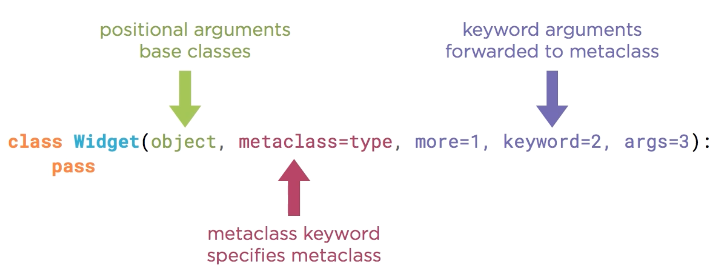

# 6.3 Metaclass Keyword Arguments

## Key Ideas

- Metaclasses can accept additional keyword arguments beyond the standard parameters
- All three metaclass methods (`__prepare__`, `__new__`, `__init__`) must have matching signatures
- Keyword arguments enable class statements to function as configurable class factories
- Arguments are forwarded from class definition to all three metaclass methods
- Both `**kwargs` and explicit named parameters are supported

## Passing Arguments to Metaclasses



### Argument Forwarding Mechanism

The metaclass methods `__prepare__`, `__new__`, and `__init__` support a `**kwargs` parameter to accept arbitrary keyword arguments. Any arguments provided in the class definition beyond the `metaclass` parameter are forwarded to all three methods.

### Basic Example with Keyword Arguments

```python
>>> from tracing import *
>>> 
>>> class Reticulator(metaclass=TracingMeta, tension=496):
...     def reticulate(self, spline):
...         print(spline)
...     cubic = True
TracingMeta.__prepare__(name, bases, **kwargs)
  mcs = <class 'tracing.TracingMeta'>
  name = Reticulator
  bases = ()
  kwargs = {'tension': 496}
  <-- namespace = {}

TracingMeta.__new__(mcs, name, bases, namespace, **kwargs)
  mcs = <class 'tracing.TracingMeta'>
  name = Reticulator
  bases = ()
  namespace = {'__module__': 'builtins', '__qualname__': 'Reticulator', 'cubic': True, 'reticulate': <function Reticulator.reticulate at 0x1032c88c8>}
  kwargs = {'tension': 496}
  <-- cls = <class 'Reticulator'>

TracingMeta.__init__(cls, name, bases, namespace, **kwargs)
  cls = <class 'Reticulator'>
  name = Reticulator
  bases = ()
  namespace = {'__module__': 'builtins', '__qualname__': 'Reticulator', 'cubic': True, 'reticulate': <function Reticulator.reticulate at 0x1032c88c8>}
  kwargs = {'tension': 496}
```

**Result**: The `tension=496` argument is forwarded to all three metaclass methods, enabling class configuration. This transforms the class statement into a configurable class factory.

## Practical Example: Dynamic Attribute Generation

### EntriesMeta Implementation

```python
class EntriesMeta(type):

    def __new__(mcs, name, bases, namespace, **kwargs):
        print("Entries.__new__(mcs, name, bases, namespace, **kwargs)")
        print("  kwargs =", kwargs)
        num_entries = kwargs['num_entries']
        print("  num_entries =", num_entries)
        namespace.update({chr(i): i for i in range(ord('a'), ord('a') + num_entries)})
        cls = super().__new__(mcs, name, bases, namespace)
        return cls
```

**Functionality**: This metaclass expects a `num_entries` keyword argument to dynamically populate the class namespace with alphabet entries (`a`, `b`, `c`, etc.) mapped to their ASCII values.

## Critical Issue: Signature Matching Requirement

### Initial Attempt and Error

```python
>>> from entries import EntriesMeta
>>> class AtoZ(metaclass=EntriesMeta, num_entries=26):
...     pass
...
Entries.__new__(mcs, name, bases, namespace, **kwargs)
  kwargs = {'num_entries': 26}
  num_entries = 26
Traceback (most recent call last):
  File "<input>", line 1, in <module>
TypeError: type.__init__() takes no keyword arguments
```

**Problem**: The `__new__` method successfully receives the keyword arguments, but `__init__` fails because `type.__init__()` doesn't accept keyword arguments.

### Solution: Matching Signatures

**Critical Rule**: Both `__new__` and `__init__` must accept the same additional keyword arguments.

```python
def __init__(cls, name, bases, namespace, **kwargs):
    super().__init__(name, bases, namespace)
```

**Implementation**: Add a matching `__init__` method that accepts `**kwargs` but only passes the standard arguments to `super()`.

### Successful Implementation

```python
>>> from entries import EntriesMeta
>>> class AtoZ(metaclass=EntriesMeta, num_entries=26):
...     pass
...
Entries.__new__(mcs, name, bases, namespace, **kwargs)
  kwargs = {'num_entries': 26}
  num_entries = 26

>>> dir(AtoZ)
['__class__', '__delattr__', '__dict__', '__dir__', '__doc__', '__eq__',
 '__format__', '__ge__', '__getattribute__', '__gt__', '__hash__', '__init__',
 '__init_subclass__', '__le__', '__lt__', '__module__', '__ne__', '__new__',
 '__reduce__', '__reduce_ex__', '__repr__', '__setattr__', '__sizeof__',
 '__str__', '__subclasshook__', '__weakref__',
 'a', 'b', 'c', 'd', 'e', 'f', 'g', 'h', 'i', 'j', 'k', 'l', 'm', 'n', 'o',
 'p', 'q', 'r', 's', 't', 'u', 'v', 'w', 'x', 'y', 'z']
>>> AtoZ.x
120
```

**Result**: The class now contains all 26 alphabet letters as attributes, each mapped to their ASCII values.

## Improved Approach: Explicit Named Parameters

### Enhanced EntriesMeta with Named Parameters

```python
class EntriesMeta(type):

    def __new__(mcs, name, bases, namespace, num_entries, **kwargs):
        print("Entries.__new__(mcs, name, bases, namespace, **kwargs)")
        print("  kwargs =", kwargs)
        print("  num_entries =", num_entries)
        namespace.update({chr(i): i for i in range(ord('a'), ord('a') + num_entries)})
        cls = super().__new__(mcs, name, bases, namespace)
        return cls

    def __init__(cls, name, bases, namespace, num_entries, **kwargs):
        super().__init__(name, bases, namespace)
```

### Usage with Named Parameters

```python
>>> from entries import EntriesMeta
>>> class AtoJ(metaclass=EntriesMeta, num_entries=10):
...     pass
...
Entries.__new__(mcs, name, bases, namespace, **kwargs)
  kwargs = {}
  num_entries = 10
```

**Advantages**: 
- More explicit and readable than extracting from `**kwargs`
- Better type hinting and IDE support
- Clearer API for metaclass users

## Key Implementation Requirements

### Signature Consistency
- **Both** `__new__` and `__init__` must accept the same additional parameters
- Use `**kwargs` if accepting arbitrary keyword arguments
- Use named parameters for explicit API design

### Parameter Handling Options
1. **`**kwargs` only**: Extract parameters from the kwargs dictionary
2. **Named parameters + `**kwargs`**: Explicit parameters with optional additional arguments
3. **Named parameters only**: Fixed API with specific required arguments

## Best Practices

- **Explicit is better**: Use named parameters when the API is well-defined
- **Signature matching**: Ensure `__new__` and `__init__` accept the same arguments
- **Documentation**: Clearly document expected keyword arguments
- **Error handling**: Validate required arguments and provide meaningful error messages
- **Delegation**: Always call `super()` with appropriate arguments
