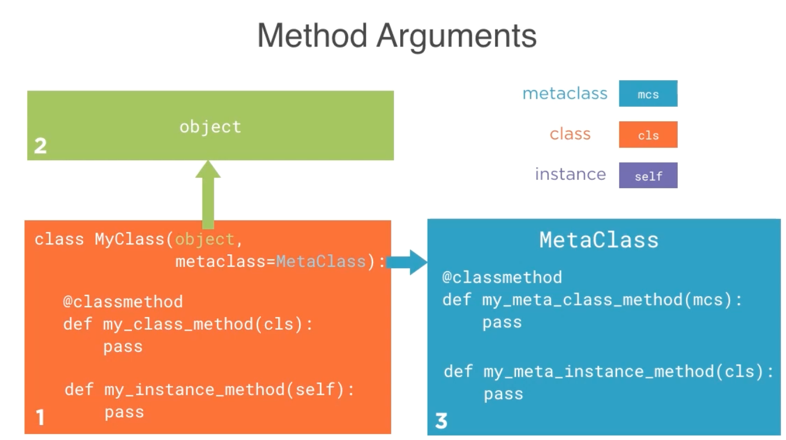

# 6.4 Metaclass Method Visibility

## Key Ideas

- Metaclasses can contain custom methods beyond the special methods (`__prepare__`, `__new__`, `__init__`)
- Instance methods of metaclasses become accessible as class-level methods
- Metamethods accept `cls` as their first argument (the class instance of the metaclass)
- Metamethods are not accessible through class instances, only through the class itself
- Class methods in regular classes take precedence over metamethods during lookup
- The `__call__` metamethod has special significance and practical applications

## Custom Methods in Metaclasses

### Adding a Metamethod

```python
def metamethod(cls):
    print("TracingMeta.metamethod(cls)")
    print("cls =", cls)
    print()
```

**Characteristics**:
- Accepts single argument `cls` (making it an instance method of the metaclass)
- The `cls` parameter represents the class that uses this metaclass
- Functions as a class-level method when accessed through the target class

## Method Access Patterns

### Accessing Metamethods Through Classes

```python
>>> from tracing import *
>>> class Widget(metaclass=TracingMeta):
...     pass

>>> Widget.metamethod()
TracingMeta.metamethod(cls)
cls = <class 'Widget'>
```

**Result**: The metamethod is accessible directly on the `Widget` class and receives the class itself as the `cls` argument.

### Metamethods Not Available Through Instances

```python
>>> w = Widget()
>>> w.metamethod()
Traceback (most recent call last):
  File "<input>", line 1, in <module>
AttributeError: 'Widget' object has no attribute 'metamethod'
>>> 
```

**Limitation**: Unlike regular class methods (created with `@classmethod`), metamethods cannot be accessed via class instances.

## Method Lookup Precedence and Argument Patterns



### Method Resolution Priority

**Precedence Rule**: Class method definitions in the regular class and its base classes take precedence over methods in the metaclass during method lookup.

### Argument Patterns for Metaclass Methods

**Regular Metaclass Methods**:
- Accept `cls` as their first argument
- `cls` represents the class (instance of the metaclass)
- Analogous to `self` in regular instance methods

**Class Methods in Metaclasses**:
- Accept `mcs` (metaclass) as their first argument
- `mcs` represents the metaclass itself
- Analogous to `cls` in regular class methods

## Summary

Metaclass methods provide class-level functionality but with important limitations:
- **Accessibility**: Only available through the class, not through instances
- **Precedence**: Regular class methods override metaclass methods
- **Arguments**: Follow metaclass-specific parameter conventions
- **Usage**: Rarely used in practice, with `__call__` being a notable exception
