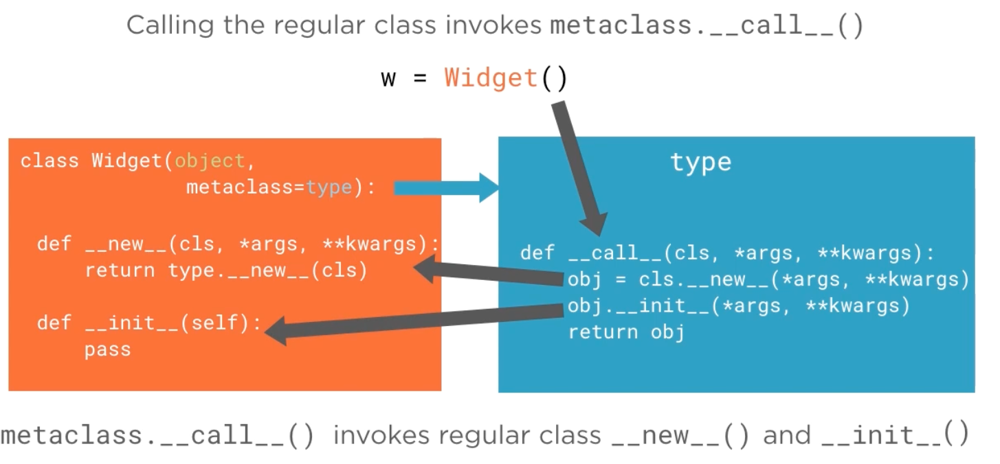

# 6.5 Metaclass __call__ : The Instance Constructor

## Key Ideas

- **Metaclass `__call__` Control**: Overriding `__call__` in metaclasses provides fine-grained control over instance creation
- **Constructor Mechanism**: Class constructors are actually calls to the metaclass `__call__` method
- **Default Behavior**: `type.__call__` orchestrates the standard `__new__` → `__init__` sequence
- **Practical Applications**: Enable constructor argument validation and constraints at the metaclass level

## Instance Creation Process

The standard instance creation process involves calling the class constructor:

```python
class Widget(object, metaclass=type):

    def __new__(cls, *args, **kwargs):
        return type.__new__(cls)

    def __init__(self):
        pass

w = Widget()
```

**Traditional Understanding**: Instance creation calls `Widget.__new__` for allocation followed by `Widget.__init__` for initialization.

## The Real Mechanism Behind Instance Creation



**Core Concept**: The `__new__` → `__init__` sequence is orchestrated by the metaclass `__call__` method.

### How Classes Become Callable

- **Metaclass `__call__`**: Responsible for the entire instance creation process
- **Metamethod Nature**: `__call__` is a metamethod accessible as a class method
- **Callable Objects**: `__call__` makes classes callable like functions
- **Constructor Calls**: What we call "constructor calls" are actually `__call__` metamethod invocations

## Implementing Custom `__call__` Behavior

```python
def __call__(cls, *args, **kwargs):
    print("TracingMeta.__call__(cls, *args, **kwargs)")
    print("  cls =", cls)
    print("  args =", args)
    print("  kwargs =", kwargs)
    print("  About to call type.__call__()")
    obj = super().__call__(*args, **kwargs)
    print("  Returned from type.__call__()")
    print("<-- obj =", obj)
    print()
    return obj
```

**Implementation Strategy**:
1. **Trace Arguments**: Print method name and received parameters
2. **Delegate to Parent**: Forward call to `type.__call__()` via `super()`
3. **Trace Result**: Print the returned object from parent metaclass

```python
class TracingClass(metaclass=TracingMeta):

    def __new__(cls, *args, **kwargs):
        print(" TracingClass.__new__(cls, args, kwargs)")
        print("  cls =", cls)
        print("  args =", args)
        print("  kwargs =", kwargs)
        obj = super().__new__(cls)
        print("  <-- obj =", obj)
        return obj

    def __init__(self, *args, **kwargs):
        print(" TracingClass.__init__(self, *args, **kwargs)")
        print("  self =", self)
        print("  args =", args)
        print("  kwargs =", kwargs)
        print()
```

**TracingClass Features**:
- **Metaclass Assignment**: Uses `TracingMeta` as its metaclass
- **Method Tracing**: Overrides `__new__` and `__init__` to trace execution
- **Complete Visibility**: Shows the full instance creation process

### Class Definition Process

```python
>>> from tracing import *

>>> TracingMeta.__prepare__(name, bases, **kwargs)
mcs = <class 'tracing.TracingMeta'>
name = TracingClass
bases = ()
kwargs = {}
<-- namespace = {}

>>> TracingMeta.__new__(mcs, name, bases, namespace, **kwargs)
mcs = <class 'tracing.TracingMeta'>
name = TracingClass
bases = ()
namespace = {'__new__': <function TracingClass.__new__ at 0x1032c8840>, '__qualname__': 'TracingClass', '__module__': 'tracing'}
kwargs = {}
<-- cls = <class 'tracing.TracingClass'>

>>> TracingMeta.__init__(cls, name, bases, namespace, **kwargs)
cls = <class 'tracing.TracingClass'>
name = TracingClass
bases = ()
namespace = {'__new__': <function TracingClass.__new__ at 0x1032c8840>, '__qualname__': 'TracingClass', '__module__': 'tracing'}
kwargs = {}

>>>
```

**Class Creation Sequence**: During module import, the metaclass trifecta (`__prepare__`, `__new__`, `__init__`) executes when `TracingClass` is defined.

## Instance Creation with Custom `__call__`

```python
>>> t = TracingClass(42, keyword="clef")
TracingMeta.__call__(cls, *args, **kwargs)
  cls = <class 'tracing.TracingClass'>
  args = (42,)
  kwargs = {'keyword': 'clef'}
  About to call type.__call__()

TracingClass.__new__(cls, args, kwargs)
  cls = <class 'tracing.TracingClass'>
  args = (42,)
  kwargs = {'keyword': 'clef'}
  <--- obj = <tracing.TracingClass object at 0x1032f9eb8>

TracingClass.__init__(self, *args, **kwargs)
  self = <tracing.TracingClass object at 0x1032f9eb8>
  args = (42,)
  kwargs = {'keyword': 'clef'}

  Returned from type.__call__()
<--- obj = <tracing.TracingClass object at 0x1032f9eb8>

>>>
```

### Control Flow Analysis

**Execution Sequence**:
1. **Constructor Call** → **Metaclass `__call__`**: `TracingClass(42, keyword="clef")` invokes `TracingMeta.__call__()`
2. **Argument Forwarding**: Metaclass receives constructor arguments plus the class being constructed
3. **Delegation to `type.__call__()`**: Custom `__call__` forwards to parent metaclass implementation
4. **Standard Process**: `type.__call__()` orchestrates `TracingClass.__new__` → `TracingClass.__init__`

**Key Insights**:
- **Orchestration Role**: `type.__call__` manages the default allocation and initialization sequence
- **Low-Level Control**: Overriding `__call__` provides fundamental Python machinery control
- **Rare Usage**: Metaclass `__call__` overrides are uncommon but powerful

## Practical Application: Constructor Constraints
 
```python
class KeywordsOnlyMeta(type):
    def __call__(cls, *args, **kwargs):
        if args:
            raise TypeError("Constructor for class {!r} does not accept positional arguments.".format(cls))
        return super().__call__(cls, **kwargs)


class ConstrainedToKeywords(metaclass=KeywordsOnlyMeta):
    def __init__(self, *args, **kwargs):
        print("args =", args)
        print("kwargs =", kwargs)
```

**KeywordsOnlyMeta Features**:
- **Argument Validation**: Prevents classes from accepting positional constructor arguments
- **Error Handling**: Raises `TypeError` when positional arguments are detected
- **Selective Forwarding**: Only passes keyword arguments to parent `__call__`

**ConstrainedToKeywords Class**:
- **Metaclass Usage**: Uses `KeywordsOnlyMeta` for constructor constraint enforcement
- **Method Flexibility**: `__init__` accepts both positional and keyword arguments, but metaclass prevents positional usage
 
### Demonstration of Constraint Enforcement

```python
>>> from keywordmeta import *
>>> c = ConstrainedToKeywords(23, 45, 96, color='white')
Traceback (most recent call last):
  File "<input>", line 1, in <module>
  File "/Users/rjs/training/tmp/metaclass/keywordmeta.py", line 6, in __call__
    raise TypeError("Constructor for class {!r} does not accept positional arguments.".format(cls))
TypeError: Constructor for class <class 'keywordmeta.ConstrainedToKeywords'> does not accept positional arguments.
>>> 
```

**Constraint Enforcement**: Despite `__init__` accepting positional arguments via `*args`, execution never reaches the method because the metaclass `__call__` intercepts and rejects positional arguments.

```python
>>> c = ConstrainedToKeywords(color='white')
args = (<class 'keywordmeta.ConstrainedToKeywords'>,)
kwargs = {'color': 'white'}
```

**Successful Usage**: Constructor calls with only keyword arguments are permitted as designed.

## Summary

Metaclass `__call__` provides powerful control over instance creation:
- **Constructor Interception**: Override `__call__` to intercept all constructor calls
- **Argument Validation**: Implement custom validation logic before object creation
- **Low-Level Control**: Access to fundamental Python object creation machinery
- **Practical Applications**: Enable constructor constraints and specialized instantiation patterns
