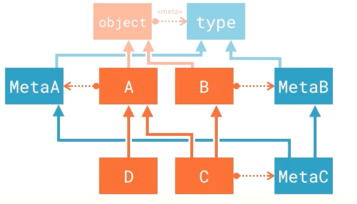
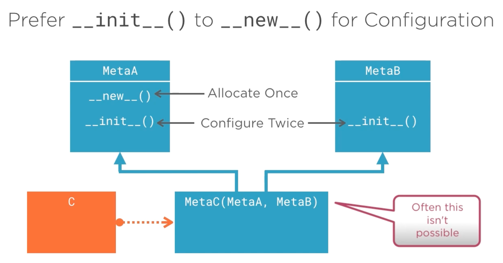

# 6.8 Metaclasses and Inheritance

## Key Ideas

- **Metaclass Inheritance**: Metaclasses are inherited from base classes to derived classes
- **Conflict Resolution**: Multiple inheritance with different metaclasses requires explicit resolution
- **Cooperative Design**: Metaclasses must use `super()` and be designed for composition
- **Method Placement**: Prefer `__init__` over `__new__` for configuration to enable better cooperation
- **Third-Party Limitations**: Framework metaclasses may not compose gracefully

## Basic Metaclass Inheritance

### Setting Up Test Metaclasses

```python
class MetaA(type):
    pass

class MetaB(type):
    pass
```

**Test Setup**: Two empty metaclasses that both inherit from `type`, with no special functionality.

```python
class A(metaclass=MetaA):
    pass

class B(metaclass=MetaB):
    pass
```

**Base Classes**: Two regular classes that use different metaclasses (`MetaA` and `MetaB` respectively).

### Single Inheritance: Metaclass Inherited

```python
class D(A):
    pass
```

```python
>>> from metainheritance import *
>>> type(D)
<class 'metainheritance.MetaA'>
```

**Result**: Class `D` inherits the metaclass `MetaA` from its base class `A`. Metaclasses are inherited through the class hierarchy.

## Multiple Inheritance: Metaclass Conflicts

### Problem: Conflicting Metaclasses

```python
class C(A, B):
    pass
```

```python
>>> from metainheritance import *
Traceback (most recent call last):
  File "<input>", line 1, in <module>
  File "/Applications/PyCharm.app/Contents/helpers/pydev/pydev_import_hook.py", line 21, in do_import
    module = self._system_import(name, *args, **kwargs)
  File "/Users/rjs/training/tmp/metaclass/metainheritance.py", line 18, in <module>
    class C(A, B):
TypeError: metaclass conflict: the metaclass of a derived class must be a (non-strict) subclass of the metaclasses of all its bases
```

**Conflict Analysis**:
- **Error Cause**: Classes `A` and `B` have unrelated metaclasses (`MetaA` and `MetaB`)
- **Python's Dilemma**: Cannot determine which metaclass `__new__` method to use for class allocation
- **Requirement**: The derived class metaclass must be a subclass of all base class metaclasses

## Resolving Metaclass Conflicts


### Solution: Unified Metaclass

```python
class MetaC(MetaA, MetaB):
    pass
```

```python
class C(A, B, metaclass=MetaC):
    pass
```

```python
>>> from metainheritance import *
>>> type(C)
<class 'metainheritance.MetaC'>
```

**Resolution Strategy**:
1. **Create Unified Metaclass**: `MetaC` inherits from both `MetaA` and `MetaB`
2. **Explicit Declaration**: Specify `MetaC` as the metaclass for class `C`
3. **Conflict Resolved**: `MetaC` is a subclass of both required metaclasses



**Success**: Class `C` now successfully uses `MetaC` as its metaclass, resolving the conflict.

## Practical Metaclass Composition

### Simple Composition Example

Empty metaclasses combine trivially, but real metaclasses can also compose when they override different methods:

```python
class ProhibitDuplicatesMeta(type):
    @classmethod
    def __prepare__(mcs, name, bases):
        return OneShotClassNamespace(name)
```

```python
class KeywordsOnlyMeta(type):
    def __call__(cls, *args, **kwargs):
        if args:
            raise TypeError(
                "Constructor for class {!r} does "
                "not accept positional arguments.".format(cls))
        return super().__call__(cls, **kwargs)
```

```python
class ProhibitDuplicatesAndKeyWordsOnlyMeta(
    ProhibitDuplicatesMeta,
    KeyWordsOnlyMeta):
    pass
```

**Successful Composition**:
- **Non-Overlapping Methods**: `ProhibitDuplicatesMeta` overrides `__prepare__`, `KeywordsOnlyMeta` overrides `__call__`
- **Empty Body**: The combined metaclass requires no additional implementation
- **Both Behaviors**: Inherits duplicate prevention and keyword-only constructor enforcement

## Design Principles for Cooperative Metaclasses

### Use `super()` for Delegation

**Critical Requirement**: Metaclasses must use `super()` when delegating to base classes to support multiple inheritance through the Method Resolution Order (MRO).

**Example**: Both `TracingMeta` and `DescriptorNamingMeta` override `__new__` but combine successfully because they properly use `super()`.

### Practical Example: Combining TracingMeta and DescriptorNamingMeta

```python
from tracing import TracingMeta

class TracingDescriptorNamingMeta(TracingMeta, DescriptorNamingMeta):
    pass

class Planet(metaclass=TracingDescriptorNamingMeta):
    # ... Planet implementation
```

**Successful Cooperation**:
- **Multiple `__new__` Overrides**: Both metaclasses override `__new__` but work together
- **Order Independence**: The metaclasses combine successfully in either inheritance order
- **Proper Delegation**: Both use `super()` to delegate through the MRO chain
- **Combined Functionality**: Planet class gets both tracing and descriptor naming capabilities



### Prefer `__init__` for Configuration

**Design Recommendation**: Place class configuration code in `__init__` rather than `__new__` when possible.

**Rationale**:
- **Allocation vs Configuration**: `__new__` handles allocation (once per object), `__init__` handles configuration (potentially multiple times)
- **Better Composition**: Configuration in `__init__` allows for more flexible metaclass cooperation
- **Separation of Concerns**: Clear distinction between object creation and object configuration

## Limitations with Third-Party Metaclasses

**Reality Check**: Metaclasses from third-party frameworks (SQLAlchemy, Qt, etc.) often don't compose gracefully.

**Compatibility Assessment**:
- **Source Code Review**: Examine implementation to determine if metaclasses use `super()` properly
- **Composition Testing**: Test combinations in controlled environments
- **Framework Documentation**: Check for official guidance on metaclass composition

## Summary

Key principles for metaclass inheritance and composition:

- **Inheritance**: Metaclasses are inherited through the class hierarchy
- **Conflict Resolution**: Multiple inheritance with different metaclasses requires explicit unified metaclass
- **Cooperative Design**: Use `super()` for proper delegation through MRO
- **Method Placement**: Prefer `__init__` over `__new__` for configuration when possible
- **Real-World Constraints**: Third-party metaclasses may not be designed for composition

**Best Practice**: Design metaclasses with composition in mind from the beginning, using `super()` and clear separation of concerns.
