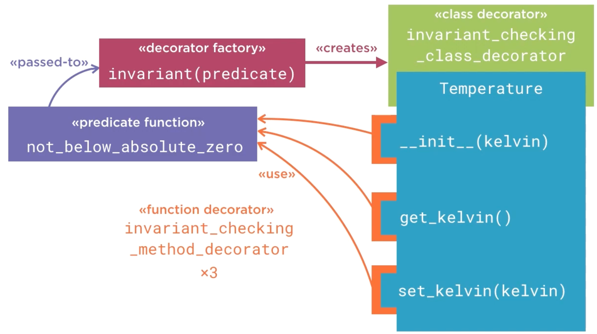

# 7.2 Enforcing Class Invariants

## Key Ideas

- **Generic Invariant Checking**: Create reusable class decorators that accept predicate functions to define invariants
- **Decorator Factory Pattern**: Use factory functions that return class decorators for configurable behavior
- **Method Wrapping**: Automatically wrap all callable class members with invariant-checking proxies
- **Post-Method Validation**: Check invariants after each method execution to catch violations immediately
- **Property Limitation**: Standard callable detection doesn't handle property setters, revealing decorator limitations

## Invariant Enforcement Architecture

To implement generic invariant checking, we need a way to specify the class invariant to the class decorator using the decorator factory pattern:



### Architecture Overview

**Multi-Layer Process**:
1. **Predicate Function**: Describes the invariant condition
2. **Decorator Factory**: Creates the actual class decorator based on the predicate
3. **Class Decorator**: Processes the class definition and identifies callable members
4. **Method Decorators**: Applied to each method to add invariant checking
5. **Runtime Validation**: Method decorators delegate to the predicate function after method execution

## Implementation: Invariant Decorator Factory

```python
import functools

def invariant(predicate):
    """Create a class decorator which checks a class invariant.

    Args:
        predicate: A callable to which, after every method invocation,
                   the object on which the method was called will be passed.
                   The predicate should evaluate to True if the class invariant
                   has been maintained, or False if it has been violated.

    Returns:
        A class decorator for checking the class invariant tested by
        the supplied predicate function.
    """
    def invariant_checking_class_decorator(cls):
        """A class decorator for checking invariants."""

        method_names = [name for name, attr in vars(cls).items() if callable(attr)]
        for name in method_names:
            _wrap_method_with_invariant_checking_proxy(cls, name, predicate)

        return cls

    return invariant_checking_class_decorator

def _wrap_method_with_invariant_checking_proxy(cls, name, predicate):
    method = getattr(cls, name)
    assert callable(method)

    @functools.wraps(method)
    def invariant_checking_method_decorator(self, *args, **kwargs):
        result = method(self, *args, **kwargs)
        if not predicate(self):
            raise RuntimeError("Class invariant {!r} violated for {!r}".format(predicate.__doc__, self))
        return result

    setattr(cls, name, invariant_checking_method_decorator)

def not_below_absolute_zero(temperature):
    """Temperature not below absolute zero"""
    return temperature._kelvin >= 0 

@invariant(not_below_absolute_zero)
class Temperature:

    def __init__(self, kelvin):
        self._kelvin = kelvin

    def get_kelvin(self):
        return self._kelvin

    def set_kelvin(self, value):
        self._kelvin = value
```

### Implementation Components

**Decorator Factory (`invariant`)**:
- **Input**: Predicate function for testing invariant conditions
- **Output**: Class decorator configured with the specific predicate
- **Purpose**: Enables reusable invariant checking with custom predicates

**Class Decorator (`invariant_checking_class_decorator`)**:
- **Method Detection**: Identifies callable attributes using `vars(cls).items()`
- **Method Processing**: Wraps each callable method with invariant checking
- **Class Modification**: Returns the modified class with wrapped methods

**Method Wrapper (`_wrap_method_with_invariant_checking_proxy`)**:
- **Execution Flow**: Calls original method, then checks invariant
- **Error Handling**: Raises `RuntimeError` if invariant is violated
- **Class Update**: Uses `setattr()` to replace methods (class `__dict__` is immutable)

**Predicate Function (`not_below_absolute_zero`)**:
- **Direct Access**: Accesses private `_kelvin` attribute for validation
- **Return Value**: Boolean indicating invariant compliance
- **Documentation**: Docstring used in error messages

## Testing Basic Invariant Enforcement

```python
>>> from class_decorators import *
>>> t = Temperature(5.0)
>>> t = Temperature(-1.0)
Traceback (most recent call last):
  File "<input>", line 1, in <module>
  File "/Users/rjs/training/tmp/class_decorators/class_decorators.py", line 37, in invariant_checking_method_decorator
    raise RuntimeError("Class invariant {!r} violated for {!r}".format(predicate.__doc__, self))
RuntimeError: Class invariant 'Temperature not below absolute zero' violated for <class_decorators.Temperature object at 0xXXXXX>
>>> s = Temperature(42.0)
>>> s.set_kelvin(-1.0)
Traceback (most recent call last):
  File "<input>", line 1, in <module>
  File "/Users/rjs/training/tmp/class_decorators/class_decorators.py", line 37, in invariant_checking_method_decorator
    raise RuntimeError("Class invariant {!r} violated for {!r}".format(predicate.__doc__, self))
RuntimeError: Class invariant 'Temperature not below absolute zero' violated for <class_decorators.Temperature object at 0xXXXXXXXX>
```

### Successful Invariant Detection

**Constructor Protection**: Creating `Temperature(-1.0)` triggers invariant violation in `__init__`
**Method Protection**: Calling `set_kelvin(-1.0)` triggers invariant violation after method execution
**Error Messages**: Include predicate docstring for clear violation reporting

## Limitation: Properties and Complex Descriptors

### Enhanced Temperature Class with Properties

```python
@invariant(not_below_absolute_zero)
class Temperature:

    def __init__(self, kelvin):
        self._kelvin = kelvin

    def get_kelvin(self):
        return self._kelvin

    def set_kelvin(self, value):
        self._kelvin = value

    @property
    def celsius(self):
        return self._kelvin - 273.15

    @celsius.setter
    def celsius(self, value):
        self._kelvin = value + 273.15

    @property
    def fahrenheit(self):
        return self._kelvin * 9/5 - 459.67

    @fahrenheit.setter
    def fahrenheit(self, value):
        self._kelvin = (value + 459.67) * 5/9
```

**Added Properties**:
- **Celsius**: Conversion between Kelvin and Celsius scales
- **Fahrenheit**: Conversion between Kelvin and Fahrenheit scales
- **Bidirectional**: Both getter and setter for each temperature scale

### Demonstrating the Property Limitation

```python
>>> from class_decorators import *
>>> t = Temperature(42.0)
>>> t.celsius
-231.14999999999998
>>> t.celsius = -100
>>> t.celsius
-100.0
>>> t.celsius = -300 #class invariant violated
```

**Test Results**:
1. **Valid Operation**: `t.celsius = -100` works correctly (-100°C is above absolute zero)
2. **Invariant Bypass**: `t.celsius = -300` succeeds but should fail (-300°C is below absolute zero)
3. **Missing Protection**: No `RuntimeError` is raised despite invariant violation

### Delayed Detection Problem

```python
>>> t.get_kelvin()
Traceback (most recent call last):
  File "<input>", line 1, in <module>
  File "/Users/rjs/training/tmp/class_decorators/class_decorators.py", line 37, in invariant_checking_method_decorator
    raise RuntimeError("Class invariant {!r} violated for {!r}".format(predicate.__doc__, self))
RuntimeError: Class invariant 'Temperature not below absolute zero' violated for <class_decorators.Temperature object at
```

**Critical Issue**: The invariant violation is detected only when calling `get_kelvin()`, not when the violation occurs.

## Root Cause Analysis

**Why Properties Bypass Invariant Checking**:
- **Callable Detection**: The decorator only wraps methods identified as `callable(attr)`
- **Property Structure**: Properties are descriptor objects, not callable functions
- **Setter Access**: Property setters are not detected by the simple callable check
- **Defense Breach**: Objects can enter invalid states through unprotected property setters

**Design Flaw**: Class invariant violations should be caught immediately at mutation points, not during subsequent query operations.

## Summary

The basic invariant enforcement mechanism works for simple methods but fails with properties because:

- **Limited Scope**: Only wraps directly callable attributes
- **Property Blindness**: Cannot detect property setters as mutation points
- **Late Detection**: Violations discovered during queries rather than mutations
- **Incomplete Protection**: Sophisticated descriptors require more advanced detection mechanisms

**Next Steps**: Enhanced approaches needed to handle properties and other descriptor-based attributes.
