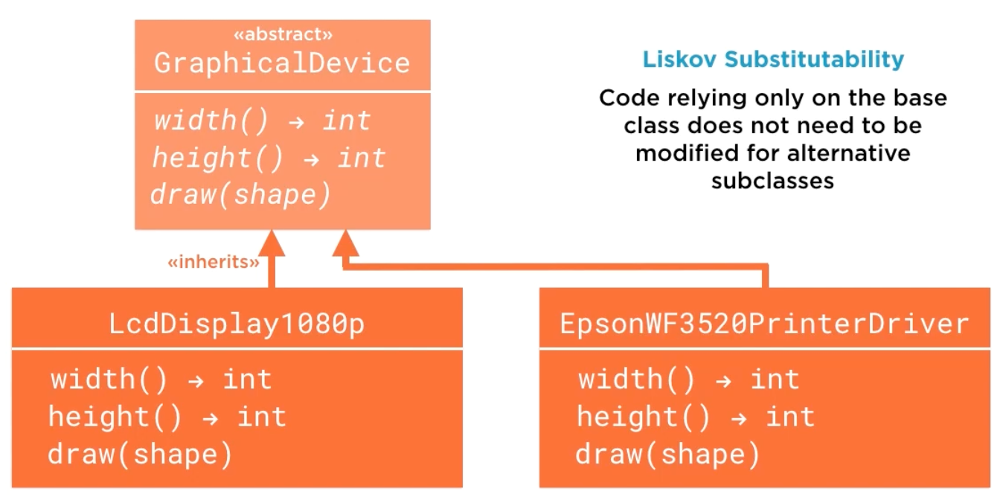

# 8.1 Introducing Abstract Base Classes

## Key Ideas

- **PEP 3119 Foundation**: Python's ABC mechanism defined in PEP 3119 provides tools for creating abstract base classes
- **Interface Definition**: ABCs define interfaces that derived classes must implement
- **Flexibility**: Python's ABC mechanism is more flexible than traditional OOP languages (Java, C++, C#)
- **Liskov Substitutability**: Enables subclasses to be interchangeable from client code perspective
- **Duck Typing Enhancement**: Complements duck typing with explicit interface verification
- **Standard Library Tools**: The `abc` module provides infrastructure for custom abstract base classes

## Understanding Abstract Base Classes

### General Definition

### Terminology Analysis

**Base**:
- **Inheritance Target**: Intended as the parent in inheritance relationships
- **Example**: `GraphicalDevice` serves as base class for `EpsonWF3520PrinterDriver`

**Abstract**:
- **Non-Instantiable**: Cannot be instantiated in isolation
- **Derived-Only**: Only makes sense as part of a derived type object
- **Enforcement**: Should prevent direct instantiation of the abstract class

**Concrete** (opposite of abstract):
- **Instantiable**: Can be directly instantiated
- **Example**: `PrinterDriver` is concrete and can be instantiated

## Core Purposes of Abstract Base Classes

### 1. Interface Definition

**Primary Rationale**: Define interfaces that derived classes must implement

**Benefits**:
- **Client Code Simplification**: Write code against the base class interface
- **Implementation Requirement**: Derived classes must override abstract methods
- **Example**: `PrinterDriver` must override three abstract methods of `GraphicalDevice`

### 2. Liskov Substitutability

**Design Principle**: Subclasses should be interchangeable from a client code perspective

**Requirements**:
- **Interface Adherence**: Client code depends only on the abstract interface, not concrete types
- **Type Independence**: Code works with any conforming implementation
- **Example**: Code using `GraphicalDevice` works equally with `EpsonWF3520Printer` or `1080pLcdDisplay`

### 3. Shared Implementation

**Beyond Pure Interfaces**: Unlike Java interfaces, ABCs can contain implementation code

**Advantage**: Common functionality shared across all derived classes

## ABCs and Duck Typing

### The Duck Typing Question

**Philosophical Issue**: Why define named interfaces when duck typing exists?

**Duck Typing Principle**: If an object responds to the interface and behaves correctly, type identity shouldn't matter

### Practical Limitations of Pure Duck Typing

**Interface Verification Challenge**: Determining interface support before usage is awkward

**Example Problem**: What defines a `MutableSequence` in Python?

### MutableSequence Protocol Complexity

**Known Facts**:
- `list` is a `MutableSequence`
- Not all mutable sequences are lists
- **Protocol Requirements**: At least 16 methods must be implemented

**Duck Typing Challenges**:
1. **Verification Difficulty**: Hard to confirm all requirements are met
2. **Look Before You Leap**: Pre-checking object admissibility is messy and awkward
3. **Robustness Issues**: No clean way to verify interface compliance in advance

## Summary

Abstract base classes in Python provide:

**Core Capabilities**:
- **Interface Contracts**: Define required methods for derived classes
- **Shared Implementation**: Provide common functionality across subclasses
- **Type Checking**: Enable explicit interface verification beyond duck typing

**Design Benefits**:
- **Liskov Substitutability**: Enable interchangeable subclasses
- **Client Code Simplification**: Program against abstract interfaces, not concrete types
- **Documentation**: Explicitly declare interface requirements

**Python-Specific Features**:
- **Flexibility**: More flexible than traditional OOP language ABCs
- **Duck Typing Enhancement**: Complement, don't replace, duck typing
- **Standard Library Support**: Built-in tools via the `abc` module

**Key Distinction**: Python ABCs balance between formal interface definition and duck typing flexibility, addressing practical verification challenges while maintaining Python's dynamic nature.
