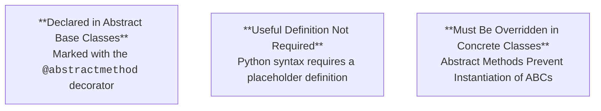

# 8.10 Declaring Abstract Methods

## Key Ideas

- **@abstractmethod Decorator**: Marks methods as abstract, requiring implementation in concrete subclasses
- **ABCMeta Requirement**: Abstractness is only enforced when the class uses `ABCMeta` as its metaclass
- **Prevents Instantiation**: Classes with unimplemented abstract methods cannot be instantiated
- **Virtual Subclass Exception**: Abstract method requirements only apply to real subclasses, not virtual subclasses
- **NotImplemented vs NotImplementedError**: Distinct concepts for different purposes

---

## What Are Abstract Methods?

### Definition



An abstract method is a method which is declared, but which doesn't necessarily have a useful definition. Abstract methods must be overridden in derived concrete classes, and the presence of an abstract method will prevent its host class being instantiated.

**Characteristics:**

- **Declaration without implementation**: Method signature exists but may lack meaningful code
- **Enforcement mechanism**: Prevents instantiation of incomplete classes
- **Contract definition**: Specifies which methods subclasses must provide
- **Optional default behavior**: Can provide implementation that subclasses may call via `super()`

---

## Declaring Abstract Methods

### Basic Syntax

```python
from abc import (ABC, abstractmethod)

class AbstractBaseClass(ABC):  # metaclass is ABCMeta

    @abstractmethod
    def an_abstract_method(self):
        raise NotImplementedError  # Method body syntactically required.
# Metaclass must be ABCmeta for abstracness to be enforced
```

**Requirements:**

1. **Import `@abstractmethod` decorator** from `abc` module
2. **Use `ABCMeta` as metaclass** (directly or via `ABC` base class)
3. **Decorate methods** with `@abstractmethod`
4. **Provide method body** (Python syntax requirement, even if placeholder)

**Common Placeholder Implementations:**

- `raise NotImplementedError`: Explicit error if called
- `pass`: Minimal valid body
- Default implementation: Useful behavior that subclasses can override or extend

---

## Abstract Methods in Sword Example

### Adding Abstract Methods to Sword ABC

```python
from abc import ABC, abstractmethod

class Sword(ABC):

    @classmethod
    def __subclasshook__(cls, sub):
    return ((hasattr(sub, 'swipe') and callable(sub.swipe)
             and hasattr(sub, 'thrust') and callable(sub.thrust)
             and hasattr(sub, 'parry') and callable(sub.parry)
             and hasattr(sub, 'sharpen') and callable(sub.sharpen))
            or NotImplemented)

    @abstractmethod
    def swipe(self):
        raise NotImplementedError

    @abstractmethod
    def thrust(self):
        print("Thrusting...")

    @abstractmethod
    def parry(self):
        raise NotImplementedError
```

### Implementation Variations

**swipe() and parry():**
- Raise `NotImplementedError` as placeholders
- Must be fully implemented in subclasses
- No default behavior provided

**thrust():**
- Provides default implementation: `print("Thrusting...")`
- Subclasses can call via `super().thrust()`
- Subclasses still must override (cannot use inherited implementation directly)

### Updated __subclasshook__

The `__subclasshook__()` method is updated to check for all abstract methods: `swipe`, `thrust`, `parry`, and `sharpen`.

---

## NotImplemented vs NotImplementedError

### Critical Distinction

| Aspect | `NotImplemented` | `NotImplementedError` |
|--------|-----------------|---------------------|
| **Type** | Singleton value | Exception class |
| **Purpose** | Signal "unable to determine" | Signal "code not implemented" |
| **Context** | Return from predicate functions | Raise in missing implementations |
| **Use Case** | `__subclasshook__()`, comparison operators | Abstract method placeholders |
| **Meaning** | "I don't know" / "defer to others" | "This must be implemented" |

**Example Usage:**

```python
# NotImplemented - return value
def __subclasshook__(cls, sub):
    if some_condition:
        return True
    else:
        return NotImplemented  # Let someone else decide

# NotImplementedError - exception
@abstractmethod
def abstract_method(self):
    raise NotImplementedError  # This must be overridden
```

---

## Enforcement with Real Subclasses

### Incomplete Implementation Attempt

```python
class BroadSword(Sword):

    def swipe(self):
        print("Swoosh!")

    def sharpen(self):
        print("Shink!")
```

### Instantiation Error

```python
>>> from weapons import *
>>> broad_sword = BroadSword()
Traceback (most recent call last):
  File "<input>", line 1, in <module>
TypeError: Can't instantiate abstract class BroadSword with abstract methods, parry, thrust
```

**Analysis:**

- `BroadSword` explicitly inherits from `Sword` (real subclass relationship)
- Only implements `swipe()` and `sharpen()`
- Missing implementations for `parry()` and `thrust()`
- Python prevents instantiation with clear error message
- Error lists specific missing methods: `parry` and `thrust`

---

## Complete Implementation

### Implementing All Abstract Methods

```python
class BroadSword(Sword):

    def swipe(self):
        print("Swoosh!")

    def thrust(self):
        super().thrust()

    def parry(self):
        print("Parry!")

    def sharpen(self):
        print("Shink!")
```

**Key Points:**

- All four abstract methods are now implemented
- `thrust()` calls `super().thrust()` to use default behavior from `Sword`
- `swipe()`, `parry()`, and `sharpen()` provide custom implementations
- Class is now considered concrete (can be instantiated)

### Successful Instantiation

```python
>>> from weapons import *
>>> broad_sword = BroadSword()
>>> broad_sword.swipe()
Swoosh!
```

**Result:**

- `BroadSword` can now be instantiated successfully
- All methods work as expected
- Default `thrust()` behavior available via `super()`

---

## Virtual Subclasses and Abstract Methods

### Abstract Method Requirements Do Not Apply

```python
>>> samurai_sword = SamuraiSword()
>>> samurai_sword
<weapons.SamuraiSword object at 0x1031b96d8>
```

**Critical Observation:**

`SamuraiSword` can be instantiated successfully despite:
- Being a virtual subclass of `Sword`
- Not implementing all abstract methods
- Passing `isinstance(samurai_sword, Sword)` checks

### Why Virtual Subclasses Are Exempt

**Real Subclasses (via inheritance):**
- Directly inherit from ABC
- Must implement all abstract methods
- Enforcement is automatic via `ABCMeta`
- Cannot be instantiated if incomplete

**Virtual Subclasses (via registration or `__subclasshook__`):**
- Only recognized for type checking purposes
- Do not inherit abstract method requirements
- Can be instantiated regardless of protocol compliance
- Enforcement is limited to what `__subclasshook__()` checks

### Design Implications

This distinction means:

```python
# Real subclass - abstract methods enforced
class RealSubclass(Sword):
    pass  # Cannot instantiate without implementing abstract methods

# Virtual subclass - no enforcement
@Sword.register
class VirtualSubclass:
    pass  # Can instantiate freely

isinstance(VirtualSubclass(), Sword)  # True, but no guarantees
```

---

## Best Practices

### When to Use Abstract Methods

**Appropriate Scenarios:**

- Defining required interface for real subclasses
- Enforcing implementation of critical methods
- Documenting expected subclass behavior
- Creating class hierarchies with shared structure

### Providing Default Implementations

**Benefits:**

- Subclasses can extend rather than replace behavior via `super()`
- Reduces code duplication for common implementations
- Documents expected behavior even if overridden
- Provides fallback for partial implementations

**Pattern:**

```python
@abstractmethod
def method(self):
    # Default implementation
    print("Default behavior")
```

Subclasses can then:

```python
def method(self):
    super().method()  # Use default
    print("Extended behavior")
```

### Combining with __subclasshook__

When using both abstract methods and `__subclasshook__()`:

- Abstract methods enforce requirements for **real subclasses**
- `__subclasshook__()` defines protocol for **virtual subclasses**
- Keep both in sync to maintain consistent expectations
- Document which guarantees apply to which type of subclass

---

## Summary

Abstract methods, declared with the `@abstractmethod` decorator, define required methods that concrete subclasses must implement. Abstractness is only enforced when the class uses `ABCMeta` as its metaclass (directly or via `ABC` base class), preventing instantiation of classes with unimplemented abstract methods. The `Sword` example demonstrates three patterns: placeholder implementations using `raise NotImplementedError`, default implementations that subclasses can extend via `super()`, and updated `__subclasshook__()` to match abstract methods. Critically, abstract method requirements only apply to real subclasses through inheritance; virtual subclasses established via registration or `__subclasshook__()` are exempt from these requirements and can be instantiated regardless of implementation completeness.
