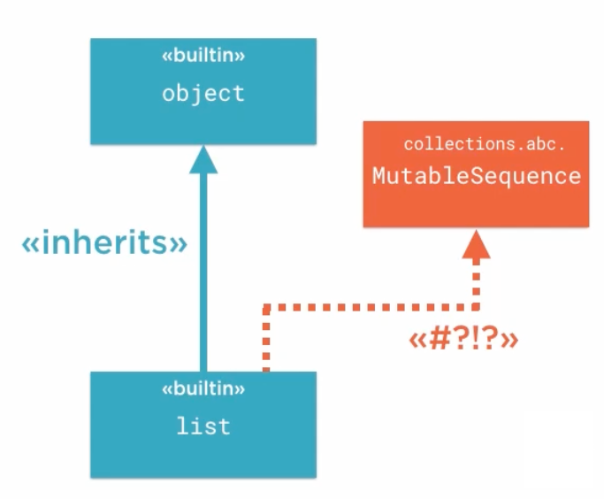
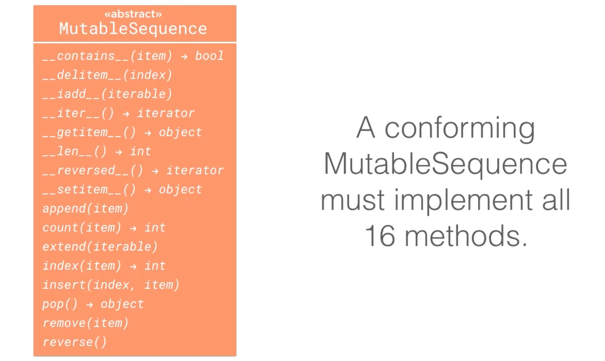
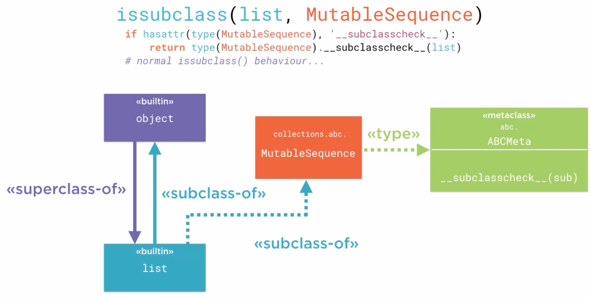

# 8.2 Abstract Base Classes in Python

## Key Ideas

- **Dual Purpose**: ABCs define protocols and verify protocol compliance
- **Virtual Base Classes**: Classes can be subclasses without inheritance relationships
- **Metaclass Mechanism**: `__subclasscheck__` enables custom subclass determination
- **Minimal Implementation**: Implement only core methods; ABCs provide the rest
- **Non-Traditional Inheritance**: Python ABCs break traditional OOP inheritance rules
- **Protocol Verification**: Easy determination of protocol compliance via `issubclass()`

## Two Core Purposes of Python ABCs

### 1. Protocol Definition

**Interface Specification**: Define protocols/interfaces with minimum implementation requirements

### 2. Protocol Verification

**Compliance Checking**: Easily determine if classes/instances meet protocol requirements

## The Surprising Nature of Python ABCs


### The Paradox: `list` and `MutableSequence`

```python
>>> from collections.abc import MutableSequence
>>> 
>>> issubclass(list, MutableSequence)
True
>>> list.__mro__
(<class 'list'>, <class 'object'>)
```



**Surprising Result**: `issubclass(list, MutableSequence)` returns `True`

**Investigation**: Examining `list`'s Method Resolution Order (MRO) via `__mro__` reveals:



**Key Discovery**:
- **Only Base Class**: `list` inherits only from `object`
- **MutableSequence Absence**: `MutableSequence` is not in the inheritance chain
- **Paradox**: `list` is a subclass of `MutableSequence` without inheriting from it

**Implications**:
- Fundamental type (`list`) appears as subclass of library module type (`MutableSequence`)
- Challenges traditional OOP inheritance understanding
- Demonstrates Python ABC flexibility

## Verifying Abstract Nature

### Direct Instantiation Attempt

```python
>>> ms = MutableSequence()
Traceback (most recent call last):
  File "<stdin>", line 1, in <module>
TypeError: Can't instantiate abstract class MutableSequence with abstract methods __delitem__, __getitem__, __len__, __setitem__, insert
>>> 
```

**Confirmation**: `MutableSequence` cannot be instantiated directly

**Error Information**:
- **Five Required Methods**: `__delitem__`, `__getitem__`, `__len__`, `__setitem__`, `insert`
- **Minimal Implementation**: Only 5 methods required out of 16 total protocol methods

### Shared Implementation in ABCs

**Efficiency Through Composition**:
- **11 Derived Methods**: Implemented in terms of the 5 core methods
- **Code Reuse**: ABC provides default implementations for derived methods
- **Performance Trade-off**: Default implementations may not be most efficient (work through abstract interface only)
- **Optimization Opportunity**: Concrete classes can override defaults with optimized versions

## The Mechanism: Virtual Base Classes



### How `issubclass(list, MutableSequence)` Returns True

**Metaclass Hook**: The `issubclass()` function uses a special metaclass method for custom subclass checking.

**Process Flow**:
1. **Method Check**: `issubclass()` checks for `__subclasscheck__` on `type(MutableSequence)` (the metaclass)
2. **Delegation**: If present, calls `__subclasscheck__(list)` on the metaclass
3. **Custom Logic**: Metaclass determines subclass relationship

**Equivalent Code**: `issubclass(list, MutableSequence)` is roughly equivalent to:

```python
if hasattr(type(MutableSequence), '__subclasscheck__'):
    return type(MutableSequence).__subclasscheck__(list)
# normal issubclass() behaviour...
```

### Responsibility Inversion

**Traditional Inheritance**: Subclass knows about and declares its superclasses

**Virtual Base Classes**: 
- **Inverted Responsibility**: Metaclass determines subclass relationships
- **One-Way Knowledge**: `list` doesn't need to know about `MutableSequence`
- **Flexible Determination**: `MutableSequence`'s metaclass decides if `list` qualifies

### Virtual Base Classes Defined

**Concept**: Base classes without traditional inheritance relationships

**Key Characteristics**:
- **Subclass Without Inheritance**: `list` is a subclass of `MutableSequence` without inheriting from it
- **Not a Superclass**: `MutableSequence` is not a superclass in the traditional sense
- **No C++ Connection**: Unrelated to C++'s virtual base class concept

### `__subclasscheck__` Flexibility

**Arbitrary Logic**: The metaclass `__subclasscheck__` method can use any criteria to determine subclass status

**Power**: Complete control over what constitutes a valid subclass for the protocol

## Summary

Python's abstract base class mechanism provides:

**Protocol Definition**:
- **Minimal Requirements**: Define only essential methods (5 for `MutableSequence`)
- **Shared Implementation**: Provide default implementations for derived methods
- **Clear Contracts**: Explicit error messages for missing methods

**Virtual Inheritance**:
- **Metaclass Magic**: `__subclasscheck__` enables custom subclass determination
- **Flexible Relationships**: Subclass relationships without traditional inheritance
- **Protocol Verification**: Easy compliance checking via `issubclass()`

**Key Innovation**: Separation of interface compliance from inheritance hierarchy, allowing Python's built-in types to retroactively implement protocols defined in library modules.

**Practical Benefit**: Built-in types like `list` automatically work as protocol implementations without modification or inheritance changes.
