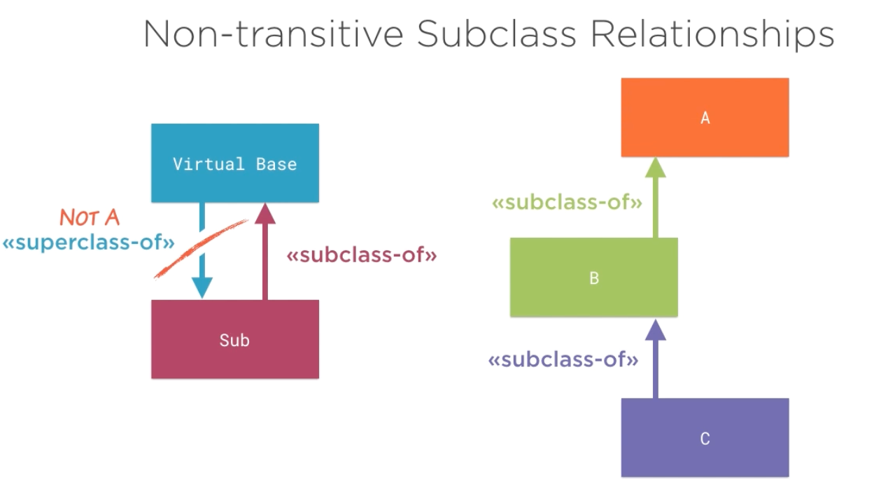
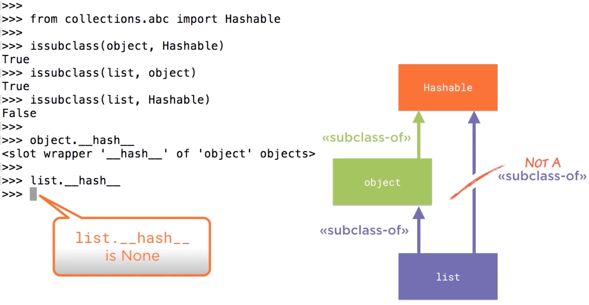

# 8.4 Non-transitive Subclass Relationships

## Key Ideas

- **Non-transitivity in Virtual Base Classes**: Overriding `__subclasscheck__` breaks the traditional transitivity property of subclass relationships
- **Hashable Example**: The `collections.abc.Hashable` ABC demonstrates non-transitivity where `object` is `Hashable`, `list` is `object`, but `list` is not `Hashable`
- **Explicit Hash Disabling**: Mutable types like `list` set `__hash__ = None` to explicitly disable hashing despite inheriting from hashable `object`
- **Lack of Symmetry**: Virtual base classes demonstrate that superclass/subclass relationships are not symmetric in Python's ABC system

---

## Non-transitivity of Subclass Relationships



### Breaking Traditional Inheritance Rules

Overriding `__subclasscheck__` provides class implementors with extensive flexibility, but this flexibility comes at a cost: the traditional properties of inheritance hierarchies no longer hold.

**Transitivity in Traditional Inheritance:**
- If `C` is a subclass of `B`
- And `B` is a subclass of `A`
- Then `C` should be a subclass of `A`

**With Virtual Base Classes:**
- This transitivity property cannot be guaranteed
- Custom `__subclasscheck__` implementations can break the chain
- Each relationship is evaluated independently

---

## The Hashable Example



### Demonstrating Non-transitivity

The `Hashable` abstract base class from `collections.abc` provides a clear example of non-transitive subclass relationships:

```python
from collections.abc import Hashable

# Test the chain of relationships
issubclass(object, Hashable)  # True
issubclass(list, object)      # True
issubclass(list, Hashable)    # False!
```

### Analysis of the Relationship

**Step 1: object is Hashable**
- The base `object` class is considered a subclass of `Hashable`
- `object` provides a default `__hash__` method

**Step 2: list is object**
- The `list` class inherits from `object`
- This is a traditional inheritance relationship

**Step 3: list is NOT Hashable**
- Despite inheriting from `object`, `list` is not considered `Hashable`
- Transitivity is broken: `list` → `object` → `Hashable` does not imply `list` → `Hashable`

---

## How list Disables Hashing

### Explicit Hash Removal

Mutable collections like `list` explicitly disable hashing to prevent their use as dictionary keys or set members:

```python
# The list class explicitly sets __hash__ to None
class list:
    __hash__ = None
    # ... other methods
```

### The Hashable.__subclasscheck__ Implementation

The `Hashable` ABC's `__subclasscheck__` method checks for the presence of a valid `__hash__` attribute:

1. **Looks for `__hash__` attribute** in the candidate class
2. **Checks if `__hash__` is `None`**: If so, the class explicitly opts out of hashability
3. **Returns `False`** for classes with `__hash__ = None`

This mechanism allows:
- Classes to inherit from `object` (which is hashable)
- Yet explicitly signal they are not hashable
- Breaking the transitivity chain intentionally

---

## Implications for Class Design

### Lack of Symmetry

This example also demonstrates the asymmetry in Python's ABC system:

- The ultimate base class `object` can be considered a subclass of `Hashable`
- Yet `object` is not explicitly a superclass of `Hashable`
- Superclass and subclass relationships are not symmetric inverses

### When to Break Transitivity

Non-transitive relationships are appropriate when:
- **Protocol compliance is conditional**: Like hashability depending on mutability
- **Explicit opt-out is needed**: Classes can inherit structure but opt out of protocols
- **Semantic requirements differ**: Subclasses may not satisfy parent protocol semantics

---

## Summary

Overriding `__subclasscheck__` enables powerful flexibility in defining class relationships, but breaks traditional inheritance properties. The `Hashable` ABC demonstrates how `list` can inherit from hashable `object` yet explicitly opt out of hashability by setting `__hash__ = None`. This mechanism shows that virtual base class relationships are neither transitive nor symmetric, requiring careful consideration when designing ABC hierarchies. The ability to break transitivity allows precise control over protocol compliance independent of structural inheritance.
