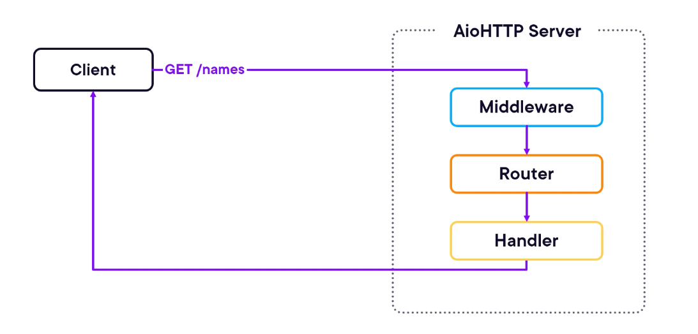

# 2.2 Building an Asynchronous HTTP Server

## AioHTTP Request Flow

Here's how a request travels through the system:



### Request Processing Pipeline

| **Step** | **Component** | **Function** | **Example** |
|----------|---------------|--------------|-------------|
| **1. Client Request** | HTTP Client | Sends HTTP request (browser, app, or AioHTTP client) | `GET /names` |
| **2. Middleware** | Middleware Layer | Handles cross-cutting concerns | Authentication, logging, CORS |
| **3. Router** | Request Router | Identifies correct handler based on method and URL | Maps `GET /names` to handler |
| **4. Handler** | Route Handler | Processes request and generates response | Business logic execution |
| **5. Response** | HTTP Response | Sends response back to client | JSON data, status codes |

### Key Benefits of This Architecture

- **Flexibility**: Add multiple request handlers for different endpoints
- **Extensibility**: Implement middleware for authentication, logging, and other features
- **Separation of Concerns**: Each component has a specific responsibility
- **Scalability**: Non-blocking I/O throughout the pipeline

## Basic AioHTTP Server Implementation

### Installation and Setup

First, install AioHTTP:

```bash
pip install aiohttp
```

### Minimal Server Example

```python
# pip install aiohttp

from aiohttp import web

async def get_names(request):
    return web.Response(text='hi all')

app = web.Application()
app.router.add_get('/names', get_names)

web.run_app(app)
```

### Code Breakdown

| **Component** | **Purpose** | **Details** |
|---------------|-------------|-------------|
| `from aiohttp import web` | **Import Module** | Web module provides server functionality |
| `async def get_names(request)` | **Handler Coroutine** | Takes request as argument for processing |
| `web.Application()` | **Application Container** | Main container for the web server |
| `app.router.add_get()` | **Route Registration** | Maps GET requests to handler coroutine |
| `web.run_app(app)` | **Server Startup** | Starts server to process client requests |

## Demo: Building a RESTful API

We'll build a complete RESTful API to manage names and IDs with three endpoints:

- **GET /names** - Read all names
- **GET /names/{id}** - Read name by ID  
- **POST /names** - Add new name

### Phase 1: Basic Server

**Running the first example:**

```bash
❯ python aiohttp_server.py
======== Running on http://0.0.0.0:8080 ========
(Press CTRL+C to quit)
```

**Testing with curl:**

```bash
❯ curl -X GET http://localhost:8080/names
hi all
```

### Phase 2: Adding Database and JSON Response

**Enhanced code with data storage:**

```python
from aiohttp import web

names_db = {
    1: "Sophia",
    2: "Michael",
}

async def get_names(request):
    return web.json_response(names_db)

app = web.Application()
app.router.add_get("/names", get_names)

web.run_app(app)
```

**Testing after adding names_db:**

```bash
❯ curl -X GET http://localhost:8080/names
{"1": "Sophia", "2": "Michael"}
```

### Phase 3: Get Name by ID

**Adding individual name retrieval:**

```python
async def get_name_by_id(request):
    name_id = request.match_info.get("id")
    response = {
        "id": name_id,
        "name": names_db.get(int(name_id), "Unknown"),
    }
    return web.json_response(response)

# Register the route
app.router.add_get("/names/{id}", get_name_by_id)
```

**Key Implementation Details:**

- **`request.match_info.get("id")`**: Extracts ID from URL path
- **Type conversion**: `int(name_id)` converts string to integer
- **Default handling**: `"Unknown"` for non-existent IDs

**Testing get_name_by_id:**

```bash
❯ curl -X GET http://localhost:8080/names/1
{"id": "1", "name": "Sophia"}

❯ curl -X GET http://localhost:8080/names/2
{"id": "2", "name": "Michael"}

❯ curl -X GET http://localhost:8080/names/3
{"id": "3", "name": "Unknown"}
```

### Phase 4: Adding New Names

**POST endpoint implementation:**

```python
async def add_name(request):
    data = await request.json()
    new_id = len(names_db) + 1
    names_db[new_id] = data.get("name")
    return web.json_response({"id": new_id, "name": names_db[new_id]}, status=201)

# Register the POST route
app.router.add_post("/names", add_name)
```

**Key Implementation Details:**

- **`await request.json()`**: Asynchronously parses JSON from request body
- **Dynamic ID generation**: `len(names_db) + 1` creates incremental IDs
- **Status code**: `status=201` indicates successful creation
- **Data extraction**: `data.get("name")` safely retrieves name field

**Testing add_name functionality:**

```bash
❯ curl -X POST http://localhost:8080/names -H "Content-Type: application/json" -d '{"name":"David"}'
{"id": 3, "name": "David"}

❯ curl -X GET http://localhost:8080/names
{"1": "Sophia", "2": "Michael", "3": "David"}
```

## Complete Server Implementation

**Final server code:**

```python
from aiohttp import web

names_db = {
    1: "Sophia",
    2: "Michael",
}

async def get_names(request):
    return web.json_response(names_db)

async def get_name_by_id(request):
    name_id = request.match_info.get("id")
    response = {
        "id": name_id,
        "name": names_db.get(int(name_id), "Unknown"),
    }
    return web.json_response(response)

async def add_name(request):
    data = await request.json()
    new_id = len(names_db) + 1
    names_db[new_id] = data.get("name")
    return web.json_response({"id": new_id, "name": names_db[new_id]}, status=201)

app = web.Application()
app.router.add_get("/names", get_names)
app.router.add_get("/names/{id}", get_name_by_id)
app.router.add_post("/names", add_name)

web.run_app(app)
```

## RESTful API Summary

| **Endpoint** | **Method** | **Purpose** | **Request** | **Response** |
|--------------|------------|-------------|-------------|--------------|
| `/names` | GET | Retrieve all names | None | `{"1": "Sophia", "2": "Michael"}` |
| `/names/{id}` | GET | Get specific name | ID in URL | `{"id": "1", "name": "Sophia"}` |
| `/names` | POST | Add new name | `{"name": "David"}` | `{"id": 3, "name": "David"}` |

## Key Learning Points

### HTTP Method Handling
- **GET requests**: Use `app.router.add_get()`
- **POST requests**: Use `app.router.add_post()`
- **Route parameters**: Use `{id}` syntax for URL parameters

### Request Processing
- **JSON parsing**: `await request.json()` for POST data
- **URL parameters**: `request.match_info.get("id")` for path variables
- **Response types**: `web.json_response()` for JSON, `web.Response()` for text

### Asynchronous Patterns
- **Handler coroutines**: All route handlers are `async def` functions
- **Async operations**: Use `await` for JSON parsing and other I/O operations
- **Non-blocking**: Server can handle multiple requests concurrently

## Best Practices Demonstrated

1. **RESTful Design**: Clear HTTP method usage and resource-based URLs
2. **JSON Communication**: Standardized data exchange format
3. **Error Handling**: Default values for missing data
4. **Status Codes**: Appropriate HTTP status codes (200, 201)
5. **Async Throughout**: Consistent async/await usage

> **Success**: Our basic REST API works as expected, demonstrating the power and simplicity of AioHTTP for building asynchronous web services.
