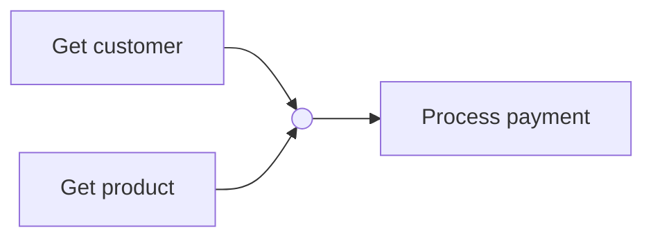

# 3.2 Maintaining Tasks and Coroutines

## Overview

Understanding how to effectively manage tasks and coroutines is crucial for building efficient asynchronous applications. This lesson focuses on scheduling tasks for concurrent execution and composing coroutines to create clean, efficient, and maintainable workflows.

## Core Concepts

### Task Scheduling

**Purpose**: Manage the execution of multiple operations concurrently, maximizing resource utilization and responsiveness.

| Benefit | Description |
|---------|-------------|
| **Concurrent Progress** | Event loop enables simultaneous progress on multiple operations |
| **Resource Optimization** | Maximizes CPU and I/O resource utilization |
| **Improved Responsiveness** | Applications remain responsive during long-running operations |
| **Scalability** | Handles multiple operations without blocking |

### Coroutine Composition

**Purpose**: Structure asynchronous code to create clean, efficient, and maintainable workflows.

| Pattern | Description | Use Case |
|---------|-------------|----------|
| **Sequential** | Operations run one after another | When output of one operation feeds the next |
| **Parallel** | Operations run simultaneously | Independent operations that can execute concurrently |
| **Mixed** | Combination of sequential and parallel | Complex workflows with dependencies |

## Gathering Multiple Tasks

### Using `asyncio.gather()`

`asyncio.gather()` is a powerful pattern for executing multiple tasks concurrently, waiting for all to complete, and collecting results in a single operation.

#### Example 1: Direct Coroutine Gathering

```python
# Fetch customer and product data concurrently
customer, product = await asyncio.gather(
    get_customer(customer_id),
    get_product(product_id)
)
```

**Key Points**:
- Both coroutines execute **simultaneously**, reducing overall execution time
- Results are returned in the **same order** as passed to `asyncio.gather()`
- This is much faster than running them sequentially (one after the other)

#### Example 2: Variable Number of Tasks

```python
async def fetch_all():
    async with ClientSession() as session:
        # Create list of tasks using list comprehension
        tasks = [fetch(session, url) for url in API_URLS]
        
        # Use * to unpack variable number of tasks
        results = await asyncio.gather(*tasks)
        print(results)
```

**Key Features**:
- **List comprehension** creates multiple tasks efficiently
- **Asterisk (`*`)** before `tasks` unpacks the list, passing each task individually
- This allows passing a **variable number of tasks** instead of adding them one by one
- The `results` variable contains a **list with output of all tasks**

**Advantages**:
- Handles variable number of tasks
- Clean, readable code structure
- Automatic result collection

## Task Groups

### Using `asyncio.TaskGroup()`

Task groups provide a cleaner way to schedule and manage multiple related tasks with automatic resource management.

```python
# Create an asynchronous context manager for grouping tasks
async with asyncio.TaskGroup() as tg:
    # Create task from get_customer coroutine with customer ID
    customer_task = tg.create_task(get_customer(customer_id))
    # Create task from get_product coroutine with product ID  
    product_task = tg.create_task(get_product(product_id))

# After exiting context manager, all tasks are complete
# Results available by calling .result() on each task
customer = customer_task.result()
product = product_task.result()
```

**Key Features**:
- **No explicit awaiting** needed for the created tasks
- **Automatic awaiting** - all tasks are awaited when exiting the context manager
- **Cleaner code** and automatic resource management
- **Grouped management** - all related tasks managed together

### Task Groups vs Gather Comparison

| Feature | `asyncio.gather()` | `asyncio.TaskGroup()` |
|---------|-------------------|----------------------|
| **Syntax** | Function call | Context manager |
| **Resource Management** | Manual | Automatic |
| **Task Creation** | Direct coroutine passing | Explicit task creation |
| **Result Access** | Direct return values | `.result()` method |
| **Error Handling** | Exception propagation | Automatic cleanup |
| **Code Style** | Functional | Object-oriented |

## Composing Coroutines for Complex Workflows

### Design Principles

| Principle | Description | Benefit |
|-----------|-------------|---------|
| **Modular Approach** | Write smaller, focused coroutines | Improved reusability and testing |
| **Single Responsibility** | Each coroutine handles one specific operation | Easier to read and maintain |
| **Data Flow Design** | Output of one operation becomes input for next | Clear workflow logic |
| **Mixed Patterns** | Combine sequential and parallel execution | Optimal performance and maintainability |

### Practical Workflow Example

Let's build a complete e-commerce order processing workflow:



#### Step 1: Individual Coroutines

> **Demo Reference**: See complete implementation in `demo/workflow.py`

```python
async def get_customer(customer_id):
    """Fetches customer data asynchronously - simulates external API call"""
    print(f"Fetching customer {customer_id}...")
    await asyncio.sleep(3)  # I/O-bound operation simulation
    print(f"Customer {customer_id} data received")
    return {"id": customer_id, "name": f"Customer {customer_id}"}

async def get_product(product_id):
    """Fetches product data asynchronously - simulates database query"""
    print(f"Fetching product {product_id}...")
    await asyncio.sleep(2)  # I/O-bound operation simulation  
    print(f"Product {product_id} data received")
    return {"id": product_id, "name": f"Product {product_id}", "price": 99.99}

async def process_payment(order):
    """Processes payment sequentially - depends on customer and product data"""
    print(f"Payment ${order['total']}: {order['customer_name']} {order['product_name']}")
    await asyncio.sleep(1)  # Payment gateway communication
    print("Payment complete")
```

#### Step 2: Workflow Assembly with TaskGroup

> **Demo Reference**: Complete implementation in `demo/workflow.py`

```python
async def process_order(customer_id, product_id):
    """
    Demonstrates TaskGroup pattern for concurrent execution
    followed by sequential processing of results
    """
    # Concurrent Phase: Fetch customer and product data simultaneously
    async with asyncio.TaskGroup() as tg:
        customer_task = tg.create_task(get_customer(customer_id))
        product_task = tg.create_task(get_product(product_id))
    
    # Results automatically available after context manager exit
    customer = customer_task.result()
    product = product_task.result()
    
    # Sequential Phase: Process payment using collected data
    order = {
        "order_id": "0-1234",
        "customer_name": customer["name"],
        "product_name": product["name"], 
        "total": product["price"],
    }
    
    await process_payment(order)
```

**Key TaskGroup Features Demonstrated**:
- **Automatic task management**: No manual `await` needed for individual tasks
- **Clean resource handling**: Context manager ensures all tasks complete
- **Clear separation**: Concurrent data gathering vs sequential processing

#### Step 3: Execution with Custom Event Loop

> **Demo Reference**: Run `python demo/workflow.py` to see timing analysis

```python
from custom_event_loop import TimingEventLoopPolicy

if __name__ == "__main__":
    # Use custom timing event loop for performance measurement
    asyncio.set_event_loop_policy(TimingEventLoopPolicy())
    
    # Execute the complete workflow with real customer/product IDs
    asyncio.run(process_order("C-41", "P-314"))
```

**Integration Points**:
- **Custom Event Loop**: Uses `TimingEventLoopPolicy` from lesson 3.1
- **Real Execution**: Actual customer ID "C-41" and product ID "P-314"
- **Performance Measurement**: TimingEventLoop tracks total execution time

## Performance Analysis

### Expected Execution Time Calculation

| Operation | Duration | Execution Pattern |
|-----------|----------|------------------|
| `get_customer()` | 3 seconds | Concurrent |
| `get_product()` | 2 seconds | Concurrent |
| `process_payment()` | 1 second | Sequential |
| **Total Expected** | **4 seconds** | Max(3,2) + 1 = 4 |

### Actual Output Example

> **Demo Output**: Run `python demo/workflow.py` to see this execution

```bash
Fetching customer C-41...
Fetching product P-314...
Product P-314 data received
Customer C-41 data received  
Payment $99.99: Customer C-41 Product P-314
Payment complete
Event loop execution time: 4.0 seconds
```

**Output Analysis**:
- **Lines 1-2**: Both tasks start simultaneously (concurrent execution)
- **Lines 3-4**: Product completes first (2s), then customer (3s) - demonstrating independent progress
- **Lines 5-6**: Payment processes sequentially after both data operations complete
- **Line 7**: TimingEventLoop shows total execution time matches our calculation (4.0 seconds)

### Performance Comparison

> **Demo Results**: Based on actual `demo/workflow.py` execution

| Approach | Execution Time | Performance Gain |
|----------|----------------|------------------|
| **Sequential** | 6 seconds (3+2+1) | Baseline |
| **Optimized Concurrent** | 4 seconds (max(3,2)+1) | **33% faster** |
| **Actual Demo Result** | 4.0 seconds | **Matches theoretical calculation** |

## Best Practices Summary

| Practice | Implementation | Benefit |
|----------|----------------|---------|
| **Use Task Groups** | `async with asyncio.TaskGroup()` | Automatic resource management |
| **Modular Coroutines** | Single-purpose, focused functions | Better testing and reusability |
| **Mixed Patterns** | Concurrent where possible, sequential where necessary | Optimal performance |
| **Clear Data Flow** | Output → Input chains | Maintainable workflow logic |
| **Error Handling** | Context managers for cleanup | Robust application behavior |

## Common Patterns

| Pattern | When to Use | Implementation |
|---------|-------------|----------------|
| **Gather Pattern** | Simple concurrent execution | `await asyncio.gather(*tasks)` |
| **Task Group Pattern** | Complex task management | `async with asyncio.TaskGroup()` |
| **Pipeline Pattern** | Sequential data processing | Chain coroutines with await |
| **Fan-out/Fan-in** | Parallel processing, single result | Gather → Process → Return |

## Hands-On Demo

### Running the Complete Example

> **File**: `demo/workflow.py`

The demo file demonstrates all concepts covered in this lesson:

```bash
cd demo/
python workflow.py
```

**Expected Output**:
```bash
Fetching customer C-41...
Fetching product P-314...
Product P-314 data received
Customer C-41 data received  
Payment $99.99: Customer C-41 Product P-314
Payment complete
Event loop execution time: 4.0 seconds
```

### Key Learning Points from Demo

| Concept | Implementation in Demo | Learning Outcome |
|---------|----------------------|------------------|
| **TaskGroup Usage** | `async with asyncio.TaskGroup() as tg:` | Automatic task management |
| **Concurrent Execution** | Both fetch operations start simultaneously | Resource optimization |
| **Result Access** | `customer_task.result()` | Clean data retrieval |
| **Sequential Dependencies** | Payment waits for both data operations | Proper workflow design |
| **Performance Measurement** | TimingEventLoop integration | Real performance insights |

Effective task and coroutine management enables you to build sophisticated, high-performance asynchronous workflows that are both efficient and maintainable.
