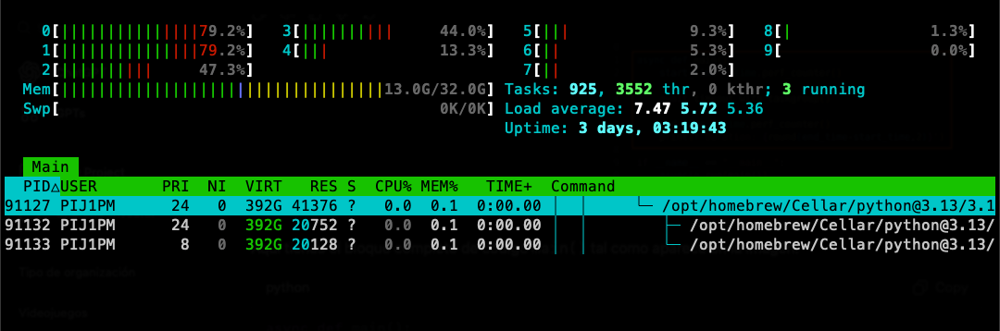
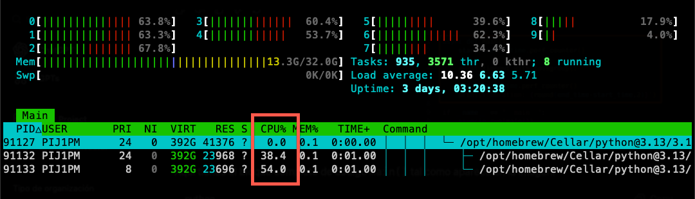

# 4.1 Building a Scalable AioHTTP Server

## Overview

This lesson focuses on scaling AioHTTP applications to handle high traffic volumes while maintaining optimal performance. We'll explore three key areas for building scalable AioHTTP servers: routing optimization, server configuration, and advanced scaling approaches.

## AioHTTP Routing Optimization

### Core Principles

Routing optimization is about organizing and structuring your routes in AioHTTP servers for optimal performance. As applications grow from a few routes to hundreds, poor organization can create performance bottlenecks and maintenance nightmares.

| Principle | Description | Benefit |
|-----------|-------------|---------|
| **Consistent Naming** | Follow RESTful principles and coherent patterns | Easier implementation and evolution |
| **Logical Grouping** | Group related functionality together | Better organization and maintainability |
| **Pattern-Matching Efficiency** | Order routes strategically for faster matching | Improved request routing performance |

### Consistent Naming

```python
# ✅ Good: RESTful and consistent patterns
app.router.add_get('/api/v1/users', get_users)
app.router.add_post('/api/v1/users', create_user)
app.router.add_get('/api/v1/users/{user_id}', get_user)
app.router.add_put('/api/v1/users/{user_id}', update_user)
app.router.add_delete('/api/v1/users/{user_id}', delete_user)

# ❌ Bad: Inconsistent naming
app.router.add_get('/users', get_users)
app.router.add_post('/create_user', create_user)
app.router.add_get('/user_details/{id}', get_user)
```

**Benefits of Consistent Naming**:
- **Version Support**: Easy to implement new API versions (`/api/v2/users`)
- **Predictable Patterns**: Developers can guess endpoint URLs
- **Evolution-Friendly**: Applications can grow without breaking existing clients

### Logical Grouping

```python
# Organize routes as sub-applications
def create_user_routes():
    """Group all user-related routes"""
    user_app = web.Application()
    user_app.router.add_get('/', get_users)
    user_app.router.add_post('/', create_user)
    user_app.router.add_get('/{user_id}', get_user)
    return user_app

def create_product_routes():
    """Group all product-related routes"""
    product_app = web.Application()
    product_app.router.add_get('/', get_products)
    product_app.router.add_post('/', create_product)
    return product_app

# Main application
app = web.Application()
app.add_subapp('/api/v1/users', create_user_routes())
app.add_subapp('/api/v1/products', create_product_routes())
```

### Pattern-Matching Efficiency

**Performance Strategy**: Order routes from most specific and frequently used to least specific to accelerate request matching.

```python
# ✅ Optimized order: specific and frequent first
app.router.add_get('/api/v1/users/profile', get_current_user_profile)  # Most frequent
app.router.add_get('/api/v1/users/search', search_users)              # Specific endpoint
app.router.add_get('/api/v1/users/{user_id}', get_user)               # Variable pattern
app.router.add_get('/api/v1/users', get_users)                        # General endpoint

# ❌ Poor order: general patterns first slow down specific matches
app.router.add_get('/api/v1/users/{user_id}', get_user)               # Catches everything first
app.router.add_get('/api/v1/users/profile', get_current_user_profile) # Never reached!
```

## AioHTTP Server Configuration

### Configuration Overview

Tweaking AioHTTP server configuration values helps handle connections more efficiently and improves scalability under high load conditions.

| Configuration | Purpose | Impact |
|---------------|---------|--------|
| **Backlog Size** | Control pending connection queue | Handle traffic spikes |
| **Keep-Alive Timeout** | Manage idle connection lifetime | Optimize resource usage |
| **Maximum Request Size** | Limit incoming request size | Security and stability |
| **Request Throttling** | Prevent server overload | Maintain consistent performance |

### Backlog Size

```python
from aiohttp import web

app = web.Application()

# Configure backlog size for high-traffic scenarios
web.run_app(
    app,
    host='localhost',
    port=8080,
    backlog=1024  # Allow up to 1024 pending connections
)
```

**Backlog Size Configuration**:
- **Purpose**: Controls how many pending connections can queue while waiting to be accepted
- **High Load Scenario**: Larger backlog allows more connections to wait instead of being refused
- **Trade-off**: Balance between connection acceptance and memory usage

### Keep-Alive Timeout

```python
from aiohttp import web
import aiohttp

async def create_app():
    # Configure keep-alive timeout
    connector = aiohttp.TCPConnector(
        keepalive_timeout=120,  # 2 minutes
        enable_cleanup_closed=True
    )
    
    app = web.Application()
    return app
```

**Keep-Alive Benefits**:
- **Performance**: Longer timeouts (2 minutes) reduce connection establishment overhead
- **User Experience**: Existing users get faster subsequent requests
- **Resource Balance**: Must balance performance gains with resource consumption

### Maximum Request Size

```python
from aiohttp import web

app = web.Application(
    client_max_size=1024*1024*16  # 16MB maximum request size
)

# Alternative: Configure per route
async def upload_handler(request):
    # This route can handle larger uploads
    pass

app.router.add_post('/upload', upload_handler)
```

**Security Benefits**:
- **DoS Protection**: Prevents bad actors from sending massive requests
- **Resource Management**: Limits memory consumption per request
- **Stability**: Prevents server crashes from oversized requests

### Request Throttling

```python
import asyncio
from aiohttp import web
from collections import defaultdict
import time

class RateLimiter:
    def __init__(self, max_requests=100, time_window=60):
        self.max_requests = max_requests
        self.time_window = time_window
        self.requests = defaultdict(list)
    
    async def is_allowed(self, client_ip):
        now = time.time()
        # Clean old requests
        self.requests[client_ip] = [
            req_time for req_time in self.requests[client_ip]
            if now - req_time < self.time_window
        ]
        
        # Check if under limit
        if len(self.requests[client_ip]) < self.max_requests:
            self.requests[client_ip].append(now)
            return True
        return False

# Middleware for request throttling
async def rate_limit_middleware(request, handler):
    limiter = request.app['rate_limiter']
    client_ip = request.remote
    
    if not await limiter.is_allowed(client_ip):
        return web.Response(status=429, text="Too Many Requests")
    
    return await handler(request)
```

**Throttling Benefits**:
- **Server Protection**: Prevents overwhelming the server
- **Consistent Performance**: Maintains optimal capacity
- **Quality of Service**: Ensures responsiveness for all users

## Advanced Scaling Steps

### Scaling Evolution

Advanced scaling involves transitioning from a single AioHTTP server process to sophisticated distributed systems capable of handling massive traffic loads.

| Scaling Step | Technology | Capability | Use Case |
|--------------|------------|------------|----------|
| **Step 1** | **Gunicorn** | Multi-process on single machine | Utilize all CPU cores |
| **Step 2** | **Nginx** | Reverse proxy and load balancing | Multiple machines, static content |
| **Step 3** | **Kubernetes** | Container orchestration | Auto-scaling, thousands of servers |

### Step 1: Gunicorn - Multi-Process Scaling

**Purpose**: Use Gunicorn to manage multiple worker processes, enabling your application to utilize multiple CPU cores on a single machine.

```bash
# Install Gunicorn
pip install gunicorn

# Start AioHTTP server with Gunicorn
gunicorn aiohttp_server:app \
    --bind localhost:8080 \
    --worker-class aiohttp.GunicornWebWorker \
    --workers 4
```

**Gunicorn Benefits**:
- **Multi-Core Utilization**: Standalone AioHTTP servers cannot effectively use multiple CPU cores
- **Automatic Recovery**: Worker restarts if crashes occur
- **Load Distribution**: Automatically distributes requests across all workers
- **Process Isolation**: Worker crashes don't affect other workers

### Step 2: Nginx - Reverse Proxy Scaling

**Purpose**: Introduce Nginx as a reverse proxy in front of Gunicorn workers for enhanced performance and scalability.

```nginx
# nginx.conf
upstream aiohttp_backend {
    server 127.0.0.1:8080;
    server 127.0.0.1:8081;
    server 127.0.0.1:8082;
    server 127.0.0.1:8083;
}

server {
    listen 80;
    
    # Serve static content directly
    location /static/ {
        alias /var/www/static/;
        expires 1d;
        add_header Cache-Control "public, immutable";
    }
    
    # Proxy dynamic content to AioHTTP
    location / {
        proxy_pass http://aiohttp_backend;
        proxy_set_header Host $host;
        proxy_set_header X-Real-IP $remote_addr;
    }
}
```

**Nginx Advantages**:
- **Static Content**: Efficiently serves static files without burdening workers
- **Caching**: Can cache responses to reduce backend load
- **Load Balancing**: Distributes requests across multiple Gunicorn instances
- **SSL Termination**: Handles HTTPS encryption/decryption
- **Multiple Servers**: Can route to different physical machines

### Step 3: Kubernetes - Container Orchestration

**Purpose**: Deploy applications in Kubernetes for massive scalability with auto-scaling capabilities.

```yaml
# deployment.yaml
apiVersion: apps/v1
kind: Deployment
metadata:
  name: aiohttp-app
spec:
  replicas: 10
  selector:
    matchLabels:
      app: aiohttp-app
  template:
    metadata:
      labels:
        app: aiohttp-app
    spec:
      containers:
      - name: aiohttp
        image: my-aiohttp-app:latest
        ports:
        - containerPort: 8080
        resources:
          requests:
            cpu: 100m
            memory: 128Mi
          limits:
            cpu: 500m
            memory: 512Mi

---
apiVersion: autoscaling/v2
kind: HorizontalPodAutoscaler
metadata:
  name: aiohttp-hpa
spec:
  scaleTargetRef:
    apiVersion: apps/v1
    kind: Deployment
    name: aiohttp-app
  minReplicas: 3
  maxReplicas: 100
  metrics:
  - type: Resource
    resource:
      name: cpu
      target:
        type: Utilization
        averageUtilization: 70
```

**Kubernetes Benefits**:
- **Massive Scalability**: Potentially thousands of servers
- **Auto-Scaling**: Automatically add/remove servers based on CPU/memory usage
- **High Availability**: Automatic failover and health checks
- **Rolling Updates**: Zero-downtime deployments
- **Resource Management**: Efficient resource allocation across clusters

## Scaling Architecture Comparison

| Architecture | Concurrent Users | Infrastructure | Complexity | Cost |
|--------------|------------------|----------------|------------|------|
| **Single AioHTTP** | ~1,000 | 1 server | Low | $ |
| **Gunicorn** | ~10,000 | 1 server | Medium | $ |
| **Nginx + Gunicorn** | ~100,000 | Multiple servers | Medium-High | $$ |
| **Kubernetes** | 1,000,000+ | Cloud cluster | High | $$$ |

## Performance Optimization Checklist

| Category | Action Items | Impact |
|----------|-------------|---------|
| **Routing** | ✅ Use consistent RESTful naming | Medium |
| **Routing** | ✅ Group related routes as sub-applications | Medium |
| **Routing** | ✅ Order routes by frequency and specificity | High |
| **Configuration** | ✅ Tune backlog size for expected traffic | High |
| **Configuration** | ✅ Set appropriate keep-alive timeouts | Medium |
| **Configuration** | ✅ Implement request size limits | High |
| **Configuration** | ✅ Add request throttling | High |
| **Scaling** | ✅ Use Gunicorn for multi-core utilization | High |
| **Scaling** | ✅ Add Nginx for static content and caching | Medium |
| **Scaling** | ✅ Plan Kubernetes migration for massive scale | High |

## Demo: Building a Scalable AioHTTP Server

> **Demo Files**: [`demo/aiohttp_server.py`](demo/aiohttp_server.py) and [`demo/client_aiohttp.py`](demo/client_aiohttp.py)

Let's build a scalable AioHTTP server with the first scaling step of running multiple workers with Gunicorn and verify that Gunicorn automatically distributes the workload across workers.

### Server Configuration for Gunicorn

In our AioHTTP server, notice the configuration for Gunicorn deployment:

```python
app = web.Application()
app.router.add_get("/names", get_names)
app.router.add_get("/names/{id}", get_name_by_id)
app.router.add_post("/names", add_name)

# gunicorn aiohttp_server:app --bind localhost:8080 --worker-class aiohttp.GunicornWebWorker --workers 2
# web.run_app(app)  # ← Commented out since we'll use Gunicorn instead
```

**Key Configuration Changes**:
- **Commented `web.run_app(app)`**: Since we're starting the server with Gunicorn, we no longer need this line to run the application
- **Gunicorn command reference**: The comment shows the exact command needed to start with Gunicorn

### Setting Up Gunicorn

1. **Install Gunicorn**:
```bash
pip install gunicorn
```

2. **Start Server with Gunicorn**:
```bash
gunicorn aiohttp_server:app \
    --bind localhost:8080 \
    --worker-class aiohttp.GunicornWebWorker \
    --workers 2
```

**Command Breakdown**:
- `aiohttp_server:app` - Module and application name
- `--bind localhost:8080` - Server binding address
- `--worker-class aiohttp.GunicornWebWorker` - Tell Gunicorn about the AioHTTP worker type
- `--workers 2` - Run 2 separate worker processes

### Process Monitoring with htop

Using `htop` task management utility to monitor the Gunicorn processes:



**Process Structure**:
- **Gunicorn parent process**: Manages and coordinates the worker processes
- **Two separate child worker processes**: Each running as independent processes with their own PIDs
- **Process isolation**: Each worker can handle requests independently

### Load Testing for Workload Distribution

To verify that Gunicorn automatically distributes the workload, we'll send a large number of requests using our client:

```python
# In client_aiohttp.py - Modified for load testing
async def main():
    tasks = [fetch(session, URL) for _ in range(10_000)]  # Create 10,000 requests
    # ... but we increased this to 100,000 for stress testing:
    tasks = [fetch(session, URL) for _ in range(100_000)]  # 100,000 requests
    responses = await asyncio.gather(*tasks)
```

**Load Test Execution**:
```bash
❯python "demo/client_aiohttp.py"

Duration: 16.45 seconds
```

### CPU Workload Distribution

During the load test, monitoring CPU usage shows workload distribution:



**Performance Analysis**:
- **Both workers active**: CPU workload increases for both worker processes
- **Automatic distribution**: Gunicorn splits the 100,000 requests automatically across workers
- **Multi-core utilization**: The AioHTTP server now scales with the number of CPU cores available
- **Performance improvement**: 16.45 seconds for 100,000 requests with 2 workers

### Key Demo Results

| Metric | Single Process | Gunicorn (2 Workers) |
|--------|----------------|---------------------|
| **CPU Cores Used** | 1 | 2 |
| **Process Isolation** | None | Full isolation between workers |
| **Crash Recovery** | Manual restart needed | Automatic worker restart |
| **Request Distribution** | Single queue | Automatic load balancing |
| **Scalability** | Limited by single core | Scales with available cores |

### Scaling Verification

The demo conclusively shows that:

1. **Multi-process deployment works**: Gunicorn successfully starts 2 worker processes
2. **Load distribution is automatic**: No additional code needed for request distribution
3. **Performance scales**: Both CPU cores are utilized during high load
4. **Process management is handled**: Gunicorn manages worker lifecycle automatically

This demonstrates the first critical step in scaling AioHTTP applications beyond single-process limitations, enabling better resource utilization and improved performance under load.