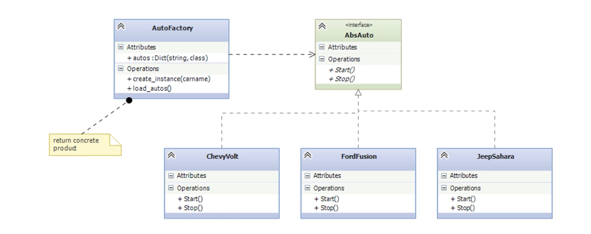
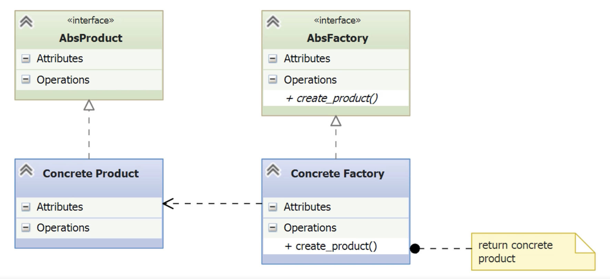

# Factory

- [Before Factory](#before-factory)
- [The Factory Pattern](#the-factory-pattern)
	- [Simple Factory Pattern](#simple-factory-pattern)
		- [Understanding the Simple Factory Pattern](#understanding-the-simple-factory-pattern)
		- [Implementing the Simple Factory Pattern](#implementing-the-simple-factory-pattern)
	- [The Full Factory Pattern](#the-full-factory-pattern)
		- [Understanding the Full Factory Pattern](#understanding-the-full-factory-pattern)
		- [Implementing the Full Factory Pattern](#implementing-the-full-factory-pattern)
- [Summary (Factory)](#summary-factory)

---

- Defines an interface for creating an object.
- Lets subclasses decide which object.
- Defers instantiation to subclasses.
- Also known as the *Virtual Constructor*.

## Before Factory

- **Scenario**: You want to support several car models, but you don’t know which one will be needed until runtime.

*chevyvolt.py*
```Python

class ChevyVolt(object):
	def start(self):
		print("Chevrolet Volt running with shocking power!")

	def stop(self):
		print("Chevrolet Volt shutting down.")
```

*fordfusion.py*
```python
class FordFussion(object):
	def start(self):
		print("Cool Ford Fusion running smoothly")

	def stop(self):
		print("Ford fusion shutting down.")
```

*jeepsahara.py*
```python
class JeepSahara(object):
	def start(self):
		print("Jeep Shara running ruggedly.")

	def stop(self):
		print("Jeep Shara shutting down.")

```

*nullcar.py*

```python
class NullCar(object):
	def __init__(self, carname):
		self._carname = carname
		
	def start(self):
		print("Unknown car '%s'." % self._carname)

	def stop(self):
		pass
```

*main.py*
```python
from chevyvolt import Chevyvolt
from fordfusion import FordFusion
from jeepsahara import JeepSahara
from nullcar import NullCar

def getcar(carname):
	if carname = "Chevy":
		return Chevyvolt()
	elif carname = "Ford":
		return FordFusion()
	elif carname = "Jeep":
		return JeepSahara()
	else:
		return NullCar(carname)

for carname in "Chevy", "Ford", "Jeep", "Tesla":
	car = getcar(carname)
	car.start()
	car.stop()
```

- *Problems*:
	- Adding a new car model requires opening the code, modifying the imports, and the `getcar` function. It will break the *Open/Close principle*.
	- We are directly instantiating the car classes, which breaks the *dependency inversion principle*, since we are depending on the implementation of those classes.

## The Factory Pattern

### Simple Factory Pattern

- The **Simple Factory Pattern** provides a solution to avoid long `if-elif-else` chains for object instantiation.
- It encapsulates the creation lo gic in a separate class (**AutoFactory**).
- It separates object creation from usage, supporting the **Open/Closed** and **Dependency Inversion** principles.

#### Understanding the Simple Factory Pattern



- **AbsAuto**: Abstract base class requiring `start()` and `stop()`.
- **ChevyVolt, FordFusion, JeepSahara**: Concrete implementations of `AbsAuto`.
- **NullCar**: Implements the same interface, used for unsupported car names.
- **AutoFactory**:
    - Scans the `autos` package.
    - Filters only concrete subclasses of `AbsAuto`.
    - Stores them in a dictionary: `model_name -> class reference`.
    - Provides `create_instance(carname)` to instantiate cars dynamically.

#### Implementing the Simple Factory Pattern

```bash
Project Root/
├── __main__.py
├── autofactory.py
└── autos/
    ├── __init__.py
    ├── abs_auto.py
    ├── chevyvolt.py
    ├── fordfusion.py
    ├── jeepsahara.py
    └── nullcar.py
```

- Create a package`autos` (folder): *\_\_init\_\_.py*, *abs_auto.py*, *chevyvolt.py*, *fordfusion.py*, *jeepsahara.py*, *nullcar.py*

*\_\_init\_\_.py*
```python3
from .chevyvolt import ChevyVolt
from .fordfusion import FordFusion
from .jeepsahara import JeepSahara
from .nullcar import NullCar
from .abs_auto import Absauto
```

*abs_auto.py*
```python
import abc

class AbsAuto(abc.ABC):

    @abc.abstractmethod
    def start(self):
        pass

    @abc.abstractmethod
    def stop(self):
        pass
```

- `AbsAuto` is an abstract base class that defines a common interface for all car models.
- It uses Python’s `abc` module to declare the `start()` and `stop()` methods as abstract, which forces subclasses to implement them.
- This abstraction allows `AutoFactory` to work with any class that follows this interface, applying the Dependency Inversion Principle.

*\_\_main\_\_.py*
```python
from autofactory import AutoFactory

factory = AutoFactory()

for carname in 'ChevyVolt', 'FordFusion', 'JeepSahara', 'Tesla Roadster':
    car = factory.create_instance(carname)
    car.start()
    car.stop()
```

- The program imports AutoFactory, creates an instance, and iterates over a list of car names.
- For each name, the factory creates the corresponding object.
- If the name is unrecognized (like "Tesla Roadster"), the factory returns a null object that implements the same interface, preventing runtime errors.

*autofactory.py* (outside the `autos` package)
```python
from inspect import getmembers, isclass, isabstract
import autos

class AutoFactory(object):
    autos = {}  # Key = car model name, Value = class for the car

    def __init__(self):
        self.load_autos()

    def load_autos(self):
        classes = getmembers(autos, lambda m: isclass(m) and not isabstract(m))
        for name, _type in classes:
            if isclass(_type) and issubclass(_type, autos.AbsAuto):
                self.autos.update([name, _type])

    def create_instance(self, carname):
        if carname in self.autos:
            return self.autos[carname]()
        else:
            return autos.NullCar(carname)
```

- The factory uses `inspect.getmembers()` to dynamically find all non-abstract classes imported from the autos package.    
- Importing `autos` package will execute the import statements in `__init__.py`, adding them to the `AutoFactory` namespace.
	- Keeps auto names and classes in the `autos` dict.
- The method `load_autos()` filters those classes that inherit from AbsAuto and stores them in the autos dictionary.
	- Uses the introspection function `getmembers` to find the concrete classes imported into the package (not abstract). 
	- Check if those clases are subclasses of `AbsAuto` before including them in the dict.
- `create_instance()` checks if the requested car name exists in the dictionary. If it does, it creates and returns an instance of that class.
	- If the name is not found, it returns a NullCar, which acts as a safe fallback.
    
- This dynamic discovery avoids hardcoding car classes, supporting the **Open/Closed Principle**: new models can be added without modifying the factory logic.
- The factory knows only about the AbsAuto interface, not concrete implementations — applying the **Dependency Inversion Principle**.

### The Full Factory Pattern  
#### Understanding the Full Factory Pattern



- It introduces two layers of abstraction:
    - An abstract factory that declares a creation method.
    - An abstract product that defines the interface of the object to be created.
- Concrete factories implement the creation method and produce concrete products.
- This pattern improves scalability and flexibility by decoupling object creation from the client.
#### Implementing the Full Factory Pattern

- We set two packages in the `Factory` directory.
	- `autos`: same as the previous example.
	- `factories`: 

```bash
Project Root/
├── __main__.py
├── autofactory.py
├── autos/
│   ├── __init__.py
│   ├── abs_auto.py
│   ├── chevyvolt.py
│   ├── fordfusion.py
│   ├── jeepsahara.py
│   └── nullcar.py
└── factories/
    ├── abs_factory.py
    ├── chevy_factory.py
    ├── ford_factory.py
    ├── jeep_factory.py
    ├── null_factory.py
    └── loader.py
```

*abs_auto.py*
```python
import abc

class AbsAuto(abc.ABC):

	@property
	def name(self):
		return self._name

	@name.setter
	def name(self, name):
		self._name = name

    @abc.abstractmethod
    def start(self):
        pass

    @abc.abstractmethod
    def stop(self):
        pass
```

- `abs_auto.py` is modified, adding a `name` property used by the factories.

*abs_factory.py*
```python
import abc

class AbsFactory(abc.ABC):

	@abc.abstractmethod
	def create_auto(self):
		pass
```

- `AbsFactory` base class defines the abstract method `create_auto()`, that each factory must implement.

*chevy_factory.py*
```python
from .abs_factory import AbsFactory
from autos.chevyvolt import ChevyVolt

class ChevyFactory(AbsFactory):

	def create_auto(self):
		self.chevy = chevy = ChevyVolt()
		chevy.name = "Chevy Volt"
		return chevy
```

- The factory classes implement the `crate_auuto()` method.
- Sets the new `name` property after instantiation.

*main.py*
```python
from factories import loader

for factory_name in 'ChevyVolt', 'FordFusion', 'JeepSahara', 'Tesla Roadster':
    car = factory.create_auto()
    
    car.start()
    car.stop()
```

*loader.py*
```python
from importlib import import_module
from inspect import getmembers, isabstract, isclass
from .abs_factory import AbsFactory

def load_factory(factory_name):
    try:
        factory_module = import_module('.' + factory_name, 'factories')
    except ImportError:
        factory_module = import_module('.null_factory', 'factories')

    classes = getmembers(
        factory_module,
        lambda m: isclass(m) and not isabstract(m)
    )

    for _, _class in classes:
        if issubclass(_class, AbsFactory):
            return _class()
```

- Uses dynamic imports: given a factory name, it tries to import it from the factories package.
	- Imports `null_factory` if it fails.
- Looks for a class to return, and returns the first non-abstract class that is a subclass of `AbsFactory`.
- The `load_factory()` function eliminates the need to import all the factories in `__init__.py`, **which is empty now**.
- To add new factories, we only need to add their modules to the factories package.

## Summary (Factory)

- The Factory Pattern encapsulates object instantiation, avoiding direct class creation.
- It supports the **Dependency Inversion Principle**: clients no longer depend on concrete implementations, but on abstractions.
- All objects returned from the factory conform to a common interface (an abstract base class in Python).
- Two variations were covered:
    - **Simple Factory**: a single factory that produces concrete products; often sufficient for many use cases.
    - **Full Factory**: each product has its own factory that implements a shared interface (create_product()), providing more flexibility.
- A third variation, the **Abstract Factory Pattern**, will be discussed later.