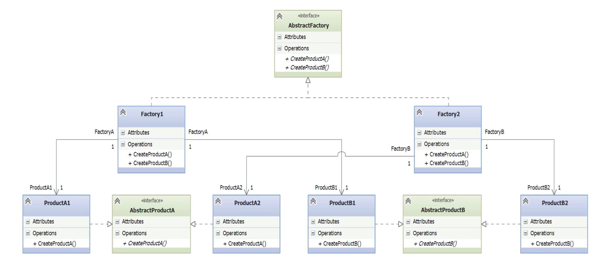

# Abstract Factory

- [Before Abstract Factory](#before-abstract-factory)
- [Understanding Abstract Factory Pattern](#understanding-abstract-factory-pattern)
- [Implementing Abstract Factory Pattern](#implementing-abstract-factory-pattern)

---

- Close cousing of the [[#Factory Pattern]].
- Factory creates one product, abstract creates families of classes.
- Enforces dependencies between classes.
- Defers creation of objects to concrete subclasses.
- Also known as *Kit Pattern*.
## Before Abstract Factory

- **Scenario**: We have a collection of car factories.
	- Each one makes cars for one manufacturer, but can make it in Economy, Sport, and Luxury editions.
	- Need to support multiple manufacturers, each one having those three conditions.

```bash
Project Root/
├── __main__.py
└── factories/
    ├── __init__.py
    ├── ford.py
    └── gm.py
```

*\_\_main\_\_.py*
```python
from factories.gm import ChevySpark, ChevyCamaro, CadillacCTS
from factories.ford import FordFiesta, FordMustang, LincolnMKS
from random import randint

makers = ('gm', 'ford')
editions = ('Economy', 'Sport', 'Luxury')
maker = makers[randint(0, 1)]
edition = editions[randint(0, 2)]

if maker == 'gm':
    if edition == 'Economy':
        car = ChevySpark()
    elif edition == 'Sport':
        car = ChevyCamaro()
    elif edition == 'Luxury':
        car = CadillacCTS()
    else:
        raise ValueError("Unknown car.")
elif maker == 'ford':
    if edition == 'Economy':
        car = FordFiesta()
    elif edition == 'Sport':
        car = FordMustang()
    elif edition == 'Luxury':
        car = LincolnMKS()
    else:
        raise ValueError("Unknown car.")
else:
    raise ValueError("Unknown maker.")

car.start()
car.stop()
```

*ford.py*
```python
class FordFiesta:
    def start(self):
        print('Ford Fiesta running cheaply.')
    def stop(self):
        print('Ford Fiesta shutting down.')

class FordMustang:
    def start(self):
        print("Ford Mustang roaring and ready to go!")
    def stop(self):
        print('Ford Mustang shutting down.')

class LincolnMKS:
    def start(self):
        print('Lincoln MKS running smoothly.')
    def stop(self):
        print('Lincoln MKS shutting down.')
```


- Factories are in the `factories` package.
- Each car type has a class with two methods.
- The `__main__` program imports these car types and randomly chooses which manufacturer and car to produce (this would be provided by the client program in a real implementation).
- The main work of the program is to instantiate the desired car model through a big nested `elif` statement.

- **Problems**:
	- **Tight Coupling**: The main program is tightly coupled to all the concrete car classes (ChevySpark, FordFiesta, etc.), violating the **Dependency Inversion Principle**.
	- **Open/Closed Violation**: Adding a new manufacturer or edition requires modifying the main logic with more elif branches, violating the **Open/Closed Principle**.
    - **Poor Scalability**: As the number of manufacturers and editions grows, the conditional logic becomes harder to maintain and understand.
    - **Duplication of Logic**: The structure of edition-based logic is repeated for each manufacturer, leading to code duplication.
    - **Difficult to Extend or Reuse**: You can’t easily replace or extend the car creation logic without changing the main program.
    - **No Abstraction**: There’s no interface or common abstraction for car types, so the client must know all class names and details.
## Understanding Abstract Factory Pattern




- **Abstract Factory** is a design pattern (not a specific Python class) used to create **families of related products** without specifying their concrete classes.
- The UML diagram begins with an AbstractFactory interface:
    - In Python, this would be an abstract base class.
    - It defines methods like `create_productA()` and `create_productB()`.
- Each **Concrete Factory** (e.g., Factory1, Factory2) implements the AbstractFactory and knows how to instantiate a related set of products.
- Each **product** (like ProductA1, ProductA2, ProductB1, ProductB2) implements its corresponding abstract product interface (AbstractProductA, AbstractProductB).
- Factories and products are **grouped in families**:
    - Factory1 creates ProductA1 and ProductB1.
    - Factory2 creates ProductA2 and ProductB2.
- This pattern supports:
    - **Consistency among products** created by the same factory.
    - **Scalability**, allowing easy addition of new factories or product families.
- In the car example, each factory (e.g., Ford, GM) produces multiple car models (economy, sport, luxury), which are the related products.
- The Abstract Factory pattern enforces **dependencies** between created objects — a single factory creates a coordinated set of products.

## Implementing Abstract Factory Pattern

```bash
Project Root/
├── __main__.py
├── autos/
│   ├── __init__.py
│   ├── abs_auto.py
│   ├── ford/
│   │   ├── __init__.py
│   │   ├── fiesta.py
│   │   ├── mustang.py
│   │   └── lincoln.py
│   └── gm/
│       ├── __init__.py
│       ├── spark.py
│       ├── camaro.py
│       └── cadillac.py
└── factories/
    ├── __init__.py
    ├── abs_factory.py
    ├── ford_factory.py
    └── gm_factory.py
```

1. Package `factories`
	- Holds the abstract base class `abs_factory`.
	- Two concrete factories: `ford_factory` and `gm_factory`.
	

*abs_factory.py*
```python
import abc

class AbsFactory(abc.ABC):

    @abc.abstractstaticmethod
    def create_economy():
        pass

    @abc.abstractstaticmethod
    def create_sport():
        pass

    @abc.abstractstaticmethod
    def create_luxury():
        pass
```

- Three abstract static methods are defined, one for each type.
	- Three abstract static methods are defined, one for each car edition: Economy, Sport, and Luxury.
*ford_factory.py*
```python
from .abs_factory import AbsFactory
from autos.ford.fiesta import FordFiesta
from autos.ford.mustang import FordMustang
from autos.ford.lincoln import LincolnMKS

class FordFactory(AbsFactory):

    @staticmethod
    def create_economy():
        return FordFiesta()

    @staticmethod
    def create_sport():
        return FordMustang()

    @staticmethod
    def create_luxury():
        return LincolnMKS()
```

*gm_factory.py*
```python
from .abs_factory import AbsFactory
from autos.gm.spark import ChevySpark
from autos.gm.camaro import ChevyCamaro
from autos.gm.cadillac import CadillacCTS

class GMFactory(AbsFactory):

    @staticmethod
    def create_economy():
        return ChevySpark()

    @staticmethod
    def create_sport():
        return ChevyCamaro()

    @staticmethod
    def create_luxury():
        return CadillacCTS()
```

- Imports `AbsFactory` base class and the car models it needs.
+ Each concrete factory implements the required methods, returning the corresponding car instances.

2. Package `autos`
	- `abs_auto` module
	- Subpackes: `ford` and `gm`
		- Hold the concrete cars: `fiesta`, `lincoln`, `mustang`, etc.

*abs_auto.py*
```python
import abc

class AbsAuto(abc.ABC):
    @abc.abstractmethod
    def start(self):
        pass

    @abc.abstractmethod
    def stop(self):
        pass
```

+ The `AbsAuto` class defines the two required methods `start()` and `stop()`, which must be implemented by all concrete car classes.

*fiesta.py*
```python
from autos.abs_auto import AbsAuto

class FordFiesta(AbsAuto):
    def start(self):
        print('Ford Fiesta running cheaply.')

    def stop(self):
        print('Ford Fiesta shutting down.')
```

- Imports the abstract base class `AbsAuto`.
- Implements the required methods `start()` and `stop()`.

*\_\_main\_\_.py*
```python
from factories.ford_factory import FordFactory
from factories.gm_factory import GMFactory

for factory in FordFactory, GMFactory:
    car = factory.create_economy()
    car.start()
    car.stop()

    car = factory.create_sport()
    car.start()
    car.stop()

    car = factory.create_luxury()
    car.start()
    car.stop()
```

+ The `main` program imports the two factories and tests them in a loop, ensuring that each factory can produce all car types consistently.