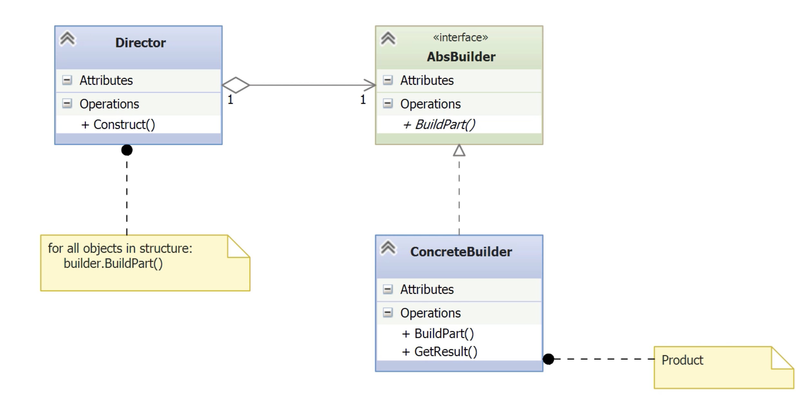

# Builder

- [Before Builder](#before-builder)
	- [Take 1 Initial attempt](#take-1-initial-attempt)
	- [Take 2 Exposing the attributes](#take-2-exposing-the-attributes)
	- [Take 3 Encapsulating the attributes](#take-3-encapsulating-the-attributes)
	- [Take 4 Enforcing build order](#take-4-enforcing-build-order)
- [Implementing the Builder Pattern](#implementing-the-builder-pattern)

---

- The **Builder pattern** is a **creational pattern** used to construct complex objects.
- It separates **object construction** from its **representation**.
	- Example used: building a custom computer with various configurations.
- Encourages **encapsulation of the construction process**, aligning with “encapsulate what varies”.
- Supports **multi-step construction**, which is where Builder excels.
- Adheres to **SOLID** principles, especially the **Single Responsibility Principle**.
- Allows for **variation in object creation** (e.g., gaming PC vs. budget PC) **without changing the client code**.
- The client interacts only with an **abstraction**, not concrete construction logic.

## Before Builder

- **Scenario**
	- Custom computer builder
	- Can be many components
	- Can lead to bad design choices

### Take 1: Initial attempt

*\_\_main\_\_.py*
```python
from computer import Computer

computer = Computer(
    case='Coolermaster',
    mainboard='MSI',
    cpu='Intel Core i9',
    memory='2 X 16GB',
    hard_drive='SSD 2TB',
    video_card='GeForce'
)

computer.display()
```

*computer.py*
```python
class Computer(object):
    def __init__(self, case, mainboard, cpu, memory, hard_drive, video_card):
        self.case = case
        self.mainboard = mainboard
        self.cpu = cpu
        self.memory = memory
        self.hard_drive = hard_drive
        self.video_card = video_card

    def display(self):
        print('Custom Computer:')
        print(f'\t{"Case":>10}: {self.case}')
        print(f'\t{"Mainboard":>10}: {self.mainboard}')
        print(f'\t{"CPU":>10}: {self.cpu}')
        print(f'\t{"Memory":>10}: {self.memory}')
        print(f'\t{"Hard drive":>10}: {self.hard_drive}')
        print(f'\t{"Video card":>10}: {self.video_card}')
```

- The constructor uses a lot of parameters, one for each component.

- **Problem**
	- Long parameter list makes the constructor hard to read and maintain.
	- Unclear which parameters are required vs optional.
	- Breaks the _Single Responsibility_ and _Open/Closed_ principles.
    - Construction logic is exposed to the client.
    - No control over build sequence.
    - Adding new components requires modifying the constructor.
    - Poor scalability for complex configurations.
    - Low semantic clarity in the client code.

### Take 2: Exposing the attributes

*computer.py*
```python
class Computer(object):
	case: str
	mainboard: str
	cpu: str
	memory: str
	hard_drive: str
	video_card: str

    def display(self):
        print('Custom Computer:')
        print(f'\t{"Case":>10}: {self.case}')
        print(f'\t{"Mainboard":>10}: {self.mainboard}')
        print(f'\t{"CPU":>10}: {self.cpu}')
        print(f'\t{"Memory":>10}: {self.memory}')
        print(f'\t{"Hard drive":>10}: {self.hard_drive}')
        print(f'\t{"Video card":>10}: {self.video_card}')
```

*\_\_main\_\_.py*
```python
from computer import Computer

computer = Computer()
computer.case='Coolermaster'
computer.mainboard='MSI'
computer.cpu='Intel Core i9'
computer.memory='2 X 16GB'
computer.hard_drive='SSD 2TB'
computer.video_card='GeForce

computer.display()
```

- **Problem**
	- Solves the long constructor parameter list.
    - Attributes are set directly on the object.
    - Breaks encapsulation (_violates “Encapsulate what varies”_ principle).
    - No enforcement of required fields or build sequence.
    - Easy to misuse or forget a step.
    - Client code is tightly coupled to internal structure.
    - Still violates _Single Responsibility_ and _Open/Closed_ principles.

### Take 3: Encapsulating the attributes

*mycomputer.py*
```python
from computer import Computer

class MyComputer(object):

    def get_computer(self):
        return self._computer

    def build_computer(self):
        computer = self._computer = Computer()
        computer.case = 'Coolermaster'
        computer.mainboard = 'MSI'
        computer.cpu = 'Intel Core i9'
        computer.memory = '2 x 16GB'
        computer.hard_drive = 'SSD 2TB'
        computer.video_card = 'GeForce'
```

- `build_computer()` instantiates a new `Computer` object and encapsulates the setting of the attributes.

*\_\_main\_\_.py*
```python
from computer import Computer
from mycomputer import MyComputer

builder = MyComputer()
builder.build_computer()
computer = builder.get_computer(())
computer.display()
```

- **Problem**
	- Fix the too many parameters problem
	- Fix the problem of exposing attributes to the client (encapsulated in `MyComputer` class)
	- The build order is a problem.

### Take 4: Enforcing build order

*mycomputer_builder.py*
```python
from computer import Computer

class MyComputerBuilder(object):

    def get_computer(self):
        return self._computer

    def build_computer(self):
        self._computer = Computer()
        self.get_case()
        self.build_mainboard()
        self.install_mainboard()
        self.install_hard_drive()
        self.install_video_card()

    def get_case(self):
        self._computer.case = 'Coolermaster N300'

    def build_mainboard(self):
        self._computer.mainboard = 'MSI 970'
        self._computer.cpu = 'Intel Core i7-4770'
        self._computer.memory = 'Corsair Vengeance 16GB'

    def install_mainboard(self):
        pass

    def install_hard_drive(self):
        self._computer.hard_drive = 'Seagate 4TB'

    def install_video_card(self):
        self._computer.video_card = 'GeForce GTX 1070'
```

- `MyComputerBuilder` class enhances the `MyComputer` class by adding the steps to build a computer in the correct order.
	- The `build_computer()` method does this by calling methods for each of the steps.
	- There is a separate step for the main board assembly `build_mainboard()`.

- **Problem**
	- If we want to create a different computer, we could copy and rename `mycomputer_builder.py` and change the settings.
	- Maintenance will be difficult
	- `get_computer()` and `build_computer()` become repeated code; if they change, we need to update all the copies.

*cheap_one.py*
```python
...
	def install_hard_drive(self):
        self._computer.hard_drive = 'Seagate 2TB'
	def install_video_card(self):
		self._computer.video_card = 'on board'
```

## Implementing the Builder Pattern



- **AbsBuilder**: abstract base class with build step methods (`build_part`, `get_computer`, etc.).
- **ConcreteBuilder**: implements (the abstract builder) each step for a specific product (e.g. MyComputerBuilder, BudgetBoxBuilder). There can be many of these.
- **Director**: orchestrates the build sequence by calling builder methods in order.     
- **Client**: nstantiates the chosen builder and passes it to the Director. The director calls the `GetResult` method, which returns the finished product. 

*abs_builder.py*
```python
import abc
from computer import Computer

class AbsBuilder(abc.ABC):
    def get_computer(self):
        return self._computer

    def new_computer(self):
        self._computer = Computer()

    @abc.abstractmethod
    def build_mainboard(self):
        pass

    @abc.abstractmethod
    def get_case(self):
        pass

    @abc.abstractmethod
    def install_mainboard(self):
        pass

    @abc.abstractmethod
    def install_hard_drive(self):
        pass

    @abc.abstractmethod
    def install_video_card(self):
        pass
```

- The `get_computer()` and `new_computer()` methods are implemented, since these would otherwise be repeated in each concrete builder.
	- Consider these to be abstract as well in more complex scenarios.
- Each step is represented by an abstract method.

*mycomputer_builder.py*
```python
from abs_builder import AbsBuilder

# ConcreteBuilder: implements all steps defined by the AbsBuilder interface.
# This class encapsulates the specific construction process for one product variant.
class MyComputerBuilder(AbsBuilder):

    # Each step focuses on a specific aspect of construction.
    # This promotes Single Responsibility and encapsulates what varies.

    def get_case(self):
        self._computer.case = 'Coolermaster'

    def build_mainboard(self):
        self._computer.mainboard = 'MSI'
        self._computer.cpu = 'Intel Core i9'
        self._computer.memory = '2 X 16GB'

    def install_mainboard(self):
        # This step would handle attaching the mainboard inside the case
        pass

    def install_hard_drive(self):
        self._computer.hard_drive = 'SSD'

    def install_video_card(self):
        self._computer.video_card = 'GeForce GTX'
```

*director.py*
```python
# Director: orchestrates the construction steps in the correct order.
# It is decoupled from the concrete builder and only interacts with the builder interface.

class Director(object):
    
    def __init__(self, builder):
        self._builder = builder  # builder must implement AbsBuilder

    def build_computer(self):
        # Calls each step in the correct sequence to ensure valid construction.
        self._builder.new_computer()
        self._builder.get_case()
        self._builder.build_mainboard()
        self._builder.install_mainboard()
        self._builder.install_hard_drive()
        self._builder.install_video_card()

    def get_computer(self):
        # Retrieves the finished product
        return self._builder.get_computer()
```

- The **Director** controls the build sequence — the construction algorithm.
- Ensures **build order correctness**, which is critical for assembling complex objects.
- Uses only the **abstract interface** (AbsBuilder), supporting flexibility and substitution.
- Follows the **Dependency Inversion Principle**: depends on abstractions, not concretions.
- Keeps the client clean — no need to know build internals, only which builder to provide.

*budget_box_builder.py*
```python
# BudgetBoxBuilder: a ConcreteBuilder that implements the AbsBuilder interface.
# Provides specific configuration for a low-cost build variant.

from abs_builder import AbsBuilder

class BudgetBoxBuilder(AbsBuilder):

    def get_case(self):
        self._computer.case = 'Corsair'  # Budget case selection

    def build_mainboard(self):
        self._computer.mainboard = 'ASUS'         # Affordable mainboard
        self._computer.cpu = 'AMD'                # Budget CPU
        self._computer.memory = '2 X 4GB'         # Less RAM

    def install_mainboard(self):
        pass  # Could simulate installation process

    def install_hard_drive(self):
        self._computer.hard_drive = 'Seagate'     # Cheaper storage

    def install_video_card(self):
        self._computer.video_card = 'On board'    # Integrated GPU
```

- This is a **ConcreteBuilder** implementing the abstract steps defined in AbsBuilder.
- Focuses on **alternative configuration**, not behavior — reuses the build algorithm.
- Demonstrates **flexibility**: client and Director don’t need to change.
- Aligns with _Open/Closed Principle_: new product variants with no code duplication.
- Supports **product families** within the same build flow.

*\_\_main\_\_.py*
```python
# Main program: the client only interacts with the Director.
# The specific builder is passed in, hiding implementation details.
# Demonstrates flexibility and separation of concerns.

from director import Director
from mycomputer_builder import MyComputerBuilder
from budget_box_builder import BudgetBoxBuilder

# First build: high-end configuration
computer_builder = Director(MyComputerBuilder())
computer_builder.build_computer()
computer = computer_builder.get_computer()
computer.display()

# Second build: budget configuration
computer_builder = Director(BudgetBoxBuilder())
computer_builder.build_computer()
computer = computer_builder.get_computer()
computer.display()
```

- **Client delegates** construction to the Director, passing a chosen Builder.
- Director enforces the **build order**, not the builder.
- Client **remains decoupled** from the product’s construction process.
- **Polymorphism in action**: both builders share the same interface.
- **Easily extensible**: new builders require no client or director change.
