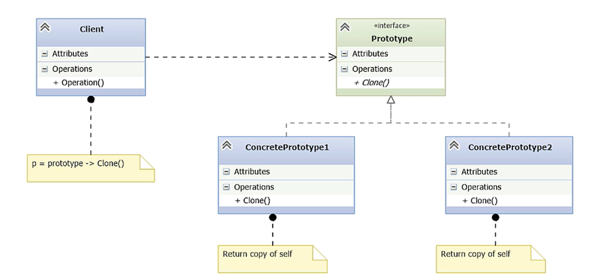

# Prototype

- [Understanding the Prototype Pattern](#understanding-the-prototype-pattern)
- [Understanding Shallow Cloning](#understanding-shallow-cloning)
- [Implementing Deep Cloning](#implementing-deep-cloning)
- [Using a Prototype Mapper](#using-a-prototype-mapper)

---

## Understanding the Prototype Pattern

- **Pattern type:** Creational
- **Purpose:** Create new objects by cloning existing ones (prototypes) instead of instantiating classes directly.
- **Main idea:** Start with a predefined object and clone it → modify attributes as needed.
- **Goal:** Reduce class count and simplify object creation when many configurations are possible.



- **Prototype (interface)**:
    - Declares the `clone()` method.
    - All concrete prototypes must implement it.
- **ConcretePrototype1 / ConcretePrototype2**:
    - Implement the Prototype interface.
    - Each class defines its own version of `clone()` to return a copy of itself.
- **Client**:
    - Uses the `clone()` method instead of new or constructors.
    - It knows only the prototype interface, not the concrete class.
- **Benefits**:
    - Reduces the number of concrete classes needed.
    - Enables object creation at runtime with different attributes.
    - Useful for complex or expensive-to-create objects.
    - Promotes loose coupling and flexibility.

## Understanding Shallow Cloning
	
*abs_computer.py*
```python
import abc

# Abstract base class that defines the interface for computer products.
# Any concrete class (like Laptop or Tower) must implement the display method.
class AbsComputer(abc.ABC):

    @abc.abstractmethod
    def display(self):
        pass
```

*abs_prototype.py*
```python
import abc

# Abstract base class for the Prototype pattern.
# Enforces the presence of a clone() method in all concrete prototypes.
class AbsPrototype(abc.ABC):

    @abc.abstractmethod
    def clone(self):
        pass
```

- Two abstract base classes
	- One for the computer models `abs_computer.py`
	- Another for the prototype interface `abs_prototype.py`

*laptop.py*
```python
# laptop.py
from abs_computer import AbsComputer
from abs_prototype import AbsPrototype
import copy

# Concrete prototype class.
# Implements both the product (AbsComputer) and prototype (AbsPrototype) interfaces.
class Laptop(AbsComputer, AbsPrototype):

    def __init__(self, model, processor, memory, hard_drive, graphics, screen):
        # Initialize all attributes that define this product
        self.model = model
        self.processor = processor
        self.memory = memory
        self.hard_drive = hard_drive
        self.graphics = graphics
        self.screen = screen

    def display(self):
        # Shows component values — helps confirm that cloning works correctly
        print('Custom Computer: ' + self.model)
        print('\t{:>10}: {}'.format('Processor', self.processor))
        print('\t{:>10}: {}'.format('Memory', self.memory))
        print('\t{:>10}: {}'.format('Hard drive', self.hard_drive))
        print('\t{:>10}: {}'.format('Graphics', self.graphics))
        print('\t{:>10}: {}'.format('Screen', self.screen))

    def clone(self):
        # Shallow copy — fast, but does not fully duplicate nested objects
        return copy.copy(self)
```

- The laptop module defines the `Laptop` class, which inherits from both `AbsComputer` and `AbsPrototype`, so `display()` and `clone()` methods must be implemented.

*\_\_main\_\_.py*
```python
from laptop import Laptop
from tower import Tower, MainBoard

# --- Shallow Copy Demo with Laptop ---

# Create original object (the prototype)
l1 = Laptop('L1', 'Intel', '32GB', '2TB SSD', 'onboard', '1920x1080')
l1.display()

# Clone the prototype — shallow copy
l2 = l1.clone()

# Modify cloned object
l2.model = 'L2'
l2.processor = 'AMD'
l2.display()

# --- Optional: Shallow Copy Demo with Tower ---
# This block demonstrates shallow copy issues with nested objects
# t1 = Tower('T1', MainBoard('ASUS', 'Game'), 'AMD', '32GB', '2TB SSD', 'onboard', '1920x1080')
# t1.display()
# t2 = t1.clone()
# t2.model = 'T2'
# t2.mainboard.model = 'Business'  # Mutates t1.mainboard too (shared reference!)
# t2.display()
# t1.display()  # Will show changed mainboard model — clone not isolated
```

```bash
❯ python .\__main__.py
Custom Computer: L1
	Processor: Intel
	   Memory: 32GB
   Hard drive: 2TB SSD
     Graphics: onboard
       Screen: 1920x1080
Custom Computer: L2
	Processor: AMD
	   Memory: 32GB
   Hard drive: 2TB SSD
     Graphics: onboard
       Screen: 1920x1080
```

*tower.py*
```python
from abs_prototype import AbsPrototype
from abs_computer import AbsComputer
import copy

# Class with its own state — used as a nested object
class MainBoard(object):
    manufacturer: str
    model: str

    def __init__(self, manufacturer, model):
        self.manufacturer = manufacturer
        self.model = model

# Tower implements the prototype interface and includes a nested object (MainBoard)
class Tower(AbsComputer, AbsPrototype):
    def __init__(self, model, mainboard, processor, memory, hard_drive, graphics, monitor):
        self.model = model
        self.mainboard = mainboard  # <-- Reference to another object (not primitive)
        self.processor = processor
        self.memory = memory
        self.hard_drive = hard_drive
        self.graphics = graphics
        self.monitor = monitor

    def display(self):
        print('Custom Computer: ' + self.model)
        print('\t{:>10}: {}'.format('Mainboard', self.mainboard.model))  # Risky with shallow copy
        print('\t{:>10}: {}'.format('Processor', self.processor))
        print('\t{:>10}: {}'.format('Memory', self.memory))
        print('\t{:>10}: {}'.format('Hard drive', self.hard_drive))
        print('\t{:>10}: {}'.format('Graphics', self.graphics))
        print('\t{:>10}: {}'.format('Monitor', self.monitor if self.monitor else 'None'))

    def clone(self):
        return copy.copy(self)  # <-- Shallow copy; nested objects still shared
```

- The main board is an object of the `MainBoard` class which tracks the manufacturer and model.

*\_\_main\_\_.py*
```python
```python
from laptop import Laptop
from tower import Tower, MainBoard

#l1 = Laptop('L1', 'Intel', '32GB', '2TB SSD', 'onboard', '1920x1080')
#l1.display()
#l2 = l1.clone()
#l2.model = 'L2'
#l2.processor = 'AMD'
#l2.display()

# --- Shallow Copy Demo with Tower ---
# This block demonstrates shallow copy issues with nested objects
t1 = Tower('T1', MainBoard('ASUS', 'Game'), 'AMD', '32GB', '2TB SSD', 'onboard', '1920x1080')
t1.display()
t2 = t1.clone()
t2.model = 'T2'
t2.mainboard.model = 'Business'  # Mutates t1.mainboard too (shared reference!)
# t2.display()
t1.display()  # Will show changed mainboard model — clone not isolated
```

```bash
❯ python .\__main__.py
Custom Computer: T1
	Mainboard: Game
	Processor: AMD
	   Memory: 32GB
   Hard drive: 2TB SSD
     Graphics: onboard
       Screen: 1920x1080
Custom Computer: T1
	Mainboard: Business
	Processor: AMD
	   Memory: 32GB
   Hard drive: 2TB SSD
     Graphics: onboard
       Screen: 1920x1080
```

- After cloning T1 to T2 and changing T2 model from Game to Business, it also changes T1 model.
- This is caused by the `copy()` function.
- The mainboard is a separate object, so the clone operation keeps the reference to that object.

> [!INFO] A shallow copy constructs a new compound object and then (to the extent possible) inserts references into it ot the objects found in the original.

## Implementing Deep Cloning

- Deep cloning recursively copies objects found in the original.
- In Python, use `copy.deepcopy()` to enable this behavior.
-  Fixes the issue seen with **shallow copy** when objects have embedded mutable components.
- ⚠️ Recursive structures may cause **infinite loops** or hit recursion limits.
- ⚠️ **Performance cost**: copies more than needed, increasing memory use
- Ideal when:
    - You need **complete separation** of object state.
    - The object graph is not too large or cyclic.

*tower.py*
```python
class Tower(AbsComputer, AbsPrototype):
	...
    def clone(self):
        return copy.deepcopy(self)  # <-- Deep copy; nested objects not shared
```

```bash
❯ python .\__main__.py
Custom Computer: T1
	Mainboard: Game
	Processor: AMD
	   Memory: 32GB
   Hard drive: 2TB SSD
     Graphics: onboard
       Screen: 1920x1080
Custom Computer: T2
	Mainboard: Business
	Processor: AMD
	   Memory: 32GB
   Hard drive: 2TB SSD
     Graphics: onboard
       Screen: 1920x1080
Custom Computer: T1
	Mainboard: Game # Still has the original
	Processor: AMD
	   Memory: 32GB
   Hard drive: 2TB SSD
     Graphics: onboard
       Screen: 1920x1080
```

## Using a Prototype Mapper

- A **Prototype Manager** is a specialized dictionary for organizing prototype instances.
- Ensures only **cloneable objects** (those implementing clone()) are added.
- Typically implemented by **subclassing dict** and overriding __setitem__.
- Promotes **separation of concerns**:
    - Creation and registration of prototypes happens once.
    - Clients retrieve and clone as needed without knowing cloning details (shallow or deep).
- Useful when managing **large numbers of prototypes** (tens to thousands).
- In Python 3.9+, supports merging (|=) for clean prototype registration.
- Makes the system **extensible and decoupled** — clients work only with clone results.

*prototype_manager.py*
```python
from abs_prototype import AbsPrototype

class PrototypeManager(dict):
    def __setitem__(self, key, prototype):
        if issubclass(prototype, AbsPrototype):
            dict.__setitem__(self, key, prototype)
```

- PrototypeManager inherits from Python's built-in dict
- Override __setitem__ to accept only objects that support prototyping, which must implement `clone()`.
- Only accept prototypes that implement the required interface
- Call the original dict method to store the prototype

*\_\_main\_\_.py*
```python
from laptop import Laptop
from tower import Tower, MainBoard
from prototype_manager import PrototypeManager

# Create the prototype registry
manager = PrototypeManager()

# Create a Laptop prototype and store it
l1 = Laptop('L1', 'Intel', '32GB', '2TB SSD', 'onboard', '1920x1080')
l1.display()
manager |= {'L1': l1}  # New syntax in Python 3.9 to update dicts

# Clone and customize a new laptop based on the prototype
l2 = manager['L1'].clone()
l2.model = 'L2'
l2.processor = 'AMD'
l2.display()

# Create a Tower prototype and store it
t1 = Tower('T1', MainBoard('ASUS', 'Game'), 'AMD', '32GB', '2TB SSD', 'onboard', '1920x1080')
t1.display()
manager |= {'T1': t1}

# Clone and customize a new tower from the prototype
t2 = manager['T1'].clone()
t2.model = 'T2'
t2.mainboard.model = 'Business'  # Only works safely if deep cloned
t2.display()

# Re-display original to verify deep copy behavior
t1.display()
```

- Import and instantiate the prototype manager
- Create prototype and store it the manager
- Use the manager to retrieve a prototype and clone it
- The main program is unaware of shallow or deep cloning