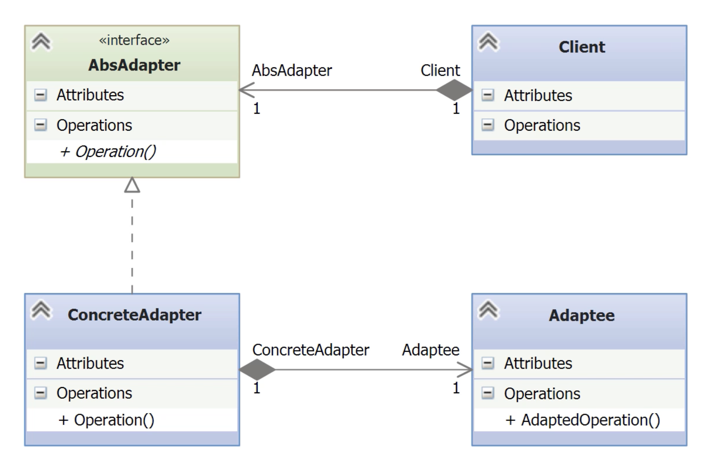
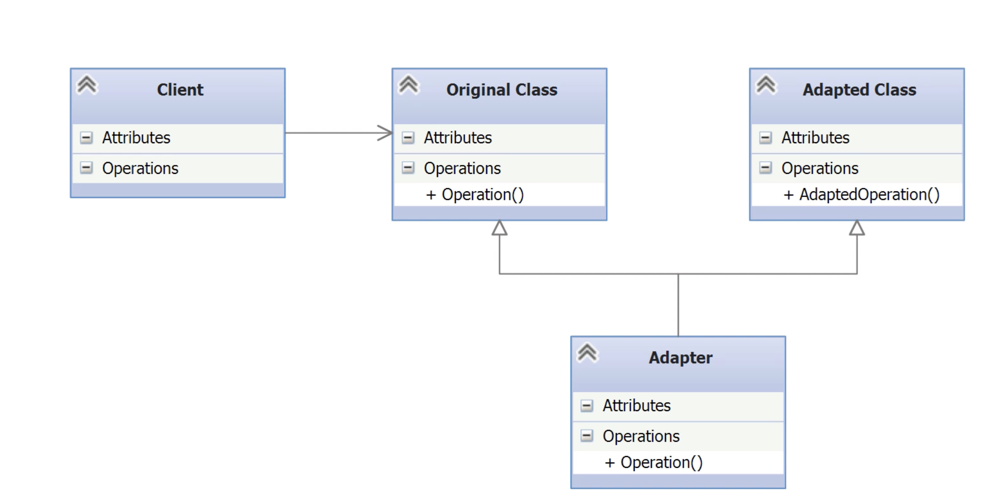

# Adapter

- [Before Adapter](#before-adapter)
- [Understanding the Adapter Pattern](#understanding-the-adapter-pattern)
- [Implementing an Object Adapter](#implementing-an-object-adapter)
- [Implementing a Class Adapter](#implementing-a-class-adapter)
- [Comparing Obejct and Class Adapter](#comparing-obejct-and-class-adapter)

---

- This pattern is used to make an API look like another with different methods and signatures.

**Key Concepts:**
- **Purpose**: Provide a consistent abstract API to client code instead of multiple differing concrete APIs.
- **Motivation**: Aligns with the **Dependency Inversion Principle** (D in SOLID) – _code to abstractions, not implementations_.
- **Also supports**: **Open-Closed Principle** (O in SOLID) – _extend behavior without modifying existing code_.

## Before Adapter

**Context:**
- You have a working program that prints customer names and addresses.
- Users now ask for **vendor support**, since vendors also have names and addresses.

**Problem:**
- The APIs differ:
    - Customer: has a unified address field.
    - Vendor: splits address into number and street.

**Initial Approach (Bad Ideas):**
- ❌ **Duplicate code**: make a new version of the program → violates **DRY** principle.
- ❌ **Add conditionals** for each type → leads to:
    - Hard-to-maintain code.
    - Violates **Open-Closed Principle**.
    - Breaks whenever new types (e.g. GovernmentCustomer, ForeignVendor) are added.
        
- **Original program**: prints customer names and addresses

*customer.py*
```python
class Customer(object):
	# The constructor takes name and address and saves it in private vbls
    def __init__(self, name, address):
        self._name = name
        self._address = address

	# name and address properties to retrieve vbls
    @property
    def name(self):
        return self._name

    @property
    def address(self):
        return self._address
```

*mock_customers.py*
```python
from customer import Customer

MOCKCUSTOMERS = (
    Customer('Pizza Love', '33 Pepperoni Lane'),
    Customer('Happy and Green', '25 Kale St.'),
    Customer('Sweet Tooth', '42 Chocolate Ave.')
)
```

*\_\_main_orig__.py*
```python
from mock_customers import MOCKCUSTOMERS

def main():
    for cust in MOCKCUSTOMERS:
        print('Name: %s; Address: %s' % (cust.name, cust.address))

if __name__ == '__main__':
    main()
```

- Simple client that prints data from a list of Customer objects.
- Works as long as the input objects have .name and .address properties.

```bash
BeforeAdapter> python .\__main_orig__.py
Name: Pizza Love; Address: 33 Pepperoni Lane  
Name: Happy and Green; Address: 25 Kale St.  
Name: Sweet Tooth; Address: 42 Chocolate Ave.  
BeforeAdapter>
```

*vendor.py*
```python
class Vendor(object):
    def __init__(self, name, number, street):
        self._name = name
        self._number = number
        self._street = street

    @property
    def name(self):
        return self._name

    @property
    def number(self):
        return self._number

    @property
    def street(self):
        return self._street
```

- The `Vendor` class is similar to `Customer` class, except `adress` is separated in `number` and `street`.

*mock_vendors.py*
```python
from vendor import Vendor

MOCKVENDORS = (
    Vendor('Dough Factory', 1, 'Semolina Court'),
    Vendor('Farm Produce', 14, 'Country Rd.'),
    Vendor('Cocoa World', 53, 'Tropical Blvd.')
)
```

- Modify the main program to handle this change.

*\_\_main_new__.py*
```python
from mock_customers import MOCKCUSTOMERS as CUSTOMERS
from mock_vendors import MOCKVENDORS as VENDORS

# Simulate runtime parameter
TYPE = 'vendors'

def main():
    if TYPE == 'customers':
        for cust in CUSTOMERS:
            print('Name: %s; Address: %s' % (cust.name, cust.address))
    elif TYPE == 'vendors':
        for vend in VENDORS:
            print('Name: %s; Address: %s %s' % (vend.name, vend.number, vend.street))
    else:
        raise ValueError('Incorrect type: ' + TYPE)

if __name__ == '__main__':
    main()
```

- This version mixes logic for two distinct classes: Customer and Vendor.
- Violates **Open/Closed Principle**: changes require modifying `main()`.
- Violates **Single Responsibility Principle**: `main()` knows too much.
- Adding more types (e.g., GovernmentCustomer) increases complexity.
- Leads to duplicated or conditional logic → **not scalable**.
- Sets the stage for applying the **Adapter Pattern** to abstract differences.

## Understanding the Adapter Pattern

The **Adapter Pattern** is a structural design pattern that:
- Converts one interface into another expected by the client.
- Enables classes with incompatible interfaces to collaborate.
- Can provide additional functionallity.
- Is also known as the **Wrapper Pattern**.

Types of Adapters

- **Object Adapter** _(preferred)_:
    - Uses **composition**.   
    - Can adapt parent classes and subclasses. 
    - More flexible and easier to maintain.    
    
- **Class Adapter**:
    - Uses **inheritance**. 
    - Can override Adaptee methods.
    - Less flexible, tightly coupled to the Adaptee.

> Favor composition over inheritance for flatter, more maintainable class hierarchies.



- **AbstractAdapter**: defines the expected API.
	- Satisfies the *dependency inversion* principle: you should program towards abstraction rather than implementations.
- **ConcreteAdapter**: wraps (composes) an Adaptee and translates the interface.
	- One or more concrete implementations.
	- All hidden from the client program.
	- Uses composition to access an object of the `Adaptee` class.
- **Adaptee**: existing class with a different API.
	- Often has an unknown signature to the client.
	- Used by the `ConcreteAdapter` to present an operation that is known to the client.
- **Client**: uses the Adapter interface.
	- Gets an instance of an object implementing the `AbstractAdapter`.
	- Perhaps using a factory method.
	- Uses the `Operation()` method to do its work.
	- What happens in the `ConcreteAdapter` and the adapted class is unknown to the client.

## Implementing an Object Adapter

*abs_adapter.py*
```python
import abc

# Define an abstract base class for all adapters.
# It specifies the interface that client code will use.
class AbsAdapter(abc.ABC):
	# The constructor takes an 'adaptee' — the object being adapted.
    # This is how composition is applied: we wrap an instance.
    def __init__(self, adaptee):
        self._adaptee = adaptee

	# Provide a protected accessor for the adaptee.
    # Subclasses will use this to access the wrapped object.
    @property
    def adaptee(self):
        return self.
		
	# Abstract property for 'name' — all adapters must provide this.
    # This aligns with the client-facing interface.
    @abc.abstractproperty
    def name(self):
        pass

	# Abstract property for 'address' — expected by client code.
    # Concrete adapters will compute or map this value from the adaptee.
    @abc.abstractproperty
    @abc.abstractproperty
    def address(self):
        pass
```

- `AbsAdapter` implements a standard Python base class.
- The constructor `__init__()` is not abstract.
- The constructor expects an adaptee, which will be used by the concrete adapter.
- Since the adaptee is in a private variable, we define a property.
- The abstract properties `name` and `address` echo the same properties in the `Customer` class.

*vendor_adapter.py*
```python
# Import the abstract base adapter that defines the expected interface
from abs_adapter import AbsAdapter

# Concrete Adapter: adapts a Vendor object to match the Customer interface
class VendAdapter(AbsAdapter):
    # Implements the 'name' property expected by the client
    # This simply delegates to the adaptee (Vendor)'s name
    @property
    def name(self):
        return self.adaptee.name

    # Adapts the Vendor's number + street into a single 'address' string
    # This is where the interface transformation happens
    @property
    def address(self):
        return '{} {}'.format(
            self.adaptee.number,
            self.adaptee.street
        )
```

- Imports the abstract adapter and implements the two required properties.
- The `name` property is returned from the adapted class using the `adaptee` property from the abstract base class.
- The `adress` property converts the two `Vendor` class attributes.

*mock_vendor.py*
```python
from vendor import Vendor
# Import the concrete adapter that will wrap Vendor instances
from vend_adapter import VendAdapter

# Create mock vendor data, wrapped at runtime with the adapter
# This is where composition happens: we inject Vendor into VendAdapter
# From this point, the client sees the standard interface (name, address)
MOCKVENDORS = (
    VendAdapter(Vendor('Dough Factory', 1, 'Semolina Court')),
    VendAdapter(Vendor('Farm Produce', 14, 'Country Rd.')),
    VendAdapter(Vendor('Cocoa World', 53, 'Tropical Blvd.'))
)
```

- We wrap the `Vendor` instances with the `VendorAdapter`.

## Implementing a Class Adapter



- The **Client** expects to work with an `OriginalClass` that provides `Operation()`.
- The **Adapter** inherits from both classes:
    - From OriginalClass to conform to the interface expected by the client.
    - From AdaptedClass to reuse its functionality.
- The **AdaptedClass** exposes a different method: `AdaptedOperation()`.
- The **Client** instantiates the subclass `Adapter` directly, which acts as a bridge between the two.

*vend_adapter.py*
```python
from customer import Customer
from vendor import Vendor

# The adapter inherits from both the Adaptee (Vendor) and the expected interface (Customer)
class VendorAdapter(Vendor, Customer):
    # Constructor forwards all arguments to the superclass initializer.
    def __init__(self, *args, **kwargs):
        super().__init__(*args, **kwargs)

    # Override the 'address' property expected by the Customer interface.
    # Combines 'number' and 'street' from Vendor into a single string to match Customer format.
    @property
    def address(self):
        return '{} {}'.format(
            self.number,  # Comes from Vendor
            self.street   # Comes from Vendor
        )
```

- `VendorAdapter` inherits from both `Vendor` (adaptee) and `Customer` (target interface).
	- This is possible in Python thanks to support for multiple inheritance.
	- Multiple inheritance allows access to both sets of attributes and methods.
	- The constructor must pass the arguments to the superclass.
	- According to Python’s MRO (Method Resolution Order), `Vendor.__init__` will be called first.
- Adapts the incompatible interface of Vendor to look like Customer.
- Uses method override (`address`) to fulfill the expectations of the client code.
- Works without modifying either Customer or Vendor classes.

*mock_vendor.py*
```python
from vend_adapter import VendorAdapter

# Here, we instantiate the VendorAdapter directly, passing the original Vendor arguments.
# This works because VendorAdapter inherits from Vendor and forwards the constructor parameters.


MOCKVENDORS = (
    VendorAdapter('Dough Factory', 1, 'Semolina Court'),
    VendorAdapter('Farm Produce', 14, 'Country Rd.'),
    VendorAdapter('Cocoa World', 53, 'Tropical Blvd.')
)
```

- The adapter `VendorAdapter` replaces the original `Vendor` instances in this mock data structure.
- The result: each VendorAdapter instance behaves like a Customer to the client code.
- This setup enables seamless use of vendor data in client code that expects customers.
- The interface transformation is transparent for the client, demonstrating the adapter’s role.
- Class Adapter is instantiated directly here, showing that no extra wrapping logic is needed.

*\_\_main__.py*
```python
from mock_vendors import MOCKVENDORS

CUSTOMERS = MOCKVENDORS

def main():
    for cust in CUSTOMERS:
        print('Name: %s; Address: %s' % (cust.name, cust.address))

if __name__ == '__main__':
    main()
```

- The main program remains the same

## Comparing Obejct and Class Adapter

| **Feature**                    | **🧱 Object Adapter**               | **🧬 Class Adapter**                  |
| ------------------------------ | ----------------------------------- | ------------------------------------- |
| Pattern Type                   | Composition                         | Inheritance (multiple)                |
| Code Coupling                  | Low (decoupled via delegation)      | High (tight coupling via subclass)    |
| Flexibility                    | High (can adapt any subclass)       | Low (adapts one specific class)       |
| Reusability                    | High                                | Low                                   |
| SOLID Compliance (Liskov)      | ✅ Yes                               | ✅ Yes                                 |
| SOLID Compliance (Open/Closed) | ❌ No (must change for new behavior) | ✅ Yes (inherits new behavior)         |
| Class Hierarchy Impact         | Flat and clean                      | Can become deeper and harder to trace |
| Implementation                 | Slightly more complex               | Simpler                               |
| Python Suitability             | Excellent                           | Viable (Python supports it)           |
| Default Recommendation         | ✅ Preferred                         | 🚫 Use only for narrow cases          |
