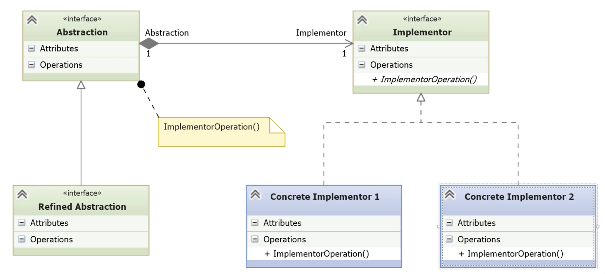

# Bridge

- [Solving a Problem Using Subclassing](#solving-a-problem-using-subclassing)
	- [Adding Discounts](#adding-discounts)
- [Understanding the Problems Found](#understanding-the-problems-found)
- [Implementing the Bridge Pattern](#implementing-the-bridge-pattern)
- [Adding the Special Offer Feature](#adding-the-special-offer-feature)
---
## Solving a Problem Using Subclassing

- Online courseware provider.
	- Annual and monthly subscribers.
	- Student and corporate discounts.
- Abstract base class and inheritance.

*abs_subscription.py*
```python
import abc

class Subscription(abc.ABC):
    # Constructor stores subscriber info and enrollment date
    def __init__(self, subscriber, enrolled):
        self._subscriber = subscriber
        self._enrolled = enrolled

    # Concrete property to access subscriber name
    @property
    def subscriber(self):
        return self._subscriber

    # Concrete property to access enrollment date
    @property
    def enrolled(self):
        return self._enrolled

    # Abstract property for the subscription price
    @abc.abstractproperty
    def price(self):
        pass

    # Abstract property for the subscription expiration date
    @abc.abstractproperty
    def expiration(self):
        pass
```

- `Subscription` is the abstract base class for all subscription types.
- Encapsulates shared state: subscriber and enrolled properties.
- Uses `@abc.abstractproperty` to enforce implementation of:
    - price — e.g., 250 for annual, 25 for monthly.
    - expiration — calculated based on enrolled date.
- Enforces a common interface, supporting polymorphism in client code.
- **Design flaw**: discount policies cannot vary independently from subscription types.
- Any combination of duration (annual/monthly) and discount (student/corporate) would require **combinatorial subclassing**.

*annual.py*
```python
from abs_subscription import Subscription
from dateutil.relativedelta import relativedelta

# Concrete subclass representing a yearly subscription
class Annual(Subscription):

    # Fixed price for annual subscriptions
    @property
    def price(self):
        return 250.00

    # Expiration is calculated as one year from the enrollment date
    @property
    def expiration(self):
        return self._enrolled + relativedelta(years=1)
```

- Implements the abstract `Subscription` interface for a yearly subscription plan.
	- `price`: hardcoded to $250.
    - `expiration`: uses `elativedelta` to return a date one year after enrollment.
- Simple and clear, but tightly coupled logic.
- If discounting policies vary (e.g. student/corporate), subclassing would force creating multiple versions:
    - AnnualStudent, AnnualCorporate, etc.
- Demonstrates the **class explosion problem** — a key motivation for the Bridge pattern.

*monthly.py*
```python
from abs_subscription import Subscription
from dateutil.relativedelta import relativedelta

# Concrete subclass representing a monthly subscription
class Monthly(Subscription):

    # Fixed price for monthly subscriptions
    @property
    def price(self):
        return 50.00

    # Expiration is calculated as one month from enrollment date
    @property
    def expiration(self):
        return self._enrolled + relativedelta(months=1)
```

- Implements the abstract `Subscription` for monthly plans.
    - `price`: hardcoded to $50.
    - `expiration`: adds 1 month to enrollment using relativedelta.
- This class mirrors `Annual`, reinforcing the **rigid inheritance structure**.

*\_\_main__.py*
```python
from annual import Annual
from monthly import Monthly
from datetime import datetime

def main():
    sub1 = Monthly('Bob', datetime.today())
    sub2 = Annual('Carol', datetime.today())

    print(f'Subscriber: {sub1.subscriber}, Cost: {sub1.price}, Expiration: {sub1.expiration}')
    print(f'Subscriber: {sub2.subscriber}, Cost: {sub2.price}, Expiration: {sub2.expiration}')

if __name__ == "__main__":
    main()
```

- This script is the entry point for testing the current hierarchy.
- It creates one monthly (`sub1`) and one annual (`sub2`) subscription. 
	- The `datetime.today()` call is passed as the enrollment date.   
- This confirms polymorphism: Annual and Monthly share a base (`Subscription`) but behave differently.
- At this point, adding discounts would require subclassing both Monthly and Annual per discount type — e.g. MonthlyStudent, AnnualCorporate, etc.
- This rigid structure motivates the need for the **Bridge Pattern**, to decouple **duration** from **discount strategy**.

### Adding Discounts

- Add 10% discount for students and 20% for companies.

*annual_student.py*
```python
class AnnualStudent(Annual):
    @property
    def price(self):
        return super().price * 0.9
```

*annual_corporate.py*
```python
class AnnualCorporate(Annual):
    @property
    def price(self):
        return super().price * 0.8
```

*monthly_student.py*
```python
class MonthlyStudent(Monthly):
    @property
    def price(self):
        return super().price * 0.9
```

*monthly_corporate.py*
```python
class MonthlyCorporate(Monthly):
    @property
    def price(self):
        return super().price * 0.8
```


- Inherits from `Annual` or `Monthly`, reusing the duration logic (expiration remains unchanged).
- Overrides the price property to apply a 10% or 20% discount (* 0.9, * 0.8).
- Uses `super()` to access the base price from `Annual` or `Monthly`.

*\_\_main__.py*
```python
from annual import Annual
from monthly import Monthly
from annual_student import AnnualStudent
from annual_corporate import AnnualCorporate
from monthly_student import MonthlyStudent
from monthly_corporate import MonthlyCorporate
from datetime import datetime

def main():
    sub1 = MonthlyCorporate('Bob', datetime.today())
    sub2 = AnnualStudent('Carol', datetime.today())
    sub3 = MonthlyCorporate('Ted', datetime.today())
    sub4 = AnnualStudent('Alice', datetime.today())

    print('\nDiscounted subscriptions:\n')
    print(f'Subscription: {sub1.subscriber}, Cost: {sub1.price}, Expiration: {sub1.expiration}')
    print(f'Subscription: {sub2.subscriber}, Cost: {sub2.price}, Expiration: {sub2.expiration}')
    print(f'Subscription: {sub3.subscriber}, Cost: {sub3.price}, Expiration: {sub3.expiration}')
    print(f'Subscription: {sub4.subscriber}, Cost: {sub4.price}, Expiration: {sub4.expiration}')

    print('\nNormal subscriptions:\n')
    sub5 = Monthly('Fred', datetime.today())
    sub6 = Annual('Wilma', datetime.today())

    print(f'Subscription: {sub5.subscriber}, Cost: {sub5.price}, Expiration: {sub5.expiration}')
    print(f'Subscription: {sub6.subscriber}, Cost: {sub6.price}, Expiration: {sub6.expiration}')

if __name__ == "__main__":
    main()
```

  
 - **⚠️ Design Concern:**
	- 6 concrete classes for just 2 subscription types and 2 discount types.
	- Adding one new variation (e.g., “double duration”) would double class count again.
    - **Class explosion** is the main driver for introducing the Bridge Pattern next.

## Understanding the Problems Found

1. **Exponential class growth**
	- 6 concrete classes for just 2 subscription types and 2 discount types.
	- Adding one new variation (e.g., “double duration”) would double class count again.
    - **Class explosion** is the main driver for introducing the Bridge Pattern next.
2. **Code duplication**
	- Repeated logic across subclasses breaks the DRY principle.
3. **High maintenance cost**
	- More classes = more code to update, debug, and document.

- **Motivation for Bridge Pattern**
	- Bridge pattern decouples **abstraction** (subscription types) from **implementation** (discounts).
    - This decoupling allows both class hierarchies to grow **independently and linearly**.
    - The pattern solves the tight coupling between subscription and discount behavior seen in the naïve design.



- **Abstraction**: `Subscription`
	- Holds a reference to the implementor.
	- Defines high-level logic.
- **Implementor**: `Discount` (interface or base class)
	- Defines the operations to be implemented by concrete discounts.
- **Concrete Implementors**: `StudentDiscount`, `CorporateDiscount`, etc.
	- Provide the actual discount logic.
- **Refined Abstraction**: `Annual`, `Monthly`
	- Specializations of the abstraction.
## Implementing the Bridge Pattern

*discount.py*
```python
import abc

# Abstract base class representing a Discount strategy
class Discount(abc.ABC):
    
    @abc.abstractproperty
    def discount(self):
        pass

# Student discount: returns a 10% discount
class StudentDiscount(Discount):

    @property
    def discount(self):
        return 10

# Corporate discount: returns a 20% discount
class CorporateDiscount(Discount):
    
    @property
    def discount(self):
        return 20

# No discount (Null Object pattern): always returns 0%
class NoDiscount(Discount):
    
    @property
    def discount(self):
        return 0
```

- `Discount` acts as the **Implementor** in the Bridge Pattern, defining a common interface (`discount`) for all discount strategies.
- `StudentDiscount`, `CorporateDiscount`, and `NoDiscount` are **Concrete Implementors** providing specific discount percentages.
- These classes are **composed** into the Abstraction (`Subscription` classes) instead of subclassing them, decoupling the discount behavior.    
- `NoDiscount` applies the **Null Object Pattern**, avoiding special-case checks for missing discounts.
- This setup allows the **Abstraction (subscriptions)** and **Implementors (discounts)** to vary independently.

*abs_subscription.py*
```python
import abc

# Abstraction class in the Bridge Pattern
class Subscription(abc.ABC):
    def __init__(self, subscriber, enrolled, discount):
        # Composition: hold a reference to a discount implementor
        self._subscriber = subscriber
        self._enrolled = enrolled
        self._discount = discount()

    # Property to get subscriber name
    @property
    def subscriber(self):
        return self._subscriber

    # Property to get enrollment date
    @property
    def enrolled(self):
        return self._enrolled

    # Abstract method for base price (to be defined in refined abstractions)
    @abc.abstractproperty
    def price_base(self):
        pass

    # Concrete property applying discount logic
    @property
    def price(self):
        discount = self._discount.discount
        return self.price_base * (1 - discount / 100)

    # Abstract method for expiration (to be defined in refined abstractions)
    @abc.abstractproperty
    def expiration(self):
        pass
```

- `Subscription` is the **Abstraction**, which delegates discount logic to the Implementor.
- The constructor accepts a `discount` class and instantiates it, using **composition** to hold a reference to it.
- `price_base` and `expiration` are **abstract properties**, forcing concrete subclasses to define the raw subscription logic.
- `price` is now a reusable method that calculates the final price using the injected discount.
- This structure **decouples** the subscription type from the discount logic, flattening the class hierarchy and allowing independent evolution of both sides.

*annual.py*
```python
from abs_subscription import Subscription
from dateutil.relativedelta import relativedelta

class Annual(Subscription):
    # Implements the base price for the annual subscription.
    @property
    def price_base(self):
        return 250.00

    # Implements the expiration logic specific to annual plans.
    @property
    def expiration(self):
        return self._enrolled + relativedelta(years=1)
```

*monthly.py*
```python
from abs_subscription import Subscription
from dateutil.relativedelta import relativedelta

class Monthly(Subscription):
    # Defines the base price for monthly subscriptions.
    @property
    def price_base(self):
        return 50.00

    # Provides the expiration logic specific to monthly plans.
    @property
    def expiration(self):
        return self._enrolled + relativedelta(months=1)
```

- `Annual` and `Monthly` are **refined abstractions**, extending the base `Subscription` abstraction.    
- It overrides `price_base` and `expiration` to define specific behavior.
- The pricing logic (with discounts) is **delegated** to the composed discount object (self._discount), achieving **decoupling**.
- This enables new subscription types (e.g., Permanent) or new discount types (e.g., SeniorDiscount) without multiplying subclasses.

*\_\_main__.py*
```python
from monthly import Monthly
from annual import Annual
from datetime import datetime
from discount import NoDiscount, StudentDiscount, CorporateDiscount

def main():
    sub1 = Monthly('Ted', datetime.today(), StudentDiscount)
    sub2 = Annual('Alice', datetime.today(), CorporateDiscount)
    sub3 = Annual('Bob', datetime.today(), NoDiscount)

    print(f'Subscription: {sub1.subscriber},  Cost: {sub1.price},  Expiration: {sub1.expiration}')
    print(f'Subscription: {sub2.subscriber},  Cost: {sub2.price},  Expiration: {sub2.expiration}')
    print(f'Subscription: {sub3.subscriber},  Cost: {sub3.price},  Expiration: {sub3.expiration}')

if __name__ == "__main__":
    main()
```

- The `main()` function composes **abstraction (`Annual`, `Monthly`)** with **implementor (Discount variants)** at runtime.
- Each subscription instance receives its **discount strategy via composition**, not inheritance.
- This setup eliminates the need for subclasses like AnnualStudent, MonthlyCorporate, etc.
- The Bridge pattern allows **independent extension** of subscription types and discount types.
- Promotes **open/closed principle**: new discounts or subscription types can be added without modifying existing code.
## Adding the Special Offer Feature

- New requirement
	- Support special offers extending subscription periods.

1.  Design the `Extend` base clase and its variants.

*extend.py*
```python
import abc

# This is the "Implementor" in the Bridge pattern for subscription duration.
# It defines the interface for extension strategies.
class Extend(abc.ABC):

    @abc.abstractproperty
    def expiration_base(self):
        # This method should return a relativedelta to extend the base subscription period.
        pass
```

- **Extend** is the abstract implementor of a second dimension in the Bridge pattern: time extension.
- It mirrors the Discount hierarchy but focuses on modifying subscription expiration rather than price.
- Each concrete extender (e.g. NoExtend, DoubleExtend) will implement `expiration_base` to define how long the subscription is extended.
- This enables independent evolution of duration logic without touching subscription types.

2. Refactorizar Subscription para tener expiration_base.
*abs_subscription.py*
```python
class Subscription(abc.ABC):
	# The constructor now takes extend
    def __init__(self, subscriber, enrolled, discount, extend):
        self._subscriber = subscriber
        self._enrolled = enrolled
        self._discount = discount()
	...
```

- The constructor will need to take a new parameter, which is a reference to one of the extended periods

3. Crear ejemplos en main.py con combinaciones de descuentos y extensiones.
