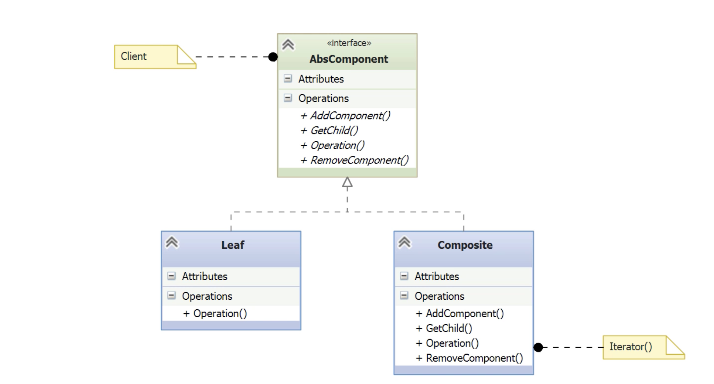

# Composite

- [Before Composite](#before-composite)
- [Understanding the Composite Pattern](#understanding-the-composite-pattern)
- [Implementing the Composite Pattern](#implementing-the-composite-pattern)

---

**Concept:**
- The Composite pattern is designed to manage **part-whole hierarchies** (tree-like structures) where individual objects and groups of objects should be treated uniformly.

**Real-world analogies:**
- Family trees (e.g. people → families → clans)
- Employee org charts (e.g. developer → team → department)
- File systems (file vs folder)
- Biological taxonomy (e.g. species → genus → family)
    
 **Core idea:**
- **Any component (leaf or branch) should support the same interface**, allowing clients to process objects and groups of objects recursively and uniformly.

 **Pattern Intent:**
- Treat individual objects and compositions of objects **the same way**.

## Before Composite

- You want to find the **oldest person** across a dynamic tree of family units.
- Individuals may or may not be in the same nuclear family.
- Families can be **nested** (e.g. married children with their own kids).
- You need a **recursive approach** that can traverse both people and family groups seamlessly.

*person.py*
```python
# Leaf class in the Composite Pattern.
# Represents a single entity (a person) in the tree structure.
class Person:
    def __init__(self, name, birthdate):
        self._name = name
        self._birthdate = birthdate

    @property
    def name(self):
        return self._name

    @property
    def birthdate(self):
        return self._birthdate
```

- Person is the **leaf node** in the composite structure.
- It **does not contain children**, just raw data (name, birthdate).
- Will later implement a shared interface (e.g., FamilyMember) to integrate with Family. 
- Enables **uniform traversal** of mixed elements (Person, Family) once composite is complete.

*family.py*
```python
# Composite class in the Composite Pattern.
# Represents a group of elements (people or families).
# Implements iteration to support traversal over child members.
from collections import Iterable

class Family(Iterable):
	# Shared across all instances – bad practice; should be in __init__
    _members = []

    def __init__(self, members):
        self._members = members

    def __iter__(self):
        return iter(self._members)
```

- Family is the **composite node** — it holds a collection of child elements.
- Children can be either **Person instances (leaves)** or **other Family instances (subtrees)**.
- Implements `__iter__` to allow iteration over children, enabling flat traversal.
- ⚠️ Note: The _members list defined at class level is a shared mutable default. This should be moved into the constructor to avoid shared state.

*\_\_main__.py*
```python
# Before applying the Composite Pattern.
# Two separate collections (family and singles) require two loops to find the oldest person.

from datetime import date
from dateutil.relativedelta import relativedelta
from person import Person
from family import Family

def main():
    # Family group created with a list of Person instances
    family = Family([
        Person('Trillian', date(1970, 3, 14)),
        Person('Arthur', date(1965, 7, 4)),
        Person('Ford', date(1995, 2, 2)),
        Person('Zaphod', date(1997, 3, 1)),
        Person('Douglas', date(1999, 4, 2))
    ])

    # List of single (non-family) Person instances
    singles = [
        Person('Marvin', date(1991, 1, 1)),
        Person('Slarti', date(1993, 9, 9))
    ]

    oldest = None
    earliest_date = date.max

    # Loop over family members
    for m in family:
        if m.birthdate < earliest_date:
            oldest = m
            earliest_date = m.birthdate

    # Separate loop over singles
    for s in singles:
        if s.birthdate < earliest_date:
            oldest = s
            earliest_date = s.birthdate

    # Compute age using relativedelta
    age = relativedelta(date.today(), oldest.birthdate)

    # Output the oldest person and their age
    print(f'Oldest person: {oldest.name}; Age: {age.years} years, {age.months} months')
```

- Two separate collections (family, singles) require **duplicate logic** to find the oldest.
- `Family` and `Person` are not interchangeable — the code must distinguish them.
- Adding **nested families** would force recursion and complicate the loop logic.
- This motivates applying the **Composite Pattern** to unify the interface and simplify traversal.

## Understanding the Composite Pattern

 **Purpose**
- Allows treating **individual objects (leaves)** and **groups of objects (composites)** uniformly through a **shared interface**.



**Core Concepts**
- **Component (abstract base class)**
	- Declares the interface for all objects in the composition.
    - Can provide **default implementations** for methods like `add`, `remove`, `get_child`.
    - It must be implemented by both leaf and composite classes.
	    - Instances of those are called *nodes*.
- **Leaf (e.g. Person)**
    - Represents end objects.    
    - No children.
    - Implements core operations (e.g., `birthdate`, `name`, etc.).
    - `Operation` will retrun information of that node.
- **Composite (e.g. Family)**
    - Contains child Component objects (both Person and Family). 
	    - It is a subtree.
    - Implements the interface and delegates behavior to its children.   
    - Operations often implemented via **iteration** over children.

**Benefits**
- Allows recursive structures: trees of arbitrary depth.
- Simplifies client code: you treat families and people the same.
- Extensible without changing client logic.

## Implementing the Composite Pattern

- Create a tree holding families and singles.
- `Family` and `Person` -> `AbsComposite`.
- Simpler client code.

*abs_composite.py*
```python
import abc

# Abstract base class for both leaf and composite nodes in the tree
class AbsComposite(abc.ABC):

    @abc.abstractmethod
    def get_oldest(self):
        # Abstract method that must be implemented by all subclasses
        # Leaf nodes (Person) return themselves
        # Composite nodes (Tree) return the oldest of their children
        pass
```

- **AbsComposite** is the _component interface_ that allows clients to treat `Person` and `Tree` uniformly.
- `get_oldest()` is the **core operation** declared here, implemented differently by leaves and composites.
- Marked with `@abstractmethod` to **enforce implementation** in all subclasses.
- Enables **recursive structures** (trees) and **uniform traversal** without type checking.

*person.py*
```python
from abs_composite import AbsComposite

class Person(AbsComposite):
    def __init__(self, name, birthdate):
        self._name = name
        self._birthdate = birthdate

    def get_oldest(self):
        # Leaf node returns itself
        return self

    @property
    def name(self):
        return self._name

    @property
    def birthdate(self):
        return self._birthdate
```

- Implements `AbsComposite` (abstract component).
- `get_oldest()` returns `self` because `Person`does not hold members.
- Can be used uniformly with composite nodes (`Tree`) thanks to the Composite pattern.

*tree.py*
```python
class Tree(Iterable, AbsComposite):
    # Composite node holding members that can be either Person (leaf) or Tree (composite)
    def __init__(self, members):
        self._members = members

    def __iter__(self):
        # Enables iteration over child nodes (leaf or composite)
        return iter(self._members)

    def get_oldest(self):
        # Recursive function used by reduce to compare oldest nodes
        def f(t1, t2):
            t1_, t2_ = t1.get_oldest(), t2.get_oldest()
            return t1_ if t1_.birthdate < t2_.birthdate else t2_
        
        # Traverses all members recursively and returns the oldest person
        return reduce(f, self, NullPerson())

class NullPerson(AbsComposite):
    # Null object used as initial value in reduce; has latest possible birthdate
    name = None
    birthdate = date.max

    def get_oldest(self):
        return self
```

- Tree implements both `AbsComposite` (common interface) and `Iterable` (to traverse members).
- Child elements in `Tree` can be `Person` (leaf) or other `Tree` instances (composite).
- `get_oldest()` uses `reduce()` to recursively find the oldest member in any tree depth.
	- *Recursive, depth-first traversal*
- `NullPerson` serves as a neutral starting point for comparison (null object pattern).
- This structure enables client code to treat both individuals and groups uniformly.

*\_\_main__.py*
```python
from datetime import date
from dateutil.relativedelta import relativedelta
from person import Person
from tree import Tree

def main():
    # Create leaf nodes (Person instances)
    hitchhikers = Tree([
        Person('Trillian', date(1970, 3, 14)),
        Person('Arthur', date(1965, 7, 4)),
        Person('Ford', date(1995, 2, 2)),
        Person('Zaphod', date(1997, 5, 1)),
        Person('Douglas', date(1999, 4, 2)),
    ])

    # Another group of leaf nodes
    singles = Tree([
        Person('Marvin', date(1991, 1, 1)),
        Person('Slarti', date(1993, 9, 9)),
    ])

    # Additional individual person (leaf)
    loner = Person('Dirk', date(1990, 6, 6))

    # Create composite nodes
    tree1 = Tree([hitchhikers])
    tree2 = Tree([singles, loner])
    tree3 = Tree([tree1, tree2])  # Nesting trees recursively

    # Client code works with the abstract interface (get_oldest)
    for tree in tree1, tree2, tree3:
        oldest = tree.get_oldest()
        age = relativedelta(date.today(), oldest.birthdate)
        print(f'Oldest person: {oldest.name}; Age: {age.years} years, {age.months} months')

if __name__ == '__main__':
    main()
```

- **Uniform interface**: `get_oldest()` works on both `Person` (leaf) and `Tree` (composite) objects.
- **Tree composition**: Trees can contain persons or other trees recursively.
- **Client simplicity**: The loop works regardless of tree depth or complexity — no conditionals needed.
- **Flexibility**: New composite structures can be built dynamically (e.g., tree3 nesting tree1 and tree2).
- **Scalability**: Pattern supports adding more types of nodes (e.g., Organizations, Departments) without altering client logic.
