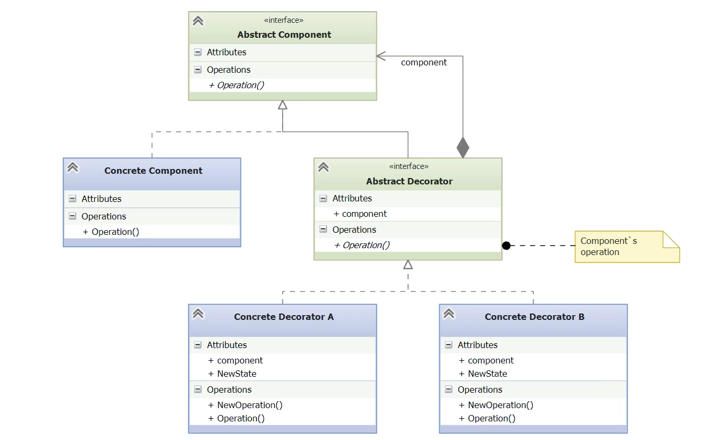

# Decorator

- [Before Decorator](#before-decorator)
- [Second Attempt](#second-attempt)
- [Understanding the Issues and the Decorator Pattern](#understanding-the-issues-and-the-decorator-pattern)
- [Implementing the Decorator Pattern](#implementing-the-decorator-pattern)
- [How Python Decorators Differ](#how-python-decorators-differ)

---

- The **Decorator pattern** helps avoid subclass explosion by adding features at **runtime** rather than at **compile time**.
- This approach supports the **Open-Closed Principle** (O in SOLID): classes should be open for extension, but closed for modification.
    
- Example context: a **car dealership** offering various models (economy, luxury, sport) with options:
    - **Engine**: Inline 4 or V6
    - **Paint**: White, Red, or Black
    - **Upholstery**: Leather or Vinyl        
- Each combination of model and options would normally require a **separate subclass**, leading to complexity.

## Before Decorator

- The demo begins with an **abstract base class** AbsCar defining two abstract properties: `description` and `cost`.

*abs_car.py*
```python
class AbsCar(abc.ABC):
    @abc.abstractproperty
    def description(self):
        pass  # Must be implemented by all concrete car models

    @abc.abstractproperty
    def cost(self):
        pass  # Must be implemented to return the cost of the car
```

- A **concrete model** class (e.g., Economy model) implements the base class with basic default values.

*economy.py*
```python
class Economy(AbsCar):
    @property
    def description(self):
        return 'Economy'  

    @property
    def cost(self):
        return 12000.00   
```

- To handle options (engine type, paint, upholstery), **subclasses are created for each combination**.      

*economy_4cyl_white_vinyl.py*
```python
class Economy4CylWhiteVinyl(Economy):
    @property
    def description(self):
        # Extends the base description with specific options
        return 'Economy, white, 4 cylinder, vinyl upholstery'

    @property
    def cost(self):
        return 12000.00
```

*economy_6cyl_white_vinyl.py*
```python
class Economy6CylWhiteVinyl(Economy):
    @property
    def description(self):
        return 'Economy, 6 cylinder, white, vinyl upholstery'

    @property
    def cost(self):
        return 13500.00
```

- The main script creates and prints instances of these subclasses, confirming they behave as expected.

*\_\_main__.py*
```python
from cars.economy_4cyl_white_vinyl import Economy4CylWhiteVinyl
from cars.economy_6cyl_white_vinyl import Economy6CylWhiteVinyl

def main():
	car1 = Economy4CylWhiteVinyl()
	car2 = Economy6CylWhiteVinyl()  

	print(car1.description, car1.cost) 
	print(car2.description, car2.cost)

if __name__ = "__main__":
	main()
```

- However, this leads to **subclass explosion**:
    - 3 models × 2 engines × 3 paint colors × 2 upholstery types = **36 subclasses**
    - Adding 3 interior color schemes would lead to **108 subclasses**
- Conclusion: this **class-based approach is not scalable** and violates maintainability.
    
    → The **Decorator pattern** will be introduced as a better alternative.
## Second Attempt

- **Abstract Base Class Grows**: Now includes engine, paint, upholstery properties and a concrete cost() method.
	- This is a transitional solution before introducing the **Decorator Pattern**.
    - The goal is to reduce the subclass explosion from the first demo by using _properties_ for car options instead of dedicated subclasses.
    - Cost calculation logic is centralized in the abstract base class (`AbsCar`), depending on the values of engine, paint, and upholstery.

*abs_car.py*
```python
class AbsCar(abc.ABC):
	# Abstract base class with required properties for all car models
    @abc.abstractproperty
    def description(self):
        pass

    @abc.abstractproperty
    def engine(self):
        pass

    @abc.abstractproperty
    def paint(self):
        pass

    @abc.abstractproperty
    def upholstery(self):
        pass

	# Cost logic embedded in base class, based on property values
    # This violates the Open/Closed Principle — every time options or prices change,
    def cost(self): 
        cost = 0.00
        if self.engine == '4 cyl':
            cost += 0.00
        elif self.engine == '6 cyl':
            cost += 1500.00
        if self.paint == 'white':
            cost += 0.00
        elif self.paint == 'black':
            cost += 1000.00
        elif self.paint == 'red':
            cost += 2000.00
        if self.upholstery == 'vinyl':
            cost += 0.00
        elif self.upholstery == 'leather':
            cost += 2000.00
        return cost
```

- **Concrete Model Simpler**: Only one class per car model (e.g., Economy), options passed via constructor
	- This class provides a concrete car model while **delegating option logic** to the base class via properties.   
	- The `cost` method adds the base model price (12000) to the result of `super().cost()` (which calculates extra cost based on selected options).
	- The constructor accepts all configuration options, avoiding subclass proliferation.

*economy.py*
```python
from .abs_car import AbsCar

class Economy(AbsCar):
    def __init__(self, engine, paint, upholstery):
        # Accepting options as arguments instead of creating subclasses
        self._engine = engine
        self._paint = paint
        self._upholstery = upholstery

    @property
    def description(self):
        return 'Economy'

    # The following properties expose option values to the base class logic.
    @property
    def engine(self):
        return self._engine

    @property
    def paint(self):
        return self._paint

    @property
    def upholstery(self):
        return self._upholstery

    @property
    def cost(self):
        # Base price for the model plus additional cost from AbsCar depending on options
        return 12000.00 + super().cost()
```

*\_\_main__.py*
```python
from cars.economy import Economy

def main():
    # Instead of using subclasses for each variant, we now pass the options as arguments.
    car1 = Economy('4 cyl', 'black', 'vinyl')
    car2 = Economy('6 cyl', 'red', 'leather')

    # Each car computes its final cost dynamically using the base model cost and options.
    print(f'{car1.description}: ${car1.cost}')
    print(f'{car2.description}: ${car2.cost}')

if __name__ == '__main__':
    main()
```

**Review**
- **Fewer classes**: Only one concrete class per model (e.g., Economy), avoiding subclass explosion.
- **Cleaner imports**: Main program imports a single model and passes options directly.
- **More complex models**: Each concrete class must implement multiple properties (engine, paint, upholstery).    
- **Constructor grows**: Must accept all configurable options and assign them internally.
- **Base class bloating**: Option pricing logic lives in the abstract base class AbsCar.
- **Violates Open/Closed Principle**:
	- Adding a new option (e.g., interior_color) requires modifying both base and concrete classes.    
    - Option price changes require editing the cost method in AbsCar.
        
## Understanding the Issues and the Decorator Pattern

**OOP Principles Violated in First Two Demos**
- **Single Responsibility Principle (SRP)**: `AbsCar` shouldn’t handle cost calculation logic — it’s not its concern.
- **Open/Closed Principle (OCP)**: Adding new options forces changes in both abstract and concrete classes.
- **Interface Segregation Principle (ISP)**: `cost()` method should be part of a separate abstraction, not tied to `AbsCar`.
- **Dependency Inversion Principle (DIP)**: Concrete cars rely on the `AbsCar` cost logic implementation — tight coupling.
- **Don’t Repeat Yourself (DRY)**: Lots of duplication in option logic across combinations and classes.
    
**Why Use the Decorator Pattern**
- **Category**: Structural pattern.
- **Purpose**: Add behaviors dynamically _at runtime_ without modifying the original class.
- **Alternative**: Replaces subclassing and property expansion with composition.



- The component is the object that we want to decorate.
- **Abstract Component**: interface shared by all components.      
- **Concrete Component**: (one or more concrete components) base object being decorated (e.g., Economy) will implement the Abstract Component.   
- **Abstract Decorator**: also implements Abstract Component and holds a component reference and has access to the component operations.
- **Concrete Decorators**: (one or more) implement abstract decorator. Wrap the component, extending or overriding its behavior.
	- Each concrete decorator maintains a reference to the component it decorates.
	- It may optionally add some new state or operations, as well as its own implementation of the abstract operation.

## Implementing the Decorator Pattern

*abs_car.py*
```python
import abc

class AbsCar(abc.ABC):
    @abc.abstractproperty
    def description(self):
        pass

    @abc.abstractproperty
    def cost(self):
        pass
```

- `AbsCar` is the **Component** in the Decorator pattern.
- Defines the common interface (description, cost) that both **concrete cars** and **decorators** must implement.
- Promotes programming to an interface, enabling interchangeability between cars and decorated cars.
- Sets the foundation for **runtime composition** via decorators.

*economy.py*
```python
from .abs_car import AbsCar

class Economy(AbsCar):
    @property
    def description(self):
        return 'Economy'

    @property
    def cost(self):
        return 12000.00
```

*luxury.py*
```python
from .abs_car import AbsCar

class Luxury(AbsCar):
    @property
    def description(self):
        return 'Luxury'

    @property
    def cost(self):
        return 18000.00
```

*sport.py*
```python
from .abs_car import AbsCar

class Sport(AbsCar):
    @property
    def description(self):
        return 'Sport'

    @property
    def cost(self):
        return 15000.00
```

- `Economy`, `Luxury`, and `Sport` are **Concrete Components** that implement the interface `AbsCar`.
- They provide the **base object** to be wrapped by decorators at runtime.
- The decorators will **augment these objects’ behavior** (description and cost) without modifying the class.
- Keeps the model simple and adheres to **Single Responsibility** and **Open/Closed** principles.

> Decorators in their own package: `decorators`

*abs_decorator.py*
```python
from cars.abs_car import AbsCar

class AbsDecorator(AbsCar):
    # Abstract Decorator — inherits from the same base as the component (AbsCar)
    def __init__(self, car):
        # Decorator holds a reference to a component it wraps (composition)
        self._car = car

    @property
    def car(self):
        # Exposes the wrapped component so concrete decorators can access it
        return self._car
```

- `AbsDecorator` is an **abstract decorator**, inheriting from the same interface as the component (AbsCar).
- It introduces **composition**: it holds a reference (`_car`) to another `AbsCar` object.
- This enables chaining: decorators can decorate other decorators or the base car.
- Does **not** implement description or cost; concrete decorators will do that.
- Promotes **Open/Closed Principle**: new features can be added via decorators without modifying existing code.

*v6.py*
```python
from .abs_decorator import AbsDecorator

# Concrete Decorator — adds engine upgrade functionality
class V6(AbsDecorator):
    @property
    def description(self):
        # Adds 'V6' to the existing car description
        return self.car.description + ', V6'

    @property
    def cost(self):
        # Adds the V6 engine cost to the existing car cost
        return self.car.cost + 1200.00
```

*black.py*
```python
from .abs_decorator import AbsDecorator

class Black(AbsDecorator):
    @property
    def description(self):
        return self.car.description + ', black'

    @property
    def cost(self):
        return self.car.cost + 1000.00
```

*red.py*
```python
from .abs_decorator import AbsDecorator

class Red(AbsDecorator):
    @property
    def description(self):
        return self.car.description + ', Ferarri red'

    @property
    def cost(self):
        return self.car.cost + 1200.00
```

*vinyl.py*
```python
from .abs_decorator import AbsDecorator

class Vinyl(AbsDecorator):
    @property
    def description(self):
        return self.car.description + ', vinyl upholstery'

    @property
    def cost(self):
        return self.car.cost + 2700.00
```

- Inherits from `AbsDecorator`, meaning it wraps an `AbsCar`.
- Overrides the description and cost properties to **extend** behavior, not replace it.
- Uses `self.car.description` and `self.car.cost` to **delegate** to the wrapped object and then enhance it.
- This implementation is **transparent**: it behaves like a car but adds functionality dynamically.
- Can be composed with other decorators, enabling flexible and runtime combinations.

*\_\_main__.py*
```python
# Import the base car and the decorators to use
from cars.economy import Economy
from decorators.v6 import V6
from decorators.vinyl import Vinyl
from decorators.black import Black

def main():
    car = Economy()
    show(car)
    car = V6(car)
    show(car)
    car = Vinyl(car)
    show(car)
    car = Black(car)
    show(car)

def show(car):
    print(f'Description: {car.description}; cost: ${car.cost}')

if __name__ == '__main__':
    main()
```

```bash
Description: Economy; cost: $12000.0
Description: Economy, V6; cost: $13200.0
Description: Economy, V6, vinyl upholstery; cost: $13700.0
Description: Economy, V6, vinyl upholstery, midnight black; cost: $15500.0
```

**Consequences of the decorator pattern**
- **More flexible than static inheritance**: it allows behavior to be modified at runtime without modifying the original class or creating deep subclass hierarchies.    
- **Cleaner than adding many properties**: each decorator has a single, well-defined responsibility, following the Single Responsibility Principle (SRP).
- **Composable and chainable**: there is no practical limit to how many decorators can be applied to a single component.
- **Transparent to clients**: clients interact with the decorated object through the same interface, unaware of how many layers are applied.
- **Different type in class hierarchy**: decorated objects are not of the same type as the original, which can be problematic if client code checks types explicitly.
- **Many small objects**: using many decorators can lead to a proliferation of objects, increasing the learning curve and complexity.
- **Factory or Builder patterns can help**: to manage the construction and composition of decorated objects more cleanly.

## How Python Decorators Differ

| **Aspect**             | **Decorator Pattern (GoF)**                  | **Python** @decorators                                                      |
| ---------------------- | -------------------------------------------- | --------------------------------------------------------------------------- |
| **Syntax**             | Uses concrete classes and inheritance        | Uses @ syntax with functions or callables                                   |
| **Target**             | Wraps class instances (objects)              | Wraps functions, methods, or classes                                        |
| **When Applied**       | At **runtime**                               | At **compile time** (decorator expands then)                                |
| **Purpose**            | Adds functionality to **objects**            | Adds functionality to **definitions** (func/class)                          |
| **Design Basis**       | Gang of Four structural pattern              | Language feature introduced in [PEP 318](https://peps.python.org/pep-0318/) |
| **Use Cases**          | Fine-grained control over object composition | Logging, timing, memoization, registration, etc.                            |
| **Naming Controversy** | Follows classical OOP terminology            | Name reused inconsistently (per PEP author)                                 |
