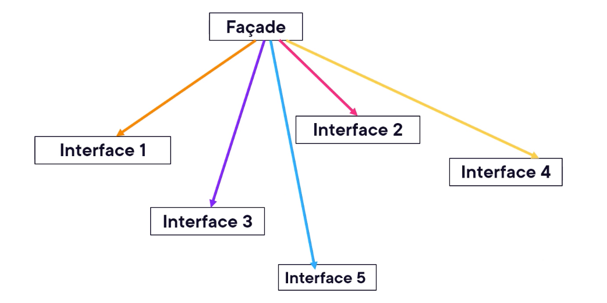
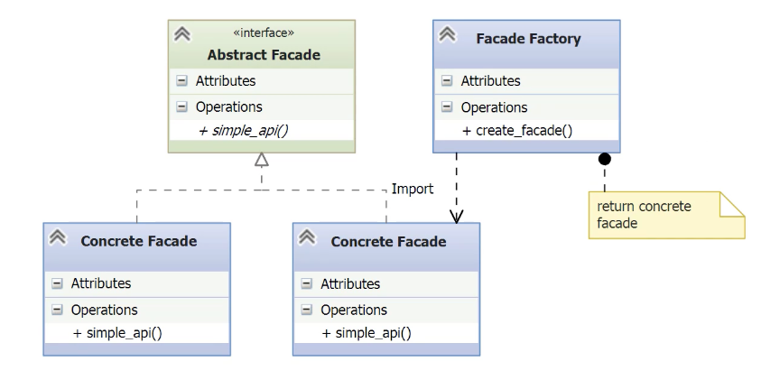

# Façade

- [Before Façade](#before-façade)
- [Understanding the Façade Pattern](#understanding-the-façade-pattern)
- [Implementing the Façade Pattern](#implementing-the-façade-pattern)

---

- The **Facade Pattern** provides a simplified interface to a complex system or set of APIs.
- It’s useful when:
    - The underlying API is complicated or cumbersome.
    - Multiple APIs exist that perform similar tasks but differ in usage.
    - You want to hide complexity and expose a clean, unified interface to client code.
- Motivation example: accessing a database just to read a single employee row involves many steps:
    - Identify the right database and driver.
    - Import proper Python modules.
    - Instantiate connection/control objects.
    - Build a connection string.
    - Connect, query, handle results, and clean up.
- A **Facade** can encapsulate all these steps behind one simple method call.

## Before Façade

*get_employee.py*
```python
import pyodbc  # Direct dependency on a low-level API

# This connection string is hardcoded.
# In real-world usage, it would ideally be abstracted or loaded from config.
CONNSTR = (
    'DRIVER={SQL Server};' +
    'SERVER=.\\sql2019;' +
    'DATABASE=AdventureWorks;' +
    'TRUSTED_CONNECTION=TRUE'
)

def get_employees():
    # Low-level setup: directly managing connection
    connection = pyodbc.connect(CONNSTR)
    # Raw SQL query defined in the business logic
    query = '''
        SELECT DISTINCT TOP 5 FirstName, LastName
        FROM Person.Person
        ORDER BY LastName, FirstName;
    '''
    # Manual cursor handling
    cursor = connection.cursor()
    cursor.execute(query)
    # Data handling and printing done inline
    for row in cursor:
        print(row.FirstName, row.LastName)
    # Manual transaction management
    connection.commit()
    # Manual resource cleanup
    connection.close()

# Business logic is tightly coupled to implementation details
get_employees()
```

- **Too much boilerplate**: Manual connection, cursor, commit, and close.
- **Tight coupling** to `pyodbc` — makes future backend changes painful.
- **Poor separation of concerns**: business logic (get employees) is mixed with low-level technical details.
- **Code repetition risk**: Any other function doing similar DB operations would likely repeat this structure.
- **Facade pattern goal**: Wrap all of this in a simplified, reusable interface so the rest of the application only needs something like:

## Understanding the Façade Pattern

- **Pattern type**: Structural — it organizes how code is structured by providing a simplified interface.
- **Main purpose**: To present a **unified, high-level API** over a **set of underlying subsystems**, reducing complexity for client code.
- **What it hides**: Low-level interfaces like database `connect()`, `cursor()`, `execute()`, `commit()`, `close()`.
- **Key features**:
    - Facade delegates requests to appropriate subsystems.
    - Subsystems **do not know** about the façade.
    - It simplifies interaction while allowing the internal complexity to remain unchanged.





- **Abstract Facade**: Defines the interface with a single method `simple_api()`. This is the method the client will call. All concrete facades must implement this interface.
- **Concrete Facades**: These are the actual implementations of the abstract facade.
	- Each one handles a different subsystem (e.g., a SQL database, a REST API, a flat file, etc.).
	- Each implements the `simple_api()` method, hiding the internal complexity.
- **Facade Factory**: A factory responsible for instantiating and returning a specific Concrete Facade. The decision of which concrete class to use is hidden from the client and can be configured dynamically. The factory may import the required class and return an instance.
- **Client (implicit)**: The client calls the `FacadeFactory.create_facade()` method to get an instance of `AbstractFacade`, and then calls `simple_api()` to perform operations. The client does not need to know the details of the subsystem.

## Implementing the Façade Pattern

- Module get_employees with all the Façade members.

*get_employees/__init__.py*
```python
PROVIDER = 'sql_server'

CONNSTR = (
    'DRIVER={SQL Server};' +
    'SERVER=.\\sql2019;' +
    'DATABASE=AdventureWorks;' +
    'TRUSTED_CONNECTION=TRUE'
)

QUERY = '''
    SELECT DISTINCT TOP 5 FirstName, LastName
    FROM Person.Person
    ORDER BY LastName, FirstName;
'''
```

- `__init__` holds three constant definitions.
	- `PROVIDER`: Defines which module will provide the concrete implementation of the façade.
	- `CONSTR`: Connection string used by most databases.
	- `QUERY`: The query we want to run.
- Centralizing config values allows flexibility and separation of concerns.

*get_employee/abs_facade.py*
```python
import abc

# Defines the common interface for all concrete facades.
class AbsFacade(abd.ABC):
	@abc.abstractmethod
	def get_employee(self):
		pass
```

- **AbsFacade** (Abstract Facade)
- Declares a single abstract method: `get_employees()`.
- Every concrete Facade must implement this method.

*get_employee/sql_server.py*
```python
import pyodbc
from .abs_facade import AbsFacade
from . import CONNSTR, QUERY

# Concrete Facade implementation
# Implements the unified interface defined in AbsFacade
class GetEmployeesFacade(AbsFacade):
    def get_employees(self):
        # Connect to the database using the shared connection string
        connection = pyodbc.connect(CONNSTR)
        # Obtain a cursor and execute the shared query
        cursor = connection.cursor()
        cursor.execute(QUERY)
        # Process the result set
        for row in cursor:
            print(row.FirstName, row.LastName)
        # Commit and close the connection
        connection.commit()
        connection.close()
```

- **Concrete Facade (sql_server.py)
- **Implements** `AbsFacade`, the façade interface.
- **Simplifies complexity**: Client code doesn’t need to know how to connect, query, or process results.
- **Decouples configuration**: Uses shared constants (`CONNSTR`, `QUERY`) from `__init__.py`, supporting reuse and easier updates.
- **Easily replaceable**: To switch database providers, we only need to implement a new class with the same interface (`AbsFacade`).

*get_employee/facade_factory.py*
```python
from importlib import import_module
from inspect import getmembers, isabstract, isclass
from .abs_facade import AbsFacade

# Factory class to create the correct Facade implementation at runtime
class FacadeFactory(object):
    @staticmethod
    def create_facade(module_name):
        # Dynamically import the module based on the configured provider (e.g., 'sql_server')
        module = import_module('.' + module_name, __package__)
        # Filter the module members to find the first non-abstract class that implements AbsFacade
        classes = getmembers(
            module,
            lambda m: (
                isclass(m)
                and not isabstract(m)
                and issubclass(m, AbsFacade)
            )
        )
        # Instantiate and return the matching concrete Facade
        return classes[0][1]()  # [0][1] gets the class object from the (name, class) tuple
```

- **Factory decouples creation from usage**: Client code doesn’t need to know the concrete class—it just gets a working object.
- **Dynamic import adds flexibility**: Easily switch implementations at runtime based on config (PROVIDER), no code change required.
- **Open/Closed Principle**: You can add new facade implementations (e.g., CSV, REST, etc.) without modifying the factory.
- **Single Responsibility**: The factory focuses only on locating and instantiating the right concrete facade class.
- **Pluggable architecture**: Ideal for dependency injection or configurable environments (e.g., using YAML/JSON/env vars).

*\_\_main__.py*
```python
from get_employees import PROVIDER  # Selected implementation module name (e.g., "sql_server")
from get_employees.facade_factory import FacadeFactory  # Factory to create the appropriate Facade instance

def main():
    # Create the appropriate facade dynamically using the configured provider
    facade = FacadeFactory.create_facade(PROVIDER)

    # Call the unified interface method (facade hides underlying complexity)
    facade.get_employees()

if __name__ == '__main__':
    main()
```

- Imports `PROVIDER` and `FacadeFactory`.
- Uses the factory to create a facade instance for the provider.
- Calls `get_employees()` on the resulting facade.
- Produces the same results as the original, but with far cleaner structure.

- **Client simplicity**: The client (`main()`) is completely decoupled from the underlying database logic.    
- **One entry point**: `facade.get_employees()` is the only method the client needs to call — all complexity is hidden.
- **Swappable implementation**: Changing the `PROVIDER` constant allows switching between implementations without modifying main.py.
- **Factory + Facade combo**: Combines both patterns to maximize flexibility and maintainability.
- **Real-world use**: This approach is ideal when working with APIs, database connectors, cloud SDKs, or other complex subsystems.
