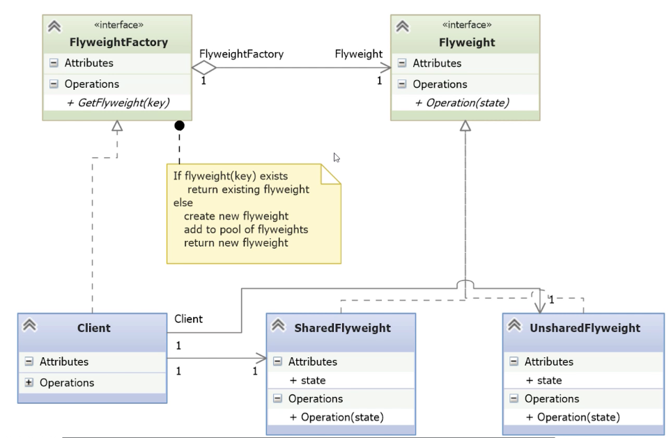

# Flyweight

- [Before Flyweight](#before-flyweight)
- [Understanding the Flyweight Pattern](#understanding-the-flyweight-pattern)
- [Implementing the Flyweight Pattern](#implementing-the-flyweight-pattern)

---

- **Category**: Structural pattern
- **Problem Addressed**:
	- When an application creates **many small objects**, memory usage becomes significant and can **slow down the system**.
- **Typical Use Case**:
	- Situations where large numbers of **similar objects** are needed, and many share **common, immutable data**.
- **Metaphor Used**:
	- Compared to **particle collisions** in the Large Hadron Collider (LHC), where events occur **at massive scale** (e.g. **1 billion/sec**) and generate repetitive structured data (location, time, energy).
	- Tracking each particle collision as an object in Python with traditional OOP can cause **excessive memory usage** due to data duplication.
- **Flyweight Solution**:
- Extract and **share the common state** (intrinsic data) across many objects, while allowing only the unique (extrinsic) data to vary per instance.

## Before Flyweight

- Define an Event class.
- Instantiate one class per collision.
- Keep all Event objects in a list.

*ColliderEvents.py*
```python
import math
import random
import time
import sys

# Naive Event class: each event stores all its state independently
# This design leads to massive memory usage when the number of events is very large
class Event:
    x: int      # x coordinate on the detector
    y: int      # y coordinate on the detector
    t: float    # time of event (in nanoseconds)
    e: float    # energy level measured

    def __init__(self, x, y, t, e):
        self.x = x  # intrinsic state (could be shared)
        self.y = y  # intrinsic state (could be shared)
        self.t = t  # extrinsic state (unique per event)
        self.e = e  # intrinsic state (could be shared)

    def velocity(self):
        # Simplified calculation of particle velocity
        # Note: this ignores relativistic effects; for demonstration only
        # Flyweight note: uses object's full state to compute
        v = 1e9 * math.sqrt(1.2 ** 2 + math.sqrt(self.x ** 2 + self.y ** 2)) / self.t
        return v

def main():
    # Record start time to compute delta t per event
    start = time.time_ns()
    time.sleep(1e-9)  # slight delay to avoid divide-by-zero in velocity()

    event_list = []
    for _ in range(100):
    # Atlas Inner detector: radius of 1.2 meters, and is 6.2 meters in lenght
        # Generate random detector coordinates
        x = math.floor(random.random() * 10)
        y = math.floor(random.random() * 10)
        # Time since start
        t = time.time_ns() - start
        # Random energy level (in Kelvin, for this simulation)
        e = random.random() * 1000
        # Store full object — memory-heavy approach
        event_list.append(Event(x, y, t, e))

	# Examine one object for size estimation
    o = event_list[0]
    o_size = sys.getsizeof(o) + 4*8 + 4*8  # base + 4 attributes (int/float assumed 64-bit)
    print(f"Event object size: {o_size} bytes")
    print(f"Particle velocity: {o.velocity()} meters/second")
 
	# Estimate memory usage for the entire list
    e = event_list
    print(f"Size of list: {sys.getsizeof(e)+ len(e) * o_size} bytes")
 
main()
```

- This naive implementation stores **all state per object**, causing **redundant memory usage**.
- Common or shared properties (like position or energy categories) could be **externalized and reused**.
- This code is a **starting point to refactor** into a Flyweight solution, where:
    - Intrinsic state is shared    
    - Extrinsic state is passed in or stored separately
- The goal: **minimize memory usage** when handling **millions/billions** of similar objects.

```bash
BeforeFlyweight> python .\ColliderEvents.py
Event object size: 112 bytes
Particle velocity: 30690.823086079745 meters/second
Size of list: 12120 bytes
BeforeFlyweight>
```

- Each event consumes 112 bytes, which is the basic size of the object plus four 64-bit pointers to the two 64-bit integers and the two 64-bit double-precision floating-point numbers.
- The entire 100-element list uses 12120 bytes.
	- Python lists are pointers to objects.
	- Imagine billions of events per second, it will add many GB/s.

## Understanding the Flyweight Pattern

- The **Flyweight** pattern is a **structural pattern** that reduces memory usage by sharing data across instances.
- Instead of storing event data in many object instances (as in the naive example), state data is **centralized** in a shared data structure.
- This **minimizes the number of object instances**, sometimes reducing them to a single shared instance.
  
| **Pros**                                                                        | **Cons**                                                                                          |
| ------------------------------------------------------------------------------- | ------------------------------------------------------------------------------------------------- |
| Significantly reduces memory usage by sharing data across instances             | Shared instances lose independence, making them harder to customize per use case                  |
| Avoids storing duplicate state by centralizing it in a shared data structure    | Shared instances typically don’t hold individual state, limiting what each instance can represent |
| Reduces the number of object instantiations, sometimes to just one              | All shared instances also share methods, which may restrict behavioral flexibility                |
| Especially suited for high-volume scenarios like particle collisions at the LHC | Requires structural trade-offs and may complicate logic when needing per-instance variation       |




- **FlyweightFactory**: Creates or returns existing `Flyweight` instances using an application-specific key.
	- It requires just une method, `GetFlyweight()`.
- **Flyweight**: Interface with operations to act on shared state.
	- Declares an interface (`Operation(state)`) that all concrete flyweights must implement.
	- This method receives external state passed by the client.
- **SharedFlyweight**: Common use case where all state is shared.
	- Must implement the `Flyweight` interface.
	- May have oner or more operations that work on the state data.
	- Contains **intrinsic state** (shared across clients).
	- Receives **extrinsic state** from the client as parameters in the operation method.
- **UnsharedFlyweight**: Optional variant that maintains unique state per object.
	- Also implements the `Flyweight` interface.
	- Unlike `SharedFlyweight`, this one keeps **its own full state per instance**.
	- Used when flyweights can’t or shouldn’t be shared.

## Implementing the Flyweight Pattern

*flyweight.py*
```python
import abc
import math
import numpy as np

# Abstract Flyweight defining the common interface.
class AbsFlyweight(abc.ABC):
    @abc.abstractmethod
    def get_velocity(self):
        pass

# Concrete Flyweight implementation: shared object holding all event data.
class SharedEvents(AbsFlyweight):
    def __init__(self, xaxis, yaxis):
        # Creates a 3D NumPy array: [x][y][2] where [2] holds [t, e]
        self._events = np.zeros((xaxis, yaxis, 2), np.double)

    def set_event(self, x, y, t, e):
        # Stores event data at coordinates (x, y)
        self._events[x, y] = t, e

    def get_event(self, x, y):
        # Retrieves event data from (x, y)
        return self._events[x, y]

    def get_velocity(self, x, y):
	    # Implements the required method
        # Calculates particle velocity based on location and time
        # Assumes collision occurred at (x, y) in a cylindrical detector
        t, _ = self._events[x, y]
        v = 10e9 * math.sqrt(1.2 ** 2 + math.sqrt(x ** 2 + y ** 2)) / t
        return v
```

- **AbsFlyweight** is the abstract base defining the get_velocity() interface, which enforces a uniform API.
- **SharedEvents** is the shared flyweight object that:
    - Holds all event data in a single NumPy array, drastically reducing the number of Python objects.
    - We don't need an object for each event.
    - Exposes `set_event()` and `get_event()` methods to interact with internal state using coordinates.
    - Implements the required method `get_velocity()` to calculate particle speed using the same logic as the naive version.
- **Design focus**:
    - Shared memory-efficient structure, avoiding per-event instantiation.
    - All external access is done via array coordinates, not via object references.

*fliweight_factory.py*
```python
from flyweight import SharedEvents  

class FlyweightFactory:
    @staticmethod
    def get_flyweight(xaxis, yaxis):
        return SharedEvents(xaxis, yaxis)
```

- It implements the `get_flyweight(key)` interface, where key in this case is the detector size (xaxis, yaxis).
- Returns a new shared flyweight instance for the given detector dimensions.
	- According to the Flyweight pattern, this method acts as a factory method that controls the creation and reuse of flyweight instances.
- Although minimal here, a full implementation could include **object pooling** to reuse instances.
- Keeps the **creation logic decoupled** from the client using the shared flyweight.

*\_\_main__.py*
```python
import math
import random
import time
import sys

# Import the factory that produces flyweight objects
from flyweight_factory import FlyweightFactory  

def main():
    # Create a shared Flyweight instance for a size 10x10 detector grid (z-axis = 2)
    events = FlyweightFactory.get_flyweight(10, 10)
    # Record the start time
    start = time.time_ns()
    # Optional: manually set an event at position (1,2)
    events.set_event(1, 2, 3, 4)
    # Sleep briefly to avoid division by zero in velocity calculation
    time.sleep(1e-9)

    # Simulate 100 collision events at random positions and levels
    for _ in range(100):
        x = math.floor(random.random() * 10)
        y = math.floor(random.random() * 10)
        t = time.time_ns() - start  # time since start
        e = random.random() * 1000  # random energy level
        events.set_event(x, y, t, e)  # store event in shared structure

    # Retrieve a single event (0,0) for reporting
    o = events.get_event(0, 0)
    print(f'Event object size: {2 * 8} bytes')  # 2 doubles = 16 bytes
    print(f'Particle velocity: {events.get_velocity(1,2)} meters/second')

    # Print total size of the shared array
    e = events._events
    print(f'Size of array: {2 * 8 * 10 * 10} bytes')  # 2 doubles per cell × 10×10 grid

if __name__ == "__main__":
    main()
```

- `FlyweightFactory.get_flyweight(10,10)` creates **a single shared Flyweight object** for all events.
- `set_event()` stores each event’s time and energy in the shared 3D NumPy array at position (x,y).
- This avoids creating individual objects per event, reducing memory footprint drastically.
- The `Flyweight` instance is stateless in terms of identity—it only **encodes intrinsic state** (t, e) based on coordinates.
- `get_event()` and `get_velocity()` retrieve data using coordinates as keys.
- Memory usage is predictable and minimal: 2 floats per (x,y) pair instead of full-blown objects.

```bash
Flyweight> python .\__main__.py
Event object size: 16 bytes
Particle velocity: 6391024937.363151 meters/second
Size of array: 1600 bytes
Flyweight> 
```

- Far less storage is consumed compared to the naive implementation.
- Since `NumPy` is designed for high-performance, this is a much more performant solution.
