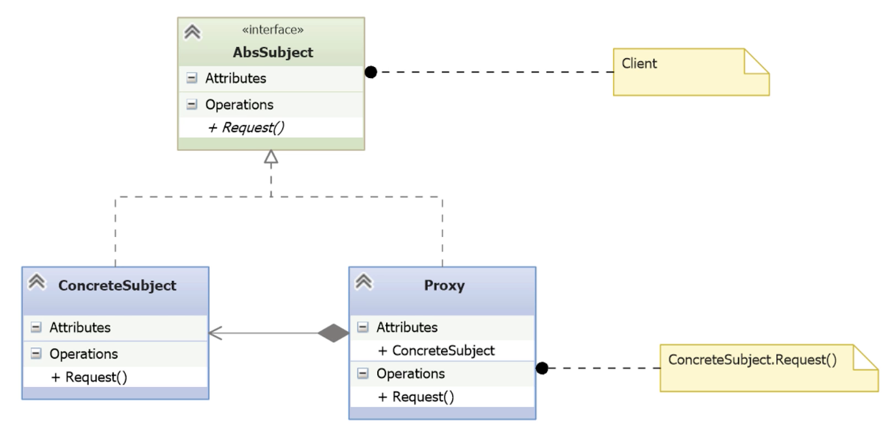
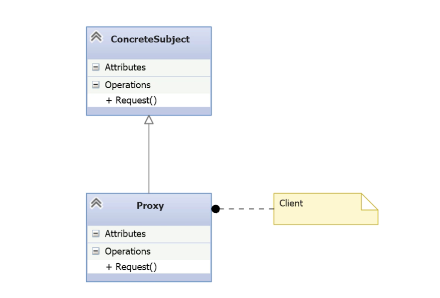

# Proxy

- [Before Proxy](#before-proxy)
- [Understanding the Proxy Pattern](#understanding-the-proxy-pattern)
- [Implementing the Proxy Pattern](#implementing-the-proxy-pattern)
- [Sumary (Proxy)](#sumary-proxy)

---

- **Remote Proxy**:
	- Represents an object in a different address space or server.	
	- Example: A web server accessing a database behind a firewall.	
	- Purpose: Improve **security** and **separation of concerns**.
- **Virtual Proxy**:
	- Delays creation or loading of expensive objects until needed (lazy loading).	
	- Example: Delaying database query results until accessed.	
	- Purpose: Improve **performance** and **efficiency**.
- **Protection Proxy**:
	- Controls access based on user roles, time, or context.	
	- Example: Limiting access to sensitive database records.	
	- Purpose: Provide **authorization** and **privacy control**.	
- **Smart Reference Proxy**:
	- Adds extra behavior when the object is accessed.
	- Example: Reference counting, locking, logging, auditing.	
	- Purpose: Add **auxiliary services** like thread safety or monitoring.
		
- **Common Use Cases**:
    - Databases use all four proxy types:
        - Remote for accessing external servers.
        - Virtual for buffering and lazy loading.
        - Protection for row/column-level security.
        - Smart references for copy-on-write, logging, and performance stats.       
    - Web servers use proxies to delay loading resources (e.g. images).

## Before Proxy

- **Scenario**:
    - An Employee object holds sensitive data like birthdate and salary.
    - Access must be restricted based on a requester’s permissions.
- **Access Control Setup**:
    - A separate AccessControl object defines which employee IDs can view personal information (can_see_personal = True/False).        
    - Both EMPLOYEES and ACCESSCONTROL are implemented as dictionaries (in-memory test data).
- **Naive Client Program**:
    - A function takes a list of employee IDs and a requester ID.
    - It prints basic employee info (ID and name) for all.
    - It conditionally adds sensitive info (birthdate, salary) **only if** the requester has access rights.

*employee.py*
```python
class Employee:
    def __init__(self, empid, name, birthdate, salary):
        self.empid = empid           # Unique employee identifier
        self.name = name             # Employee name (non-sensitive)
        self.birthdate = birthdate   # Sensitive personal data
        self.salary = salary         # Sensitive personal data
```

*access_control.py*
```python
class AccessControl:
    def __init__(self, empid, can_see_personal):
        self.empid = empid                         # ID of the accessor
        self.can_see_personal = can_see_personal   # Boolean flag: True if allowed to view sensitive info
```

*testdata.py*
```python
from employee import Employee
from access_control import AccessControl

EMPLOYEES = {
    1: Employee(1, 'Bob', '4 Jul 1994', 80000.00),
    2: Employee(2, 'Carol', '28 May 1992', 85000.00),
    3: Employee(3, 'Ted', '18 Feb 1988', 55000.00),
    4: Employee(4, 'Alice', '25 Nov 1987', 40000.00),
    101: Employee(101, 'Morgan the Manager', '14 Mar 1975', 100000.00)
}

ACCESSCONTROL = {
    101: AccessControl(101, True)  # Only Morgan is authorized to view personal info
}
```

*\_\_main__.py*
```python
from testdata import EMPLOYEES, ACCESSCONTROL

def get_employee_info(empids, reqid):
    for empid in empids:
        if empid not in EMPLOYEES:
            continue

        e = EMPLOYEES[empid]
        details = f'Employee Id: {e.empid}, Name: {e.name}'  # Public info always shown

        # Naive inline access check – violates separation of concerns
        if reqid in ACCESSCONTROL:
            if ACCESSCONTROL[reqid].can_see_personal:
                details += f', BirthDate: {e.birthdate}, Salary: {e.salary:.2f}'

        print(details)

# Unauthorized requester (ID 3) – cannot see personal info
get_employee_info([3, 4], 3)

# Authorized requester (ID 101) – can see everything
get_employee_info([1, 2, 5], 101)
```

- The function `get_employee_info()`:
    - Receives a list of employee IDs and the requester’s ID.
    - Iterates through the employees and prints:
        - Always: Employee ID and Name (non-sensitive).
        - Conditionally: BirthDate and Salary **only if**:
            - The requester exists in `ACCESSCONTROL`, and
            - `can_see_personal` is `True`.   
- Example behavior:
    - Requester 3 has no special rights → only basic info shown.
    - Requester 101 is authorized → sees all fields.

```bash
BeforeProxy> python .\__main__.py
Employee Id: 3, Name: Ted
Employee Id: 4, Name: Alice
Employee Id: 1, Name: Bob, BirthDate: 4 Jul 1994, Salary: 80000.00
Employee Id: 2, Name: Carol, BirthDate: 28 May 1992, Salary: 85000.00
BeforeProxy>
```

 **Issues with the Naive Implementation**
 
- **Violation of Separation of Concerns**: The main program (`get_employee_info`) mixes data retrieval, formatting, and **access control logic** in a single place.
- **Tight Coupling**: The client code directly accesses both EMPLOYEES and ACCESSCONTROL and needs to know **how to check permissions**.
- **Poor Scalability**: If new sensitive attributes are added (e.g. address, phone), the access logic must be updated **manually in every place** it’s used.
- **Duplication of Logic**: Any function that needs to show employee info must duplicate the access check logic.
- **Hard to Maintain**: Changing security rules (e.g. new roles, time-based access) would require editing logic scattered throughout the application.
- **Inflexible Design**: The Employee class itself has **no control over how its data is accessed**, which violates encapsulation.
- **Error-Prone**: Developers might accidentally **bypass** the access check and expose sensitive data.

## Understanding the Proxy Pattern

- **Classification**:
    - The Proxy pattern is a **structural pattern**.
- **Core Idea**:
    - A **proxy** holds a reference to a **real subject** (e.g. Employee) and controls access to it.
    - The proxy **exposes the same interface** as the subject, so the client is unaware it’s using a proxy.
- **Design Benefits**:
    - Enables access control, lazy loading, logging, caching, etc.
    - Example of **composition**, not inheritance.

**Classic Proxy**



- **Abstract Subject**
	- Defines the interface shared by both the Proxy and the RealSubject.
	- Represents the object that needs to be controlled in some way.
	- The `Request()` operation is whatever operation the client needs to gain access.
- **RealSubject (ConcreteSubject)**
	- The actual object the client wants to interact with (e.g. an `Employee` object).
- **Proxy**
    - Implements `AbstractSubject`, holds a reference to `ConcreteSubject`, and controls access.
    - Can **deny, defer, or modify** the request.
- **Client**
    - Talks to `AbstractSubject` and does not know if it’s using a proxy or the real object.

**Simplified Proxy (Not Recommended)**



- **Proxy via Inheritance**
    - The proxy directly **inherits from the real subject** instead of using composition.
    - Simpler but **breaks encapsulation** and should only be used in **limited and controlled** contexts.

## Implementing the Proxy Pattern

- Create:
	- Subject Abstract Base Class.
		- The `Request()` method will be the `get_employee()` method.
	- Concrete subject.
		- The employees collection itself that implements the abstract base class, and retrieves the data.
	- Proxy Subject for the employees collection.
		- Composed with a concrete subject to add the protection part.
	- Use a Factory to get the proxy.
		- In the main program, a factory will provide a reference to the object to use.

*abs_employee.py*
```python
import abc

class AbsEmployees(abc.ABC):
    @abc.abstractmethod
    def get_employee_info(self, empids):
        pass
```

- Defines the **common interface** for both the real subject and the proxy.
- Declares the abstract method `get_employee_info(empids)` as the operation to be controlled.
- Allows the **client to remain unaware** of whether it is using the real object or a proxy.

*employees.py*
```python
from abs_employees import AbsEmployees
from testdata import EMPLOYEES

class Employees(AbsEmployees):
    def get_employee_info(self, empids):
        return (EMPLOYEES[empid]         # Yield Employee objects one by one
                for empid in empids
                if empid in EMPLOYEES)   # Filter out invalid IDs
```

- Implements the abstract method from `AbsEmployees`.
- Acts as the **real subject** in the Proxy Pattern.
- Provides **raw access to data** without any protection or filtering.
- Returns a **generator** of employee objects for memory-efficient iteration.
- Does not include any access control logic — **delegates responsibility** to the proxy layer.
- Acts as a **composition target** for the proxy (`EmployeesProxy`).

*proxy.py*
```python
from abs_employees import AbsEmployees
from access_controls import AccessControls
from employee import Employee

class Proxy(AbsEmployees):
    def __init__(self, employees, reqid):
        self._employees = employees  # Composition: reference to real subject
        self._reqid = reqid          # ID of the requester (for access control)

    def get_employee_info(self, empids):
        reqid = self._reqid
        acc = AccessControls.get_access_control()  # Retrieve access permissions

        for e in self._employees.get_employee_info(empids):  # Delegate to real subject
            if e.empid == reqid or \
               (reqid in acc and acc[reqid].can_see_personal):
                # Authorized: show full info
                yield Employee(e.empid, e.name,
                               f'{e.salary:.2f}',
                               e.birthdate)
            else:
                # Unauthorized: mask sensitive fields
                yield Employee(e.empid, e.name, '*****', '*****')
```

- Implements the same interface (`AbsEmployees`) as the real subject.
- **Uses composition**: holds a reference to an `Employees` instance (self._employees).
- Also stores the requester ID for later access validation.
- Delegates actual data fetching to the real subject, maintaining **separation of concerns**.
- Implements **authorization logic**:
    - Requesters can always see **their own data**.
    - If the requester is authorized in the access control list, they can see all employees’ personal data.
    - Otherwise, **sensitive fields (salary, birthdate) are masked**.
- Returns a generator of filtered Employee objects based on access rights.
- Achieves **transparent access control** for the client while maintaining a clean interface.

*factory.py*
```python
from employees import Employees
from proxy import Proxy

def get_employees_collection(reqid):
    return Proxy(Employees(), reqid)  # Returns a proxy composed with the real subject
```

- **Encapsulates object creation**: The client doesn’t know it’s receiving a proxy.
- Returns an object that implements the `AbsEmployees` interface — could be a Proxy or a real Employees object.
- Enables **transparent substitution** of real object or proxy at runtime.
- Follows the **Factory design pattern**, promoting loose coupling and flexibility.
- Aligns with the **Dependency Inversion Principle**: high-level code (client) depends on abstractions, not concrete classes.
- Helps keep the main program clean, reusable, and independent of security logic.
    
*\_\_main__.py*
```python
from factory import get_employees_collection

def print_employee_details(empids, reqid):
    employees = get_employees_collection(reqid)  # Factory returns Proxy (implements AbsEmployees)

    for e in employees.get_employee_info(empids):  # Calls method defined in the abstract interface
        print (
            f'Employee Id: {e.empid}, ' +
            f'Name: {e.name}, ' +
            f'Birthdate: {e.birthdate}, ' +
            f'Salary: {e.salary}'
        )

print("Requestor authorized to see everything:")
print_employee_details([1, 2], 101)  # Authorized manager

print("Requestor is an ordinary employee.")
print_employee_details([1, 2, 3, 4], 3)  # Unauthorized requester
```

- Uses the **factory** to obtain a reference to an object that implements `AbsEmployees` — either real or proxy.
- The client (print_employee_details) only uses the **abstract interface**, without knowing if it talks to the real subject or a proxy.
- This allows **authorization logic to be hidden** inside the proxy, keeping the client clean and focused only on presentation.
- Two test cases:
    - Requester 101 (authorized) sees **full details** for others.
    - Requester 3 (ordinary employee) sees **masked sensitive info**, except for their own.

```bash
Proxy> python .\__main__.py
Requestor authorized to see everything:
Employee Id: 1, Name: Bob, Birthdate: 80000.00,Salary: 4 Jul 1994
Employee Id: 2, Name: Carol, Birthdate: 85000.00,Salary: 28 May 1992
Requestor is an ordinary employee.
Employee Id: 1, Name: Bob, Birthdate: *****,Salary: *****
Employee Id: 2, Name: Carol, Birthdate: *****,Salary: *****
Employee Id: 3, Name: Ted, Birthdate: 55000.00,Salary: 18 Feb 1988
Employee Id: 4, Name: Alice, Birthdate: *****,Salary: *****
Proxy>
```

## Sumary (Proxy)

**Consequences of Using the Proxy Pattern**

- **Adds a layer of indirection**
    - Client code is unaware of whether it’s interacting with a proxy or the real subject.
    - Demonstrated in the protection proxy example.    
- **Supports lazy instantiation and caching** (_Virtual Proxy_)
    - Example: functools.lru_cache in Python acts as a virtual proxy.
- **Can abstract remote communication** (_Remote Proxy_)
    - Example: pyodbc accesses local or remote databases transparently.
- **Enables extra behavior like locking or auditing** (_Smart Proxy_)
    - Useful for multithreaded scenarios or resource management.
- **Preserves the Open/Closed Principle**
    - New behavior is added via proxy without modifying existing classes.
- **Favors composition over inheritance**
    - Keeps class hierarchies **shallow and maintainable**.
- **Proxies can be combined**
    - Multiple proxies can operate together, unaware of each other.
        
 **When to Use the Proxy Pattern**

- When you need to **control or extend access** to another object.   
- When you want to respect the **Open/Closed Principle**.
- When you want to add logic like **authorization, logging, caching, remote access**, etc.
- When the client code **should remain unaware** of such logic.
