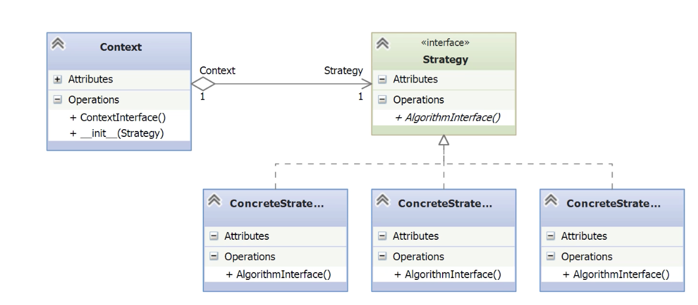

# Strategy

- [Before Strategy](#before-strategy)
- [Understanding the Strategy Pattern](#understanding-the-strategy-pattern)
- [Implementing the Strategy Pattern](#implementing-the-strategy-pattern)
- [Strategic Advantages](#strategic-advantages)
- [Working on Useful Variations](#working-on-useful-variations)

---

- The **Strategy Pattern** is a **behavioral design pattern** used to control the operation of a system.
- It provides a way to define a **family of algorithms**, encapsulate each one, and make them **interchangeable**.
- All algorithms in the family typically **share the same inputs and outputs**, often using a common object as input.
- The pattern allows each algorithm to **vary independently** from the others.
- Real-world analogy: comparing Newtonian gravity vs. Einstein’s relativity—different implementations, same result format.
- The Strategy Pattern is sometimes referred to as the **Policy Pattern**, especially when used to apply policies to software behavior.
- It’s one of the **most widely used patterns** due to its flexibility and clean separation of concerns.

## Before Strategy

- The naive solution calculates **shipping costs** for three hardcoded shippers: **FedEx**, **UPS**, and **PostalService**.
- Must be extendable (add new shippers).

*\_\_main__.py*
```python
from before_strategy import Order, Shipper, ShippingCost

# Test Federal Express shipping

order = Order(Shipper.FEDEX)
cost_calculator = ShippingCost()
cost = cost_calculator.shipping_cost(order)        
assert cost == 3.0                                

# Test UPS shipping
order = Order(Shipper.UPS)
cost_calculator = ShippingCost()
cost = cost_calculator.shipping_cost(order)
assert cost == 4.0

# Test Postal Service shipping
order = Order(Shipper.POSTAL)
cost_calculator = ShippingCost()
cost = cost_calculator.shipping_cost(order)
assert cost == 5.0

print('Tests passed')                          
```

- There are three sections, one for each shipping method.
- In each section, we instantiate an `Order` object, specifying a shipping method.
- Then we instantiate a `ShippingCost` object, which will do the actual calculation.
- It compute the costs and check.
- Violets **D** in **SOLID**: It depends on a concrete implementation (`ShippingCost`) instead of an abstraction.

*before_strategy/order.py*
```python
class Order(object):
    def __init__(self, shipper):
	    # Shipping method is stored directly in the order (tight coupling)
        self._shipper = shipper  

    @property
    def shipper(self):
        return self._shipper     
```

- The `Order` class holds a direct reference to the shipper.
	- Violates the S in SOLID

*before_strategy/shipper.py*
```python
from enum import Enum

class Shipper(Enum):
    FEDEX = 1
    UPS = 2
    POSTAL = 3
```

 - Defines an enumeration of shipping providers.
- Used as a switch value for branching logic inside ShippingCost.
- **Problem**: As new shippers are added, **everywhere that uses this enum must be updated**, violating the **Open/Closed Principle**.    
- The enum serves as a **dispatch key**, which will later be replaced by polymorphism in the Strategy Pattern.

*before_strategy/shipping_cost.py*
```python
from before_strategy import Shipper

class ShippingCost(object):
    def shipping_cost(self, order):
        # This conditional dispatch breaks the Open/Closed Principle.
        # Adding a new shipper requires modifying this method.
        if order.shipper == Shipper.FEDEX:
            return self._fedex_cost(order)
        elif order.shipper == Shipper.UPS:
            return self._ups_cost(order)
        elif order.shipper == Shipper.POSTAL:
            return self._postal_cost(order)
        else:
            raise ValueError(f'Invalid shipper {order.shipper}')

    # Hardcoded implementations for each shipper
    def _fedex_cost(self, order):
        return 3.00

    def _ups_cost(self, order):
        return 4.00

    def _postal_cost(self, order):
        return 5.00
```

- It uses a default constructor and then defines a `shipping_cost()` method to do the work according to the shippers stored in the order.
- For each shipper the cost calculator calls a helper method to get the actual cost (hardcoded).
- **Violation of Open/Closed Principle**: Every time a new shipper is introduced, the `shipping_cost()` method must be modified and a new helper method is required.
- **Tight Coupling**: Logic for determining cost is tightly coupled to the ShippingCost class instead of being delegated to independent strategies.
- **Long conditional logic**: The chain of if/elif/else is a strong signal that Strategy Pattern could help.
- **No abstraction**: The behavior (shipping cost calculation) is not abstracted — it’s hardcoded per shipper.

## Understanding the Strategy Pattern

**Problems with the Initial (Naive) Implementation**

- **Violates Single Responsibility Principle (SRP):** `Order` takes responsibility for choosing a shipper, which isn’t its concern.
- **Violates Open/Closed Principle (OCP):** `ShippingCost` must be modified to support a new shipper.
- **Violates Dependency Inversion Principle (DIP):** `main()` depends on the concrete class `ShippingCost` instead of an abstraction.
- **Long if/elif/else chains:** Fragile and hard to maintain when adding new logic.
    
**Strategy Pattern Solution**

- **Encapsulates each algorithm in its own class** (Concrete Strategies).
- **Abstract base class** (Strategy Interface) unifies the method signature for all strategies.
- **The context (ShippingCost) delegates to the strategy**, decoupling logic from decision.
- **New algorithms (shippers) can be added** without modifying existing code.
- Clean separation of responsibilities and better adherence to SOLID principles.



- **Context**
    - Within some context, we have an interface, which will be an abstract base class in Python, that is common to all the supported algorithms.
- **Strategy (Interface)**
    - Defines the common interface for all supported algorithms.
    - Declares the method `AlgorithmInterface()`, which all concrete strategies must implement.
    - The context uses this interface to call the various algorithms defined by the Concrete Strategies.
- **ConcreteStrategy**
    - Implements the Strategy interface.
    - Each concrete class defines a different algorithm using the same input/output signature.

## Implementing the Strategy Pattern

- Fix the problems discovered:
	- Remove the shipping concerns from orders.
	- Separate the algorithms into their own classes.
	- Keep the classes closed.
	- Allow for extension.
	- Program to an interface (Python ABC).
    
*strategy/shipping_cost.py*
```python
class ShippingCost(object):
    def __init__(self, strategy):
        # Store a reference to the strategy object (must implement calculate(order))
        self._strategy = strategy

    def shipping_cost(self, order):
        # Delegate the algorithm to the injected strategy
        return self._strategy.calculate(order)
```

- **ShippingCost** is the **Context** that delegates the algorithm execution.
- It accepts a **Strategy object** at runtime (composition over inheritance).
- The context is **decoupled from concrete implementations** and uses the common `calculate()` interface.

*strategy/strategy_abc.py*
```python
import abc

# Abstract base class defining the Strategy interface
class AbsStrategy(abc.ABC):

	# Concrete strategies must implement this
    @abc.abstractmethod
    def calculate(self, order):
        """ Calculate shipping cost """
        pass  
```

- **AbsStrategy** defines the **common interface** all concrete strategies must implement.
- The `calculate(order)` method ensures **consistency across all algorithms**.

*strategy/fedex_strategy.py*
```python
from strategy.strategy_abc import AbsStrategy

class FedExStrategy(AbsStrategy):
    def calculate(self, order):
        return 3.00  # Fixed cost for FedEx
```

*strategy/postal_strategy.py*
```python
from strategy.strategy_abc import AbsStrategy

class PostalStrategy(AbsStrategy):
    def calculate(self, order):
        return 5.00  # Fixed cost for Postal service
```

*strategy/ups_strategy.py*
```python
from strategy.strategy_abc import AbsStrategy

class UPSStrategy(AbsStrategy):
    def calculate(self, order):
        return 4.00  # Fixed cost for UPS
```

- Each concrete class implements the `calculate()` method declared in the abstract base class `AbsStrategy`.
- They all share the same method signature but provide different behaviors, encapsulating the logic for each shipping method.
- This design allows us to **swap strategies at runtime** without modifying the context (ShippingCost) or the client code.
- New strategies can be added by simply creating a new class that inherits from AbsStrategy, **respecting the Open/Closed Principle**.
- These classes are completely decoupled from the context and from each other, encouraging **code reusability and maintainability**.

*\_\_main__.py*
```python
from strategy import Order, ShippingCost
from strategy import FedExStrategy, PostalStrategy, UPSStrategy

# --- Test Federal Express shipping ---
order = Order()                           # Order is now decoupled from shipping details
strategy = FedExStrategy()               # Choose a concrete strategy at runtime
cost_calculator = ShippingCost(strategy) # Context receives strategy as dependency (DI)
cost = cost_calculator.shipping_cost(order)  # Delegates behavior to strategy object
assert cost == 3.0                        # Test correctness

# --- Test UPS shipping ---
order = Order()
strategy = UPSStrategy()
cost_calculator = ShippingCost(strategy)
cost = cost_calculator.shipping_cost(order)
assert cost == 4.0

# --- Test Postal Service shipping ---
order = Order()
strategy = PostalStrategy()
cost_calculator = ShippingCost(strategy)
cost = cost_calculator.shipping_cost(order)
assert cost == 5.0

print('Tests passed')
```

- **Client** creates the Order and selects the appropriate ConcreteStrategy (FedExStrategy, UPSStrategy, etc.).
- **Strategy** is injected into the ShippingCost context object at runtime — this supports **runtime polymorphism**.
- The context (`ShippingCost`) delegates the calculation responsibility to the strategy via a common interface (`AbsStrategy`).
- **Order** is no longer coupled to shipping logic, satisfying **Single Responsibility Principle**.
- Adding a new strategy (e.g., DroneStrategy) only requires a new class — no changes to ShippingCost, complying with **Open/Closed Principle**.
- The context uses the abstract interface (AbsStrategy) instead of a concrete class, satisfying **Dependency Inversion Principle**.

## Strategic Advantages

- **No more SOLID violations**:
    - Single Responsibility: shipping logic is no longer in the Order class. 
    - Open/Closed: new algorithms can be added without modifying existing logic.
    - Dependency Inversion: the context now depends on an abstraction, not specific implementations.    
- **Improved testability**:
    - Each strategy is isolated and easily testable in unit tests.
    - Mock strategies can be injected for deterministic testing.
- **Improved flexibility**:
    - Algorithms are interchangeable at runtime without modifying client or context code.
- **Cleaner code**:
    - Eliminates brittle if/elif/else chains—common indicator that Strategy may be a better solution.
- **Extensibility preserved**:
    - Adding a new shipping method is just adding a new strategy class.
- **Remaining improvement**
    - There’s still a direct dependency on the Order object—could be further decoupled using the Factory pattern.

## Working on Useful Variations

- There are two variations:
	- Strategies as functions.
	- Strategies as lambdas.
 
*strategy_variation/shipping_cost.py*
```python
class ShippingCost(object):
    def __init__(self, strategy):
        # In this case it expects a callable function instead of an object
        self._strategy = strategy

    def shipping_cost(self, order):
        #return self._strategy(order)
        return self._strategy.calculate(order)
```

- In the main function, lambdas will replace the strategy objects

*\_\_main__.py*
```python
from strategy_variation import Order, ShippingCost

# A named function used as a strategy
# Simulates FedEx shipping cost
def fedex_strategy(order):
	return 3.0

# A lambda function used as a strategy (UPS)
# Not ideal for complex logic, but valid in Python
ups_strategy = lambda order: 4.0

order = Order()                           

# --- Test Federal Express shipping ---
# Using the named function as a strategy
strategy = fedex_strategy             
cost_calculator = ShippingCost(strategy) 
cost = cost_calculator.shipping_cost(order)
assert cost == 3.0                        

# --- Test UPS shipping ---
# Using the lambda strategy assigned to a variable
cost_calculator = ShippingCost(ups_strategy)
cost = cost_calculator.shipping_cost(order)
assert cost == 4.0

# --- Test Postal Service shipping ---
# Using an inline lambda directly in the constructor
cost_calculator = ShippingCost(labda order: 5.0)
cost = cost_calculator.shipping_cost(order)
assert cost == 5.0

print('Tests passed')
```

