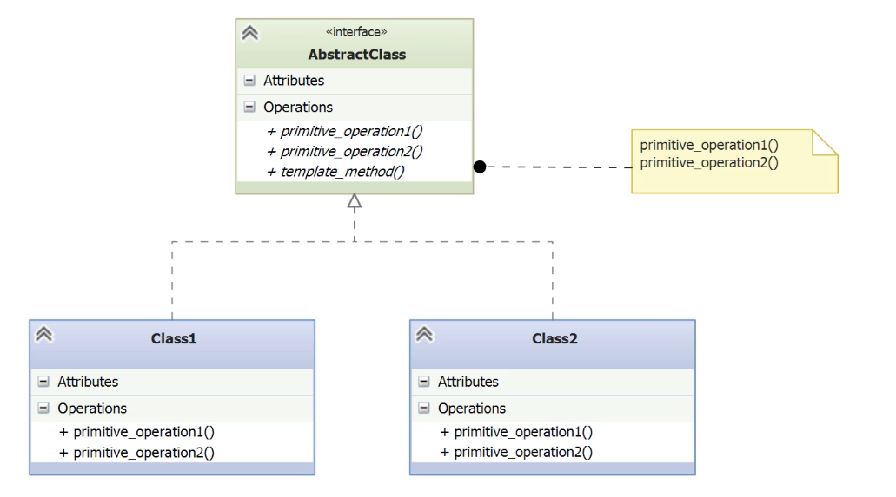

# Template

- [Before Template](#before-template)
- [Understanding the Template Pattern](#understanding-the-template-pattern)
- [Implementing the Template Pattern](#implementing-the-template-pattern)
- [Exploring the Consequences of Template](#exploring-the-consequences-of-template)

---

- The Template pattern is used when multiple classes share a common **algorithm structure**, but differ in some specific steps.
- It is ideal for situations like **baking a cake vs making bread**: similar high-level steps but differing details.
- The example chosen in the lesson involves **traveling to a destination** (e.g., New York or Amsterdam).
	- Both **buses and airplanes** achieve the same goal—transport from point A to point B—but follow **different processes**.
- The problem: avoid duplicating the structure of similar workflows across classes that only vary in a few steps.
- The Template pattern solves this by:
    - Defining the **skeleton of the algorithm** in a base class.
    - Allowing **subclasses** to override certain steps **without changing the overall structure**.

## Before Template

- Implement two models of travel.
	- Bus.
	- Airplane.

*bus.py*
```python
class Bus(object):
    # Constructor saves the destination for the trip
    def __init__(self, destination):
        self._destination = destination

    # High-level method that defines the full bus trip workflow
    def bus_trip(self):
        self.start_diesel()                   # Step 1: start engine
        self.leave_terminal()                # Step 2: leave terminal
        self.drive_to_destination()         # Step 3: travel
        self.arrive_at_destination()        # Step 4: arrival

    # Concrete implementation of starting the bus engine
    def start_diesel(self):
        print('Starting the Cummins diesel engine')

    # Concrete implementation of leaving the terminal
    def leave_terminal(self):
        print('Leaving terminal')

    # Concrete implementation of the travel step
    def drive_to_destination(self):
        print('Driving...')

    # Concrete implementation of the arrival step
    def arrive_at_destination(self):
        print('Arriving at ' + self._destination)
```

- This class defines a **fixed sequence of steps** in `bus_trip()` that form a full trip.
- The logic is **procedural** and not reusable across other transport modes like airplanes.
- Each method performs a specific part of the trip, but **the structure of the workflow is rigidly tied to the Bus class**.
- Any new transport method (e.g., Airplane) would have to duplicate most of the logic with minor variations.

*airplane.py*
```python
class Airplane(object):
    # Constructor sets the destination
    def __init__(self, destination):
        self._destination = destination

    # High-level method that defines the airplane trip workflow
    def plane_trip(self):
        self.start_gas_turbines()           # Step 1: start engines
        self.leave_terminal()               # Step 2: taxi and take off
        self.fly_to_destination()           # Step 3: fly
        self.land_at_destination()          # Step 4: land

    # Concrete implementation for airplane engine startup
    def start_gas_turbines(self):
        print('Starting the Rolls-Royce gas-turbine engines')

    # Concrete implementation for leaving the terminal
    def leave_terminal(self):
        print('Taxiing to the runway')
        print('Taking off')

    # Travel method (in the air)
    def fly_to_destination(self):
        print('Flying...')

    # Arrival step
    def land_at_destination(self):
        print('Landing at ' + self._destination)
```

- The `Airplane` class looks similar, but with different engines and methods to leave the terminal, etc.

*\_\_main__.py*
```python
from bus import Bus
from airplane import Airplane

# Main function that executes two separate trip routines
def main():
    takebus('New York')        # Take the bus to New York
    takeplane('Amsterdam')     # Take the plane to Amsterdam

# Routine for bus trips
def takebus(destination):
    print(f'\nTaking the bus to {destination} =====>')
    bus = Bus(destination)
    bus.bus_trip()             # Call the complete trip sequence for the bus

# Routine for airplane trips
def takeplane(destination):
    print(f'\nFlying to {destination} =====>')
    plane = Airplane(destination)
    plane.plane_trip()         # Call the complete trip sequence for the airplane

# Standard Python entry point
if __name__ == '__main__':
    main()
```

- The `__main__` program tests these classes.
- Both functions **instantiate a vehicle** (bus or plane), then call a method that **encapsulates the entire trip algorithm** (`bus_trip()` or `plane_trip()`).
- This code shows **duplicate control logic**: the steps are logically the same, but implemented separately for each vehicle
- This violates the **DRY** principle.

## Understanding the Template Pattern

- The Template pattern is a **behavioral design pattern**.
- It **defines the skeleton of an algorithm** in a base class.
	1. **Abstract methods**: Must be implemented by all subclasses.
    2. **Concrete methods**: Provide default behavior; subclasses may override them.
    3. **Hooks**: Optional methods that do nothing by default but **can be overridden** to inject behavior at specific points.
- The **template method** defines the **fixed sequence of steps** (like a recipe).
	- Example from earlier: `bus_trip()` and `plane_trip()` were both implicit template methods.
- The algorithm’s **invariant parts remain unchanged**, only the variable parts differ per subclass.
- This pattern **enforces DRY (Don’t Repeat Yourself)** by extracting shared logic.




- **AbstractClass** defines the **template method**, which sets the **fixed order of operations** in the algorithm.
    - `template_method()`: the **main algorithm skeleton**.
    - `primitive_operationX()`: **steps** to be implemented or optionally overridden.
	- **Primitive operations** can be:
        - **Abstract** – must be implemented by subclasses.  
	    - **Concrete** – have a default behavior but can be overridden.
	    - **Hooks** – empty methods subclasses may override if needed.
- **Concrete subclasses** (e.g., `Class1`, `Class2`) inherit from `AbstractClass`:
    - They **must implement** the abstract methods.
    - They **may override** concrete or hook methods, but it’s **not mandatory**.
- The **core structure of the algorithm remains unchanged**, promoting reuse and consistency.

## Implementing the Template Pattern

*abs_transport.py*
```python
import abc

# Abstract base class using the Template pattern
class AbsTransport(abc.ABC):
    
    def __init__(self, destination):
        self._destination = destination

    # Template Method: defines the fixed sequence of steps for a trip
    def take_trip(self):
        self.start_engine()              # Abstract method: must be implemented
        self.leave_terminal()           # Concrete method: can be overridden
        self.entertainment()            # Hook method: optional override
        self.travel_to_destination()    # Abstract method: must be implemented
        self.arrive_at_destination()    # Concrete method: can be overridden

    @abc.abstractmethod
    def start_engine(self):
        pass  # Abstract: subclasses must implement their own engine startup

    def leave_terminal(self):
        print('Leaving terminal')  # Default implementation, can be overridden

    @abc.abstractmethod
    def travel_to_destination(self):
        print('Travelling...')  # Will usually be overridden

    def entertainment(self):
        pass  # Hook method: does nothing by default

    def arrive_at_destination(self):
        print('Arriving at ' + self._destination)  # Default implementation
```

- `AbsTransport` defines a **common structure** for all travel operations.
- `take_trip()` is the **template method** — it dictates the **fixed sequence** of steps.`
- `start_engine()` and `travel_to_destination()` are **abstract methods** — must be implemented by concrete subclasses.
- `leave_terminal()` and `arrive_at_destination()` are **concrete methods** — provide defaults that can be overridden.
- `entertainment()` is a **hook method** — does nothing by default, can be customized optionally.
- This design supports **code reuse**, **flexibility**, and enforces a **uniform structure** across different transport types.

*airplane.py*
```python
from abs_transport import AbsTransport

# Concrete subclass implementing the abstract base class AbsTransport
class Airplane(AbsTransport):

    # Implements abstract method: defines how an airplane starts its engine
    def start_engine(self):
        print('Starting the Rolls-Royce gas-turbine engines')

    # Overrides the default terminal behavior to reflect airplane-specific steps
    def leave_terminal(self):
        print('Leaving terminal')
        print('Taxiing to runway')

    # Implements abstract method: defines travel behavior for an airplane
    def travel_to_destination(self):
        print('Flying...')

    # Overrides the hook method to provide in-flight entertainment
    def entertainment(self):
        print('Playing in-flight movie')

    # Overrides the default arrival method to specify landing behavior
    def arrive_at_destination(self):
        print(f'Landing at {self._destination}')
```

- Airplane **inherits from `AbsTransport`** and completes the template with specific implementations.
- It **implements** the required abstract methods: `start_engine()` and `travel_to_destination()`.
- It **overrides** optional steps:
    - `leave_terminal()` includes taxiing to the runway.
    - `entertainment()` adds in-flight movies.
    - `arrive_at_destination()` specifies airplane landing.
- The class **follows the template method** defined in `take_trip()` while customizing behavior where needed
- This demonstrates the **flexibility and reuse** provided by the Template pattern.

*bus.py*
```python
from abs_transport import AbsTransport

# Concrete subclass that implements the required steps from AbsTransport
class Bus(AbsTransport):

    # Implements the abstract method: bus starts with a diesel engine
    def start_engine(self):
        print('Starting the Cummins diesel engine')

    # Implements the abstract method: defines travel behavior for a bus
    def travel_to_destination(self):
        print('Driving...')
```

- Bus inherits from `AbsTransport` and **implements the two required abstract methods**: `start_engine()` and `travel_to_destination()`.
- It **does not override** any of the concrete or hook methods, meaning:
    - It uses the default `leave_terminal()` implementation ('Leaving terminal').
    - It skips entertainment (the hook method).
    - It uses the default arrival logic.
- This minimal implementation **reduces duplication** by relying on the base class defaults.
- The Template pattern ensures that the **trip sequence is preserved** while allowing Bus to focus only on what’s unique to its process.

*\_\_main__.py*
```python
from bus import Bus
from airplane import Airplane

def main():
    # Launches two trips with different transport modes
    travel('New York', Bus)
    travel('Amsterdam', Airplane)

def travel(destination, transport):
    # Prints which transport is being used for which destination
    print(f'\nTaking the {transport.__name__} to {destination} =====>')

    # Dynamically creates an instance of the transport class
    means = transport(destination)

    # Executes the trip using the shared template method
    means.take_trip()

# Standard Python entry point
if __name__ == '__main__':
    main()
```

- This `main.py` script **uses polymorphism** to abstract away the transport type.
- Both `Bus`and `Airplane` are passed as class references, and the `travel()` function instantiates them dynamically.
- The function **relies only on the interface defined by AbsTransport** and the `take_trip()` method (the template method).
- This design **removes duplication** (no separate `takebus()` or `takeplane()` functions needed).
- It showcases **decoupling**: `travel()` works with any class of `AbsTransport` without modification.
- The pattern enforces a **consistent algorithm structure** while allowing flexibility in specific steps.

## Exploring the Consequences of Template

- **Reduces code duplication** by placing invariant logic in a shared abstract base class.
- **Template method defines the skeleton** of the algorithm and enforces the step order.
- **Subclass methods are called at runtime**, even if the method is defined in the parent — known as the “Hollywood Principle”: _“Don’t call us, we’ll call you.”_
- **Hook methods** allow optional extension points for subclasses without requiring implementation.    
- Supports a **mix of method types**: abstract (must implement), concrete (default behavior), and hooks (optional).
- Encourages **code reuse and flexibility** in algorithm implementation.
- **Strategy pattern** can be used when more flexibility is needed — to replace parts or all of the algorithm dynamically.
- Can **leverage Factory methods** internally to delegate creation steps.    
- It’s a **foundational OOP pattern** — often used implicitly in abstract classes and frameworks.