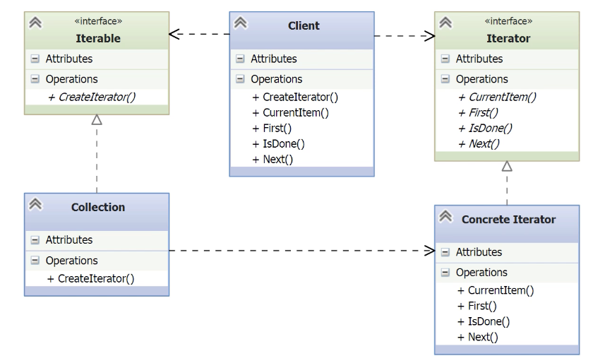

# Iterator

- [Before Iterator](#before-iterator)
- [Understanding the Iterator Pattern](#understanding-the-iterator-pattern)
	- [Python Support for Iteration](#python-support-for-iteration)
- [Implementing the Iterator Pattern](#implementing-the-iterator-pattern)
- [Using Generators as Iterators](#using-generators-as-iterators)
- [Exploring the Consequences of Iterator](#exploring-the-consequences-of-iterator)

---

- Modern applications deal with collections of data — sometimes millions or even billions of items. These collections must be accessed **one item at a time**, a process called **iteration**.
- However, without a standard pattern, developers often create **inconsistent ways** to iterate through collections. This lack of conformity makes code **harder to understand, maintain, and reuse**.
- The **Iterator pattern** solves this by providing a **consistent interface** to traverse elements of a collection **without exposing its internal structure**. It ensures that client code can iterate in a uniform way, regardless of how the collection is implemented internally.

## Before Iterator

- Two custom collections are introduced: one for employees and one for departments. Each hides its internal structure (dictionary or list), following good OOP practice. However:
	- Each collection exposes **custom iteration logic** using ad-hoc get_* methods.
	- Clients must **know the internal implementation** to loop over items.
    - Collections return different data structures (e.g., dictionaries vs. tuples).
    - Writing a **generic function** (like print_summary) becomes difficult or impossible due to these inconsistencies. 
- This leads to non-Pythonic, non-polymorphic, and hard-to-maintain code.
- The **Iterator Pattern** solves this by defining a **common interface** for sequential access to elements in a collection, enabling clients to iterate without knowing how the collection is built or accessed internally.

*employee.py*
```python
from dataclasses import dataclass
from datetime import datetime

@dataclass
class Employee(object):
    empid: int
    name: str
    hiredate: datetime
```

- Basic class to define the `Employee` data model.

*employe_collection.py*
```python
class Employees(object):
    _employees = {}
    _headcount = 0

    def add_employee(self, employee):
        self._headcount += 1
        self._employees[self._headcount] = employee

    def get_employee(self, i):
        return self._employees[i]

    @property
    def headcount(self):
        return self._headcount
```

- `Employees` is a collection to hold `Employee` elements.
- The collection is maintained with a `dict`, with the key being the order.
- Clients must use `get_employee()` with explicit indexing.
	- **No iterator support yet** — accessing elements one by one requires knowledge of the internal API.

*\_\_main1__.py*
```python
from testdata import employees

def main():
    print("Employees:")

    # Manual iteration using headcount and get_employee
    for i in range(1, employees.headcount + 1):
        e = employees.get_employee(i)
        print(f'Employee Id: {e.empid}; Name: {e.name}; Date of Hire: {e.hiredate}')

if __name__ == '__main__':
    main()
```

- Main program for testing.
- The collection interface is not iterable — **requires manual loop logic**.

*testdata.py*
```python
from datetime import datetime
from employee import Employee
from employee_collection import Employees
from department import Department
from department_collection import Departments

TESTEMPLOYEES = (
    (1, 'Douglas Adams', datetime(1942, 7, 6)),
    (2, 'Sherlock Holmes', datetime(1887, 3, 15)),
    (3, 'Albert Einstein', datetime(1915, 11, 25)),
    (4, 'Sir John A Macdonald', datetime(1867, 8, 1)),
    (5, 'Theodore Roosevelt', datetime(1901, 9, 14))
)

employees = Employees()
for empid, name, hiredate in TESTEMPLOYEES:
    employees.add_employee(
        Employee(empid, name, hiredate)
    )

TESTDEPARTMENTS = (
    (101, 'Sci-Fi Commedy', datetime(2010, 10, 1)),
    (102, 'Mystery', datetime(2012, 2, 13)),
    (103, 'Physics', datetime(2014, 5, 14)),
    (104, 'Politics', datetime(2016, 7, 28)),
    (201, 'POTUS', datetime(1776, 7, 4))
)

departments = Departments()
for deptid, name, date_established in TESTDEPARTMENTS:
    departments.add_department(
        Department(deptid, name, date_established)
    )
```

- This module prepares test data for both `Employees` and `Departments`.    
- Both collections use different internal structures, setting up the polymorphism challenge the Iterator pattern aims to solve.

```bash
BeforeIterator> python .\__main1__.py
Employees:
Employee Id: 1; Name: Douglas Adams; Date of Hire: 1942-07-06 00:00:00
Employee Id: 2; Name: Sherlock Holmes; Date of Hire: 1887-03-15 00:00:00
Employee Id: 3; Name: Albert Einstein; Date of Hire: 1915-11-25 00:00:00
Employee Id: 4; Name: Sir John A Macdonald; Date of Hire: 1867-08-01 00:00:00
Employee Id: 5; Name: Theodore Roosevelt; Date of Hire: 1901-09-14 00:00:00
BeforeIterator>
```

*department.py*
```python
from dataclasses import dataclass
from datetime import datetime

@dataclass
class Department:
    deptid: str
    name: int
    date_established: datetime
```

*\_\_main2__.py*
```python
from testdata import employees, departments

def main():
    print("Employees:")

    # Iteration over employees using get_employee
    for i in range(1, employees.headcount + 1):
        e = employees.get_employee(i)
        print(f'Employee Id: {e.empid}; Name: {e.name}; Date of Hire: {e.hiredate}')

    print("Departments:")

    # Iteration over departments using custom range and get_department
    for i in range(*departments.departments_range):
        d = departments.get_department(i)
        print(f'Department Id: {d.deptid}; Name: {d.name}; Date Established: {d.date_established}')

    print_summary(employees)
    print_summary(departments)

def print_summary(collection):
    pass  # Can't implement yet: collections are not uniform

if __name__ == '__main__':
    main()
```

- This example illustrates the **problem of inconsistent iteration** between two collections.
	- `employees` uses `get_employee(i)` with a numeric index.
    - departments requires a custom range via `departments_range` and `get_department(i)`.
- A polymorphic `print_summary` is not possible without refactoring — this sets the stage for the **Iterator Pattern**.

## Understanding the Iterator Pattern

- **Type**: Behavioral pattern
- **Purpose**: Enables iteration over a collection without exposing its internal structure.
- **Benefits**:
    - Preserves **encapsulation**
    - Promotes **information hiding**
    - Adds iteration behavior **without modifying** the collection class
- **Alternative Name**: _Cursor Pattern_
    - Similar to cursors in databases, enabling position-based traversal
        


- **Iterable**
	- Abstract class that declares the `CreateIterator()` method.
	- It is implemented by any collection class that wants to support iteration.
    - In the demo, Employees and Departments act as concrete implementations of this interface.
- **Collection**
    - Implements the `Iterable` interface by providing a concrete version of `CreateIterator()`.
    - It encapsulates the internal data structure (e.g., dictionary, list).
- **Iterator**
    - Declares the interface for iteration:
		- `CurrentItem()` returns the current element.
	    - `First()` resets the iteration.
		- `IsDone()` checks if the end has been reached.
		- `Next()` advances to the next element.
	- In Python, these methods are generally replaced with `__iter__()` and `__next__()` and the use of `StopIteration` instead of `IsDone()`.
- **Concrete Iterator**
	- Implements the Iterator interface.
	- Maintains the internal state required for iteration (like the current index).
	- Implements the logic for the four methods listed above.
- **Client**
    - Interacts with the collection only through the iterator.
    - Calls `CreateIterator()` on the collection and then uses the standard iteration methods.
    - This ensures the client does not depend on the internal structure of the collection.

### Python Support for Iteration

- Python provides **built-in support** for iterators, integrated into the language syntax and compiler.
- There are **two types** of iterators:
    - **Sequence iterator**: implements `__getitem__()`. Works with any indexable collection.
    - **Callable iterator**: implements both `__iter__()` and `__next__()`. This is the standard form used in Python loops.
- In Python 2.x, `__next__()` was simply called `next()`.
- Python uses StopIteration to signal the end of iteration, replacing the need for a `IsDone()` method.
- The **`__iter__()` method** corresponds to `CreateIterator()` in the classic UML structure.
- Instead of `First()` or `CurrentItem()`, Python-style iteration uses the for loop to automatically start fresh and retrieve the next item.
- Python includes **abstract base classes** for iteration in the `collections` module:
    - Iterable, Iterator
    - Sequence.
## Implementing the Iterator Pattern

- The goal is to use a single `print_summary()` function that works **polymorphically** for both employees and departments without any type checks.
- To achieve this, **custom iterators** are implemented for both collections.
- We will use a simplified version recommended in the Python documentation, where the iterable and iterator are defined together in one class.
	- Then use the new iterators in the main program.

*\_\_main__.py*
```python
from testdata import employees, departments

def main():
    print("Employees:")
    print_summary(employees)
    print("Departments:")
    print_summary(departments)

def print_summary(collection):
    # Polymorphic iteration without type checks
    for item in collection:
        print(f'Item Id: {item.number}; Name: {item.name}; Dated: {item.date}')

if __name__ == '__main__':
    main()
```

- The main program now treats both employees and departments uniformly via polymorphic iteration.
- This is possible because both collections correctly implement Python’s iterator protocols.
- The output logic is centralized in `print_summary()`, reducing duplication and increasing maintainability.

*employee_collection.py*
```python
from collections import Iterator

class Employees(Iterator):
    _employees = {}
    _headcount = 0
    _empid = 0

    def add_employee(self, employee):
        self._headcount += 1
        self._employees[self._headcount] = employee

    def __iter__(self):
        self._empid = 0  # Reset iteration
        return self

    def __next__(self):
        if self._empid < self._headcount:
            self._empid += 1
            return self._employees[self._empid]
        else:
            raise StopIteration  # End of iteration
```


- This class implements the `Iterator` interface from `collections`.
	- The Python documentation says that an iterator is also an iterable, since both require `__iter__` method. 
- `__iter__()` resets the internal counter and returns self.
- `__next__()` returns the next employee until the end, then raises `StopIteration`.
- This allows the collection to be used in a for loop without exposing internal details.

*department_collection.py*
```python
from collections import Sequence

class Departments(Sequence):
    _departments = []

    def add_department(self, department):
        self._departments.append(department)

    def __getitem__(self, item):
        return self._departments[item]  # Enables iteration via indexing

    def __len__(self):
        return len(self._departments)  # Required by Sequence
```

- This class implements the `Sequence` interface from `collections`.
- Implements `__getitem__` for indexed access, which makes the object iterable.
- Implements `__len__` to report the number of elements, also required by `Sequence`.
- Internally uses a list, making the iteration logic simple and efficient.

*employee.py*
```python
from dataclasses import dataclass
from datetime import datetime

@dataclass
class Employee(object):
    number: int
    name: str
    date: datetime
```

*department.py*
```python
from dataclasses import dataclass
from datetime import datetime

@dataclass
class Department:
    number: str
    name: int
    date: datetime
```

- The attributes in `Employee` and `Department` were renamed the same way, so the iteration works polymorphically for both collections.

 ```python
 for item in collection:
        print(f'Item Id: {item.number}; Name: {item.name}; Dated: {item.date}')
```

## Using Generators as Iterators

-The use of generator expressions.
    - `(x for x in iterable)`
    - `(f(x) for x in iterable)`
    - `(f(x) for x in iterable if <condition>)`
- Generator expressions are _lazy evaluated_, meaning items are only computed when needed.
    - This is useful for expensive computations (`f(x)`) or infinite iterables when only partial results are required.

*employee_collection.py*
```python
from collections import Iterable

class Employees(Iterable):
    _employees = {}         
    _headcount = 0          

    def add_employee(self, employee):
        self._headcount += 1
        self._employees[self._headcount] = employee

    def __iter__(self):
        # Generator expression to yield employee objects one by one
        return (e for e in self._employees.values())
```
          
- `__iter__` returns a generator expression over the internal dictionary.
- There’s no need to define `__next__`; the generator handles iteration automatically.
        
*employee_collection.py*
```python
from collections import Iterable

class Departments(Iterable):
    _departments = []  

    def add_department(self, department):
        self._departments.append(department)

    def __iter__(self):
        # Generator expression to yield department objects
        return (d for d in self._departments)
```

- `__iter__` also returns a generator expression, even simpler due to its list-based structure.

- The main program remains unchanged and still works as before.
- This pattern simplifies adding iteration to any collection. If more complex logic is needed, a full generator function can be used instead.

## Exploring the Consequences of Iterator

- The Iterator pattern provides a **simple and consistent** way to traverse elements in a collection, regardless of its complexity.
	- It allows client code to use standard constructs like for loops, list comprehensions, or generators, while hiding the collection’s internal structure.
- The collection’s **implementation of iteration can vary** (e.g., depth-first or breadth-first traversal for trees), yet the client interface remains unchanged.    
- **Multiple iterators can operate independently** on the same collection, since the iterator is decoupled from the collection itself.
- In Python, this can be achieved elegantly with generator expressions or functions, reducing the need for separate classes.
    
- **Use cases:**
    - When you need to iterate over a collection without exposing its internal representation.
    - When you want to allow multiple concurrent traversals.
    - When you aim to provide a uniform, polymorphic interface for iteration across different collection types.
