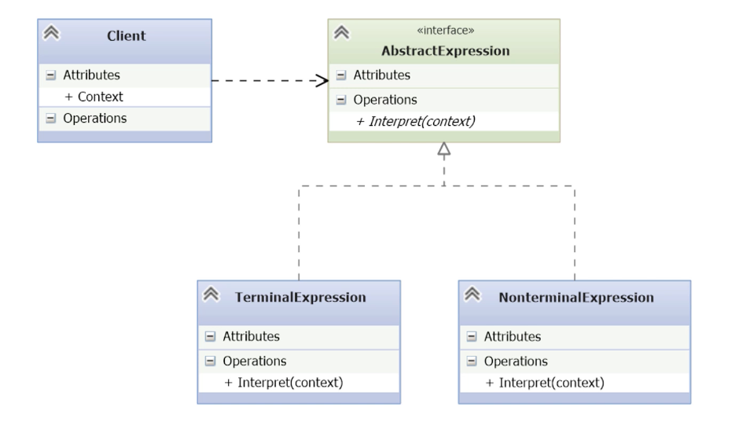

# Interpreter

- [Understanding Domain-Specific Languages](#understanding-domain-specific-languages)
- [Reviewing Backus Normal Form](#reviewing-backus-normal-form)
- [Building a Grammar](#building-a-grammar)
- [Understanding the Structure of Interpreter](#understanding-the-structure-of-the-interpreter-pattern)
- [Implementing the Interpreter Pattern](#implementing-the-interpreter-pattern)
- [Exploring the Consequences of Interpreter](#exploring-the-consequences-of-interpreter)

---

- The Interpreter pattern is used to interpret sentences written in a domain-specific language (DSL), which is a computer language designed for a specific type of problem rather than general-purpose use.
- This pattern is useful when an application needs to evaluate or execute expressions from such a DSL.
    
## Understanding Domain-Specific Languages

- Developers frequently use domain-specific languages (DSLs), often without realizing it.
- Well-known DSLs include:
    - **SQL** – for querying and managing relational databases.
    - **CSS** – for styling and formatting web content.
    - **HTML** – for structuring web pages.
    - **JSON** – for representing data as key-value pairs.
    - **PHP** – for server-side scripting and web page preprocessing.
- Additional DSL examples include:
    - **Regular expressions**, **XML**, **YAML**, **LaTeX**, **Make**, **Cron**, and Python’s **string formatting mini-language**.
- These DSLs demonstrate how common and useful domain-specific languages are in everyday development.

## Reviewing Backus Normal Form


- Most computer languages are defined using a **formal grammar**, typically expressed in **BNF (Backus Normal Form)**.
- BNF is a **metalanguage** used to describe the syntax of programming languages.
- Python’s official documentation uses BNF to define elements of the language, such as the **Format Specification Mini-Language**.
- Definition of the Python Format Specification Mini Language:

```
format_spec ::= [[fill]align][sign][#][0][width][.precision][type]
fill        ::= <a character other than '}'>
align       ::= "<" | ">" | "=" | "^"
sign        ::= "+" | "-" | " "
width       ::= integer
precision   ::= integer
type        ::= "b" | "c" | "d" | "e" | "E" | "f" | "F" | "g" | "G" | "n" | "o" | "s" | "x" | "X" | "%"
```

- In BNF:
    - `::=` defines a rule.
    - Brackets `[]` denote **optional elements**.
    - Double brackets `[[fill]]` indicate optionality dependent on another element.
    - The vertical bar `|` expresses **alternatives**.
- BNF defines **structure**, but not **semantic meaning**.
    - Interpreting semantics (e.g., what each element does) is the responsibility of the **interpreter or runtime**, like Python’s own interpreter.
## Building a Grammar

- DSL for Making Scrambled Eggs

```dsl
expression ::= command | sequence | repetition
sequence   ::= expression “;” expression
command    ::= "break egg" | "mix in bowl" | "melt butter in pan" | "cook eggs" | set
repetition ::= while variable expression
variable   ::= [A-Z][0-9]+
set        ::= set variable (“true” | “false”)

Example:
break egg; break egg; mix in bowl; melt butter in pan; set NOTCOOKED true;
while NOTCOOKED cook eggs; set NOTCOOKED false
```

- The language **MyDSL** is a domain-specific language designed for making scrambled eggs.
- The fundamental unit is an **expression**, which can be:
    - a **command**.
    - a **sequence**.
    - a **repetition** (loop controlled by a variable)
- A **sequence** is multiple expressions separated by semicolons.
- A **command** is either `break egg`, `mix in bowl`, `melt butter in pan` , `cook eggs` or `set`.
- A **repetition** defines a loop controlled by a variable that can be true or false.    
- A **variable** must start with a capital letter (A–Z) and may be followed by digits (A, A1, X99, etc.).
	- The + at the end shows that variable names can be as long as needed.
- The **set** command assigns a variable to true or false.
	- Takes the variable name, then the string true or false.
- Example script:
```eggs
break egg; break egg;
mix in bowl; melt butter in pan;
set NOTCOOKED to true;
while NOTCOOKED cook eggs;
set NOTCOOKED to false
```

## Understanding the Structure of the Interpreter Pattern



- **Client**
    - Holds some _context_ that is _global_ to the interpreter (e.g., the abstract syntax tree).
    - Invokes the `Interpret(context)` method on objects implementing the `AbstractExpression` interface.
- **AbstractExpression (interface)**
    - Defines the common interface `Interpret(context)` that all nodes in the syntax tree must implement.
    - Implemented by both terminal and nonterminal expressions.
- **TerminalExpression**
    - Represents _terminal symbols_ of the language (e.g., commands like break egg).
    - Implements `Interpret(context)` to directly interpret the language symbols.
- **NonterminalExpression**
    - Represents _nonterminal grammar rules_ (such as sequences or repetitions).
    - Implements `Interpret(context)` recursively: it invokes other expressions (terminal or nonterminal) until it reaches a terminal node.
## Implementing the Interpreter Pattern

- Build the interpreter.
- Use a simple AST (Abstract Syntax Tree) in the client.
	- Python `compile()` or `ast.parse()` functions can be used to build the abstract syntax trees.
- Can use the [[#Visitor]] pattern to separate things out for easier maintenance.
	- You don't have to put all the expression  processing in the concrete expression classes.
- Use [[#Flyweight]] for terminal symbols.

*abs_expression.py*
```python
import abc

class AbsExpression(abc.ABC):
    @abc.abstractmethod
    def interpret(context):
        pass
```
   
- `AbsExpression` defines the **common interface** for all expressions in the Interpreter pattern   
- The **interpret(context)** method must be implemented by any subclass—this enforces a contract.
- The context parameter provides shared state, usually the symbol table or AST execution environment.
- This class corresponds to **AbstractExpression** in the UML diagram.

*context.py*
```python
class Context:
    expression: str
    variables: dict
    ast: list
```

- **Context** is a data container shared across the interpreter.
- `expression` holds the raw DSL string (optional, can be used for debugging or parsing).
- `variables` is a dictionary to store and retrieve variable values at runtime (e.g., NOTCOOKED).
- `ast` is the abstract syntax tree—typically a list of expression objects to interpret.
- This class corresponds to the *Context* box in the UML diagram and is passed to every `interpret()` call.

*ast.py*
```python
from abs_expression import AbsExpression
import time

class Expression(AbsExpression):
    def __init__(self, expression):
        self._expression = expression

    def interpret(self, context):
        self._expression.interpret(context)

class BreakEgg(AbsExpression):
    def interpret(self, context):
        print('Breaking an egg.')

class MixEggs(AbsExpression):
    def interpret(self, context):
        print('Mixing eggs in a bowl.')

class MeltButter(AbsExpression):
    def interpret(self, context):
        print('Melting butter in pan.')

class CookEggs(AbsExpression):
    def interpret(self, context):
        print('Cooking the eggs.')
        time.sleep(1)

class Sequence(AbsExpression):
    def __init__(self, sequence):
        self._sequence = sequence

    def interpret(self, context):
        for e in self._sequence:
            e.interpret(context)

class Repetition(AbsExpression):
    def __init__(self, variable, expression):
        self._variable = variable
        self._expression = expression

    def interpret(self, context):
        while self._variable.interpret(context) == 'true':
            self._expression.interpret(context)

class Variable(AbsExpression):
    def __init__(self, variable):
        self._variable = variable

    def interpret(self, context):
        return context.variables.get(self._variable, None)

class Set(AbsExpression):
    def __init__(self, variable, value):
        self._variable = variable
        self._value = value

    def interpret(self, context):
        context.variables[self._variable] = self._value
```

- `Expression`: Non-terminal expression that delegates interpretation to a sub-expression.
	- It receives and stores an expression to be interpreted in a constructor.
	- The `interpret()` method is recursive, so this is a non-terminal expression evaluator.
		- It continues until it hits a terminal expression, at which point the recursion stops.
- `BreakEgg`, `MixEggs`, `MeltButter`, `CookEggs`: Terminal expressions that simulate atomic DSL commands.
	- `CookEggs` includes a sleep(1) call to simulate cooking time.
- `Sequence`: Non-terminal expression that interprets a list of sub-expressions in order (e.g. the DSL sequence with semicolons).
	- Loops through a series of expressions, interpreting each one.
- `Repetition`: Non-terminal expression representing a while loop.
    - Uses a Variable to control repetition (taken at instantiation), executing the body expression until the variable evaluates to 'false'.
- `Variable`: Terminal expression. 
    - Saves the variable name, then it returns its value when called
    - Defaults to None if the variable isn’t present.
- `Set`: Terminal expression.
    - Updates the interpreter’s global context by assigning a value to a variable.    
    - Used to control logic flow (e.g., setting loop condition to "false").

*\_\_main__.py*
```python
from ast import Sequence, BreakEgg, Expression, MixEggs, MeltButter, CookEggs
from ast import Repetition, Variable, Set
from context import Context

def main():
    context = Context()

    # The original DSL script is stored as a string for reference (not parsed automatically)
    context.expression = '''
    break egg; break egg
    mix in bowl;
    melt butter in pan;
    set NOTDONE true;
    while NOTDONE cook eggs; set NOTDONE false
    '''

    # Build the abstract syntax tree (AST) manually, following the DSL structure
    context.ast = Expression(
        Sequence([  # Non-terminal node: a sequence of expressions
            BreakEgg(),               # Terminal expression
            BreakEgg(),               # Terminal expression
            MixEggs(),                # Terminal expression
            MeltButter(),             # Terminal expression
            Set('NOTDONE', 'true'),   # Terminal expression: sets a variable
            Repetition(               # Non-terminal: repetition while variable is true
                Variable('NOTDONE'),  # Terminal: gets the value of the variable
                Sequence([            # Non-terminal: sequence inside the loop
                    CookEggs(),               # Terminal: simulates cooking
                    Set('NOTDONE', 'false')   # Terminal: ends the loop
                ])
            )
        ])
    )

    # Initialize variable store (context used by expressions during interpretation)
    context.variables = {}

    # Start interpretation from the root expression
    context.ast.interpret(context)

    # Final message after interpretation is complete
    print('Scrambled eggs ready!')
```

- This is the **client program** building and interpreting the AST manually.
- The `context.expression` stores the original DSL script as reference.
	- Since it is a series of commands separated by `;` this is a sequence according to the grammar.
- `context.ast` builds the abstract syntax tree using the classes from the DSL interpreter.
	- At the top level, it's an expression that consists of a sequence.
	- The sequence holds the terminal operations: `BreakEgg`, `MixEggs`, `MeltButter`.
	- `Set` the `NOTDONE` variable to true.
	- Begin a repetition operation.
		- The repetition class is constructed with another sequence: `CookEggs`, `Set` `NOTDONE` to false.    
- Finally, `interpret(context)` is called to execute the program, and prints confirmation.
	- To interpret the program we call the top-level `interpret` method.

```bash
> python3 __main__.py
Breaking an egg.
Breaking an egg.
Mixing eggs in a bowl.
Melting butter in pan.
Cooking the eggs.
Scrambled eggs ready!
```

## Exploring the Consequences of Interpreter

| **✅** **Benefits**                                                        | **❌** **Drawbacks**                                                            |
| ------------------------------------------------------------------------- | ------------------------------------------------------------------------------ |
| Easy to **extend or modify** the grammar by adding new expression classes | **Complex grammars** can become difficult to maintain manually                 |
| Simple to **implement** due to uniform structure of AST nodes             | Not suitable for **large or evolving** languages—consider a compiler generator |
| Easy to **override or change** how expressions are interpreted            | Requires managing the grammar and AST structure as the system evolves          |
| Facilitates **incremental development** of language features              | Can lead to many small classes, increasing system complexity                   |
