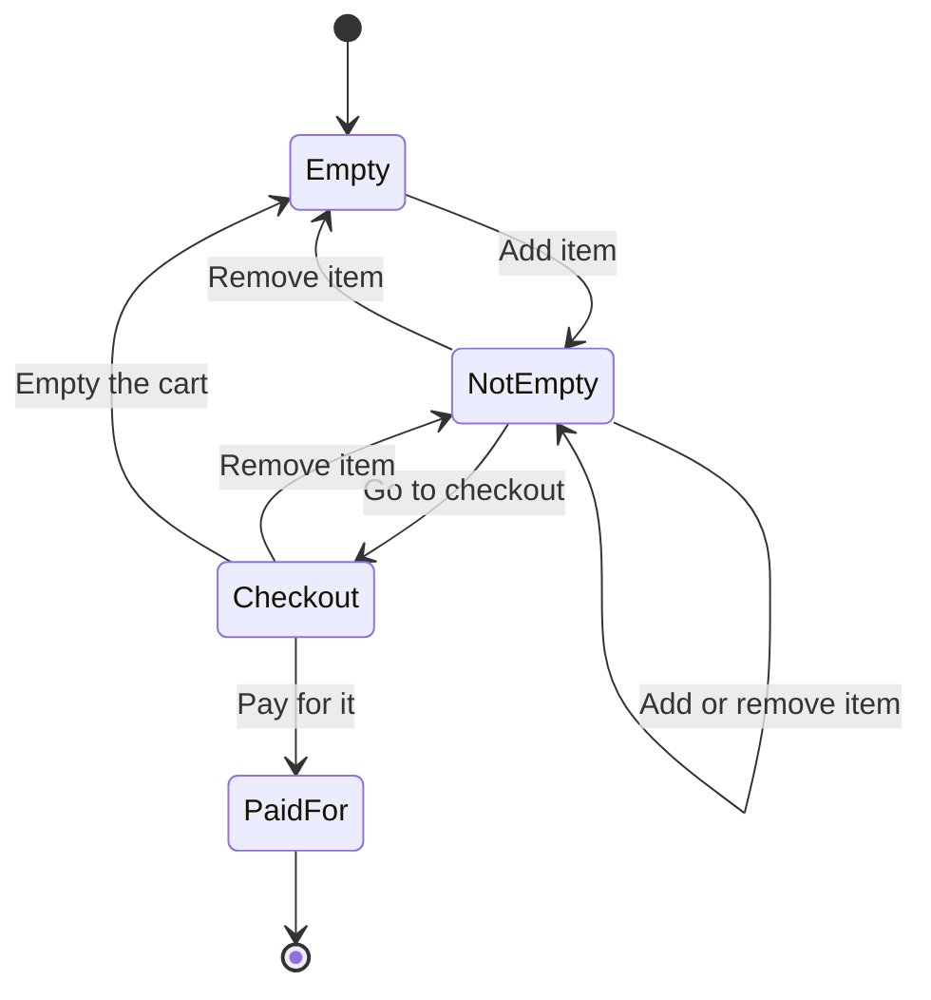
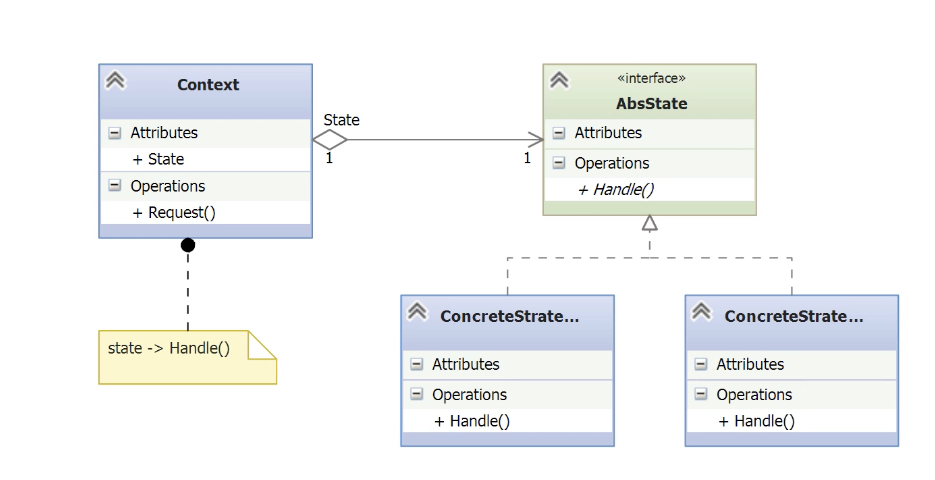

# State

- [Before State](#before-state)
- [Understanding the State Pattern](#understanding-the-state-pattern)
- [Implementing the State Pattern](#implementing-the-state-pattern)

---

- The **State pattern** is a behavioral design pattern that allows an object to change its behavior when its internal state changes.
- It models state-specific behavior into separate classes and delegates behavior to the current state.
- This pattern is particularly useful when:
	- An object can be in **multiple states**, each with distinct behavior.    
	- The object’s behavior needs to **change dynamically** at runtime based on its state.
	- You want to **avoid complex conditionals** (if / elif / switch) that handle state transitions manually.
- Instead of having a single monolithic class with lots of branching logic, the State pattern encourages defining **one class per state**, each implementing the same interface.



- The example revolves around a **shopping cart** that can exist in multiple **states**:
    - Empty
    - Not Empty
    - Checkout
    - Paid    
- **State transitions** are triggered by actions:
    - add_item() → Empty → Not Empty    
    - remove_item() → may return to Empty    
    - checkout() → moves to Checkout
    - pay() → transitions to Paid
- **Not all transitions are allowed** from all states (e.g., you can’t pay if the cart is empty).

## Before State

- Model the shopping cart
- Use one variable to track the state.
- Individual methods for each transition.
	- Check if the current state allows the action.
	- Execute the transition and update the state **only if valid**.
	- Print an error message if the action is not allowed.

*shopping_cart.py*
```python
# Define the possible states using constants for clarity
EMPTY = 0
NOT_EMPTY = 1
AT_CHECKOUT = 2
PAID_FOR = 3

class ShoppingCart:
    def __init__(self):
        # Start with an empty cart
        self.state = EMPTY
        self._items = 0

	# One method for each transition
    def add_item(self):
	    # Check allowed states in each transitions
        if self.state == EMPTY:
            print('You added the first item')
            self.state = NOT_EMPTY
            self._items += 1
        elif self.state == NOT_EMPTY:
            self._items += 1
            print(f'You now have {self._items} items in your cart')
        elif self.state == AT_CHECKOUT:
            print("You can't add new items at checkout!")
        else:  # state == PAID_FOR
            print("You can't add items after payment!")

	def remove_item(self):
        if self.state == EMPTY:
            print('Your cart is empty! Nothing to remove!!')

        elif self.state == NOT_EMPTY:
            self._items -= 1
            print(f'You now have {self._items} items in your cart')
            if not self._items:
                self.state = EMPTY

        elif self.state == AT_CHECKOUT:
            self._items -= 1
            print(f'You now have {self._items} items in your cart')
            if not self._items:
                self.state = EMPTY
            else:
                self.state = NOT_EMPTY

        else:  # state == PAID_FOR
            print("You can't add items after payment!")

	def checkout(self):
        if self.state == EMPTY:
            print("Your cart is empty. Go shopping!")

        elif self.state == NOT_EMPTY:
            print(f'You now have {self._items} items in your cart')
            self.state = AT_CHECKOUT

        elif self.state == AT_CHECKOUT:
            print('You are already at check out!')

        else:  # state == PAID_FOR
            print("You can't go back to checkout after payment.")

    def paid_for(self):
        if self.state == EMPTY:
            print("Your cart is empty. How did you get here?")

        elif self.state == NOT_EMPTY:
            print("You must go to checkout for payment.")

        elif self.state == AT_CHECKOUT:
            print(f'You paid for {self._items} items.')
            self._items = 0
            self.state = EMPTY

        else:  # state == PAID_FOR
            print("You already paid for your purchases.")
```

- The class tracks the cart’s state using an **integer value**, instead of true state objects.
- Each method (add_item, remove_item, etc.) contains **explicit conditional logic** (if/elif/else) to determine what to do depending on the state.
- This structure leads to **tight coupling** between state management and logic — every time a new state is added, **every method must change**, violating the **Open/Closed Principle**.
- The code is **hard to maintain** and **repetitive**, especially if the number of states or transitions grows.

*\_\_main__.py*
```python
from shopping_cart import ShoppingCart

def main():
    cart = ShoppingCart()
    cart.add_item()
    cart.remove_item()
    cart.add_item()
    cart.add_item()
    cart.add_item()
    cart.remove_item()
    cart.checkout()
    cart.paid_for()
    cart.add_item()
    cart.checkout()
    cart.paid_for()

main()
```

## Understanding the State Pattern

- **The State Pattern is a behavioral pattern**:
	- It defines how an object changes its behavior based on its internal state.
- **Separation of concerns**:
	- Instead of implementing all logic in the _context_ (e.g. the shopping cart), each _state_ encapsulates its own behavior.
	- **Uses a class for each state**
- **State transitions** are delegated to the state objects:
	- This avoids scattered if or match statements in the context class.
- **Client code interacts only with the context**:
	- The context maintains a reference to the current state, and delegates behavior to it.



- **Context**: The main object the client interacts with (e.g., the ShoppingCart).    
    - Holds a reference to the current **state** (`AbsState`).
    - Implements a method like `Request()` which **delegates** the behavior to the current state via state->`Handle()`.
- **AbsState (Interface or Abstract Class)**: Defines the **contract** for all states.
    - Declares abstract methods (e.g., `Handle()`) that each state must implement.
- **ConcreteState classes**: Subclasses of AbsState, each representing a **specific state**.
    - They implement behavior for the operations defined in `AbsState`.
    - Each class knows how to handle state transitions internally if needed.
- **Delegation Mechanism**:
	- The Context delegates all requests to the current state object, which handles them accordingly.
	- This avoids conditionals in the context and allows behavior to vary **dynamically** at runtime.

## Implementing the State Pattern

- Create a shopping cart context.
- Create state classes.
- Add transition handles.

*abs_state.py*
```python
import abc

# The constructor requires a context
class AbsState(abc.ABC):
    def __init__(self, context):
        self._cart = context
	# Abstract methods to be implemented by the concrete states
    @abc.abstractmethod
    def add_item(self):
        pass

    @abc.abstractmethod
    def remove_item(self):
        pass

    @abc.abstractmethod
    def checkout(self):
        pass

    @abc.abstractmethod
    def pay(self):
        pass

    @abc.abstractmethod
    def empty_cart(self):
        pass
```

- This class defines the interface for all possible states in the **State Pattern**:   
- The constructor (`__init__`) accepts the context (in this case, the `ShoppingCart`) and stores it as an instance attribute so that state objects can modify the cart.
- Each state transition method (add_item, remove_item, checkout, pay, empty_cart) is marked with `@abc.abstractmethod`, forcing every concrete state to implement all five actions.
- This design ensures that the context delegates all behavior to the current state object, and each state can handle those behaviors differently depending on its own logic.

*empty.py*
```python
from abs_state import AbsState

class Empty(AbsState):
    def add_item(self):
        self._cart.items += 1
        print('You added the first item')
        self._cart.state = self._cart.not_empty  # Transition to NotEmpty state

    def remove_item(self):
        print('Your cart is empty! Nothing to remove!!')

    def checkout(self):
        print('Your cart is empty. Go shopping!')

    def pay(self):
        print('Your cart is empty. How did you get here?')

    def empty_cart(self):
        print('Your cart is already empty.')
```

*not_empty.py*
```python
from abs_state import AbsState

class NotEmpty(AbsState):
    def add_item(self):
        self._cart.items += 1
        print(f'You now have {self._cart.items} items in your cart.')

    def remove_item(self):
        self._cart.items -= 1
        if self._cart.items:
            print(f'You now have {self._cart.items} items in your cart.')
        else:
            print('Your cart is empty again.')
            self._cart.state = self._cart.empty

    def checkout(self):
        print("Done shopping. Let's check out!")
        self._cart.state = self._cart.check_out

    def pay(self):
        print('You have to go to checkout to pay!')

    def empty_cart(self):
        print('Your can only empty the cart at checkout.')
```

*check_out.py*
```python
from abs_state import AbsState

class AtCheckOut(AbsState):
    def add_item(self):
        print("You can't add items at the check out counter.")

    def remove_item(self):
        self._cart.items -= 1
        if self._cart.items:
            print(f'You now have {self._cart.items} items in your cart.')
        else:
            print('Your cart is empty again.')
            self._cart.state = self._cart.empty

    def checkout(self):
        print("You're already at checkout.")

    def pay(self):
        print(f
```

*paid_for.py*
```python
from abs_state import AbsState

class PaidFor(AbsState):
    def add_item(self):
        print('You already paid for your purchases. Want to shop some more? Get a new shopping cart!')

    def remove_item(self):
        print("You've already paid for your purchases and can't remove any.")

    def checkout(self):
        print('Why are you back here? You already paid!')

    def pay(self):
        print("You already paid. You can't pay twice!")

    def empty_cart(self):
        print('You paid already. Time to go home!')
```

**concrete state** of the shopping cart (e.g., Empty, NotEmpty, Checkout, PaidFor).
- All state classes inherit from the shared abstract base class `AbsState` and implement the full set of transition methods.
- Each state class defines its own **valid transitions** and handles **invalid operations** by printing appropriate messages.
- When a valid action leads to a state change (e.g., adding an item in Empty, or paying in Checkout), the state of the cart is explicitly updated by assigning a new state object.

*shopping_cart.py*
```python
from empty import Empty
from not_empty import NotEmpty
from check_out import AtCheckOut
from paid_for import PaidFor

class ShoppingCart:
    def __init__(self):
        self.empty = Empty(self)
        self.not_empty = NotEmpty(self)
        self.check_out = AtCheckOut(self)
        self.paid_for = PaidFor(self)

        self.items = 0
        self.state = self.empty

    def add_item(self):
        self.state.add_item()

    def remove_item(self):
        self.state.remove_item()

    def checkout(self):
        self.state.checkout()

    def pay(self):
        self.state.pay()

    def empty_cart(self):
        self.state.empty_cart()
```


- The constructor instantiates **all possible states** of the cart and keeps references to them. Each state receives the cart instance (`self`) so it can change the cart’s state when needed.
- The initial state is set to `self.empty`, and the number of items starts at 0.
- Each method (add_item, remove_item, etc.) delegates the behavior to the **current state** using `self.state.method()`.
	- This means the cart itself does **not** contain any logic about which behavior to execute — it’s entirely controlled by the current state object.
- This delegation is the core idea of the **State Pattern**, and it allows easy maintenance and extension of behavior for new states without modifying the ShoppingCart class itself.

*\_\_main__.py*
```python
from shopping_cart import ShoppingCart

def main():
    print("====> first cart")
    cart = ShoppingCart()
    cart.add_item()
    cart.remove_item()
    cart.add_item()
    cart.add_item()
    cart.add_item()
    cart.remove_item()
    cart.checkout()
    cart.pay()

    # Go shopping again
    print("====> second cart")
    cart = ShoppingCart()
    cart.add_item()
    cart.add_item()
    cart.checkout()
    cart.empty_cart()
    cart.add_item()
    cart.checkout()
    cart.pay()

    # Try to add another item
    print("====> Expect an error here.")
    cart.add_item()

main()
```

```bash
> python .\__main__.py
====> first cart
You added the first item
Your cart is empty again.
You added the first item
You now have 2 items in your cart.
You now have 3 items in your cart.
You now have 2 items in your cart.
Done shopping. Let's check out!
You paid for 2 items.
====> second cart
You added the first item
You now have 2 items in your cart.
Done shopping. Let's check out!
Your cart is empty again.
You added the first item
Done shopping. Let's check out!
You paid for 1 items.
====> Expect an error here.
You already paid for your purchases. Want to shop some more? Get a new shopping cart!
```
