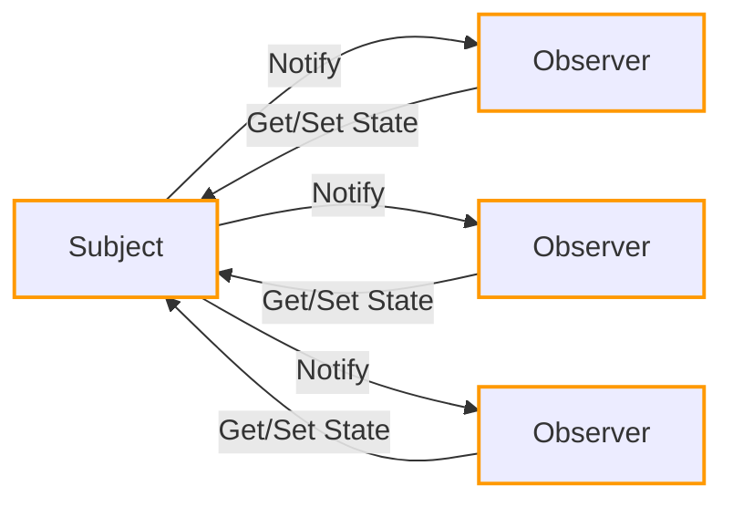
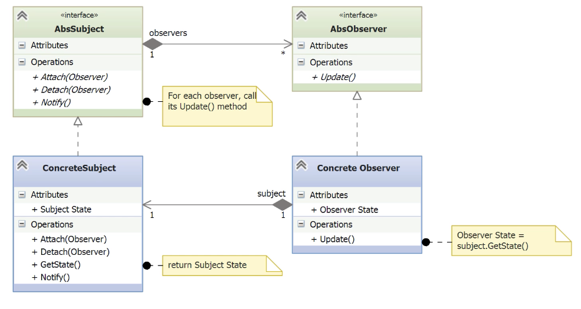

# Observer

- [Before Observer](#before-observer)
- [Understanding the Observer Pattern](#understanding-the-observer-pattern)
- [Implementing the Observe Pattern](#implementing-the-observe-pattern)
- [Observing the Results and Noticing a Bug](#observing-the-results-and-noticing-a-bug)
- [Fixing the Bug](#fixing-the-bug)

---

- The **Observer pattern** is a **behavioral pattern** that manages communication between objects when a change in state occurs.
- It solves the problem of **automatically notifying** multiple objects (observers) when another object (the subject) changes.
- It defines a **one-to-many relationship** between objects: one subject, many observers.
- When the subject changes its state, **all subscribed observers are notified**, without the subject needing to know who they are.
- Common real-world examples include:
    - Publish-subscribe systems (newspapers, blogs, event feeds).
    - Social media subscriptions (e.g., YouTube channels, Twitter).
    - GUI frameworks, where UI elements observe data sources or events.
- Also known as:
	- Dependents pattern.
	- Publish-subscribe pattern.
## Before Observer

- The example is a **dashboard application** for a tech support center that displays **Key Performance Indicators (KPIs)** like open, new, and closed tickets.
- Initially, the dashboard simply prints these KPI values to the console.
- However, as requirements evolve, the system needs to:
    - Send KPIs via **email**.
    - Push updates to a **REST API**.
    - Track additional KPIs (e.g., number of **active support techs**).
- The dashboard is the **observer**.
- The KPI source is the **subject** or **publisher**.
- The current implementation becomes **rigid and error-prone** as new output channels and data sources are added.
- This complexity highlights the need for a **flexible and extensible solution**.

*kpi_data.py*
```python
from collections import namedtuple
from itertools import starmap

# Sample KPI data: (name, value)
data = (('new', 10), ('open', 20), ('closed', 30))

# Define a namedtuple for clarity and self-documentation
nt = namedtuple('KPI', 'name value')

# Create an iterator of KPI namedtuples using starmap
KPI_Data = starmap(nt, data)
```

- This file defines **mock KPI data** for demonstration purposes.
- `namedtuple` is used to create structured, immutable objects with field access (`kpi.name`, `kpi.value`), improving readability.
- `starmap` is used to map the tuple values into instances of the KPI `namedtuple` efficiently.
- The result`KPI_Data` is an **iterator** over structured KPI records.

*\_\_main__.py*
```python
for kpi in KPI_Data:
    if kpi.name == 'open':
        print(f"Current open tickets: {kpi.value}")
    elif kpi.name == 'new':
        print(f"New tickets in last hour: {kpi.value}")
    elif kpi.name == 'closed':
        print(f"Tickets closed in last hour: {kpi.value}")
```

- This code violates the **Open/Closed Principle** and **Single Responsibility Principle**:
- It’s tightly coupled: every new KPI type or output channel (email, API, GUI, etc.) requires modifying this script.
- Adding behaviors means editing conditionals, which doesn’t scale.
- All observers are “hardwired” into one place, making it fragile and rigid.

> This setup helps simulate real-time KPI updates in a clean and readable way, serving as the **data source** in the motivating example for the Observer pattern.
> However, in the current implementation (before applying the pattern), this data is only consumed in one hardcoded way, which makes the design **inflexible and tightly coupled**—highlighting the need for Observer-style decoupling later.

```bash
BeforeObserver> python .\__main__.py
New tickets in last hour: 10
Current open tickets: 20
Tickets closed in last hour: 30
BeforeObserver>
```

## Understanding the Observer Pattern



- There is a **Subject**, which is the source of state changes.
	- In the demo, this is the component simulating KPI data.
- One or more **Observers** are interested in those changes.
	- For example, the KPI dashboard is one such observer.
- The Observer pattern sets up a **subscription mechanism** so that observers can **attach to** and **detach from** the subject dynamically.
- When the subject changes state, it **notifies all attached observers**.
	- Each observer can then **retrieve updated state** from the subject as needed.
- This pattern decouples the source of changes from the consumers of those changes, allowing better flexibility and scalability in the design.



- The pattern defines two abstract interfaces:
    - `AbsSubject`: declares the methods `attach(observer)`, `detach(observer)`, and `notify()`.
    - `AbsObserver`: declares the method `update()`.
- `ConcreteSubject` implements `AbsSubject` and maintains:
    - A **state** that can change over time.
	    - `GetState()` can be used by observers to retrieve the state.
    - A **list of observers** attached via the attach() method.
    - When the state changes, it **calls notify()**, which in turn **calls update() on each observer**.
- `ConcreteObserver` implements `AbsObserver` and:
    - Stores a **local copy of the subject’s state**.    
    - When notified via `update()`, it usually **calls subject.get_state()** to fetch the latest data.
- The relationship between subject and observer is **1-to-many**:
    - A subject can have multiple observers.
    - Observers can attach or detach dynamically at runtime.
- This design **separates concerns**:
    - The subject doesn’t need to know what the observers do with the data.
    - Observers react independently to changes in the subject.
- The pattern enforces **multiple SOLID principles**:
    - **S**: Single Responsibility — each class has a clear role.
    - **O**: Open/Closed — new observers can be added without changing the subject.
    - **I**: Interface Segregation — abstract base classes define clear contracts.
    - **D**: Dependency Inversion — subject depends on abstract observers, not concrete ones.

## Implementing the Observe Pattern

- The goal is to **implement the classic Observer Pattern** in Python by:
	- Creating **abstract base classes** (`AbsSubject`, `AbsObserver`) to define the contract.
- Using those abstractions to build **concrete classes**:
    - A subject that emits KPI data (KPIs)
    - Two observers: one showing current KPIs, another showing forecasted KPIs.
- Refactoring the main program to demonstrate **separation of concerns**.
- Adding flexibility by supporting multiple observers with different display behaviors.

*observer/observer_abc.py*
```python
import abc

class AbsObserver(abc.ABC):
    @abc.abstractmethod
    def update(self, value):
        pass
```
   
- Declares the **abstract class** that defines one **abstract method**: `update(self, value)`
    - Every concrete observer must implement this method.
    - `value` is an optional payload passed during notification (e.g., new KPI data).

*observer/subject_abc.py*
```python
import abc
from . import AbsObserver

class AbsSubject(abc.ABC):
    _observers = set()  # Set to track unique observer instances

    def attach(self, observer):
        # Ensure the observer is a subclass of AbsObserver
        if not isinstance(observer, AbsObserver):
            raise TypeError('Observer not derived from AbsObserver')
        self._observers |= {observer}  # Add observer to the set

    def detach(self, observer):
        self._observers -= {observer}  # Remove observer from the set

    def notify(self, value=None):
        for observer in self._observers:
            # Notify each observer, optionally passing a value
            if value is None:
                observer.update()
            else:
                observer.update(value)
```

- This implements the subject **abstract class**, however, its methods are concrete implementations.
	- Although it’s an abstract class, it includes reusable logic to reduce duplication.
    - This is valid and common in Python’s ABC design.
- **Encapsulates Observer Management**:
    - Uses a private _observers set to store all attached observers.
    - The `attach()` method ensures type safety by checking inheritance from `AbsObserver`.
    - `detach()` allows observers to unsubscribe from notifications.
- **Implements Notification Logic**:
    - `notify()` loops through all observers and calls their `update()` method.
    - Optionally accepts a value parameter to pass state changes. 
- **Decouples Publisher and Subscribers**:
    - The subject doesn’t know or care how each observer handles the update—it just calls `update()`.

*kpis.py*
```python
from observer import AbsSubject  # Abstract base class defining Subject behavior

# Concrete Subject in the Observer pattern
class KPIs(AbsSubject):
    # Private instance variables to store KPI values
    _open_tickets = -1
    _closed_tickets = -1
    _new_tickets = -1

    # Getter for open_tickets (read-only property)
    @property
    def open_tickets(self):
        return self._open_tickets

    # Getter for closed_tickets
    @property
    def closed_tickets(self):
        return self._closed_tickets

    # Getter for new_tickets
    @property
    def new_tickets(self):
        return self._new_tickets

    # Method to update KPI values and notify all observers
    def set_kpis(self, open_tickets, closed_tickets, new_tickets):
        self._open_tickets = open_tickets
        self._closed_tickets = closed_tickets
        self._new_tickets = new_tickets
        self.notify()  # Trigger observer updates
```
  
- **KPIs (Concrete Subject)** inherit from the abstract subject class `AbsSubject`:
	- Defines properties for the values to track holding internal state (`_open_tickets`, etc.).
	- Updates its state via `set_kpis()`, and then **calls notify()**, which tells all subscribed observers that something has changed.
    - Provides access through read-only `@property` methods.
        
*currentkpis.py*
```python
from observer import AbsObserver  # Import abstract base class for Observers

# Concrete Observer that displays current KPI values
class CurrentKPIs(AbsObserver):
    # Local state mirroring the subject's KPIs
    open_tickets = -1
    closed_tickets = -1
    new_tickets = -1

    # On initialization, store reference to subject and attach self as observer
    def __init__(self, kpis):
        self._kpis = kpis
        kpis.attach(self)  # Register this observer to receive updates

    # Called by the subject when state changes
    def update(self):
        # Pull the latest data from the subject
        self.open_tickets = self._kpis.open_tickets
        self.closed_tickets = self._kpis.closed_tickets
        self.new_tickets = self._kpis.new_tickets

        # Display the new state
        self.display()

    # Display current KPI values
    def display(self):
        print(f'Current open tickets: {self.open_tickets}')
        print(f'New tickets in last hour: {self.closed_tickets}')
        print(f'Tickets closed in last hour: {self.new_tickets}')
        print('*****\n')
```

- **Role**: CurrentKPIs is a **concrete observer** that gets notified of changes in the subject (KPIs).
- **Subscription**: On initialization, it attaches itself to the subject using `kpis.attach(self)`.
- **Reaction**: When `KPIs.notify()` is called, `CurrentKPIs.update()` gets triggered.
- **Data pulling**: The observer **pulls data** from the subject, instead of receiving it as arguments.
- **Behavior**: It mirrors the subject’s data locally and prints it with `display()`.

*forecastkpis.py*
```python
from observer import AbsObserver  # Import abstract base class for Observer interface

# Concrete Observer that forecasts future KPI values
class ForecastKPIs(AbsObserver):
    # Internal state to store last known KPI values
    open_tickets = -1
    closed_tickets = -1
    new_tickets = -1

    # On creation, attach to the Subject to receive updates
    def __init__(self, kpis):
        self._kpis = kpis
        kpis.attach(self)  # Subscribe to KPI updates

    # Called when Subject notifies observers
    def update(self):
        # Pull the current values from the subject
        self.open_tickets = self._kpis.open_tickets
        self.closed_tickets = self._kpis.closed_tickets
        self.new_tickets = self._kpis.new_tickets

        # Display forecasted KPI interpretation
        self.display()

    # Display a forecast-style interpretation of the KPIs
    def display(self):
        print(f'Forecast open tickets: {self.open_tickets}')
        print(f'New tickets expected in next hour: {self.new_tickets}')
        print(f'Tickets expected to be closed in next hour: {self.closed_tickets}')
        print('*****\n')
```

- **Role**: This class is a **Concrete Observer** that subscribes to KPI changes and provides a **forecast-oriented view**.    
- **Subscription**: Calls `kpis.attach(self)` to receive updates from the Subject.
- **Trigger**: When the Subject calls `notify()`, this class’s update() is triggered.
- **Behavior**:
    - Retrieves KPI data from the Subject.
    - In a real implementation it would use current kpi data to create a forecast.
    - Displays it with predictive language (e.g., “expected”, “forecast”).

*\_\_main__.py*
```python
from kpis import KPIs  # Subject (notifies observers of state changes)
from currentkpis import CurrentKPIs  # Concrete Observer
from forecastkpis import ForecastKPIs  # Another Concrete Observer

# Create the subject
kpis = KPIs()

# Create two observers, auto-attached to the subject
currentKPIs = CurrentKPIs(kpis)
forecastKPIs = ForecastKPIs(kpis)

# Update KPI values (notifies both observers)
kpis.set_kpis(25, 10, 5)
kpis.set_kpis(100, 50, 30)
kpis.set_kpis(50, 10, 20)

# Detach one observer (currentKPIs will no longer be notified)
print(f'\n***Detaching the currentKPIs observer.***\n')
kpis.detach(currentKPIs)

# Update again (only forecastKPIs will respond)
kpis.set_kpis(150, 110, 120)
```
    
- **Observers (CurrentKPIs and ForecastKPIs)**: Automatically attach to the subject on instantiation, and react when notify() is called.
- **detach()**: Demonstrates dynamic observer management — removing one observer stops it from reacting to further updates.
- **Final state**: After detaching CurrentKPIs, only ForecastKPIs receives the update for (150, 110, 120).

## Observing the Results and Noticing a Bug

- The Observer pattern was successfully implemented following the **Gang of Four** structure.
- The **separation of concerns** between Subject and Observers improves modularity and maintainability.
- **Encapsulation of variation** is respected: observers and the subject can evolve independently.
	- New observers can be added easily without altering existing logic.
- ⚠️ A **subtle bug** is highlighted related to **memory management**:
    - Python uses **reference counting** for memory management.
    - The subject holds references to all its observers in a set.
    - If observers are not **explicitly detached**, those references **persist**, preventing garbage collection.
	- This creates a **dangling reference**, where an unused object cannot be freed due to still being referenced.
- **Fix**: Always call `detach(observer)` when an observer is no longer needed to avoid memory leaks.

## Fixing the Bug

- Python context managers (`with` statements) are used to automatically manage observer lifecycles.
- Each concrete observer (`CurrentKPIs`, `ForecastKPIs`) now implements `__enter__` and `__exit__` methods:
    - `__exit__()` detaches the observer from the subject when the context ends.
    - This happens **even if an exception is raised** during the block.    
- The Subject class also implements `__exit__()` to clean up any remaining observers at the end of its own context.
- This eliminates the dangling reference issue, as no observer remains attached unintentionally.
- The `__main__` program is rewritten to use `with` blocks for each observer, ensuring they are automatically detached.
- ✅ After the `with` blocks exit, no more output is shown from the observers, confirming they are no longer receiving updates.
- This approach ensures **safe, automatic, and clean observer management** using Python’s built-in context management protocol.

*currentkpis.py*
```python
from observer import AbsObserver  
class CurrentKPIs(AbsObserver):
    open_tickets = -1
    closed_tickets = -1
    new_tickets = -1

    def __init__(self, kpis):
        self._kpis = kpis
        kpis.attach(self) 

    def update(self):
        self.open_tickets = self._kpis.open_tickets
        self.closed_tickets = self._kpis.closed_tickets
        self.new_tickets = self._kpis.new_tickets
        self.display()

    def display(self):
        print(f'Current open tickets: {self.open_tickets}')
        print(f'New tickets in last hour: {self.new_tickets}')
        print(f'Tickets closed in last hour: {self.closed_tickets}')
        print('*****\n')

    # Context manager exit hook – automatically detach observer
    def __exit__(self, exc_type, exc_value, traceback):
        self._kpis.detach(self)  # Ensures no dangling reference remains
```

*forecastkpis.py*
```python
class ForecastKPIs(AbsObserver):
	...
	# Context manager exit hook – automatically detach observer
    def __exit__(self, exc_type, exc_value, traceback):
        self._kpis.detach(self)  # Ensures no dangling reference remains
```

- The `__exit__` method allows this observer to be used in a with block.
- When the context exits (even due to an error), `__exit__()` is called and detaches the observer from the subject.
- This **prevents memory leaks** or **dangling references**, as the subject no longer keeps a reference to an unused observer.

*\_\_main__.py*
```python
with KPIs() as kpis:
    with CurrentKPIs(kpis), ForecastKPIs(kpis):
        kpis.set_kpis(25, 10, 5)
        kpis.set_kpis(100, 50, 30)
        kpis.set_kpis(50, 10, 20)

print ('\n***Exited context managers.***\n')
kpis.set_kpis(150, 110, 120)
```

- **with KPIs() as kpis:**
    - Enters the context of the KPIs subject.
    - (Assuming KPIs implements `__enter__`/`__exit__`)
    - When the block ends, it **cleans up any remaining observers**, avoiding memory leaks.
- **with CurrentKPIs(kpis), ForecastKPIs(kpis):**
    - Creates two observers and automatically **attaches** them to the subject.
    - Because both classes implement `__exit__()`, they **detach themselves** automatically when the context ends.
- **Inside the block**:
    - `set_kpis()` notifies both observers, and they display the data as expected.
