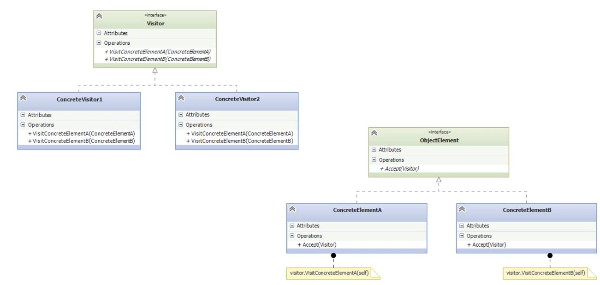

# Visitor

- [Before Visitor](#before-visitor)
- [Understanding the Visitor Pattern](#understanding-the-visitor-pattern)
- [Implementing the Visitor Pattern](#implementing-the-visitor-pattern)
- [Finding the Oldest using Visitor](#finding-the-oldest-using-visitor)
- [Summary (Visitor)](#summary-visitor)

---

- The **Visitor pattern** is a **behavioral design pattern**.
- It enables adding **new functionality** to **complex object structures** without modifying their classes.
- This is achieved by **separating the new behavior** into a **visitor class**, avoiding the need to touch every element in the structure.
- It introduces **abstractions** that allow future enhancements with minimal impact.
- The main benefit is **flexibility** and **low risk** when extending functionality across a class hierarchy.
- A trade-off is that it may **break encapsulation**, since the visitor often accesses internal state, but this is sometimes acceptable for large, stable systems.
## Before Visitor

- To motivate the use of the Visitor pattern, the lesson revisits the **Family Tree** example from the [[#Implementing the Composite Pattern|Composite]] pattern.
- The goal is to **add a new feature**: a simple `pretty_print` method to display the structure.
    
*trees/abs_tree.py*
```python
import abc

class AbsTree(abc.ABC):

    @abc.abstractmethod
    def get_oldest(self):
        pass

    @abc.abstractmethod
    def pretty_print(self):
        # New abstract method.
        # Concrete subclasses must implement this method
        pass
```

- The instructor is **extending the existing AbsTree class** (already used in the Composite pattern as `AbsComposite`) by adding a **new abstract method**: `pretty_print()`.
- By declaring pretty_print() as an abstract method, we **enforce consistency**: every class that inherits from AbsTree must define how to print itself.

*trees/person.py*
```python
from .abs_tree import AbsTree

class Person(AbsTree):
    
    def __init__(self, name, birthdate):
        self._name = name
        self._birthdate = birthdate

    def get_oldest(self):
        return self

    @property
    def name(self):
        return self._name

    @property
    def birthdate(self):
        return self._birthdate

    def pretty_print(self):
        # Implementation of the new method defined in AbsTree.
        print(f'{self.name} was born on {self.birthdate}')
```

- Person is a **leaf** in the Composite pattern. It **inherits from AbsTree**, the abstract base class for tree nodes.   
- The new method `pretty_print()` is added to make each node responsible for **its own presentation logic**.
- This follows the **uniform interface principle** of the Composite pattern: the client can call `pretty_print()` on any `AbsTree`, whether it’s a Person or a Tree, without knowing the exact type.
- We’re building toward recursive printing: each node handles how to render itself, and later, the composite node (Tree) will call `pretty_print()` recursively on its children.

*trees/tree.py*
```python
from collections import Iterable
from functools import reduce
from .abs_tree import AbsTree
from .null_person import NullPerson

class Tree(Iterable, AbsTree):

    def __init__(self, name, members):
        self._name = name
        self._members = members

    def __iter__(self):
        return iter(self._members)

    @property
    def name(self):
        return self._name

    def get_oldest(self):
        def f(t1, t2):
            t1_, t2_ = t1.get_oldest(), t2.get_oldest()
            return t1_ if t1_.birthdate < t2_.birthdate else t2_

        return reduce(f, self, NullPerson())

    def pretty_print(self):
        # Recursively prints the tree structure.
        print(f'{self.name} members:')
        for node in self:
            node.pretty_print()
```

- Tree **inherits from AbsTree**, just like Person, so it adheres to the same interface.
- It is a **composite class**: it contains other `AbsTree` nodes (which can be `Person` or other `Tree` instances).
- The `pretty_print()` method uses **recursion**: each node prints its name and then delegates the printing of its children to their own `pretty_print()` method. This respects the **Composite design principle**, which allows both leaves and composites to be treated uniformly.

*\_\_main__.py*
```python
from datetime import date
from dateutil.relativedelta import relativedelta
from trees.person import Person
from trees.tree import Tree

def main():
    hitchhikers = Tree('Cast', [
        Person('Trillian', date(1978, 3, 14)),
        Person('Arthur', date(1965, 7, 4)),
        Person('Ford', date(1995, 2, 2)),
        Person('Zaphod', date(1997, 5, 1)),
    ])

    singles = Tree('Characters', [
        Person('Marvin', date(1991, 1, 1)),
        Person('Slarti', date(1993, 9, 9))
    ])

    loner = Person('Douglas', date(1952, 3, 11))

    tree1 = Tree('Cast', [hitchhikers])
    tree2 = Tree('Others', [singles, loner])
    tree3 = Tree('Everyone', [tree1, tree2])

    for tree in tree1, tree2, tree3:
        oldest = tree.get_oldest()
        age = relativedelta(date.today(), oldest.birthdate)
        print(f'Oldest person in tree {tree.name}: {oldest.name}; Age: {age.years} years, {age.months} months')

    # Test pretty_print() → print recursively
    for tree in tree1, tree2, tree3:
        tree.pretty_print()

if __name__ == '__main__':
    main()
```

- **Uniform Interface**: All components (`Person`, `Tree`) inherit from `AbsTree`, enabling polymorphism.
- **Recursive Calls**: `get_oldest()` and `pretty_print()` are called recursively, taking advantage of the structure.
- **Scalability**: You can build arbitrarily deep trees (a tree of trees of trees…) and treat every node (leaf or composite) the same way.
- **Client Simplicity**: The client (main) doesn’t need to know whether a node is a Person or a Tree. It simply calls the method defined in the interface.

 **⚠️ Problems with the current implementation**

- **Duplicated traversal logic**: Both `get_oldest()` and `pretty_print()` perform similar recursive traversals over the tree structure, leading to code duplication and reduced maintainability.
- **Overburdened classes**: `Tree` and `Person` are responsible for both managing hierarchical data and executing operations like printing and finding the oldest member. These behaviors **should be externalized**, as they violate the **Single Responsibility Principle** and reduce flexibility.
## Understanding the Visitor Pattern

- A **visitor** visits an object.
	- Gets access to the object's contents.
	- Breaks encapsulation.
- Implements desired functionality.



- **ObjectElement (interface)**
	- Declares `Accept(visitor)` method.
	- The **entry point** for a visitor to operate on an element.
- **ConcreteElements (A, B)**
	- Implement the `Accept(visitor)` method.
	- Within this method, **they call back** the visitor:
- **Visitor (interface)**
	- Declares a **visit method** for each concrete element type (`VisitConcreteElementA`, `VisitConcreteElementB`).
	- Enables **double dispatch**, letting the visitor determine the correct method at runtime.
- **ConcreteVisitors (1, 2, …)**
	- Implement specific operations to be applied to elements.
	- Each visitor can perform **a different algorithm** without modifying the element classes.

## Implementing the Visitor Pattern

*tree/abs_tree.py*
```python
import abc

class AbsTree(abc.ABC):
    @abc.abstractproperty
    def name(self):
        pass

    @abc.abstractmethod
    def accept(self, visitor):
        # This is the key addition for the Visitor pattern
        pass
```

- `accept(visitor)` is the **foundation of the Visitor pattern** — it enables **double dispatch**:
    - The object doesn’t perform the operation itself. The method will receive a visitor object and delegate the operation to it.
	    - Example: `visitor.visit_person(self)` or `visitor.visit_tree(self)`.
    - Instead, it passes itself to a method on the visitor object.
- This decouples the **operation logic** (like `pretty_print`) from the data structure.
- Subclasses like `Person` and `Tree must` implement `accept()` to support visiting behavior.

*tree/person.py*
```python
from .abs_tree import AbsTree

class Person(AbsTree):
    def __init__(self, name, birthdate):
        self._name = name
        self._birthdate = birthdate

    @property
    def name(self):
        return self._name

    @property
    def birthdate(self):
        return self._birthdate

    def accept(self, visitor):
        # This is the implementation of the accept method defined in AbsTree
        visitor.visit_person(self)
```

- The `accept` method makes the `Person` class **compatible with the Visitor interface**.
	- It delegates the processing to the visitor object by calling its `visit_person` method
	- This passes itself (the Person instance) to the visitor, enabling external operations
- It enables the **external visitor object** to perform operations on a `Person` without modifying the class itself.
- This breaks encapsulation (since the visitor accesses internal data), but it’s a **trade-off** that favors **extensibility**: you can add new operations without changing the Person class.
- This aligns with the **Open/Closed Principle**: open for extension, closed for modification.

*tree/person.py*
```python
class Tree(Iterable, AbsTree):
    def __init__(self, name, members):
        self._name = name
        self._members = members

    def __iter__(self):
        return iter(self._members)

    @property
    def name(self):
        return self._name

    def accept(self, visitor):
        # First, allow the visitor to operate on this Tree instance
        visitor.visit_tree(self)
        # Then, delegate the same visitor to all child nodes recursively
        for node in self:
            node.accept(visitor)
```

- The `accept()` method enables Tree to be visited by a visitor object, as required by the **Visitor pattern**.
- It **calls `visit_tree(self)`** on the visitor, allowing the visitor to perform operations specific to this Tree instance.
- It then **recursively calls `accept(visitor)`** on all member nodes (which can be other trees or persons), applying the operation across the entire structure.
- This decouples the logic (like printing or calculating) from the data structure, achieving **separation of concerns**.
- The recursion is now generic: the visitor handles the operation logic, not the tree.

*visitors/abs_visitor.py*
```python
class Visitor(abc.ABC):

    @abc.abstractmethod
    def visit_person(self, person):
        pass

    @abc.abstractmethod
    def visit_tree(self, tree):
        pass
```

- This class defines the **Visitor interface** with two abstract methods:
    - `visit_person(person)` — for operations on Person objects.
    - `visit_tree(tree)` — for operations on Tree objects.
- Each method takes the object being visited as a parameter. This enables **double dispatch**, where the operation is determined both by the visitor and the visited object.
- Concrete visitors will subclass this and implement both methods, encapsulating the logic that would otherwise clutter the domain classes (Tree, Person).

*visitors/pretty_print_visitor.py*
```python
class PrettyPrintVisitor(Visitor):

    def visit_person(self, person):
        print(f'{person.name} was born on {person.birthdate}')

    def visit_tree(self, tree):
        print(f'{tree.name} members:')
```

- PrettyPrintVisitor is a **concrete visitor** that implements the Visitor interface.
- It defines specific behavior for visiting two types of elements:
    - **visit_person**: prints the name and birthdate of a person.
    - **visit_tree**: prints the name of the tree (family/group) followed by its members.
- This class centralizes the **pretty-printing logic**, removing it from Person and Tree, and therefore supports **separation of concerns**.
- Because the logic is now outside the data structure, new operations (e.g., exporting to CSV, calculating statistics) can be added without modifying the Tree or Person classes.

*\_\_main__.py*
```python
from datetime import date
from dateutil.relativedelta import relativedelta

from pkg.trees.person import Person
from pkg.trees.tree import Tree
from pkg.visitors.pretty_print_visitor import PrettyPrintVisitor
from pkg.visitors.get_oldest_visitor import GetOldestVisitor

p = Person('Douglas', date(1952, 3, 11))
v = PrettyPrintVisitor()
p.accept(v)
```

- A Person object (Douglas) is instantiated with a name and birthdate.
- A `PrettyPrintVisitor` instance is created to perform the pretty_print operation externally.  
- The call `p.accept(v)` triggers the accept method in the Person class.
- Inside accept, control is passed to the visitor’s visit_person method with self as an argument
- The visitor’s method performs the logic (printing the name and birthdate), keeping that responsibility out of the Person class.
- The process shows how **control bounces between the element and the visitor**, making the operation explicit and flexible.

## Finding the Oldest using Visitor

*visitors/pretty_print_visitor.py*
```python
from .abs_visitor import Visitor
from ..trees.null_person import NullPerson

# Concrete Visitor implementation for finding the oldest person
class GetOldestVisitor(Visitor):

    def __init__(self):
        # Stores the current oldest person; initialized with a Null Object
        self.oldest = NullPerson()

    def visit_person(self, person):
        # Compare birthdates and update oldest if necessary
        if person.birthdate < self.oldest.birthdate:
            self.oldest = person

    def visit_tree(self, tree):
        # Not implemented yet; will be needed to traverse subtrees
        pass
```

- **GetOldestVisitor is a concrete visitor** that implements part of the `Visitor` interface, specifically focusing on comparing birthdates of `Person` elements.
- The `visit_person()` method is where the logic resides: it compares the birthdate of the current person with the current oldest and updates accordingly.
- A `NullPerson object` is used to initialize the comparison safely, avoiding NoneType errors.
- The `visit_tree()` method is a placeholder and will later allow the visitor to process composite nodes, making the pattern fully recursive.
- This design allows the **logic to be moved out of the Person class**, improving separation of concerns and making it easier to add new operations without modifying the data structures.
- Like all `Visitor` pattern use cases, it **relies on `accept()` methods** in the visited objects to dispatch the correct `visit_*` method.

## Summary (Visitor)

- **Easy to add new functionality**:
	- Visitors like PrettyPrintVisitor and GetOldestVisitor can be added without modifying the core data model (Tree and Person), following **Separation of Concerns**.
-  **Harder to change the data model**:
    - Every new concrete element requires a corresponding method in all visitor classes — this adds maintenance overhead.
	- The Visitor pattern is ideal when the data structure rarely changes.
- **Cross-hierarchy compatibility**:
    - Visitor works across different classes as long as they implement an accept(visitor) method.
- **Can accumulate state**:
	- Visitors can store state during traversal (e.g., GetOldestVisitor keeps track of the oldest person found).
- **Breaks encapsulation**:
	- Visitors often need internal access to object attributes. In Python, this can be mitigated using @property to expose attributes safely.
- **Alternative in Python – Class Decorators**:
	- Python class decorators can often replace Visitor functionality, offering a more _pythonic_ way to enhance behavior without adding methods to visitors.
    
- **When to Use Visitor Pattern*
	- When working with **complex object structures** involving multiple classes.
    - When you want to **add many new operations** without altering existing object classes.
    - When the **object structure is stable** and does not change frequently.
    - To **keep operations separate** from the data structure and avoid “polluting” model classes.
