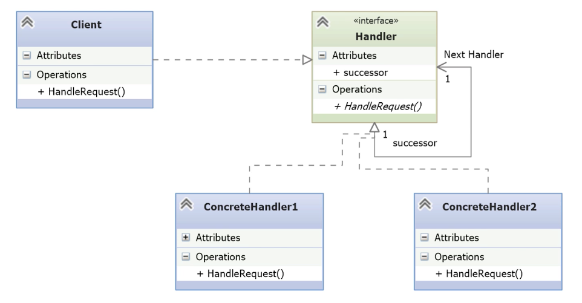

# Chain of Responsibility

- [Before Chain of Responsibility](#before-chain-of-responsibility)
- [Understanding the Chain of Responsibility Pattern](#understanding-the-chain-of-responsibility-pattern)
- [Implementing Chain of Responsibility Pattern](#implementing-chain-of-responsibility-pattern)
- [Replacing a Chain with a List](#replacing-a-chain-with-a-list)

---

- The **Chain of Responsibility** pattern addresses a common problem: handling a sequence of dynamic requests that can be processed by one of multiple handlers.
- It is especially useful when **request handling must be flexible and context-sensitive** — like in graphical applications (e.g., handling mouse clicks depending on position).
- This pattern is **behavioral** and provides an **organized way to delegate** requests across a chain of handlers.

## Before Chain of Responsibility

- The example simulates a **pet request processing system**, where each request corresponds to a specific type of pet.
- Use a Python list for incoming requests.
    
*handleres.py*
```python
def walk_dogs(request):
    print('Dogs love walks!')

def see_cats(request):
    print('People have dogs, cats have staff.')

def clean_tank(request):
    print("I can't find Nemo!")

def check_life(request):
    print('I know a dead parrot when I see one.')
```

- Each function is a **standalone handler** for a specific type of pet request (dogs, cats, fish, birds).
- All functions take a request argument, but it’s **unused in this naive version**.

*\_\_main__.py*
```python
from dataclasses import dataclass
from handlers import walk_dogs, see_cats, clean_tank, check_life

# Define a simple data structure for incoming requests
@dataclass
class Request:
    request_type: str
    request_details: str

# Static list simulating incoming dynamic requests
REQUESTS = [
    Request('dogs', 'walk twice a day'),
    Request('cats', 'see how pretty they are'),
    Request('fish', 'keep the tank clean'),
    Request('parrot', 'check for signs of life')
]

def main():
    for r in REQUESTS:
        # Hardcoded dispatching logic based on request_type
        if r.request_type == 'dogs':
            walk_dogs(r)
        elif r.request_type == 'cats':
            see_cats(r)
        elif r.request_type == 'fish':
            clean_tank(r)
        elif r.request_type == 'parrot':
            check_life(r)
        else:
            print(f'Unknown request type: {r.request_type}')

if __name__ == '__main__':
    main()
```

- Uses a dataclass for request modeling instead of a namedtuple, offering more flexibility.
- The `REQUESTS` list is a simple simulation of real-time dynamic inputs.
- The `main()` function **iterates** through each request and **manually dispatches** to the appropriate handler using if/elif/else.

**⚠️ Problems with the current implementation**

- This approach **violates the Open/Closed Principle**: adding a new pet type requires modifying this logic.
- It leads to **tight coupling** between the request dispatching and the handler implementations.
- The if/elif block grows linearly with the number of request types, reducing maintainability.
## Understanding the Chain of Responsibility Pattern

- The Chain of Responsibility pattern addresses the issues of tightly coupled request handling logic by **decoupling the sender of a request from its potential receivers**.
- Let multiple handlers see each request, and then process them or pass them along to the next handler.



- **Client**
    - The client interfaces with a request `Handler`. 
    
- **Handler (Interface or Abstract Class)**
    - Declares the method `HandleRequest()` that all concrete handlers must implement.
    - Holds a reference to the **next handler** in the chain via the `successor` attribute.
	    - In that case, the interface is not purely abstract.        
    
- **ConcreteHandler1 / ConcreteHandler2**
    - Implement `HandleRequest()` to decide whether to process the request.
    - If not handled, they **delegate** to `self.successor.HandleRequest()` (i.e. the next handler).
    - This keeps the chain moving until a handler processes the request or the end is reached.
## Implementing Chain of Responsibility Pattern

*handlers/abs_handler.py*
```python
import abc

class AbsHandler(abc.ABC):
    # Abstract property to hold the next handler in the chain
    @abc.abstractproperty
    def successor(self):
        pass

    # Abstract method to process the request or pass it to the successor
    @abc.abstractmethod
    def handle(self, request):
        pass
```

- The `AbsHandler` class defines the **abstract interface** for all handlers in the Chain of Responsibility pattern.
	- `successor`: represents the next handler in the chain.
    - `handle()`: enforces that each concrete handler must implement how to process a request.

*handlers/pet_handler.py*
```python
from .abs_handler import AbsHandler

class PetHandler(AbsHandler):

	# Requires a successor during instantiation
    def __init__(self, successor):
        self._successor = successor

	# succesor property has a setter and a getter needed to set up the chain
    @property
    def successor(self):
        return self._successor

    @successor.setter
    def successor(self, successor):
        self._successor = successor

	# Doesn't handle the request, pass it to successor
    def handle(self, request):
        if self.successor:
            self.successor.handle(request)
```

- `PetHandler` is the **base concrete handler** in the chain.
- It holds a reference to the next handler using the successor property.
- The `handle()` method doesn’t process the request—it simply forwards it to the next handler.
- Concrete handlers will override `handle()` and call `super().handle(request)` when they can’t handle the request.

*handlers/cat_handler.py*
```python
from .pet_handler import PetHandler

class CatHandler(PetHandler):
    def handle(self, request):
        # If this handler can process the request, do it
        if request.request_type == 'cats':
            print('People have dogs, cats have staff.')
        else:
            # Otherwise, pass the request along the chain
            super().handle(request)
```


- Each concrete handler subclasses the base handler and overrides `handle()`.
- It checks if it can handle the request based on custom logic.
- If it can, it processes the request and stops the chain.
- If it can’t, it calls `super().handle(request)` to delegate to the next handler.


*handlers/handlers.py*
```python
from .pet_handler import PetHandler
from .cat_handler import CatHandler
from .dog_handler import DogHandler
from .fish_handler import FishHandler
from .parrot_handler import ParrotHandler

# Start the chain with a terminal handler (does nothing if no one handles the request)
handler_chain = PetHandler(None)

# Chain each handler so that each one delegates to the next if it can't handle the request
for handler in (CatHandler, DogHandler, FishHandler, ParrotHandler):
    new_handler = handler(handler_chain)
    handler_chain = new_handler
```

- The chain starts from the _end_ with a base `PetHandler(None)` that acts as a fallback.
- Each handler wraps the current chain, becoming the new head of the chain.
- The loop builds the chain in reverse order—ParrotHandler will be called first, then FishHandler, etc.
- This structure allows:
	- Loose coupling between request sender and handler.    
    - Easy addition or removal of handlers without touching the logic elsewhere.
    - Delegation of responsibility down the chain until a handler processes the request or the chain ends.

*\_\_main__.py*
```python
from dataclasses import dataclass
from handlers.handlers import handler_chain  # Import the head of the chain

@dataclass
class Request:
    request_type: str
    request_details: str

# Simulated incoming requests
REQUESTS = [
    Request('dogs', 'walk twice a day'),
    Request('cats', 'see how pretty they are'),
    Request('fish', 'keep the tank clean'),
    Request('parrot', 'check for signs of life'),
    Request('tarantula', 'Who keeps a tarantula as a pet?')  # This won't be handled
]

def main():
    # Loop through each request and pass it to the first handler in the chain
    for r in REQUESTS:
        handler_chain.handle(r)

if __name__ == '__main__':
    main()
```

- The `Request` dataclass models an incoming request with a type and a detail.
- `handler_chain` is the entry point to the chain of handlers (imported from handlers).
- The `main()` function loops through the list of requests.
- Each request is passed to the first handler in the chain using `handle()`.
- If a handler can process the request, it does so.
- If not, it forwards the request to the next handler in the chain.
- Unrecognized requests (e.g., "tarantula") are silently ignored by the base handler, which terminates the chain.

```bash
ChainOfResponsibility> python .\__main__.py
Dogs love walks!
People have dogs, cats have staff.
I can't find Nemo!
I know a dead parrot when I see one.
ChainOfResponsibility>
```

## Replacing a Chain with a List

- There is an alternative way to build the chain.

```python
for handler in (CatHandler, DogHandler, FishHandler, ParrotHandler):
    new_handler = handler(handler_chain)
    handler_chain = new_handler
```

*handlers/pet_handler.py*
```python
from .abs_handler import AbsHandler

class PetHandler(AbsHandler):
	# Maintain a list of successor handlers instead of a linked chain
    def __init__(self):
        self._successors = []

	# Used to populate the list
    def add_successor(self, successor):
        self._successors.append(successor)

    def handle(self, request):
        # Iterate through the list and delegate the request to each handler
        for s in self._successors:
            # If a handler returns True, stop the chain
            if s.handle(request):
                break

```

- **Successors are stored in a list**, not as linked references.
- The handle method loops over the list and stops when one handler successfully processes the request (i.e. returns `True`).
- Each handler is **fully independent**: it doesn’t know or care about other handlers.
- This version **removes the need for successor references** and simplifies construction.
- The chain is **controlled by the base class**, not by handlers forwarding to each other.

*handlers/dog_handler.py*
```python
from .pet_handler import PetHandler

class DogHandler():
    def handle(self, request):
        if request.request_type == 'dogs':
            print('Dogs love walks!')
            return True  # Signal that the request has been handled
        #else:
        #    super().handle(request)
```

- **No inheritance from PetHandler is needed anymore**:
    - In this variant, `PetHandler` acts as a coordinator, not a base class.
    - Each handler is independent and only needs to implement a `handle()` method.
- **Returns True when it handles a request**:
    - This signals to `PetHandler` that the request has been processed, allowing it to stop iteration.
- **No call to `super().handle()`**:
    - There is no inheritance or explicit chain.
    - Flow control is managed by PetHandler, which loops through a list of handlers.
        
*handlers/handlers.py*
```python
from .pet_handler import PetHandler
from .cat_handler import CatHandler
from .dog_handler import DogHandler
from .fish_handler import FishHandler
from .parrot_handler import ParrotHandler

# Create the coordinator handler (PetHandler will loop through the registered handlers)
handler_chain = PetHandler()

# Add each concrete handler to the coordinator's list of successors
for handler_cls in (CatHandler, DogHandler, FishHandler, ParrotHandler):
    handler_chain.add_successor(handler_cls())
```

