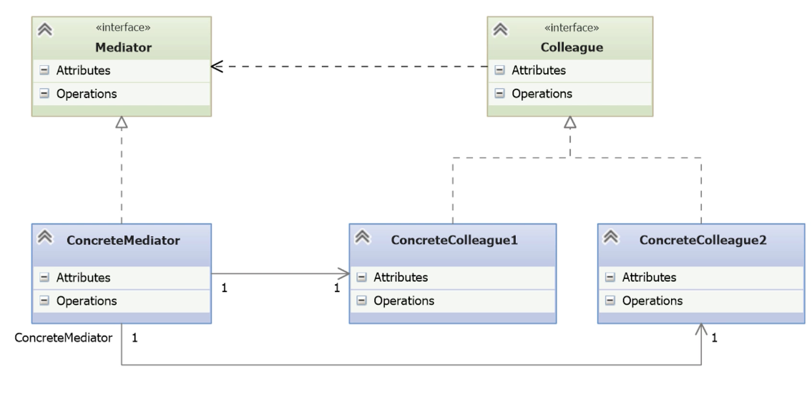

# Mediator

- [Before Mediator](#before-mediator)
- [Understanding the Mediator Pattern](#understanding-the-mediator-pattern)
- [Implementing the Mediator Pattern](#implementing-the-mediator-pattern)
- [Considering the Consequences of Mediator](#considering-the-consequences-of-mediator)

---

- The **Mediator pattern** addresses the complexity that arises when many small objects need to interact with each other in a system.
- In object-oriented design, following the **Single Responsibility Principle** often leads to a large number of focused, decoupled objects.
- However, these objects might need to communicate frequently, leading to a **“spaghetti” of dependencies**, making the system:
    - Hard to maintain
    - Hard to extend
    - Hard to understand
- This scenario introduces **tight coupling** and breaks the **Dependency Inversion Principle**, since each object must know about many others.
- The **Mediator pattern centralizes communication** by having all objects interact through a mediator instead of directly.
- This allows objects to remain independent and modular, while still being able to collaborate efficiently.

>  Real-world analogy: In a GUI (like VS Code), multiple UI components (buttons, tooltips, menus) need to react to each other’s states. Without a mediator, each component must know about all others. With a mediator, they only communicate through a central controller.

## Before Mediator

- The demo simulates a **pet management system** with a **cat**, **dog**, and **fish**, each with different needs depending on:
    - The **time of day** (morning, noon, or night)
    - The **state of other pets** (e.g., the dog only wants a walk if the cat is asleep)
- Interdependencies quickly arise:
    - The **cat** wants in/out based on whether the **fish** is alive
    - The **dog**’s behavior depends on the **cat**
    - The **fish** simply reports whether it’s alive and might need food
- These relationships make the system **highly coupled** and **difficult to maintain**:
    - Pets hold direct references to each other
    - Adding a new pet (e.g., a snake) would require updating all others
    - This creates a **full mesh of dependencies** – a potential “total mess”
    
*\_\_main__.py*
```python
import random
import time

from pets import Cat, Dog, Fish
from times import morning, noon, night

def main():
    # Instantiate the pets
    cat = Cat('Cheshire')
    dog = Dog('Tramp')
    fish = Fish('Nemo')

    # Manually wire up the inter-object references
    cat.dog = dog
    dog.cat = cat
    cat.fish = fish

    # Simulate unpredictable timing
    time.sleep(random.random())

    # Randomly choose time of day
    option = random.randint(-1, 1)
    if option < 0:
        morning(cat, dog, fish)
    if option == 0:
        noon(cat, dog, fish)
    if option > 0:
        night(cat, dog, fish)

if __name__ == '__main__':
    main()
```

- Pets are **manually linked** together via direct references.
- Objects depend **explicitly** on each other, violating **low coupling**.
- Adding or modifying pets increases the complexity exponentially.
- The main program is acting as a fragile **wiring hub**.
- Changes to relationships require touching multiple parts of the codebase.

*pets.py*
```python
import random

class Cat:
    def __init__(self, name):
        self.name = name

    def wants_out(self):
        # Cat's decision depends on whether the fish is alive
        if self.fish.is_alive():
            print(f'let {self.name} in')
        else:
            print(f'let {self.name} out')

    def is_asleep(self):
        # Randomly simulate cat being asleep
        return random.randint(0, 1)


class Dog:
    def __init__(self, name):
        self.name = name

    def wants_walk(self):
        # Dog's decision depends on whether the cat is asleep
        if self.cat.is_asleep():
            print(f'walk {self.name}')


class Fish:
    def __init__(self, name):
        self.name = name

    def needs_food(self):
        print(f'feed {self.name}')

    def is_alive(self):
        # Randomly simulate whether the fish is alive
        return random.randint(0, 1)
```

- Pets are directly referencing each other (`cat.fish`, `dog.cat`), creating **tight coupling**.
- **Behavioral logic** (like walk decisions) is scattered and **interdependent**, making the system fragile.
- If the internal logic or relationships change (e.g. add a Snake), multiple classes need to be edited.
- Pets violate **Single Responsibility Principle**: each class is doing its job _and_ managing awareness of others.
- **No clear separation** between business logic and coordination logic.

*times.py*
```python
def morning(cat, dog, fish):
    print('Morning:')
    cat.wants_out()
    dog.wants_walk()
    fish.needs_food()


def noon(cat, dog, fish):
    print('Noon:')
    cat.wants_out()


def night(cat, dog, fish):
    print('Night:')
    cat.wants_out()
    dog.wants_walk()
```

- Defines the **daily routine** behavior depending on the time of day.    
- Each function (morning, noon, night) simulates the actions pets might take during that time.   
- Hardcodes inter-object calls, reinforcing the **tight coupling** between pet objects — the kind of complexity the Mediator pattern aims to reduce.

**⚠️ Problems with the current implementation**

- **Tight coupling between classes**: Each pet directly accesses the others (e.g. cat.dog, cat.fish, dog.cat), creating strong dependencies.
- **Hard to maintain or extend**: Adding a new pet (like a snake) requires updating all other pets to possibly interact with it, increasing complexity.
- **Violates the Dependency Inversion Principle**: Although classes have single responsibilities, they still depend directly on concrete implementations of other classes.
- **Spaghetti-like structure**: Multiple bidirectional references between small objects result in tangled interdependencies.
- **Monolithic behavior despite modularity**: The program **looks modular**, but the internal logic behaves like a monolith because of direct coordination between objects.
- **Difficult to scale**: As more pets or behaviors are added, inter-object references grow, making the codebase fragile and error-prone.
    
## Understanding the Mediator Pattern

- Objects have many interdependencies.
- Hard to reuse objects with many reference to others.
- Customize behaviour without subclassing.



- **Mediator Interface**
	- Defines the attributes and operations required for any class to act as a mediator.
	- It is a general abstraction that allows decoupling the objects that collaborate with each other.
- **ConcreteMediator
	- Implements the Mediator interface.
    - Knows all the colleague objects and coordinates their interactions.
	- In the pet example, this class is PetHandler, which manages the state and behavior of the cat, dog, and fish without them knowing about each other.
	- Sometimes abstract mediators are not used, since each `ConcreteMediator` is unique
- **Colleague Interface**
	- Defines a common interface for all objects that will interact via the mediator.
	- This abstraction allows treating all collaborating objects uniformly.  
- **ConcreteColleague1 and ConcreteColleague2**
	- Implement the Colleague interface.
	- They no longer communicate directly with each other but through the mediator.
    - In the example, these would be the Cat, Dog, and Fish classes, which now interact with PetHandler instead of being directly coupled.

## Implementing the Mediator Pattern

- A new `PetMediator` class is introduced to manage interactions between pets.
- Each pet now holds a reference to the mediator instead of referencing other pets directly.
- The time-of-day logic (morning, noon, night) is moved from the main program into the mediator, making the main script simpler and better encapsulated.
- Pets are moved to `pets` package.

*pets/asb_pet.py*
```python
import abc

# Abstract base class for all pet types in the Mediator pattern.
class AbsPet(abc.ABC):

    def __init__(self, name):
        self.name = name            # Every pet has a name.
        self.mediator = None        # Reference to the mediator (PetMediator).
```

- It implements a minimal constructor (`__init__`) to:
    - Assign the pet’s name.
    - Define a mediator property (initially `None`), which will be set later to point to the `PetMediator`.
- This structure prepares each pet class to interact **only** via the mediator instead of referencing other pets directly.

*pets/cat.py*
```python
import random
from .abs_pet import AbsPet

# Concrete pet class using the Mediator pattern
class Cat(AbsPet):
    # Initialize awake status randomly
    is_awake = random.randint(0, 1)

    def wants_out(self):
        # Instead of referencing another pet directly,
        # ask the mediator about the fish's status
        if self.mediator.is_fish_alive():
            print(f'Let {self.name} in')
        else:
            print(f'Let {self.name} out')

    def is_asleep(self):
        # Simple helper to check if the pet is sleeping
        return not self.is_awake
```

*pets/dog.py*
```python
import random
from .abs_pet import AbsPet

# Concrete pet class that interacts via the mediator
class Dog(AbsPet):
    def __init__(self, name):
        self.name = name
        self.mediator = None  # Mediator will be assigned externally

    def wants_walk(self):
        # Ask the mediator if the cat is asleep instead of referencing the cat directly
        if self.mediator.is_cat_asleep():
            print(f'Walk {self.name}')
        else:
            print(f'Wake up {self.name}')
            # Ask the mediator to wake up the cat
            self.mediator.wake_up_cat()
```

*pets/fish.py*
```python
import random
from .abs_pet import AbsPet

# Concrete pet class that interacts through the mediator
class Fish(AbsPet):
    def __init__(self, name):
        self.name = name
        self.mediator = None  # The mediator is assigned externally

    def needs_food(self):
        # Ask the mediator whether it is morning instead of checking time directly
        if self.mediator.is_morning():
            print(f'Feed {self.name}')
        else:
            print(f"{self.name} isn't hungry")

    def is_alive(self):
        return random.randint(0, 1)  # Simulates life status randomly
```

- All concrete pet classes now extend a shared abstract base and hold a reference to the mediator instead of each other.
- When they need to interact with another pet (e.g., check if one is alive, asleep, or take action based on time of day), they **ask the mediator**.
- Each pet retains its own local logic but delegates all cross-object coordination to the mediator.

*pets_mediator.py*
```python
class PetMediator:
    def __init__(self, cat, dog, fish):
        # Store references to all ConcreteColleagues
        self.cat = cat
        self.dog = dog
        self.fish = fish

    def time_of_day(self, t):
        # Determine the time of day and trigger appropriate actions
        if t < 0:
            print('Morning:')
            self.morning = True
            self.cat.wants_out()
            self.fish.needs_food()
            self.dog.wants_walk()

        if t == 0:
            print('Noon:')
            self.morning = False
            self.cat.wants_out()

        if t > 0:
            print('Night:')
            self.morning = False
            self.cat.wants_out()
            self.dog.wants_walk()

    # Interface methods to be used by colleagues
    def is_cat_asleep(self):
        return self.cat.is_asleep()

    def is_fish_alive(self):
        return self.fish.is_alive()

    def is_morning(self):
        return self.morning

    def wake_up_cat(self):
        self.cat.is_awake = True
```

- PetMediator acts as the **ConcreteMediator**, coordinating all communication and state access between the pets.
- It holds direct references to the colleague objects (cat, dog, fish), centralizing the collaboration logic.
- `Pets` no longer talk to each other directly. Instead, they use the mediator’s methods (e.g., `is_cat_asleep()`, `is_fish_alive()`) to get information about others or to trigger changes.
- The method `time_of_day(t)` encapsulates all the behavioral logic based on the time. This replaces the scattered logic that used to live in the main script.
- This centralization reduces coupling, increases maintainability, and aligns with **Single Responsibility** and **Open/Closed** principles.

*\_\_main__.py*
```python
import random

from pet_mediator import PetMediator
from pets import Cat, Dog, Fish

def main():
    # Instantiate the ConcreteColleague objects
    cat = Cat('Schrodinger')
    dog = Dog('Pluto')
    fish = Fish('Wanda')

    # Instantiate the ConcreteMediator and inject colleagues
    pm = PetMediator(cat, dog, fish)

    # Set mediator reference in each colleague
    cat.mediator = pm
    dog.mediator = pm
    fish.mediator = pm

    # Simulate random time of day
    t = random.randrange(-1, 2)

    # Trigger behavior via the mediator
    pm.time_of_day(t)

if __name__ == '__main__':
    main()
```

- The `main()` function plays the role of the configuration layer, wiring the objects together.
- Instead of interconnecting the colleagues directly (as in the pre-Mediator example), the mediator is injected into each pet object.
- The logic of behavior (`time_of_day`) is centralized in the mediator, not scattered across the application.
- This ensures **low coupling** between colleague objects and encapsulates the interaction logic within the PetMediator.
- The use of a random value to simulate time abstracts the event triggering mechanism and helps test different scenarios consistently.

## Considering the Consequences of Mediator

| **Benefits**                                                           | **Drawbacks**                                                      |
| ---------------------------------------------------------------------- | ------------------------------------------------------------------ |
| Reduces the need for subclassing                                       | Mediator can become complex if many colleagues are involved        |
| Centralizes logic, simplifying maintenance                             | Centralization may lead to a monolithic, hard-to-maintain mediator |
| Increases reusability by decoupling colleagues                         | Shifts complexity from colleagues to mediator                      |
| Allows colleagues to change independently without affecting each other |                                                                    |
