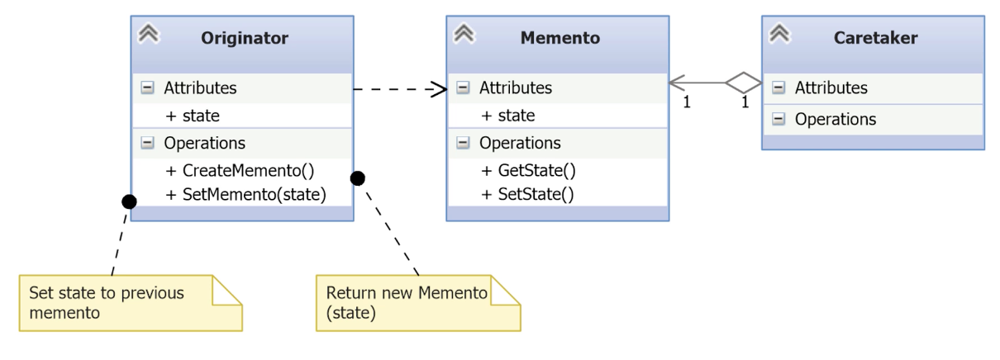

# Memento

- [Before Memento](#before-memento)
- [Understanding the Memento Pattern](#understanding-the-memento-pattern)
- [Implementing the Memento Pattern](#implementing-the-memento-pattern)
- [Summary (memento)](#summary-memento)

---

- The **Memento pattern** addresses the need to **capture and restore the internal state of an object** without violating encapsulation.
- A common use case is in **computer games**, where players can **save and restore progress** at checkpoints.
- This pattern allows **snapshots** of an object’s state to be saved and restored later, either automatically (e.g., periodic autosave) or manually (e.g., before a boss fight).
- It’s useful in any scenario where an application must **return to a known good state** after an error or a user request.
- Crucially, the Memento pattern maintains **encapsulation** — the internal state is saved and restored **without exposing private data**.
- Also known as the **Token pattern** in some contexts.
## Before Memento

*iheeart42.py*
```python
from dataclasses import dataclass
from pickle import dumps, loads

@dataclass
class GameState:
    name: str
    level: int

class I_Heart_42:
    def __init__(self, name):
        self.game_state = GameState(name, 1)

    def save_game(self):
        self.oldstate = dumps(self.game_state)
        return self.oldstate

    def restore_game(self, state):
        self.game_state = loads(state)
```

- **GameState** is a simple data class holding the player’s name and level.
- The class **I_Heart_42** represents the game logic:
    - It starts the game at level 1.
    - `save_game()` uses `pickle.dumps()` to serialize the current game state and store it.
    - `restore_game()` deserializes a previously saved state using `pickle.loads()` and restores it.

*\_\_main__.py*
```python
from iheart42 import I_Heart_42
import random

def main():
    g = I_Heart_42('Arthur')

    # Show current game state
    print(f'Hero: {g.game_state.name}, Game level: {g.game_state.level}')
    saved_game = g.save_game()

    # Change the game state
    g.game_state.level = random.randint(1, 42)
    g.game_state.name = 'Ford'
    print(f'Hero: {g.game_state.name}, Game level: {g.game_state.level}')

    # Restore the old game state
    g.restore_game(saved_game)
    print(f'Hero: {g.game_state.name}, Game level: {g.game_state.level}')

if __name__ == '__main__':
    main()
```

```bash
BeforeMemento> python .\__main__.py
Hero: Arthur, Game level: 1
Hero: Ford, Game level: 29
Hero: Arthur, Game level: 1
BeforeMemento>
```

- While this solution works, it has **two key drawbacks**:
	1. The game class becomes responsible for serialization logic, violating the **Single Responsibility Principle**.
    2. It **tightly couples** the core logic with state handling, making future extensions (e.g. named saves, persistent storage) harder.
## Understanding the Memento Pattern



- **Originator**:
	- The object whose internal state we want to save and restore.
	- Implements `CreateMemento()` to take a snapshot.
	- Implements `SetMemento(memento)` to restore a previous state.
- **Memento**:
	- Stores the internal state of the Originator.
	- It may include methods like `GetState()` / `SetState()`.
	- Doesn’t expose state manipulation to external classes.
- **Caretaker**:
	- Maintains a reference to the Memento object.
	- It has no access to the internals of the Memento.
	- Can only store and pass it back to the Originator.
## Implementing the Memento Pattern

*memento.py*
```python
from pickle import dumps, loads

class Memento:
    def set_state(self, state):
        # Serializes the game state and stores it privately.
        self._caretaker = dumps(state)

    def get_state(self):
        # Deserializes and returns the previously stored game state.
        return loads(self._caretaker)
```

- **Purpose**: This class encapsulates a snapshot of the state of another object (the _Originator_) so that it can be restored later without exposing its internal structure.
- `set_state(state)`:
    - Accepts the state to be saved (e.g., a game state).
    - Uses `pickle.dumps()` to serialize the state and store it in _caretaker.
    - Serialization makes the state independent of object structure.
- `get_state()`:
    - Retrieves and deserializes the saved state using pickle.loads().
    - Returns it to be used by the originator to restore itself.
- **Encapsulation**: The actual structure of the state is hidden from other classes (like the _Caretaker_). Only the originator knows what to store or retrieve.

*iheart42.py*
```python
from memento import Memento
from dataclasses import dataclass
from pickle import dumps, loads

@dataclass
class GameState:
    name: str
    level: int

class I_Heart_42:
    def __init__(self, name):
        # Initialize the internal state
        self.game_state = GameState(name, 1)

    def create_memento(self):
        # Create a Memento object and store current state
        memento = Memento()
        memento.set_state(self.game_state)
        return memento

    def set_memento(self, memento):
        # Restore internal state from a Memento
        self.game_state = memento.get_state()
```

- `create_memento()`:
    - Creates a new instance of the Memento class.
    - Passes the current game_state to `set_state()`, which serializes and stores it.
    - Returns the Memento to the caller (usually the caretaker).
- `set_memento(memento)`:
    - Receives a Memento instance.
    - Calls `get_state()` to retrieve the previously saved state.
    - Restores this state into self.game_state.
        
*\_\_main__.py*
```python
from iheart42 import I_Heart_42
import random

def main():
    g = I_Heart_42('Arthur')

    # Save initial game state
    print(f'Hero: {g.game_state.name}, Game level: {g.game_state.level}')
    memento = g.create_memento()

    # Modify the game state
    g.game_state.level = random.randint(1, 42)
    g.game_state.name = 'Ford'
    print(f'Hero: {g.game_state.name}, Game level: {g.game_state.level}')

    # Restore the game state from memento
    g.set_memento(memento)
    print(f'Hero: {g.game_state.name}, Game level: {g.game_state.level}')

if __name__ == '__main__':
    main()
```

```bash
Memento> python .\__main__.py
Hero: Arthur, Game level: 1
Hero: Ford, Game level: 35
Hero: Arthur, Game level: 1
Memento>
```

- **Checkpoint**: The line `memento = g.create_memento()` creates a snapshot of the current game state.
- **Mutation**: The name and level are changed, simulating in-game progress or failure.
- **Rollback**: With `g.set_memento(memento)`, we restore the state back to the saved checkpoint.
- Any change in the logic to save the game (savegame name, etc) will be implemented in the `Memento` class without affecting the game logic.

## Summary (Memento)

| **Benefits**                        | **Drawbacks**                                |
| ----------------------------------- | -------------------------------------------- |
| Preserves encapsulation             | Using mementos might be costly               |
| Simplifies the Originator class     | Caretaker class can be memory intensive      |
| Easy-to-implement state restoration | Python introspection can break encapsulation |
