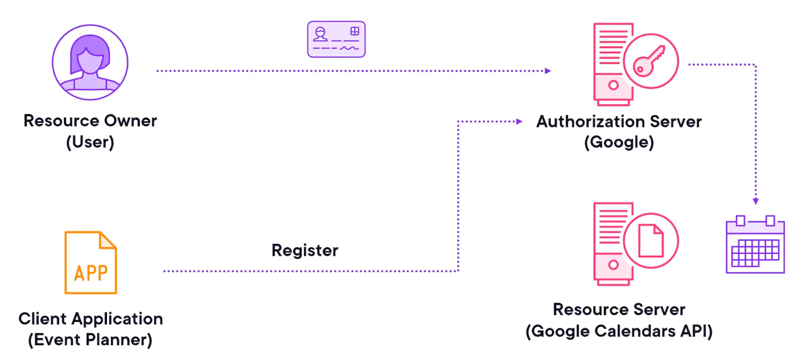

# Authenticating Requests for Secure APIs

## 6.1 Using HTTP Basic Authentication

- **Purpose:** Restricts access to resources using a username/password pair.

- **Mechanism:**    
    - Server responds with WWW-Authenticate header requesting credentials.
    - Client sends Authorization header with Base64-encoded username:password.
        
- **Browser behavior:** Prompts user for credentials when accessing protected routes.


- **Requests library:**
    - Simplest form: `requests.get(url, auth=("username", "password"))`
    - Or explicitly: from `requests.auth` import `HTTPBasicAuth` and use `auth=HTTPBasicAuth(user, pass)`.
    - Defaults to Basic Auth if a tuple is passed.

```python
import requests
from requests.auth import HTTPBasicAuth

username = "username"
password = "pass"

response = requests.get(
    "http://localhost:8000/protected-endpoint",
    auth=HTTPBasicAuth(username, password),
)

print(response.text)
```

```bash
❯ python script.py
{"message":"Welcome, authenticated user!"}
```
    
- Other authentication types (digest, proxy) can also be set via `auth` argument.

## 6.2 OAuth2 and the requests-oauthlib Library


- **Purpose:**
    - Allows secure, delegated access to a user’s resources on another service without sharing their password.
    - It provides a secure and efficient way for users to authorize third‑party applications to access their data stored on different services.
    - Widely used for APIs like Google, GitHub, Microsoft, etc.

### OAuth 1.0

- **[OAuth1](https://requests.readthedocs.io/en/latest/user/authentication/#oauth-1-authentication)** is the original version of the protocol, and it is easy to implement with the requests library.

```python
import requests
from requests_oauthlib import OAuth1

url = 'https://api.twitter.com/1.1/account/verify_credentials.json'
auth = OAuth1('YOUR_APP_KEY', 'YOUR_APP_SECRET',
              'USER_OAUTH_TOKEN', 'USER_OAUTH_TOKEN_SECRET')

requests.get(url, auth=auth)
<Response [200]>
```

- Most websites and services today use **[OAauth2](https://requests.readthedocs.io/en/latest/user/authentication/#oauth-2-and-openid-connect-authentication)**, which is the most recent version of the protocol.

- It is required to install the oauth library.

```bash
pip install requests-oauthlib
```

### OAuth 2.0
#### Roles

- **Client Application:** Our app (e.g., _Event Planner_).
- **Resource Owner:** The user of the application. He has an account in another service (e.g., Google).
	- Google will be the third-party service that has resources which we need to access (e.g., a calendar).
- **Authorization Server:** Handles user consent & issues tokens (e.g., Google).
- **Resource Server:** Stores the protected resources (e.g., Google Calendar).
    
#### Core Flow (Authorization Code Grant)




1. **Register Application:** Register the client application on the third-party service. 
	- On the provider’s developer console.
	- Get `client_id`, `client_secret` (name and password for applications), set redirect URI, define scopes, and response type.
		- The **scope** determines the scope of access we want to have on the user's account (e.g., edit calendar).
		- The **response type** determines the type of authorization we want to implement.
			- Authorization code, token, id_token, etc.

2. **Generate Authorization URL:** Generates the authorization URL for the user. 
	- It is generated with the help of our client credentials. Include client_id, redirect_uri, scope, state (CSRF token). User is redirected here.
	- When users follow this url, Google will know that we are the ones who redirected them to do so.
	
3. **User Consent:** If the users are not logged in, the third-party service (Google) will ask them to do that first.
	- Log in (if not already).
	- Approves requested scopes in the presented consent screen.
		- Ask the user if they are willing to grant access to our application with the scope set during registration (edit calendar.


4. **Redirect to Callback URI:** If the user agrees, the third-party service will redirect them to the redirect URI we provided during registration.
	- This callback URI is one of the endpoints we defined in our own server.
	- The third-party service will pass the authorization code inside the query parameters, along with the scope and the state, which is a CSRF token.
	- This code is the authorization code we need to access users' resources, and we can get it from the URL because the callback endpoint is in our server.
	- At this point, the callback URL can show a successful message to the user.


5. **Exchange Code for Token:** Our backend sends the authorization_code + client_id + client_secret to get an **Access Token** (and optionally a Refresh Token or ID Token for OpenID).
	- If we are implementing OpenID, we will also get a JSON Web Token with the users' data.


5. **Access Protected Resource:** Use the Access Token in the Authorization: `Bearer <token>` header to call the provider’s API.
	- We can use the token to access the resource in the defined scope (edit calendar).
	- We can use the Google API to edit events on the calendar on user's behalf.
        
- **Security Benefits:**
    - User credentials are never shared with the client application.
    - Access can be limited to certain scopes and revoked anytime.
        
- **Implementation Notes:**
    - Requires the requests-oauthlib package.
    - OAuth 2 is now the standard; OAuth 1 is largely obsolete except in legacy integrations.
    - Tokens expire; use refresh tokens if long-term access is needed.  

**Key takeaway:** OAuth2 separates authentication from authorization, enabling secure delegated API access for third-party apps.

## 6.3 Leveraging OAuth2 for Data Retrieval

- **Goal:** Use OAuth2 to securely retrieve a user’s Google Calendar data without storing their credentials.
    
- **Setup:**
    - Register your application in **Google Cloud**.
    - Configure the **OAuth consent screen** (External), set **scope** (/auth/calendar.events), and enable **Google Calendar API**.
    - Restrict test users and create an **OAuth Client ID** for a web app with a **redirect URI** (callback endpoint).
    - Obtain **Client ID** and **Client Secret** (store securely, ideally in environment variables).

```python
from requests_oauthlib import OAuth2Session
import json

# Ideally this would be stored securely, e.g., in environment variables
client_id = "614002997667-6impli59piqsu9m0ulkuvq8bhvv76jc3.apps.googleusercontent.com"
redirect_uri = "https://127.0.0.1:8000/callback"
authorization_base_url = "https://accounts.google.com/o/oauth2/auth"
token_url = "https://oauth2.googleapis.com/token"
scope = ["https://www.googleapis.com/auth/calendar"]

# 1. Initialize OAuth2Session
oauth = OAuth2Session(client_id, redirect_uri=redirect_uri, scope=scope)

# 2. Generate an authorization URL
authorization_url, state = oauth.authorization_url(
    authorization_base_url, prompt="consent"
)

# 3. Redirect the user to the authorization URL
print("Please go here and authorize access:", authorization_url)
redirect_response = input("Paste the full redirect URL here: ")

# 4. Fetch the access token
token = oauth.fetch_token(
    token_url,
    authorization_response=redirect_response,
    client_secret="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F",
)

# 5. Make an authenticated API request
response = oauth.get("https://www.googleapis.com/calendar/v3/users/me/calendarList")
data = response.json()

filename = "data.json"
with open(filename, "w") as file:
    json.dump(data, file, indent=4)

```

```bash
❯ python script.py
Please go here and authorize access: https://accounts.google.com/o/oauth2/auth?response_type=code&client_id=680586818467-h8suv78t4vl53oe039pu8ttm4ro6mamf.apps.googleusercontent.com&redirect_uri=https%3A%2F%2F127.0.0.1%3A8000%2Fcallback&scope=https%3A%2F%2Fwww.googleapis.com%2Fauth%2Fcalendar&state=GQJxjdkjkH9vgkiQTaurTHK9QTF6VF&prompt=consent

Paste the full redirect URL here: https://127.0.0.1:8000/callback?state=GQJxjdkjkH9vgkiQTaurTHK9QTF6VF&code=4%2F0AfJohXnry30UAXpB4cKwMjsZDw1zswooClJwH16KSSkWvffvcIg&scope=https://www.googleapis.com/auth/calendar
```

**Flow**

1. Initialize `OAuth2Session` with `client ID`, redirect URI, and scope.

2. Generate an **authorization URL** with `prompt='consent`' to always show the consent screen.
	- The `state` is just a CSRF token that we don't have to use here, but if we had a real server and we had to process the authorization code from the callback endpoint, we would first compare the state from `redirect_url` to this state to make sure no one is trying to trick us.


3. User logs in, approves scope, and is redirected to the callback URL with an **authorization code**.
	- As we don't have a server, the callback endpoint is not implemented, so we ask the user to paste the full redirect URL in the terminal

4. Application exchanges the code for an **access token** using `fetch_token()`.
	- After getting the redirect response, we need to prove it to the `fetch_token()` method with the `token_url` and the `client_secret`.
	- This method will give us back the access token from Google.

5. OAuth sessions store this token internally, so we don't need to use it directly.
    
- **Security Notes:**
    - Always validate the state parameter to protect against CSRF.
    - Never hard-code secrets in code.

## 6.4 Implementing Custom Authentication Methods

```python
import requests
from requests.auth import AuthBase

# Authorization: Bearer <token>
class JWTAuth(AuthBase):
    def __init__(self, token):
        self.token = token

    def __call__(self, request):
        request.headers["Authorization"] = f"Bearer {self.token}"
        return request

token = "abcde123"
response = requests.get(
    "http://127.0.0.1:8000/jwt-protected-route",
    auth=JWTAuth(token)
)

print(response.text)
```

```bash
❯ python script.py
{"message":"Access to protected route granted"}
```

- You can create custom authentication classes when your system uses a method not supported by the Requests library or its extensions.
    
- Example shown: **JWT (JSON Web Token) authentication**.
	- Once the server sends the token, we need to include it the requests authorization headers like: `Bearer <token>`.

- Instead of manually adding the token to each request, use a dedicated class for **separation of concerns** (`JWTAuth`).

**Process**

1. Import and extend `AuthBase` from Requests.

2. We can extend `AuthBase` class to store the token: `JWTAuth`
	- Create a constructor (`__init__`) that stores the token.
	- Implement the `__call__` method to inject the Authorization: `Bearer <token>` header into the request.
        
3. When passed to Requests, the class instance automatically adds the header before each request: `auth=JWTAuth(token)`.
	- This will trigger the `__call__` method, which will add the header to the request with the internal token.

## 6.5 Ensuring Data Privacy with HTTPS

- **TLS/SSL**: Protocols for secure internet connections. HTTPS indicates TLS is used.
    
- **Certificates**:    
    - Server sends SSL/TLS certificate for client verification.
    - Must be issued by a trusted Certificate Authority (CA).
    - Browsers keep updated CA bundles; Requests uses Mozilla’s bundle via the certifi library.
        
- **Requests behavior**:
    - Automatically verifies certificates for HTTPS requests.
    - Raises SSLError if invalid.
    
- **Custom verification**:
    - Can disable verification with verify=False _(not recommended in production)_.
    - Can provide custom CA bundle path via verify=path.
    - Useful in corporate/internal networks or self-signed certs for dev/testing.
        
- **Client certificates**:
    - Provide both cert and key paths to Requests.
    - Enables **mutual TLS** for extra security (client verification).
    - Common in B2B, API Gateways, IoT, internal networks.

**HTTPS and SSL/TLS Certificates**

- Using TLS by default. If the verification failed, it will raise SSLError

```python
response = requests.get("https://www.weather.com/my-town")
```

- Disable verification if needed (not recommended for production)

```python
response = requests.get("https://www.weather.com/my-town", verify=False)
```

- Provide a custom CA bundle

```python
response = requests.get("https://www.weather.com/my-town", verify="/bundle_path")
```

- Some servers require client certificates

```python
response = requests.get("https://www.weather.com/my-town", cert=("/cert_path", "/key_path"))
```