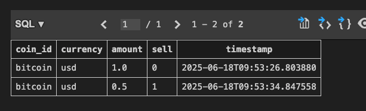
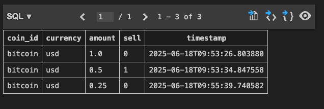
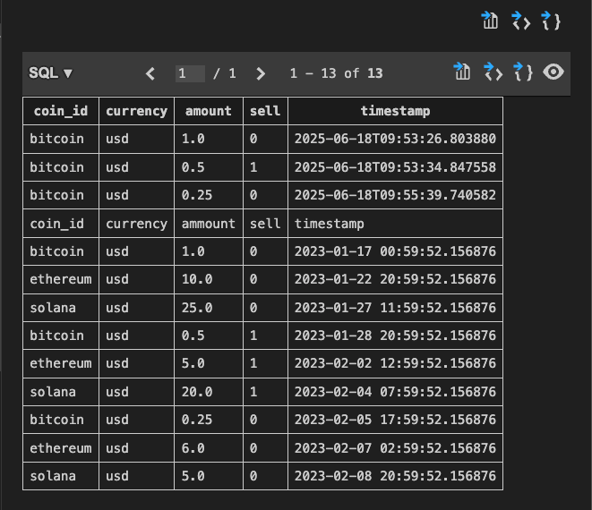

# CLI command to add rows

1. The staring point has a command registered for the function that gives the coin price.

```python
import click
import requests


def get_coin_price(coin_id, currency):
	url = (
		f"https://api.coingecko.com/api/v3/simple/price"
		f"?ids={coin_id}&vs_currencies={currency}"
	)
	data = requests.get(url).json()
	coin_price = data[coin_id][currency]
	return coin_price

# A command group allowing for multiple commands to be added later
@click.group()
def cli():
	pass

@click.command()
@click.option("--coin_id", default="bitcoin")
@click.option("--currency", default="usd")
def show_coin_price(coin_id, currency):
	coin_price = get_coin_price(coin_id, currency)
	print(f"The price of {coin_id} is {coin_price:.2f} {currency.upper()}")

# Register the command with the CLI group
cli.add_command(get_coin_price)
  
# Register the CLI group as the main entry point
if __name__ == "__main__":
	cli()
```

```bash
❯ python main.py get-coin-price
The current price of bitcoin is 105459.00 USD
❯ python main.py get-coin-price --coin_id=ethereum --currency=eur
The current price of ethereum is 2200.85 EUR
```

2. Import squlite3 and database setup in main

```python
import 
...
# SQL command to create the investments table if it doesn't exist
CREATE_INVESTMENTS_SQL = """
CREATE TABLE IF NOT EXISTS investments (
	coin_id TEXT NOT NULL,
	currency TEXT NOT NULL,
	amount REAL NOT NULL,
	sell INTEGER NOT NULL,
	timestamp TEXT NOT NULL
);
"""

...

if __name__ == "__main__":
	# Connect to the SQLite database and create the investments table if it doesn't exist
	database = sqlite3.connect("portfolio.db")
	# Create a cursor object to execute SQL commands
	cursor = database.cursor()
	# Create the investments table
	cursor.execute(CREATE_INVESTMENTS_SQL)
	cli()
```

3. Define the function to insert rows (investments) into the table, and register it as a command

```python
# cli funcion to add an investment (buy or sell)
@click.command()
@click.option("--coin_id")
@click.option("--currency")
@click.option("--amount", type=float)
@click.option("--sell", is_flag=True)
def add_investment(coin_id, currency, amount, sell):
	# Parametrized SQL query to insert a new investment record
	sql = "INSERT INTO investments VALUES (?, ?, ?, ?, ?);"
	# Row values into a tuple
	values = (coin_id, currency, amount, sell, datetime.datetime.now().isoformat())
	# Execute the SQL command with the provided values
	cursor.execute(sql, values)
	# Commit the changes to the database
	database.commit()
	if sell:
		print(f"Added sell of {amount} {coin_id}")
	else:
		print(f"Added buy of {amount} {coin_id}")

...

cli.add_command(add_investment)
```

4. Use the cli command to create a new entry in the table

```bash
❯ python main.py add-investment --coin_id=bitcoin --currency=usd --amount=1.0
Added buy of 1.0 bitcoin
❯ python main.py add-investment --coin_id=bitcoin --currency=usd --amount=0.5 --sell
Added sell of 0.5 bitcoin
```




# How results are returned

- The result of ```fetchall()``` data is a **list of tuples**
- The sell column flag is an integer
- Python does not know SQL timestamp, so it returns a string

```bash
In [1]: import sqlite3

In [2]: database = sqlite3.connect("portfolio.db")

In [3]: cursor = database.cursor()

In [4]: restult = cursor.execute("SELECT * FROM investments;")

In [5]: data = result.fetchall()

In [6]: data
Out[6]:
[('bitcoin', 'usd', 1.0, 0, '2025-06-18T08:58:00.159147'),
 ('bitcoin', 'usd', 0.5, 1, '2025-06-18T09:07:10.950008')]
```


# Get the values using a cli

- The key is processing a a list of tuples given by fetchall()

```python
# Function to get the total investment for a specific coin and currency
@click.command()
@click.option("--coin_id")
@click.option("--currency")
def get_investment_value(coin_id, currency):
	# Get the current price of the coin in the specified currency
	coin_price = get_coin_price(coin_id, currency)
	# Parametrized SQL Query to get the investments for buy and sell
	sql = """SELECTA amount
	FROM investments
	WHERE coin_id = ?
	AND currency = ?
	AND sell=?;"""
	# Get the buy/sell investements
	buy_result = cursor.execute(sql, (coin_id, currency, False)).fetchall()
	sell_result = cursor.execute(sql, (coin_id, currency, True)).fetchall()
	# As fetchall returns a list of tuples, we need to sum the amounts
	buy_amount = sum(row[0] for row in buy_result)
	sell_amount = sum(row[0] for row in sell_result)
	total = buy_amount - sell_amount
	print(
		f"You own a total of {total} {coin_id} worth {total * coin_price:.2f} {currency.upper()}"
	)

...

# Register the command
cli.add_command(get_investment_value)
```

```bash
❯ python main.py get-investment-value --coin_id=bitcoin --currency=usd
Current price of bitcoin in usd is 104978.00
You own a total of 0.5 bitcoin worth 52489.00 USD
❯ python main.py add-investment --coin_id=bitcoin --currency=usd --amount=0.250
Added buy of 0.25 bitcoin
❯ python main.py get-investment-value --coin_id=bitcoin --currency=usd
Current price of bitcoin in usd is 104952.00
You own a total of 0.75 bitcoin worth 78714.00 USD
```



- If no results for a query, ```fetchall()``` will return an empty list

```bash
❯ python main.py get-investment-value --coin_id=bitcoin --currency=eur
Current price of bitcoin in eur is 91159.00
You own a total of 0 bitcoin worth 0.00 EUR
```

# Importing a list of rows

- ```executemany()``` can take a list of rows to import, instead iterating with ```execute()```

```python
@click.command()
@click.option("--csv_file")
def import_investments(csv_file):
	with open(csv_file, "r") as f:
		rdr = csv.reader(f, delimiter=",")
		# Turns each row into a list
		rows = list(rdr)
		# Parametrized SQL query to insert a new investment record
		sql = "INSERT INTO investments VALUES (?, ?, ?, ?, ?);"
		# Instead of iterating over the rows, we can use executemany to insert all rows at once
		cursor.executemany(sql, rows)
		database.commit()
		print(f"Imported {len(rows)} investments from {csv_file}")

...

cli.add_command(import_investments)
```

- Import Example csv investments.csv

```csv
coin_id,currency,ammount,sell,timestamp
bitcoin,usd,1.0,0,2023-01-17 00:59:52.156876
ethereum,usd,10.0,0,2023-01-22 20:59:52.156876
solana,usd,25.0,0,2023-01-27 11:59:52.156876
bitcoin,usd,0.5,1,2023-01-28 20:59:52.156876
ethereum,usd,5.0,1,2023-02-02 12:59:52.156876
solana,usd,20.0,1,2023-02-04 07:59:52.156876
bitcoin,usd,0.25,0,2023-02-05 17:59:52.156876
ethereum,usd,6.0,0,2023-02-07 02:59:52.156876
solana,usd,5.0,0,2023-02-08 20:59:52.156876
```

```bash
❯ python main.py import-investments --csv_file=investments.csv
Imported 10 investments from investments.csv
```

>Included headers by mistake

