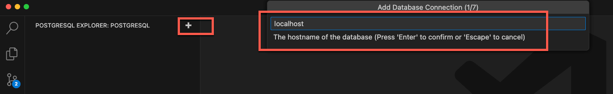
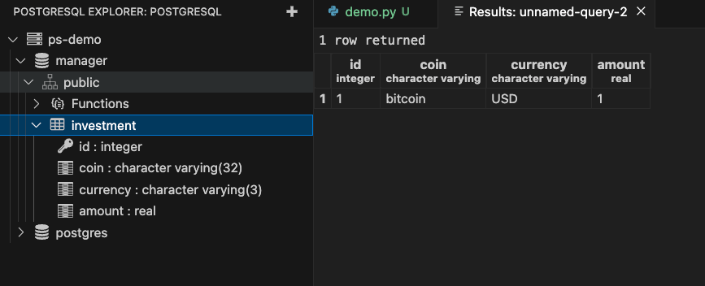
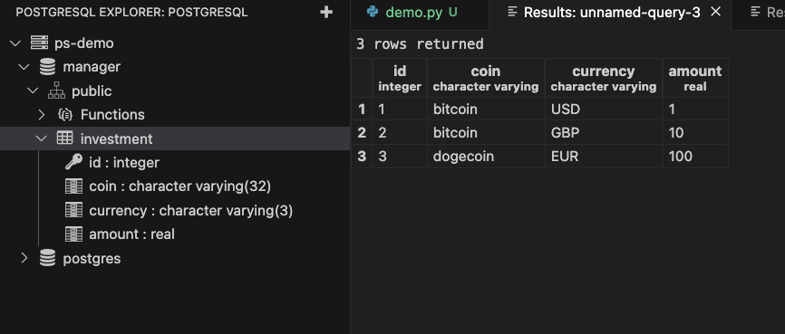

# Connecting to the db in VSCode

- In the VSCode Postgres extension click add and select the location of the database, ```localhost``` in this case, as we are running Postgres in a container.




# Connect to the db using psycopg3

- Install psycopg2
```bash
pip install psycopg2-binary
```

- Connect to the database

```python
import psycopg2

# Connect to the PostgreSQL database
connection = psycopg2.connect(
	host="localhost",
	database="manager",
	user="postgres",
	password="PGpassword"
)

# Get the cursor from the connection to interact with the database
cursor = connection.cursor()
```

- SQL query to create the investment table
	- serial is an internal autoincremental int
	- real is the Postgres equivalent to float

```python
create_investment_table = """
create table investment (
	id serial primary key,
	coin varchar(32),
	currency varchar(3),
	amount real
)
"""
```

- Send changes and commit.
	⚠️ Make sure commit on the connection and not the cursor
- Close the cursor and connection

```python
# Execute the SQL query to create the investment table
cursor.execute(create_investment_table)

# Commit the changes to the database
connection.commit()

# Close the cursor and connection
cursor.cl
connection.close()
```


# Instert a new row into the database

- SQL query to add one investment to the table

```python
# Add one row to the investment table
add_bitcoin_investment = """
insert into investment (
	coin, currency, amount
) values (
	'bitcoin', 'USD', 1.0
);
"""

# Execute the SQL query to add a row to the investment table
cursor.execute(add_bitcoin_investment)

connection.commit()
cursor.close()
connection.close()
```


# Insert multiple rows

- Use a parametrized SQL statement

```python
# Parameterized SQL query to add multiple rows to the investment table
add_investment_template = """
insert into investment (
	coin, currency, amount
) values %s;
"""

# We pass the values in al list of tuples
data = [
	("bitcoin", "GBP", 10.0),
	("dogecoin", "EUR", 100.0),
]
```

- We will use a special function called ```ececute_values()``` found in the ```psycopg2.extras``` module, to merge the template and the data, and execute all the inserts in one call.

```python
import psycopg2.extras

...

# Execute the SQL query with the cursor, template, and values to create the investment table
psycopg2.extras.execute_values(cursor, add_investment_template, data)

connection.commit()
cursor.close()
connection.close()
```

