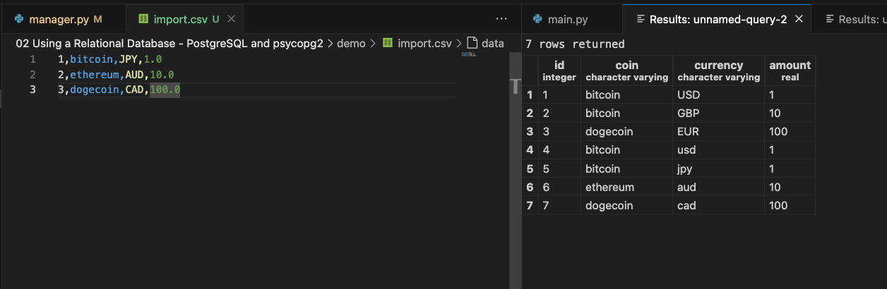

# Objective

[[Courses/python-advanced-learning/Working with Databases in Python/02 Using a Relational Database - PostgreSQL and psycopg2/demo/manager.py]]

- Connect to a PostgreSQL database from a CLI using psycopg2.
- Reuse the get_connection() function to avoid duplicating connection code.
- Insert a new investment using the new-investment command with click.
- Import multiple investments from a CSV file using the import-investments command with execute_values.
- Query investments and calculate their current value with view-investments, using CoinGecko and RealDictCursor.
- Use a dataclass to map database rows to objects with named fields.
- Run and test commands from the terminal with prompts and options (--currency, --filename, etc.).

# ```get_connection()```function

- The get_connection function is a convenience so that we don't have to duplicate the connection code in every single command.

```python
def get_connection():
	connection = psycopg2.connect(
		database="manager",
		user="postgres",
		password="PGpassword",
		host="localhost",
	)
	return connection
```

# Insert: new_investment command

1. Define SQL
2. Get connection and cursor
3. Execute SQL
4. Close connection and cursor

- The ```prompt``` keyword argument set to True will prompt the user for an option if it is omitted in the invokation.
- The SQL statement normalize values to lowercase

```python
@cli.command()
@click.option("--coin", prompt=True)
@click.option("--currency", prompt=True)
@click.option("--amount", prompt=True)
def new_investment(coin, currency, amount):
# Create a new investment in the database normalizing to lowercase
	smt = f"""
		insert into investment (
			coin, currency, amount
		) values (
			'{coin.lower()}', '{currency.lower()}', {amount}
		)
	"""
	# Get the connection to the database and cursor
	connection = get_connection()
	cursor = connection.cursor()
	# Execute the SQL statement and commit
	cursor.execute(smt)
	connection.commit()
	# Close the cursor and connection
	cursor.close()
	connection.close()
	
	print(f"Added investment for {amount} {coin} in {currency}.")
```

```bash
❯ python manager.py new-investment
Coin: bitcoin
Currency: USD
Amount: 1.0
Added investment for 1.0 bitcoin in USD.
```


# Import multiple rows: 

1. Create the statement taking the values as a paremeter
2. Create connection
3. Read the file
	- The csv file name is accepted as a parameter with flag ```---filename```
	- The reader loads the rows and omit the ID in each row
	- Normalized to lowercase
4. Instert the rows with ```psycopg2.extras```
5. Close the connection

```python
@click.command()
@click.option("--filename")
def import_investments(filename):
	# Statement to insert multiple rows into the investment table taking the values as a parameter
	stmt = "insert into investment (coin, currency, amount) values %s"
	
	# Get the connection to the database and cursor
	connection = get_connection()
	cursor = connection.cursor()

	# Read the CSV file and prepare the data for insertion omiting ID
	with open(filename, "r") as f:
		coin_reader = csv.reader(f)
		rows = [[x.lower() for x in row[1:]] for row in coin_reader]
		print(f"Added {len(rows)} investments from {filename}.")

	# Use psycopg2.extras.execute_values to insert multiple rows at once
	psycopg2.extras.execute_values(cursor, stmt, rows)

	# Commit the changes and close the cursor and connection
	connection.commit()
	cursor.close()
	connection.close()
```


```bash
❯ python manager.py import-investments --filename import.csv
Added 3 investments from import.csv.
```



# Read values

- ```view_investments``` without parameters will select all the investments in the table.
- If currency is provided, it will get only investments in that currency.

1. Get the connection and the cursor
	- In this case use the use the ```RealDictCursor``` factory in the ```psycopg2.extras``` module to make it easier to work with the data
2. Create SQL statement to get all investments
	- Append a where to filter by currency if the parameter is provided
3. Use the cursor to execute the statement
4. Convert the row to dict and unpack in Investment object
5. Close the connection and cursor
6. Get the coin prices
7. Compute the investment value

```python
@click.command()
@click.option("--currency",)
def view_investments(currency):
	# Get the connection to the database and cursor using RealDictCursor for easy access
	connection = get_connection()
	cursor = connection.cursor(cursor_factory=psycopg2.extras.RealDictCursor)

	# Create a SQL query to select all investments
	stmt = "select * from investment"

	# If currency is provided, filter the investments by currency, by appending a WHERE clause
	if currency:
		stmt += f" where currency = '{currency.lower()}'"

	# Use the cursor to execute the SQL statement
	cursor.execute(stmt)  

	# For each row in the result, create an Investment object
	data = [Investment(**dict(row)) for row in cursor.fetchall()]
	  
	# Close the cursor and connection
	cursor.close()
	connection.close()

	# Get the coin names and currencies from the data, unique them, and fetch their current prices from CoinGecko
	coins = set([row.coin for row in data])
	currencies = set([row.currency for row in data])
	url = f"https://api.coingecko.com/api/v3/simple/price?ids={','.join(coins)}&vs_currencies={','.join(currencies)}"
	coin_data = requests.get(url).json()

  
	# For each investment, get the price for the coin and compute the total value in the specified currency
	for investment in data:
		coin_price = coin_data[investment.coin][investment.currency.lower()]
	coin_total = investment.amount * coin_price
		print(
			f"{investment.amount} ({investment.coin}) in {investment.currency} is worth {coin_price:.2f} = {coin_total:.2f} {currency}"
		)
```

```bash
❯ python manager.py view-investments
1.0 (bitcoin) in USD is worth 104913.00 = 104913.00 None
10.0 (bitcoin) in GBP is worth 78134.00 = 781340.00 None
100.0 (dogecoin) in EUR is worth 0.15 = 14.77 None
1.0 (bitcoin) in usd is worth 104913.00 = 104913.00 None
1.0 (bitcoin) in jpy is worth 15286950.00 = 15286950.00 None
10.0 (ethereum) in aud is worth 3926.33 = 39263.30 None
100.0 (dogecoin) in cad is worth 0.23 = 23.24 None

❯ python manager.py view-investments --currency USD
1.0 (bitcoin) in usd is worth 104911.00 = 104911.00 USD
```