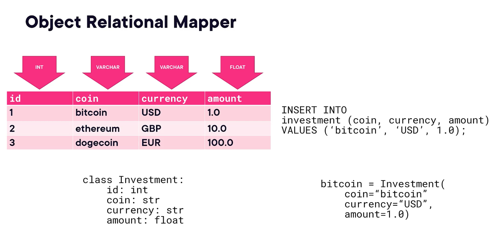

### **ORM**
- Object Relational Mapper
- Maps Python objects to database tables
- Lets you **interact with the database using classes instead of raw SQL**


### **SQLAlchemy**
- Popular Python library for database access
- Offers two interfaces:
    - **Core API** for building SQL statements
    - **ORM** for mapping classes to tables
- Allows switching databases with minimal code changes


```cardlink
url: https://docs.sqlalchemy.org/en/20/
title: "SQLAlchemy Documentation —    SQLAlchemy 2.0 Documentation"
host: docs.sqlalchemy.org
```
