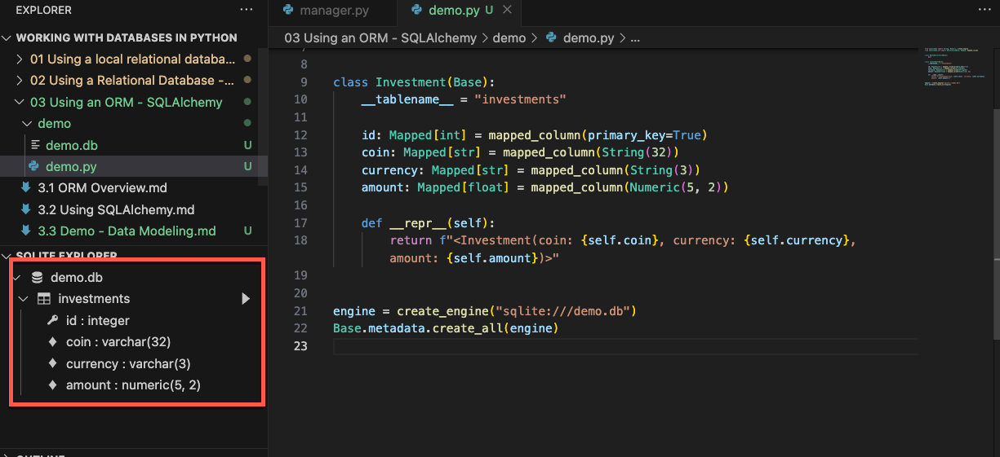
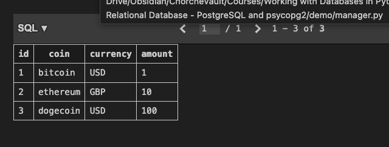

[[Courses/python-advanced-learning/Working with Databases in Python/03 Using an ORM - SQLAlchemy/demo/demo.py|demo]]


- Install SQLalchemy```

```bash
pip install sqlalchemy
```

- Import ```DeclarativeBase``` and create the ```Base```class.

```python
from sqlalchemy.orm import DeclarativeBase
  
class Base(DeclarativeBase):
	pass
```

- Define the model class with its ```__repr__```method.

```python
class Investment(Base):
	__tablename__ = "investments"

	id: Mapped[int] = mapped_column(primary_key=True)
	coin: Mapped[str] = mapped_column(String(32))
	currency: Mapped[str] = mapped_column(String(3))
	amount: Mapped[float] = mapped_column(Numeric(5, 2))

	def __repr__(self):
		return f"<Investment(coin: {self.coin}, currency: {self.currency}, amount: {self.amount})>"
```

- Create the engine and the tables in the database using the metadata of the ```Base```class.
	- All the clases inheriting from ```Base```will be created as tables in the database

```python
engine = create_engine("sqlite:///demo.db")
Base.metadata.create_all(engine)
```

- Running the code will create the database and the table
	- The ```String```and ```Numeric``` classes and the ```mapped_column``` function transform Python types (```str```, ```float```) to SQL types (```varchar```, ```numeric```)



- Create a new investment entry by initializing an instance of the model class.
	- Use keyword arguments for column names

```python
bitcoin = Investment(coin="bitcoin", currency="USD", amount=1.00)
ethereum = Investment(coin="ethereum", currency="GBP", amount=10.00)
dogecoin = Investment(coin="dogecoin", currency="USD", amount=100.00)
```

- Create the rows using a ```Session```

```python
from sqlalchemy.orm import DeclarativeBase, Mapped, mapped_column, Session

...

with Session(engine) as session:
	# Add the investments to the session, one or more at a time
	session.add(bitcoin)
	session.add_all([ethereum, dogecoin])
	# Commit the session to save the investments to the database
	session.commit()
```

