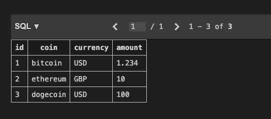

- To get data out of the database we will use the Core API of SQLAlchemy.
- Import the functions we need for the fluent API.
- The ```select```function will accept a model class that correspond to the mapped table in the database.
	- ```select(investment)```is equivalent to ```SELECT * FROM investment;```

```python
from sqlalchemy import String, Numeric, create_engine, select

...

with Session(engine) as session:
	stmt = select(Investment)
	print(stmt)
```

```bash
❯python demo.py

SELECT investments.id, investments.coin, investments.currency, investments.amount 
FROM investments
```

- To filter the results chain the ```where``` method to the ```select``` function, referring to the columns with the attribute name.

```python
with Session(engine) as session:
	stmt = select(Investment).where(Investment.coin == "bitcoin")
	print(stmt)
```

```bash
❯python demo.py

SELECT investments.id, investments.coin, investments.currency, investments.amount 
FROM investments 
WHERE investments.coin = :coin_1
```

- To execute the statement call the ```execute```method on a session and pass it the statement.
	- We can use the ```scalar_one```method as we know there is only one row.

```python
with Session(engine) as session:
	stmt = select(Investment).where(Investment.coin == "bitcoin")
	investment = session.execute(stmt).scalar_one()
	print(investment)
```

```bash
❯python demo.py

<Investment(coin: bitcoin, currency: USD, amount: 1.00)>
```

- The value of a primary key can be retrieved with the ```get```method of the session.
	- The ```get```method expects the model class to return and the value of the primary key.

```python
investment = session.get(Investment, 2)
print(investment)
```

```bash
❯python demo.py

<Investment(coin: ethereum, currency: GBP, amount: 10.00)>
```

- To retrieve multiple objects chain ```.scalars().all()```methods to te ```execute```function.

```python
stmt = select(Investment).where(Investment.amount > 5)
investments = session.execute(stmt).scalars().all()
for investment in investments:
	print(investment)
```

```bash
❯python demo.py

<Investment(coin: ethereum, currency: GBP, amount: 10.00)>
<Investment(coin: ethereum, currency: GBP, amount: 10.00)>
<Investment(coin: dogecoin, currency: USD, amount: 100.00)>
```

- If the select does not match any rows in the database it returns a ```NoResultFound```exception.

```python
stmt = select(Investment).where(Investment.coin == "foocoin")
```

```bash
❯python demo.py

...

<sqlalchemy.exc.NoResultFound: No row was found when one was required>
```

- If we use ```scalar_one()``` with multiple results it returns a ```MultipleResultsFound``` exception.

```python
stmt = select(Investment) # .where(Investment.coin == "foocoin")
```

```bash
❯python demo.py

...

[](<sqlalchemy.exc.MultipleResultsFound: Multiple rows were found when exactly one was required>)
```

- If we try to access a non-existing index it will return ```None```.

```python
investment = session.get(Investment, 20)
print(investment)
```

```bash
❯python demo.py

None
```

- If the query has no elements there is no output it will return an empty list. If we iterate the result there will not be output in the console and this can be misleading.

```python
stmt = select(Investment).where(Investment.amount > 200)
investments = session.execute(stmt).scalars().all
print(investments)
for investment in investments:
	print(investment)
```

```bash
❯python demo.py

[]
```

- Modifying the retrieved data. After getting a row and modifying the data, if we commit the changes we do not need to add the instance object to the session. Instead it is marked as dirty in the session (modified but not persisted)

```python
bitcoin = session.get(Investment, 1)
bitcoin.amount = 1.234
print(session.dirty) # Check which objects are modified
session.commit()
```

```bash
❯python demo.py

IdentitySet([<Investment(coin: bitcoin, currency: USD, amount: 1.234)>])
```

- SQLAlchemy handles the precision and scale of the number. Even if the model class has a scale representation of 2 that database hold the full decimals



```python
bitcoin = session.get(Investment, 1)
bitcoin.amount = 1.234
print(session.dirty) # Check which objects are modified
session.commit()

print(bitcoin)
```

```bash
❯python demo.py

IdentitySet([<Investment(coin: bitcoin, currency: USD, amount: 1.234)>])
<Investment(coin: bitcoin, currency: USD, amount: 1.23)>
```

- Deleting

```python
dogecoin = session.get(Investment, 3)
session.delete(dogecoin)
print(session.deleted)
session.commit()
```

```bash
❯python demo.py

IdentitySet([<Investment(coin: dogecoin, currency: USD, amount: 100.00)>])
```

